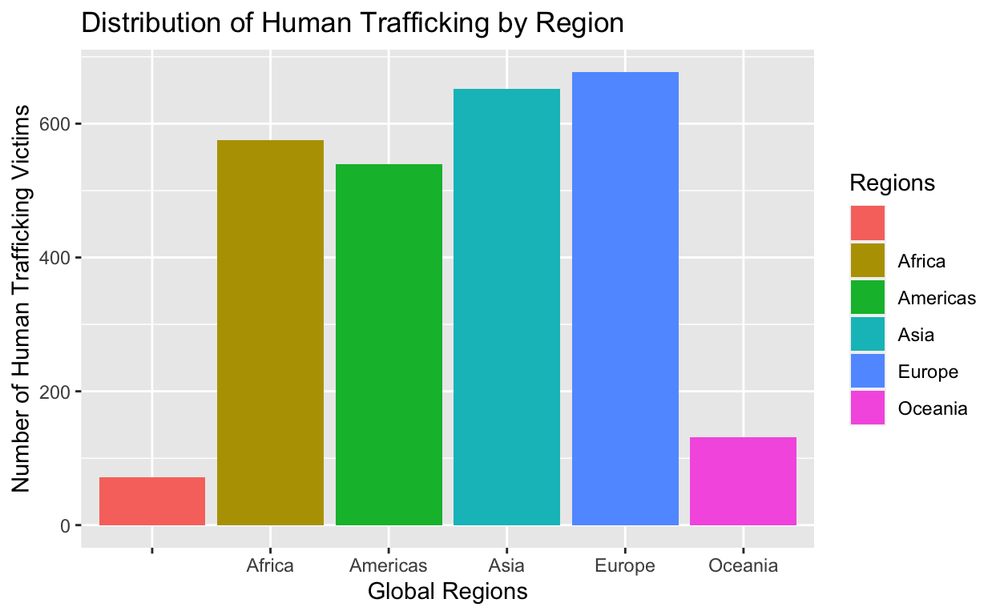

## Project thoughts

I am interested in exploring data related to human trafficking rates in
the United States. I want to focus on how the U.S-Mexican boarder is one
of the main transports for human trafficking compared to other boarders
and countries globally. I also want to analyze the amount of human
trafficking cases there are around the world.

<div class="layout-chunk" data-layout="l-body">
<div class="sourceCode"><pre class="sourceCode r"><code class="sourceCode r"><span><span class='co'>##Load Data</span></span>
<span><span class='va'>ht_data</span> <span class='op'>&lt;-</span> <span class='fu'><a href='https://rdrr.io/r/utils/read.table.html'>read.csv</a></span><span class='op'>(</span><span class='st'>"Human_trafficking_data.csv"</span><span class='op'>)</span> </span></code></pre></div>

</div>


## Writing Proposal

Which countries are the biggest consumers of human trafficking? I
hypothesize that human trafficking is most common among nations in
numerous debts and have the potential to exploit victims with loopholes
in their governments. Variables that influence the rate of human
trafficking among countries include but are not limited to the sex of
human trafficking victims, legalization of prostitution within nations,
border control guidelines, forms of exploitation (sexual violence,
forced labour, etc), age, and GDP. Our outcome variable of interest in
this study will be the rates of human trafficking among each nation.
Potential observed patterns in my data that could help prove my thesis
could include:

-Correlation between high levels of national debt and increased
instances of human trafficking

-Identification of a higher prevalence of human trafficking in countries
with weaker governance structures and loopholes in law enforcement.

-nations facing economic crises due to debts are more likely to turn a
blind eye to human trafficking activities within their borders.

-nations where work is commonly exploited could have a pattern of human
trafficking to help boost the GDP.

Conversely, some patterns that could disprove my hypothesis in the data
could include:

-Lack of correlation between national debt levels and incidences of
human trafficking.

-Instances of significant human trafficking in countries with sound
economic conditions and strong governance systems.

-Evidence indicating that human trafficking is equally prevalent in
nations regardless of their debt status or the strength of their
governance structures.

<div class="layout-chunk" data-layout="l-body">
<div class="sourceCode"><pre class="sourceCode r"><code class="sourceCode r"><span><span class='kw'><a href='https://rdrr.io/r/base/library.html'>library</a></span><span class='op'>(</span><span class='va'><a href='https://tidyverse.tidyverse.org'>tidyverse</a></span><span class='op'>)</span></span>
<span><span class='kw'><a href='https://rdrr.io/r/base/library.html'>library</a></span><span class='op'>(</span><span class='va'><a href='https://ggplot2.tidyverse.org'>ggplot2</a></span><span class='op'>)</span></span>
<span></span>
<span><span class='va'>Regions</span> <span class='op'>&lt;-</span> <span class='fu'><a href='https://rdrr.io/r/base/factor.html'>as.factor</a></span><span class='op'>(</span><span class='va'>ht_data</span><span class='op'>$</span><span class='va'>Region</span><span class='op'>)</span></span>
<span></span>
<span><span class='fu'><a href='https://ggplot2.tidyverse.org/reference/ggplot.html'>ggplot</a></span><span class='op'>(</span><span class='va'>ht_data</span>, <span class='fu'><a href='https://ggplot2.tidyverse.org/reference/aes.html'>aes</a></span><span class='op'>(</span>x <span class='op'>=</span> <span class='va'>Regions</span>, fill <span class='op'>=</span> <span class='va'>Regions</span><span class='op'>)</span><span class='op'>)</span> <span class='op'>+</span> <span class='fu'><a href='https://ggplot2.tidyverse.org/reference/geom_bar.html'>geom_bar</a></span><span class='op'>(</span><span class='op'>)</span> <span class='op'>+</span> <span class='fu'><a href='https://ggplot2.tidyverse.org/reference/labs.html'>labs</a></span><span class='op'>(</span>x <span class='op'>=</span> <span class='st'>"Global Regions"</span>, y <span class='op'>=</span> <span class='st'>"Number of Human Trafficking Victims"</span>, title<span class='op'>=</span> <span class='st'>"Distribution of Human Trafficking by Region"</span><span class='op'>)</span></span></code></pre></div>
<div class="sourceCode"><pre class="sourceCode r"><code class="sourceCode r"><span><span class='co'>#scale_fill_manual(values = c(Oceania = "steelblue1", Americas = "indianred1", Africa = "turquoise2", Asia = "orange", Europe = "maroon1", ` ` = "purple"))</span></span></code></pre></div>

</div>


This bar chart reveals the frequency of human trafficking by region.
Globally, Europe holds the highest number of human trafficking victims
compared to other global regions. Oceania consumes the least amount of
human trafficking victims.

<div class="layout-chunk" data-layout="l-body">
<div class="sourceCode"><pre class="sourceCode r"><code class="sourceCode r"><span><span class='va'>ht_data</span> <span class='op'>&lt;-</span> <span class='va'>ht_data</span> <span class='op'>|&gt;</span></span>
<span>  <span class='fu'><a href='https://dplyr.tidyverse.org/reference/group_by.html'>group_by</a></span><span class='op'>(</span><span class='va'>Region</span><span class='op'>)</span></span>
<span>  <span class='fu'><a href='https://dplyr.tidyverse.org/reference/summarise.html'>summarize</a></span><span class='op'>(</span><span class='va'>ht_data</span><span class='op'>)</span> <span class='op'>|&gt;</span></span>
<span>  <span class='fu'><a href='https://dplyr.tidyverse.org/reference/mutate.html'>mutate</a></span><span class='op'>(</span><span class='va'>Region</span><span class='op'>)</span> </span></code></pre></div>

```
# A tibble: 6 × 1
  Region    
  <chr>     
1 ""        
2 "Africa"  
3 "Americas"
4 "Asia"    
5 "Europe"  
6 "Oceania" 
```

<div class="sourceCode"><pre class="sourceCode r"><code class="sourceCode r"><span> <span class='fu'>knitr</span><span class='fu'>::</span><span class='fu'><a href='https://rdrr.io/pkg/knitr/man/kable.html'>kable</a></span><span class='op'>(</span><span class='va'>ht_data</span>, digits <span class='op'>=</span> <span class='fl'>3</span><span class='op'>)</span></span></code></pre></div>


|Iso3_code |Country                                              |Region   |Subregion                       |Indicator                    |Dimension               |Category                    |Sex   |Age   | Year|Unit.of.measurement |txtVALUE |
|:---------|:----------------------------------------------------|:--------|:-------------------------------|:----------------------------|:-----------------------|:---------------------------|:-----|:-----|----:|:-------------------|:--------|
|AFG       |Afghanistan                                          |Asia     |Southern Asia                   |Detected trafficking victims |by form of exploitation |Forced labour               |Total |Total | 2017|Counts              |<5       |
|AFG       |Afghanistan                                          |Asia     |Southern Asia                   |Detected trafficking victims |by form of exploitation |Sexual exploitation         |Total |Total | 2017|Counts              |<5       |
|AFG       |Afghanistan                                          |Asia     |Southern Asia                   |Detected trafficking victims |by form of exploitation |Forced labour               |Total |Total | 2018|Counts              |<5       |
|AFG       |Afghanistan                                          |Asia     |Southern Asia                   |Detected trafficking victims |by form of exploitation |Sexual exploitation         |Total |Total | 2018|Counts              |<5       |
|AFG       |Afghanistan                                          |Asia     |Southern Asia                   |Detected trafficking victims |by form of exploitation |Forced labour               |Total |Total | 2019|Counts              |<5       |
|AFG       |Afghanistan                                          |Asia     |Southern Asia                   |Detected trafficking victims |by form of exploitation |Sexual exploitation         |Total |Total | 2019|Counts              |<5       |
|AFG       |Afghanistan                                          |Asia     |Southern Asia                   |Detected trafficking victims |by form of exploitation |Forced labour               |Total |Total | 2020|Counts              |<5       |
|AGO       |Angola                                               |Africa   |Sub-Saharan Africa              |Detected trafficking victims |by form of exploitation |Forced labour               |Total |Total | 2017|Counts              |24       |
|AGO       |Angola                                               |Africa   |Sub-Saharan Africa              |Detected trafficking victims |by form of exploitation |Sexual exploitation         |Total |Total | 2017|Counts              |<5       |
|AGO       |Angola                                               |Africa   |Sub-Saharan Africa              |Detected trafficking victims |by form of exploitation |Forced labour               |Total |Total | 2018|Counts              |<5       |
|AGO       |Angola                                               |Africa   |Sub-Saharan Africa              |Detected trafficking victims |by form of exploitation |Sexual exploitation         |Total |Total | 2018|Counts              |<5       |
|AGO       |Angola                                               |Africa   |Sub-Saharan Africa              |Detected trafficking victims |by form of exploitation |Forced labour               |Total |Total | 2019|Counts              |8        |
|AGO       |Angola                                               |Africa   |Sub-Saharan Africa              |Detected trafficking victims |by form of exploitation |Sexual exploitation         |Total |Total | 2019|Counts              |<5       |
|AGO       |Angola                                               |Africa   |Sub-Saharan Africa              |Detected trafficking victims |by form of exploitation |Forced labour               |Total |Total | 2020|Counts              |<5       |
|AGO       |Angola                                               |Africa   |Sub-Saharan Africa              |Detected trafficking victims |by form of exploitation |Sexual exploitation         |Total |Total | 2020|Counts              |8        |
|ALB       |Albania                                              |Europe   |Southern Europe                 |Detected trafficking victims |by form of exploitation |Forced labour               |Total |Total | 2017|Counts              |<5       |
|ALB       |Albania                                              |Europe   |Southern Europe                 |Detected trafficking victims |by form of exploitation |Sexual exploitation         |Total |Total | 2017|Counts              |37       |
|ALB       |Albania                                              |Europe   |Southern Europe                 |Detected trafficking victims |by form of exploitation |Forced labour               |Total |Total | 2018|Counts              |<5       |
|ALB       |Albania                                              |Europe   |Southern Europe                 |Detected trafficking victims |by form of exploitation |Sexual exploitation         |Total |Total | 2018|Counts              |37       |
|ALB       |Albania                                              |Europe   |Southern Europe                 |Detected trafficking victims |by form of exploitation |Forced labour               |Total |Total | 2019|Counts              |<5       |
|ALB       |Albania                                              |Europe   |Southern Europe                 |Detected trafficking victims |by form of exploitation |Sexual exploitation         |Total |Total | 2019|Counts              |65       |
|ALB       |Albania                                              |Europe   |Southern Europe                 |Detected trafficking victims |by form of exploitation |Forced labour               |Total |Total | 2020|Counts              |<5       |
|ALB       |Albania                                              |Europe   |Southern Europe                 |Detected trafficking victims |by form of exploitation |Sexual exploitation         |Total |Total | 2020|Counts              |48       |
|ALB       |Albania                                              |Europe   |Southern Europe                 |Detected trafficking victims |by form of exploitation |Forced labour               |Total |Total | 2021|Counts              |16       |
|ALB       |Albania                                              |Europe   |Southern Europe                 |Detected trafficking victims |by form of exploitation |Sexual exploitation         |Total |Total | 2021|Counts              |59       |
|AND       |Andorra                                              |Europe   |Southern Europe                 |Detected trafficking victims |by form of exploitation |Forced labour               |Total |Total | 2017|Counts              |<5       |
|AND       |Andorra                                              |Europe   |Southern Europe                 |Detected trafficking victims |by form of exploitation |Sexual exploitation         |Total |Total | 2017|Counts              |<5       |
|AND       |Andorra                                              |Europe   |Southern Europe                 |Detected trafficking victims |by form of exploitation |Forced labour               |Total |Total | 2018|Counts              |<5       |
|AND       |Andorra                                              |Europe   |Southern Europe                 |Detected trafficking victims |by form of exploitation |Sexual exploitation         |Total |Total | 2018|Counts              |<5       |
|AND       |Andorra                                              |Europe   |Southern Europe                 |Detected trafficking victims |by form of exploitation |Forced labour               |Total |Total | 2019|Counts              |<5       |
|AND       |Andorra                                              |Europe   |Southern Europe                 |Detected trafficking victims |by form of exploitation |Sexual exploitation         |Total |Total | 2019|Counts              |<5       |
|AND       |Andorra                                              |Europe   |Southern Europe                 |Detected trafficking victims |by form of exploitation |Forced labour               |Total |Total | 2020|Counts              |<5       |
|AND       |Andorra                                              |Europe   |Southern Europe                 |Detected trafficking victims |by form of exploitation |Sexual exploitation         |Total |Total | 2020|Counts              |<5       |
|AND       |Andorra                                              |Europe   |Southern Europe                 |Detected trafficking victims |by form of exploitation |Sexual exploitation         |Total |Total | 2021|Counts              |<5       |
|ARE       |United Arab Emirates                                 |Asia     |Western Asia                    |Detected trafficking victims |by form of exploitation |Forced labour               |Total |Total | 2017|Counts              |<5       |
|ARE       |United Arab Emirates                                 |Asia     |Western Asia                    |Detected trafficking victims |by form of exploitation |Sexual exploitation         |Total |Total | 2017|Counts              |20       |
|ARE       |United Arab Emirates                                 |Asia     |Western Asia                    |Detected trafficking victims |by form of exploitation |Forced labour               |Total |Total | 2018|Counts              |8        |
|ARE       |United Arab Emirates                                 |Asia     |Western Asia                    |Detected trafficking victims |by form of exploitation |Sexual exploitation         |Total |Total | 2018|Counts              |26       |
|ARE       |United Arab Emirates                                 |Asia     |Western Asia                    |Detected trafficking victims |by form of exploitation |Forced labour               |Total |Total | 2019|Counts              |<5       |
|ARE       |United Arab Emirates                                 |Asia     |Western Asia                    |Detected trafficking victims |by form of exploitation |Sexual exploitation         |Total |Total | 2019|Counts              |38       |
|ARE       |United Arab Emirates                                 |Asia     |Western Asia                    |Detected trafficking victims |by form of exploitation |Forced labour               |Total |Total | 2020|Counts              |<5       |
|ARE       |United Arab Emirates                                 |Asia     |Western Asia                    |Detected trafficking victims |by form of exploitation |Sexual exploitation         |Total |Total | 2020|Counts              |21       |
|ARG       |Argentina                                            |Americas |Latin America and the Caribbean |Detected trafficking victims |by form of exploitation |Forced labour               |Total |Total | 2017|Counts              |776      |
|ARG       |Argentina                                            |Americas |Latin America and the Caribbean |Detected trafficking victims |by form of exploitation |Sexual exploitation         |Total |Total | 2017|Counts              |423      |
|ARG       |Argentina                                            |Americas |Latin America and the Caribbean |Detected trafficking victims |by form of exploitation |Forced labour               |Total |Total | 2018|Counts              |972      |
|ARG       |Argentina                                            |Americas |Latin America and the Caribbean |Detected trafficking victims |by form of exploitation |Sexual exploitation         |Total |Total | 2018|Counts              |552      |
|ARG       |Argentina                                            |Americas |Latin America and the Caribbean |Detected trafficking victims |by form of exploitation |Forced labour               |Total |Total | 2019|Counts              |934      |
|ARG       |Argentina                                            |Americas |Latin America and the Caribbean |Detected trafficking victims |by form of exploitation |Sexual exploitation         |Total |Total | 2019|Counts              |544      |
|ARG       |Argentina                                            |Americas |Latin America and the Caribbean |Detected trafficking victims |by form of exploitation |Forced labour               |Total |Total | 2020|Counts              |644      |
|ARG       |Argentina                                            |Americas |Latin America and the Caribbean |Detected trafficking victims |by form of exploitation |Sexual exploitation         |Total |Total | 2020|Counts              |235      |
|ARG       |Argentina                                            |Americas |Latin America and the Caribbean |Detected trafficking victims |by form of exploitation |Forced labour               |Total |Total | 2021|Counts              |948      |
|ARG       |Argentina                                            |Americas |Latin America and the Caribbean |Detected trafficking victims |by form of exploitation |Sexual exploitation         |Total |Total | 2021|Counts              |328      |
|ARM       |Armenia                                              |Asia     |Western Asia                    |Detected trafficking victims |by form of exploitation |Forced labour               |Total |Total | 2017|Counts              |9        |
|ARM       |Armenia                                              |Asia     |Western Asia                    |Detected trafficking victims |by form of exploitation |Sexual exploitation         |Total |Total | 2017|Counts              |<5       |
|ARM       |Armenia                                              |Asia     |Western Asia                    |Detected trafficking victims |by form of exploitation |Forced labour               |Total |Total | 2018|Counts              |27       |
|ARM       |Armenia                                              |Asia     |Western Asia                    |Detected trafficking victims |by form of exploitation |Sexual exploitation         |Total |Total | 2018|Counts              |<5       |
|ARM       |Armenia                                              |Asia     |Western Asia                    |Detected trafficking victims |by form of exploitation |Forced labour               |Total |Total | 2019|Counts              |5        |
|ARM       |Armenia                                              |Asia     |Western Asia                    |Detected trafficking victims |by form of exploitation |Sexual exploitation         |Total |Total | 2019|Counts              |<5       |
|ARM       |Armenia                                              |Asia     |Western Asia                    |Detected trafficking victims |by form of exploitation |Forced labour               |Total |Total | 2020|Counts              |<5       |
|ARM       |Armenia                                              |Asia     |Western Asia                    |Detected trafficking victims |by form of exploitation |Sexual exploitation         |Total |Total | 2020|Counts              |<5       |
|ATG       |Antigua and Barbuda                                  |Americas |Latin America and the Caribbean |Detected trafficking victims |by form of exploitation |Forced labour               |Total |Total | 2017|Counts              |<5       |
|ATG       |Antigua and Barbuda                                  |Americas |Latin America and the Caribbean |Detected trafficking victims |by form of exploitation |Sexual exploitation         |Total |Total | 2017|Counts              |<5       |
|ATG       |Antigua and Barbuda                                  |Americas |Latin America and the Caribbean |Detected trafficking victims |by form of exploitation |Forced labour               |Total |Total | 2018|Counts              |<5       |
|ATG       |Antigua and Barbuda                                  |Americas |Latin America and the Caribbean |Detected trafficking victims |by form of exploitation |Sexual exploitation         |Total |Total | 2018|Counts              |<5       |
|ATG       |Antigua and Barbuda                                  |Americas |Latin America and the Caribbean |Detected trafficking victims |by form of exploitation |Forced labour               |Total |Total | 2019|Counts              |<5       |
|ATG       |Antigua and Barbuda                                  |Americas |Latin America and the Caribbean |Detected trafficking victims |by form of exploitation |Sexual exploitation         |Total |Total | 2019|Counts              |<5       |
|ATG       |Antigua and Barbuda                                  |Americas |Latin America and the Caribbean |Detected trafficking victims |by form of exploitation |Forced labour               |Total |Total | 2020|Counts              |<5       |
|ATG       |Antigua and Barbuda                                  |Americas |Latin America and the Caribbean |Detected trafficking victims |by form of exploitation |Sexual exploitation         |Total |Total | 2020|Counts              |<5       |
|AUS       |Australia                                            |Oceania  |Australia and New Zealand       |Detected trafficking victims |by form of exploitation |Forced labour               |Total |Total | 2017|Counts              |38       |
|AUS       |Australia                                            |Oceania  |Australia and New Zealand       |Detected trafficking victims |by form of exploitation |Sexual exploitation         |Total |Total | 2017|Counts              |10       |
|AUS       |Australia                                            |Oceania  |Australia and New Zealand       |Detected trafficking victims |by form of exploitation |Forced labour               |Total |Total | 2018|Counts              |56       |
|AUS       |Australia                                            |Oceania  |Australia and New Zealand       |Detected trafficking victims |by form of exploitation |Sexual exploitation         |Total |Total | 2018|Counts              |13       |
|AUS       |Australia                                            |Oceania  |Australia and New Zealand       |Detected trafficking victims |by form of exploitation |Forced labour               |Total |Total | 2019|Counts              |81       |
|AUS       |Australia                                            |Oceania  |Australia and New Zealand       |Detected trafficking victims |by form of exploitation |Sexual exploitation         |Total |Total | 2019|Counts              |20       |
|AUS       |Australia                                            |Oceania  |Australia and New Zealand       |Detected trafficking victims |by form of exploitation |Forced labour               |Total |Total | 2020|Counts              |91       |
|AUS       |Australia                                            |Oceania  |Australia and New Zealand       |Detected trafficking victims |by form of exploitation |Sexual exploitation         |Total |Total | 2020|Counts              |17       |
|AUT       |Austria                                              |Europe   |Western Europe                  |Detected trafficking victims |by form of exploitation |Forced labour               |Total |Total | 2017|Counts              |<5       |
|AUT       |Austria                                              |Europe   |Western Europe                  |Detected trafficking victims |by form of exploitation |Sexual exploitation         |Total |Total | 2017|Counts              |<5       |
|AUT       |Austria                                              |Europe   |Western Europe                  |Detected trafficking victims |by form of exploitation |Forced labour               |Total |Total | 2018|Counts              |<5       |
|AUT       |Austria                                              |Europe   |Western Europe                  |Detected trafficking victims |by form of exploitation |Sexual exploitation         |Total |Total | 2018|Counts              |<5       |
|AUT       |Austria                                              |Europe   |Western Europe                  |Detected trafficking victims |by form of exploitation |Forced labour               |Total |Total | 2019|Counts              |<5       |
|AUT       |Austria                                              |Europe   |Western Europe                  |Detected trafficking victims |by form of exploitation |Sexual exploitation         |Total |Total | 2019|Counts              |<5       |
|AUT       |Austria                                              |Europe   |Western Europe                  |Detected trafficking victims |by form of exploitation |Forced labour               |Total |Total | 2020|Counts              |83       |
|AUT       |Austria                                              |Europe   |Western Europe                  |Detected trafficking victims |by form of exploitation |Sexual exploitation         |Total |Total | 2020|Counts              |212      |
|AZE       |Azerbaijan                                           |Asia     |Western Asia                    |Detected trafficking victims |by form of exploitation |Forced labour               |Total |Total | 2017|Counts              |<5       |
|AZE       |Azerbaijan                                           |Asia     |Western Asia                    |Detected trafficking victims |by form of exploitation |Sexual exploitation         |Total |Total | 2017|Counts              |<5       |
|AZE       |Azerbaijan                                           |Asia     |Western Asia                    |Detected trafficking victims |by form of exploitation |Forced labour               |Total |Total | 2018|Counts              |<5       |
|AZE       |Azerbaijan                                           |Asia     |Western Asia                    |Detected trafficking victims |by form of exploitation |Sexual exploitation         |Total |Total | 2018|Counts              |<5       |
|AZE       |Azerbaijan                                           |Asia     |Western Asia                    |Detected trafficking victims |by form of exploitation |Forced labour               |Total |Total | 2019|Counts              |<5       |
|AZE       |Azerbaijan                                           |Asia     |Western Asia                    |Detected trafficking victims |by form of exploitation |Sexual exploitation         |Total |Total | 2019|Counts              |<5       |
|AZE       |Azerbaijan                                           |Asia     |Western Asia                    |Detected trafficking victims |by form of exploitation |Forced labour               |Total |Total | 2020|Counts              |<5       |
|AZE       |Azerbaijan                                           |Asia     |Western Asia                    |Detected trafficking victims |by form of exploitation |Sexual exploitation         |Total |Total | 2020|Counts              |<5       |
|AZE       |Azerbaijan                                           |Asia     |Western Asia                    |Detected trafficking victims |by form of exploitation |Forced labour               |Total |Total | 2021|Counts              |<5       |
|AZE       |Azerbaijan                                           |Asia     |Western Asia                    |Detected trafficking victims |by form of exploitation |Sexual exploitation         |Total |Total | 2021|Counts              |94       |
|BDI       |Burundi                                              |Africa   |Sub-Saharan Africa              |Detected trafficking victims |by form of exploitation |Forced labour               |Total |Total | 2017|Counts              |<5       |
|BDI       |Burundi                                              |Africa   |Sub-Saharan Africa              |Detected trafficking victims |by form of exploitation |Sexual exploitation         |Total |Total | 2017|Counts              |<5       |
|BDI       |Burundi                                              |Africa   |Sub-Saharan Africa              |Detected trafficking victims |by form of exploitation |Forced labour               |Total |Total | 2018|Counts              |<5       |
|BDI       |Burundi                                              |Africa   |Sub-Saharan Africa              |Detected trafficking victims |by form of exploitation |Sexual exploitation         |Total |Total | 2018|Counts              |<5       |
|BDI       |Burundi                                              |Africa   |Sub-Saharan Africa              |Detected trafficking victims |by form of exploitation |Forced labour               |Total |Total | 2019|Counts              |<5       |
|BDI       |Burundi                                              |Africa   |Sub-Saharan Africa              |Detected trafficking victims |by form of exploitation |Sexual exploitation         |Total |Total | 2019|Counts              |<5       |
|BDI       |Burundi                                              |Africa   |Sub-Saharan Africa              |Detected trafficking victims |by form of exploitation |Forced labour               |Total |Total | 2020|Counts              |<5       |
|BDI       |Burundi                                              |Africa   |Sub-Saharan Africa              |Detected trafficking victims |by form of exploitation |Sexual exploitation         |Total |Total | 2020|Counts              |<5       |
|BEL       |Belgium                                              |Europe   |Western Europe                  |Detected trafficking victims |by form of exploitation |Forced labour               |Total |Total | 2017|Counts              |65       |
|BEL       |Belgium                                              |Europe   |Western Europe                  |Detected trafficking victims |by form of exploitation |Sexual exploitation         |Total |Total | 2017|Counts              |55       |
|BEL       |Belgium                                              |Europe   |Western Europe                  |Detected trafficking victims |by form of exploitation |Forced labour               |Total |Total | 2018|Counts              |75       |
|BEL       |Belgium                                              |Europe   |Western Europe                  |Detected trafficking victims |by form of exploitation |Sexual exploitation         |Total |Total | 2018|Counts              |33       |
|BEL       |Belgium                                              |Europe   |Western Europe                  |Detected trafficking victims |by form of exploitation |Forced labour               |Total |Total | 2019|Counts              |88       |
|BEL       |Belgium                                              |Europe   |Western Europe                  |Detected trafficking victims |by form of exploitation |Sexual exploitation         |Total |Total | 2019|Counts              |52       |
|BEL       |Belgium                                              |Europe   |Western Europe                  |Detected trafficking victims |by form of exploitation |Forced labour               |Total |Total | 2020|Counts              |49       |
|BEL       |Belgium                                              |Europe   |Western Europe                  |Detected trafficking victims |by form of exploitation |Sexual exploitation         |Total |Total | 2020|Counts              |36       |
|BEN       |Benin                                                |Africa   |Sub-Saharan Africa              |Detected trafficking victims |by form of exploitation |Forced labour               |Total |Total | 2017|Counts              |<5       |
|BEN       |Benin                                                |Africa   |Sub-Saharan Africa              |Detected trafficking victims |by form of exploitation |Sexual exploitation         |Total |Total | 2017|Counts              |<5       |
|BEN       |Benin                                                |Africa   |Sub-Saharan Africa              |Detected trafficking victims |by form of exploitation |Forced labour               |Total |Total | 2018|Counts              |<5       |
|BEN       |Benin                                                |Africa   |Sub-Saharan Africa              |Detected trafficking victims |by form of exploitation |Sexual exploitation         |Total |Total | 2018|Counts              |<5       |
|BEN       |Benin                                                |Africa   |Sub-Saharan Africa              |Detected trafficking victims |by form of exploitation |Forced labour               |Total |Total | 2019|Counts              |<5       |
|BEN       |Benin                                                |Africa   |Sub-Saharan Africa              |Detected trafficking victims |by form of exploitation |Sexual exploitation         |Total |Total | 2019|Counts              |<5       |
|BEN       |Benin                                                |Africa   |Sub-Saharan Africa              |Detected trafficking victims |by form of exploitation |Forced labour               |Total |Total | 2020|Counts              |<5       |
|BEN       |Benin                                                |Africa   |Sub-Saharan Africa              |Detected trafficking victims |by form of exploitation |Sexual exploitation         |Total |Total | 2020|Counts              |<5       |
|BFA       |Burkina Faso                                         |Africa   |Sub-Saharan Africa              |Detected trafficking victims |by form of exploitation |Forced labour               |Total |Total | 2017|Counts              |<5       |
|BFA       |Burkina Faso                                         |Africa   |Sub-Saharan Africa              |Detected trafficking victims |by form of exploitation |Sexual exploitation         |Total |Total | 2017|Counts              |<5       |
|BFA       |Burkina Faso                                         |Africa   |Sub-Saharan Africa              |Detected trafficking victims |by form of exploitation |Forced labour               |Total |Total | 2018|Counts              |<5       |
|BFA       |Burkina Faso                                         |Africa   |Sub-Saharan Africa              |Detected trafficking victims |by form of exploitation |Sexual exploitation         |Total |Total | 2018|Counts              |<5       |
|BFA       |Burkina Faso                                         |Africa   |Sub-Saharan Africa              |Detected trafficking victims |by form of exploitation |Forced labour               |Total |Total | 2019|Counts              |<5       |
|BFA       |Burkina Faso                                         |Africa   |Sub-Saharan Africa              |Detected trafficking victims |by form of exploitation |Sexual exploitation         |Total |Total | 2019|Counts              |<5       |
|BFA       |Burkina Faso                                         |Africa   |Sub-Saharan Africa              |Detected trafficking victims |by form of exploitation |Forced labour               |Total |Total | 2020|Counts              |<5       |
|BFA       |Burkina Faso                                         |Africa   |Sub-Saharan Africa              |Detected trafficking victims |by form of exploitation |Sexual exploitation         |Total |Total | 2020|Counts              |<5       |
|BGD       |Bangladesh                                           |Asia     |Southern Asia                   |Detected trafficking victims |by form of exploitation |Forced labour               |Total |Total | 2017|Counts              |<5       |
|BGD       |Bangladesh                                           |Asia     |Southern Asia                   |Detected trafficking victims |by form of exploitation |Sexual exploitation         |Total |Total | 2017|Counts              |<5       |
|BGD       |Bangladesh                                           |Asia     |Southern Asia                   |Detected trafficking victims |by form of exploitation |Forced labour               |Total |Total | 2018|Counts              |<5       |
|BGD       |Bangladesh                                           |Asia     |Southern Asia                   |Detected trafficking victims |by form of exploitation |Sexual exploitation         |Total |Total | 2018|Counts              |<5       |
|BGD       |Bangladesh                                           |Asia     |Southern Asia                   |Detected trafficking victims |by form of exploitation |Forced labour               |Total |Total | 2019|Counts              |<5       |
|BGD       |Bangladesh                                           |Asia     |Southern Asia                   |Detected trafficking victims |by form of exploitation |Sexual exploitation         |Total |Total | 2019|Counts              |<5       |
|BGD       |Bangladesh                                           |Asia     |Southern Asia                   |Detected trafficking victims |by form of exploitation |Forced labour               |Total |Total | 2020|Counts              |<5       |
|BGR       |Bulgaria                                             |Europe   |Eastern Europe                  |Detected trafficking victims |by form of exploitation |Forced labour               |Total |Total | 2017|Counts              |67       |
|BGR       |Bulgaria                                             |Europe   |Eastern Europe                  |Detected trafficking victims |by form of exploitation |Sexual exploitation         |Total |Total | 2017|Counts              |323      |
|BGR       |Bulgaria                                             |Europe   |Eastern Europe                  |Detected trafficking victims |by form of exploitation |Forced labour               |Total |Total | 2018|Counts              |59       |
|BGR       |Bulgaria                                             |Europe   |Eastern Europe                  |Detected trafficking victims |by form of exploitation |Sexual exploitation         |Total |Total | 2018|Counts              |309      |
|BGR       |Bulgaria                                             |Europe   |Eastern Europe                  |Detected trafficking victims |by form of exploitation |Forced labour               |Total |Total | 2019|Counts              |44       |
|BGR       |Bulgaria                                             |Europe   |Eastern Europe                  |Detected trafficking victims |by form of exploitation |Sexual exploitation         |Total |Total | 2019|Counts              |280      |
|BGR       |Bulgaria                                             |Europe   |Eastern Europe                  |Detected trafficking victims |by form of exploitation |Forced labour               |Total |Total | 2020|Counts              |69       |
|BGR       |Bulgaria                                             |Europe   |Eastern Europe                  |Detected trafficking victims |by form of exploitation |Sexual exploitation         |Total |Total | 2020|Counts              |336      |
|BGR       |Bulgaria                                             |Europe   |Eastern Europe                  |Detected trafficking victims |by form of exploitation |Forced labour               |Total |Total | 2021|Counts              |107      |
|BGR       |Bulgaria                                             |Europe   |Eastern Europe                  |Detected trafficking victims |by form of exploitation |Sexual exploitation         |Total |Total | 2021|Counts              |282      |
|BHR       |Bahrain                                              |Asia     |Western Asia                    |Detected trafficking victims |by form of exploitation |Forced labour               |Total |Total | 2017|Counts              |<5       |
|BHR       |Bahrain                                              |Asia     |Western Asia                    |Detected trafficking victims |by form of exploitation |Sexual exploitation         |Total |Total | 2017|Counts              |12       |
|BHR       |Bahrain                                              |Asia     |Western Asia                    |Detected trafficking victims |by form of exploitation |Forced labour               |Total |Total | 2018|Counts              |<5       |
|BHR       |Bahrain                                              |Asia     |Western Asia                    |Detected trafficking victims |by form of exploitation |Sexual exploitation         |Total |Total | 2018|Counts              |8        |
|BHR       |Bahrain                                              |Asia     |Western Asia                    |Detected trafficking victims |by form of exploitation |Forced labour               |Total |Total | 2019|Counts              |7        |
|BHR       |Bahrain                                              |Asia     |Western Asia                    |Detected trafficking victims |by form of exploitation |Sexual exploitation         |Total |Total | 2019|Counts              |19       |
|BHR       |Bahrain                                              |Asia     |Western Asia                    |Detected trafficking victims |by form of exploitation |Forced labour               |Total |Total | 2020|Counts              |5        |
|BHR       |Bahrain                                              |Asia     |Western Asia                    |Detected trafficking victims |by form of exploitation |Sexual exploitation         |Total |Total | 2020|Counts              |58       |
|BHR       |Bahrain                                              |Asia     |Western Asia                    |Detected trafficking victims |by form of exploitation |Forced labour               |Total |Total | 2021|Counts              |44       |
|BHR       |Bahrain                                              |Asia     |Western Asia                    |Detected trafficking victims |by form of exploitation |Sexual exploitation         |Total |Total | 2021|Counts              |39       |
|BHS       |Bahamas                                              |Americas |Latin America and the Caribbean |Detected trafficking victims |by form of exploitation |Forced labour               |Total |Total | 2017|Counts              |<5       |
|BHS       |Bahamas                                              |Americas |Latin America and the Caribbean |Detected trafficking victims |by form of exploitation |Sexual exploitation         |Total |Total | 2017|Counts              |<5       |
|BHS       |Bahamas                                              |Americas |Latin America and the Caribbean |Detected trafficking victims |by form of exploitation |Forced labour               |Total |Total | 2018|Counts              |<5       |
|BHS       |Bahamas                                              |Americas |Latin America and the Caribbean |Detected trafficking victims |by form of exploitation |Sexual exploitation         |Total |Total | 2018|Counts              |<5       |
|BHS       |Bahamas                                              |Americas |Latin America and the Caribbean |Detected trafficking victims |by form of exploitation |Forced labour               |Total |Total | 2019|Counts              |<5       |
|BHS       |Bahamas                                              |Americas |Latin America and the Caribbean |Detected trafficking victims |by form of exploitation |Sexual exploitation         |Total |Total | 2019|Counts              |<5       |
|BHS       |Bahamas                                              |Americas |Latin America and the Caribbean |Detected trafficking victims |by form of exploitation |Forced labour               |Total |Total | 2020|Counts              |<5       |
|BHS       |Bahamas                                              |Americas |Latin America and the Caribbean |Detected trafficking victims |by form of exploitation |Sexual exploitation         |Total |Total | 2020|Counts              |<5       |
|BIH       |Bosnia and Herzegovina                               |Europe   |Southern Europe                 |Detected trafficking victims |by form of exploitation |Forced labour               |Total |Total | 2017|Counts              |7        |
|BIH       |Bosnia and Herzegovina                               |Europe   |Southern Europe                 |Detected trafficking victims |by form of exploitation |Sexual exploitation         |Total |Total | 2017|Counts              |10       |
|BIH       |Bosnia and Herzegovina                               |Europe   |Southern Europe                 |Detected trafficking victims |by form of exploitation |Forced labour               |Total |Total | 2018|Counts              |<5       |
|BIH       |Bosnia and Herzegovina                               |Europe   |Southern Europe                 |Detected trafficking victims |by form of exploitation |Sexual exploitation         |Total |Total | 2018|Counts              |9        |
|BIH       |Bosnia and Herzegovina                               |Europe   |Southern Europe                 |Detected trafficking victims |by form of exploitation |Forced labour               |Total |Total | 2019|Counts              |<5       |
|BIH       |Bosnia and Herzegovina                               |Europe   |Southern Europe                 |Detected trafficking victims |by form of exploitation |Sexual exploitation         |Total |Total | 2019|Counts              |15       |
|BIH       |Bosnia and Herzegovina                               |Europe   |Southern Europe                 |Detected trafficking victims |by form of exploitation |Forced labour               |Total |Total | 2020|Counts              |<5       |
|BIH       |Bosnia and Herzegovina                               |Europe   |Southern Europe                 |Detected trafficking victims |by form of exploitation |Sexual exploitation         |Total |Total | 2020|Counts              |17       |
|BLR       |Belarus                                              |Europe   |Eastern Europe                  |Detected trafficking victims |by form of exploitation |Forced labour               |Total |Total | 2017|Counts              |<5       |
|BLR       |Belarus                                              |Europe   |Eastern Europe                  |Detected trafficking victims |by form of exploitation |Sexual exploitation         |Total |Total | 2017|Counts              |128      |
|BLR       |Belarus                                              |Europe   |Eastern Europe                  |Detected trafficking victims |by form of exploitation |Forced labour               |Total |Total | 2018|Counts              |10       |
|BLR       |Belarus                                              |Europe   |Eastern Europe                  |Detected trafficking victims |by form of exploitation |Sexual exploitation         |Total |Total | 2018|Counts              |132      |
|BLR       |Belarus                                              |Europe   |Eastern Europe                  |Detected trafficking victims |by form of exploitation |Forced labour               |Total |Total | 2019|Counts              |<5       |
|BLR       |Belarus                                              |Europe   |Eastern Europe                  |Detected trafficking victims |by form of exploitation |Sexual exploitation         |Total |Total | 2019|Counts              |123      |
|BLR       |Belarus                                              |Europe   |Eastern Europe                  |Detected trafficking victims |by form of exploitation |Forced labour               |Total |Total | 2020|Counts              |<5       |
|BLR       |Belarus                                              |Europe   |Eastern Europe                  |Detected trafficking victims |by form of exploitation |Sexual exploitation         |Total |Total | 2020|Counts              |104      |
|BLZ       |Belize                                               |Americas |Latin America and the Caribbean |Detected trafficking victims |by form of exploitation |Forced labour               |Total |Total | 2017|Counts              |<5       |
|BLZ       |Belize                                               |Americas |Latin America and the Caribbean |Detected trafficking victims |by form of exploitation |Sexual exploitation         |Total |Total | 2017|Counts              |<5       |
|BLZ       |Belize                                               |Americas |Latin America and the Caribbean |Detected trafficking victims |by form of exploitation |Forced labour               |Total |Total | 2018|Counts              |<5       |
|BLZ       |Belize                                               |Americas |Latin America and the Caribbean |Detected trafficking victims |by form of exploitation |Sexual exploitation         |Total |Total | 2018|Counts              |<5       |
|BLZ       |Belize                                               |Americas |Latin America and the Caribbean |Detected trafficking victims |by form of exploitation |Forced labour               |Total |Total | 2019|Counts              |<5       |
|BLZ       |Belize                                               |Americas |Latin America and the Caribbean |Detected trafficking victims |by form of exploitation |Sexual exploitation         |Total |Total | 2019|Counts              |<5       |
|BLZ       |Belize                                               |Americas |Latin America and the Caribbean |Detected trafficking victims |by form of exploitation |Forced labour               |Total |Total | 2020|Counts              |<5       |
|BLZ       |Belize                                               |Americas |Latin America and the Caribbean |Detected trafficking victims |by form of exploitation |Sexual exploitation         |Total |Total | 2020|Counts              |<5       |
|BLZ       |Belize                                               |Americas |Latin America and the Caribbean |Detected trafficking victims |by form of exploitation |Forced labour               |Total |Total | 2021|Counts              |<5       |
|BLZ       |Belize                                               |Americas |Latin America and the Caribbean |Detected trafficking victims |by form of exploitation |Sexual exploitation         |Total |Total | 2021|Counts              |<5       |
|BOL       |Bolivia (Plurinational State of)                     |Americas |Latin America and the Caribbean |Detected trafficking victims |by form of exploitation |Forced labour               |Total |Total | 2017|Counts              |88       |
|BOL       |Bolivia (Plurinational State of)                     |Americas |Latin America and the Caribbean |Detected trafficking victims |by form of exploitation |Sexual exploitation         |Total |Total | 2017|Counts              |54       |
|BOL       |Bolivia (Plurinational State of)                     |Americas |Latin America and the Caribbean |Detected trafficking victims |by form of exploitation |Forced labour               |Total |Total | 2018|Counts              |<5       |
|BOL       |Bolivia (Plurinational State of)                     |Americas |Latin America and the Caribbean |Detected trafficking victims |by form of exploitation |Sexual exploitation         |Total |Total | 2018|Counts              |6        |
|BOL       |Bolivia (Plurinational State of)                     |Americas |Latin America and the Caribbean |Detected trafficking victims |by form of exploitation |Forced labour               |Total |Total | 2019|Counts              |<5       |
|BOL       |Bolivia (Plurinational State of)                     |Americas |Latin America and the Caribbean |Detected trafficking victims |by form of exploitation |Sexual exploitation         |Total |Total | 2019|Counts              |<5       |
|BOL       |Bolivia (Plurinational State of)                     |Americas |Latin America and the Caribbean |Detected trafficking victims |by form of exploitation |Forced labour               |Total |Total | 2020|Counts              |<5       |
|BOL       |Bolivia (Plurinational State of)                     |Americas |Latin America and the Caribbean |Detected trafficking victims |by form of exploitation |Sexual exploitation         |Total |Total | 2020|Counts              |<5       |
|BRA       |Brazil                                               |Americas |Latin America and the Caribbean |Detected trafficking victims |by form of exploitation |Forced labour               |Total |Total | 2017|Counts              |<5       |
|BRA       |Brazil                                               |Americas |Latin America and the Caribbean |Detected trafficking victims |by form of exploitation |Sexual exploitation         |Total |Total | 2017|Counts              |<5       |
|BRA       |Brazil                                               |Americas |Latin America and the Caribbean |Detected trafficking victims |by form of exploitation |Forced labour               |Total |Total | 2018|Counts              |<5       |
|BRA       |Brazil                                               |Americas |Latin America and the Caribbean |Detected trafficking victims |by form of exploitation |Sexual exploitation         |Total |Total | 2018|Counts              |<5       |
|BRA       |Brazil                                               |Americas |Latin America and the Caribbean |Detected trafficking victims |by form of exploitation |Forced labour               |Total |Total | 2019|Counts              |<5       |
|BRA       |Brazil                                               |Americas |Latin America and the Caribbean |Detected trafficking victims |by form of exploitation |Sexual exploitation         |Total |Total | 2019|Counts              |<5       |
|BRA       |Brazil                                               |Americas |Latin America and the Caribbean |Detected trafficking victims |by form of exploitation |Forced labour               |Total |Total | 2020|Counts              |<5       |
|BRA       |Brazil                                               |Americas |Latin America and the Caribbean |Detected trafficking victims |by form of exploitation |Sexual exploitation         |Total |Total | 2020|Counts              |<5       |
|BRB       |Barbados                                             |Americas |Latin America and the Caribbean |Detected trafficking victims |by form of exploitation |Forced labour               |Total |Total | 2017|Counts              |<5       |
|BRB       |Barbados                                             |Americas |Latin America and the Caribbean |Detected trafficking victims |by form of exploitation |Sexual exploitation         |Total |Total | 2017|Counts              |<5       |
|BRB       |Barbados                                             |Americas |Latin America and the Caribbean |Detected trafficking victims |by form of exploitation |Forced labour               |Total |Total | 2018|Counts              |<5       |
|BRB       |Barbados                                             |Americas |Latin America and the Caribbean |Detected trafficking victims |by form of exploitation |Sexual exploitation         |Total |Total | 2018|Counts              |<5       |
|BRB       |Barbados                                             |Americas |Latin America and the Caribbean |Detected trafficking victims |by form of exploitation |Forced labour               |Total |Total | 2019|Counts              |<5       |
|BRB       |Barbados                                             |Americas |Latin America and the Caribbean |Detected trafficking victims |by form of exploitation |Sexual exploitation         |Total |Total | 2019|Counts              |<5       |
|BRB       |Barbados                                             |Americas |Latin America and the Caribbean |Detected trafficking victims |by form of exploitation |Forced labour               |Total |Total | 2020|Counts              |<5       |
|BRB       |Barbados                                             |Americas |Latin America and the Caribbean |Detected trafficking victims |by form of exploitation |Sexual exploitation         |Total |Total | 2020|Counts              |<5       |
|BRN       |Brunei Darussalam                                    |Asia     |South-eastern Asia              |Detected trafficking victims |by form of exploitation |Forced labour               |Total |Total | 2017|Counts              |<5       |
|BRN       |Brunei Darussalam                                    |Asia     |South-eastern Asia              |Detected trafficking victims |by form of exploitation |Sexual exploitation         |Total |Total | 2017|Counts              |<5       |
|BRN       |Brunei Darussalam                                    |Asia     |South-eastern Asia              |Detected trafficking victims |by form of exploitation |Forced labour               |Total |Total | 2018|Counts              |<5       |
|BRN       |Brunei Darussalam                                    |Asia     |South-eastern Asia              |Detected trafficking victims |by form of exploitation |Sexual exploitation         |Total |Total | 2018|Counts              |<5       |
|BRN       |Brunei Darussalam                                    |Asia     |South-eastern Asia              |Detected trafficking victims |by form of exploitation |Forced labour               |Total |Total | 2019|Counts              |<5       |
|BRN       |Brunei Darussalam                                    |Asia     |South-eastern Asia              |Detected trafficking victims |by form of exploitation |Sexual exploitation         |Total |Total | 2019|Counts              |<5       |
|BRN       |Brunei Darussalam                                    |Asia     |South-eastern Asia              |Detected trafficking victims |by form of exploitation |Forced labour               |Total |Total | 2020|Counts              |<5       |
|BRN       |Brunei Darussalam                                    |Asia     |South-eastern Asia              |Detected trafficking victims |by form of exploitation |Sexual exploitation         |Total |Total | 2020|Counts              |<5       |
|BTN       |Bhutan                                               |Asia     |Southern Asia                   |Detected trafficking victims |by form of exploitation |Forced labour               |Total |Total | 2017|Counts              |<5       |
|BTN       |Bhutan                                               |Asia     |Southern Asia                   |Detected trafficking victims |by form of exploitation |Sexual exploitation         |Total |Total | 2017|Counts              |<5       |
|BTN       |Bhutan                                               |Asia     |Southern Asia                   |Detected trafficking victims |by form of exploitation |Forced labour               |Total |Total | 2018|Counts              |<5       |
|BTN       |Bhutan                                               |Asia     |Southern Asia                   |Detected trafficking victims |by form of exploitation |Sexual exploitation         |Total |Total | 2018|Counts              |<5       |
|BTN       |Bhutan                                               |Asia     |Southern Asia                   |Detected trafficking victims |by form of exploitation |Forced labour               |Total |Total | 2019|Counts              |<5       |
|BTN       |Bhutan                                               |Asia     |Southern Asia                   |Detected trafficking victims |by form of exploitation |Sexual exploitation         |Total |Total | 2019|Counts              |<5       |
|BTN       |Bhutan                                               |Asia     |Southern Asia                   |Detected trafficking victims |by form of exploitation |Forced labour               |Total |Total | 2020|Counts              |179      |
|BTN       |Bhutan                                               |Asia     |Southern Asia                   |Detected trafficking victims |by form of exploitation |Sexual exploitation         |Total |Total | 2020|Counts              |<5       |
|BWA       |Botswana                                             |Africa   |Sub-Saharan Africa              |Detected trafficking victims |by form of exploitation |Forced labour               |Total |Total | 2017|Counts              |<5       |
|BWA       |Botswana                                             |Africa   |Sub-Saharan Africa              |Detected trafficking victims |by form of exploitation |Sexual exploitation         |Total |Total | 2017|Counts              |<5       |
|BWA       |Botswana                                             |Africa   |Sub-Saharan Africa              |Detected trafficking victims |by form of exploitation |Forced labour               |Total |Total | 2018|Counts              |<5       |
|BWA       |Botswana                                             |Africa   |Sub-Saharan Africa              |Detected trafficking victims |by form of exploitation |Sexual exploitation         |Total |Total | 2018|Counts              |<5       |
|BWA       |Botswana                                             |Africa   |Sub-Saharan Africa              |Detected trafficking victims |by form of exploitation |Forced labour               |Total |Total | 2019|Counts              |<5       |
|BWA       |Botswana                                             |Africa   |Sub-Saharan Africa              |Detected trafficking victims |by form of exploitation |Sexual exploitation         |Total |Total | 2019|Counts              |<5       |
|BWA       |Botswana                                             |Africa   |Sub-Saharan Africa              |Detected trafficking victims |by form of exploitation |Forced labour               |Total |Total | 2020|Counts              |<5       |
|BWA       |Botswana                                             |Africa   |Sub-Saharan Africa              |Detected trafficking victims |by form of exploitation |Sexual exploitation         |Total |Total | 2020|Counts              |<5       |
|CAN       |Canada                                               |Americas |Northern America                |Detected trafficking victims |by form of exploitation |Forced labour               |Total |Total | 2017|Counts              |<5       |
|CAN       |Canada                                               |Americas |Northern America                |Detected trafficking victims |by form of exploitation |Sexual exploitation         |Total |Total | 2017|Counts              |155      |
|CAN       |Canada                                               |Americas |Northern America                |Detected trafficking victims |by form of exploitation |Forced labour               |Total |Total | 2018|Counts              |10       |
|CAN       |Canada                                               |Americas |Northern America                |Detected trafficking victims |by form of exploitation |Sexual exploitation         |Total |Total | 2018|Counts              |129      |
|CAN       |Canada                                               |Americas |Northern America                |Detected trafficking victims |by form of exploitation |Forced labour               |Total |Total | 2019|Counts              |<5       |
|CAN       |Canada                                               |Americas |Northern America                |Detected trafficking victims |by form of exploitation |Sexual exploitation         |Total |Total | 2019|Counts              |<5       |
|CAN       |Canada                                               |Americas |Northern America                |Detected trafficking victims |by form of exploitation |Forced labour               |Total |Total | 2020|Counts              |<5       |
|CAN       |Canada                                               |Americas |Northern America                |Detected trafficking victims |by form of exploitation |Sexual exploitation         |Total |Total | 2020|Counts              |<5       |
|CAR       |                                                     |         |                                |Detected trafficking victims |by form of exploitation |Forced labour               |Total |Total | 2017|Counts              |<5       |
|CAR       |                                                     |         |                                |Detected trafficking victims |by form of exploitation |Sexual exploitation         |Total |Total | 2017|Counts              |103      |
|CAR       |                                                     |         |                                |Detected trafficking victims |by form of exploitation |Forced labour               |Total |Total | 2018|Counts              |12       |
|CAR       |                                                     |         |                                |Detected trafficking victims |by form of exploitation |Sexual exploitation         |Total |Total | 2018|Counts              |84       |
|CAR       |                                                     |         |                                |Detected trafficking victims |by form of exploitation |Forced labour               |Total |Total | 2019|Counts              |7        |
|CAR       |                                                     |         |                                |Detected trafficking victims |by form of exploitation |Sexual exploitation         |Total |Total | 2019|Counts              |181      |
|CAR       |                                                     |         |                                |Detected trafficking victims |by form of exploitation |Forced labour               |Total |Total | 2020|Counts              |13       |
|CAR       |                                                     |         |                                |Detected trafficking victims |by form of exploitation |Sexual exploitation         |Total |Total | 2020|Counts              |70       |
|CAS       |                                                     |         |                                |Detected trafficking victims |by form of exploitation |Forced labour               |Total |Total | 2017|Counts              |380      |
|CAS       |                                                     |         |                                |Detected trafficking victims |by form of exploitation |Sexual exploitation         |Total |Total | 2017|Counts              |369      |
|CAS       |                                                     |         |                                |Detected trafficking victims |by form of exploitation |Forced labour               |Total |Total | 2018|Counts              |222      |
|CAS       |                                                     |         |                                |Detected trafficking victims |by form of exploitation |Sexual exploitation         |Total |Total | 2018|Counts              |341      |
|CAS       |                                                     |         |                                |Detected trafficking victims |by form of exploitation |Forced labour               |Total |Total | 2019|Counts              |50       |
|CAS       |                                                     |         |                                |Detected trafficking victims |by form of exploitation |Sexual exploitation         |Total |Total | 2019|Counts              |184      |
|CAS       |                                                     |         |                                |Detected trafficking victims |by form of exploitation |Forced labour               |Total |Total | 2020|Counts              |36       |
|CAS       |                                                     |         |                                |Detected trafficking victims |by form of exploitation |Sexual exploitation         |Total |Total | 2020|Counts              |167      |
|CHE       |Switzerland                                          |Europe   |Western Europe                  |Detected trafficking victims |by form of exploitation |Forced labour               |Total |Total | 2017|Counts              |<5       |
|CHE       |Switzerland                                          |Europe   |Western Europe                  |Detected trafficking victims |by form of exploitation |Sexual exploitation         |Total |Total | 2017|Counts              |<5       |
|CHE       |Switzerland                                          |Europe   |Western Europe                  |Detected trafficking victims |by form of exploitation |Forced labour               |Total |Total | 2018|Counts              |<5       |
|CHE       |Switzerland                                          |Europe   |Western Europe                  |Detected trafficking victims |by form of exploitation |Sexual exploitation         |Total |Total | 2018|Counts              |<5       |
|CHE       |Switzerland                                          |Europe   |Western Europe                  |Detected trafficking victims |by form of exploitation |Forced labour               |Total |Total | 2019|Counts              |<5       |
|CHE       |Switzerland                                          |Europe   |Western Europe                  |Detected trafficking victims |by form of exploitation |Sexual exploitation         |Total |Total | 2019|Counts              |<5       |
|CHE       |Switzerland                                          |Europe   |Western Europe                  |Detected trafficking victims |by form of exploitation |Forced labour               |Total |Total | 2020|Counts              |12       |
|CHE       |Switzerland                                          |Europe   |Western Europe                  |Detected trafficking victims |by form of exploitation |Sexual exploitation         |Total |Total | 2020|Counts              |43       |
|CHE       |Switzerland                                          |Europe   |Western Europe                  |Detected trafficking victims |by form of exploitation |Forced labour               |Total |Total | 2021|Counts              |33       |
|CHE       |Switzerland                                          |Europe   |Western Europe                  |Detected trafficking victims |by form of exploitation |Sexual exploitation         |Total |Total | 2021|Counts              |29       |
|CHL       |Chile                                                |Americas |Latin America and the Caribbean |Detected trafficking victims |by form of exploitation |Forced labour               |Total |Total | 2017|Counts              |<5       |
|CHL       |Chile                                                |Americas |Latin America and the Caribbean |Detected trafficking victims |by form of exploitation |Sexual exploitation         |Total |Total | 2017|Counts              |<5       |
|CHL       |Chile                                                |Americas |Latin America and the Caribbean |Detected trafficking victims |by form of exploitation |Forced labour               |Total |Total | 2018|Counts              |12       |
|CHL       |Chile                                                |Americas |Latin America and the Caribbean |Detected trafficking victims |by form of exploitation |Sexual exploitation         |Total |Total | 2018|Counts              |<5       |
|CHL       |Chile                                                |Americas |Latin America and the Caribbean |Detected trafficking victims |by form of exploitation |Forced labour               |Total |Total | 2019|Counts              |<5       |
|CHL       |Chile                                                |Americas |Latin America and the Caribbean |Detected trafficking victims |by form of exploitation |Sexual exploitation         |Total |Total | 2019|Counts              |35       |
|CHL       |Chile                                                |Americas |Latin America and the Caribbean |Detected trafficking victims |by form of exploitation |Forced labour               |Total |Total | 2020|Counts              |18       |
|CHL       |Chile                                                |Americas |Latin America and the Caribbean |Detected trafficking victims |by form of exploitation |Sexual exploitation         |Total |Total | 2020|Counts              |<5       |
|CHN       |China                                                |Asia     |Eastern Asia                    |Detected trafficking victims |by form of exploitation |Forced labour               |Total |Total | 2017|Counts              |34       |
|CHN       |China                                                |Asia     |Eastern Asia                    |Detected trafficking victims |by form of exploitation |Sexual exploitation         |Total |Total | 2017|Counts              |328      |
|CHN       |China                                                |Asia     |Eastern Asia                    |Detected trafficking victims |by form of exploitation |Forced labour               |Total |Total | 2018|Counts              |31       |
|CHN       |China                                                |Asia     |Eastern Asia                    |Detected trafficking victims |by form of exploitation |Sexual exploitation         |Total |Total | 2018|Counts              |411      |
|CHN       |China                                                |Asia     |Eastern Asia                    |Detected trafficking victims |by form of exploitation |Forced labour               |Total |Total | 2019|Counts              |<5       |
|CHN       |China                                                |Asia     |Eastern Asia                    |Detected trafficking victims |by form of exploitation |Sexual exploitation         |Total |Total | 2019|Counts              |<5       |
|CHN       |China                                                |Asia     |Eastern Asia                    |Detected trafficking victims |by form of exploitation |Forced labour               |Total |Total | 2020|Counts              |<5       |
|CHN       |China                                                |Asia     |Eastern Asia                    |Detected trafficking victims |by form of exploitation |Sexual exploitation         |Total |Total | 2020|Counts              |<5       |
|CIV       |Côte d’Ivoire                                        |Africa   |Sub-Saharan Africa              |Detected trafficking victims |by form of exploitation |Forced labour               |Total |Total | 2017|Counts              |8        |
|CIV       |Côte d’Ivoire                                        |Africa   |Sub-Saharan Africa              |Detected trafficking victims |by form of exploitation |Sexual exploitation         |Total |Total | 2017|Counts              |<5       |
|CIV       |Côte d’Ivoire                                        |Africa   |Sub-Saharan Africa              |Detected trafficking victims |by form of exploitation |Forced labour               |Total |Total | 2018|Counts              |164      |
|CIV       |Côte d’Ivoire                                        |Africa   |Sub-Saharan Africa              |Detected trafficking victims |by form of exploitation |Sexual exploitation         |Total |Total | 2018|Counts              |8        |
|CIV       |Côte d’Ivoire                                        |Africa   |Sub-Saharan Africa              |Detected trafficking victims |by form of exploitation |Forced labour               |Total |Total | 2019|Counts              |<5       |
|CIV       |Côte d’Ivoire                                        |Africa   |Sub-Saharan Africa              |Detected trafficking victims |by form of exploitation |Sexual exploitation         |Total |Total | 2019|Counts              |<5       |
|CIV       |Côte d’Ivoire                                        |Africa   |Sub-Saharan Africa              |Detected trafficking victims |by form of exploitation |Forced labour               |Total |Total | 2020|Counts              |<5       |
|CIV       |Côte d’Ivoire                                        |Africa   |Sub-Saharan Africa              |Detected trafficking victims |by form of exploitation |Sexual exploitation         |Total |Total | 2020|Counts              |<5       |
|CMR       |Cameroon                                             |Africa   |Sub-Saharan Africa              |Detected trafficking victims |by form of exploitation |Forced labour               |Total |Total | 2017|Counts              |<5       |
|CMR       |Cameroon                                             |Africa   |Sub-Saharan Africa              |Detected trafficking victims |by form of exploitation |Sexual exploitation         |Total |Total | 2017|Counts              |<5       |
|CMR       |Cameroon                                             |Africa   |Sub-Saharan Africa              |Detected trafficking victims |by form of exploitation |Forced labour               |Total |Total | 2018|Counts              |<5       |
|CMR       |Cameroon                                             |Africa   |Sub-Saharan Africa              |Detected trafficking victims |by form of exploitation |Sexual exploitation         |Total |Total | 2018|Counts              |<5       |
|CMR       |Cameroon                                             |Africa   |Sub-Saharan Africa              |Detected trafficking victims |by form of exploitation |Forced labour               |Total |Total | 2019|Counts              |<5       |
|CMR       |Cameroon                                             |Africa   |Sub-Saharan Africa              |Detected trafficking victims |by form of exploitation |Sexual exploitation         |Total |Total | 2019|Counts              |<5       |
|CMR       |Cameroon                                             |Africa   |Sub-Saharan Africa              |Detected trafficking victims |by form of exploitation |Forced labour               |Total |Total | 2020|Counts              |<5       |
|CMR       |Cameroon                                             |Africa   |Sub-Saharan Africa              |Detected trafficking victims |by form of exploitation |Sexual exploitation         |Total |Total | 2020|Counts              |<5       |
|COD       |Democratic Republic of the Congo                     |Africa   |Sub-Saharan Africa              |Detected trafficking victims |by form of exploitation |Forced labour               |Total |Total | 2017|Counts              |<5       |
|COD       |Democratic Republic of the Congo                     |Africa   |Sub-Saharan Africa              |Detected trafficking victims |by form of exploitation |Sexual exploitation         |Total |Total | 2017|Counts              |<5       |
|COD       |Democratic Republic of the Congo                     |Africa   |Sub-Saharan Africa              |Detected trafficking victims |by form of exploitation |Forced labour               |Total |Total | 2018|Counts              |<5       |
|COD       |Democratic Republic of the Congo                     |Africa   |Sub-Saharan Africa              |Detected trafficking victims |by form of exploitation |Sexual exploitation         |Total |Total | 2018|Counts              |<5       |
|COD       |Democratic Republic of the Congo                     |Africa   |Sub-Saharan Africa              |Detected trafficking victims |by form of exploitation |Forced labour               |Total |Total | 2019|Counts              |<5       |
|COD       |Democratic Republic of the Congo                     |Africa   |Sub-Saharan Africa              |Detected trafficking victims |by form of exploitation |Sexual exploitation         |Total |Total | 2019|Counts              |5        |
|COD       |Democratic Republic of the Congo                     |Africa   |Sub-Saharan Africa              |Detected trafficking victims |by form of exploitation |Forced labour               |Total |Total | 2020|Counts              |<5       |
|COD       |Democratic Republic of the Congo                     |Africa   |Sub-Saharan Africa              |Detected trafficking victims |by form of exploitation |Sexual exploitation         |Total |Total | 2020|Counts              |<5       |
|COG       |Congo                                                |Africa   |Sub-Saharan Africa              |Detected trafficking victims |by form of exploitation |Forced labour               |Total |Total | 2017|Counts              |<5       |
|COG       |Congo                                                |Africa   |Sub-Saharan Africa              |Detected trafficking victims |by form of exploitation |Sexual exploitation         |Total |Total | 2017|Counts              |<5       |
|COG       |Congo                                                |Africa   |Sub-Saharan Africa              |Detected trafficking victims |by form of exploitation |Forced labour               |Total |Total | 2018|Counts              |<5       |
|COG       |Congo                                                |Africa   |Sub-Saharan Africa              |Detected trafficking victims |by form of exploitation |Sexual exploitation         |Total |Total | 2018|Counts              |<5       |
|COG       |Congo                                                |Africa   |Sub-Saharan Africa              |Detected trafficking victims |by form of exploitation |Forced labour               |Total |Total | 2019|Counts              |<5       |
|COG       |Congo                                                |Africa   |Sub-Saharan Africa              |Detected trafficking victims |by form of exploitation |Sexual exploitation         |Total |Total | 2019|Counts              |<5       |
|COG       |Congo                                                |Africa   |Sub-Saharan Africa              |Detected trafficking victims |by form of exploitation |Forced labour               |Total |Total | 2020|Counts              |<5       |
|COG       |Congo                                                |Africa   |Sub-Saharan Africa              |Detected trafficking victims |by form of exploitation |Sexual exploitation         |Total |Total | 2020|Counts              |<5       |
|COK       |Cook Islands                                         |Oceania  |Polynesia                       |Detected trafficking victims |by form of exploitation |Forced labour               |Total |Total | 2017|Counts              |<5       |
|COK       |Cook Islands                                         |Oceania  |Polynesia                       |Detected trafficking victims |by form of exploitation |Sexual exploitation         |Total |Total | 2017|Counts              |<5       |
|COK       |Cook Islands                                         |Oceania  |Polynesia                       |Detected trafficking victims |by form of exploitation |Forced labour               |Total |Total | 2018|Counts              |<5       |
|COK       |Cook Islands                                         |Oceania  |Polynesia                       |Detected trafficking victims |by form of exploitation |Sexual exploitation         |Total |Total | 2018|Counts              |<5       |
|COL       |Colombia                                             |Americas |Latin America and the Caribbean |Detected trafficking victims |by form of exploitation |Forced labour               |Total |Total | 2017|Counts              |13       |
|COL       |Colombia                                             |Americas |Latin America and the Caribbean |Detected trafficking victims |by form of exploitation |Sexual exploitation         |Total |Total | 2017|Counts              |69       |
|COL       |Colombia                                             |Americas |Latin America and the Caribbean |Detected trafficking victims |by form of exploitation |Forced labour               |Total |Total | 2018|Counts              |24       |
|COL       |Colombia                                             |Americas |Latin America and the Caribbean |Detected trafficking victims |by form of exploitation |Sexual exploitation         |Total |Total | 2018|Counts              |53       |
|COL       |Colombia                                             |Americas |Latin America and the Caribbean |Detected trafficking victims |by form of exploitation |Forced labour               |Total |Total | 2019|Counts              |8        |
|COL       |Colombia                                             |Americas |Latin America and the Caribbean |Detected trafficking victims |by form of exploitation |Sexual exploitation         |Total |Total | 2019|Counts              |79       |
|COL       |Colombia                                             |Americas |Latin America and the Caribbean |Detected trafficking victims |by form of exploitation |Forced labour               |Total |Total | 2020|Counts              |<5       |
|COL       |Colombia                                             |Americas |Latin America and the Caribbean |Detected trafficking victims |by form of exploitation |Sexual exploitation         |Total |Total | 2020|Counts              |75       |
|COL       |Colombia                                             |Americas |Latin America and the Caribbean |Detected trafficking victims |by form of exploitation |Forced labour               |Total |Total | 2021|Counts              |18       |
|COL       |Colombia                                             |Americas |Latin America and the Caribbean |Detected trafficking victims |by form of exploitation |Sexual exploitation         |Total |Total | 2021|Counts              |112      |
|COM       |Comoros                                              |Africa   |Sub-Saharan Africa              |Detected trafficking victims |by form of exploitation |Forced labour               |Total |Total | 2017|Counts              |<5       |
|COM       |Comoros                                              |Africa   |Sub-Saharan Africa              |Detected trafficking victims |by form of exploitation |Sexual exploitation         |Total |Total | 2017|Counts              |<5       |
|COM       |Comoros                                              |Africa   |Sub-Saharan Africa              |Detected trafficking victims |by form of exploitation |Forced labour               |Total |Total | 2018|Counts              |<5       |
|COM       |Comoros                                              |Africa   |Sub-Saharan Africa              |Detected trafficking victims |by form of exploitation |Sexual exploitation         |Total |Total | 2018|Counts              |<5       |
|COM       |Comoros                                              |Africa   |Sub-Saharan Africa              |Detected trafficking victims |by form of exploitation |Forced labour               |Total |Total | 2019|Counts              |<5       |
|COM       |Comoros                                              |Africa   |Sub-Saharan Africa              |Detected trafficking victims |by form of exploitation |Sexual exploitation         |Total |Total | 2019|Counts              |<5       |
|COM       |Comoros                                              |Africa   |Sub-Saharan Africa              |Detected trafficking victims |by form of exploitation |Forced labour               |Total |Total | 2020|Counts              |<5       |
|COM       |Comoros                                              |Africa   |Sub-Saharan Africa              |Detected trafficking victims |by form of exploitation |Sexual exploitation         |Total |Total | 2020|Counts              |<5       |
|CPV       |Cabo Verde                                           |Africa   |Sub-Saharan Africa              |Detected trafficking victims |by form of exploitation |Forced labour               |Total |Total | 2017|Counts              |<5       |
|CPV       |Cabo Verde                                           |Africa   |Sub-Saharan Africa              |Detected trafficking victims |by form of exploitation |Sexual exploitation         |Total |Total | 2017|Counts              |<5       |
|CPV       |Cabo Verde                                           |Africa   |Sub-Saharan Africa              |Detected trafficking victims |by form of exploitation |Forced labour               |Total |Total | 2018|Counts              |<5       |
|CPV       |Cabo Verde                                           |Africa   |Sub-Saharan Africa              |Detected trafficking victims |by form of exploitation |Sexual exploitation         |Total |Total | 2018|Counts              |<5       |
|CPV       |Cabo Verde                                           |Africa   |Sub-Saharan Africa              |Detected trafficking victims |by form of exploitation |Forced labour               |Total |Total | 2019|Counts              |<5       |
|CPV       |Cabo Verde                                           |Africa   |Sub-Saharan Africa              |Detected trafficking victims |by form of exploitation |Sexual exploitation         |Total |Total | 2019|Counts              |<5       |
|CPV       |Cabo Verde                                           |Africa   |Sub-Saharan Africa              |Detected trafficking victims |by form of exploitation |Forced labour               |Total |Total | 2020|Counts              |<5       |
|CPV       |Cabo Verde                                           |Africa   |Sub-Saharan Africa              |Detected trafficking victims |by form of exploitation |Sexual exploitation         |Total |Total | 2020|Counts              |<5       |
|CRI       |Costa Rica                                           |Americas |Latin America and the Caribbean |Detected trafficking victims |by form of exploitation |Forced labour               |Total |Total | 2017|Counts              |9        |
|CRI       |Costa Rica                                           |Americas |Latin America and the Caribbean |Detected trafficking victims |by form of exploitation |Sexual exploitation         |Total |Total | 2017|Counts              |23       |
|CRI       |Costa Rica                                           |Americas |Latin America and the Caribbean |Detected trafficking victims |by form of exploitation |Forced labour               |Total |Total | 2018|Counts              |7        |
|CRI       |Costa Rica                                           |Americas |Latin America and the Caribbean |Detected trafficking victims |by form of exploitation |Sexual exploitation         |Total |Total | 2018|Counts              |5        |
|CRI       |Costa Rica                                           |Americas |Latin America and the Caribbean |Detected trafficking victims |by form of exploitation |Forced labour               |Total |Total | 2019|Counts              |10       |
|CRI       |Costa Rica                                           |Americas |Latin America and the Caribbean |Detected trafficking victims |by form of exploitation |Sexual exploitation         |Total |Total | 2019|Counts              |16       |
|CRI       |Costa Rica                                           |Americas |Latin America and the Caribbean |Detected trafficking victims |by form of exploitation |Forced labour               |Total |Total | 2020|Counts              |13       |
|CRI       |Costa Rica                                           |Americas |Latin America and the Caribbean |Detected trafficking victims |by form of exploitation |Sexual exploitation         |Total |Total | 2020|Counts              |16       |
|CRI       |Costa Rica                                           |Americas |Latin America and the Caribbean |Detected trafficking victims |by form of exploitation |Forced labour               |Total |Total | 2021|Counts              |<5       |
|CRI       |Costa Rica                                           |Americas |Latin America and the Caribbean |Detected trafficking victims |by form of exploitation |Sexual exploitation         |Total |Total | 2021|Counts              |10       |
|CUB       |Cuba                                                 |Americas |Latin America and the Caribbean |Detected trafficking victims |by form of exploitation |Forced labour               |Total |Total | 2017|Counts              |<5       |
|CUB       |Cuba                                                 |Americas |Latin America and the Caribbean |Detected trafficking victims |by form of exploitation |Sexual exploitation         |Total |Total | 2017|Counts              |<5       |
|CUB       |Cuba                                                 |Americas |Latin America and the Caribbean |Detected trafficking victims |by form of exploitation |Forced labour               |Total |Total | 2018|Counts              |<5       |
|CUB       |Cuba                                                 |Americas |Latin America and the Caribbean |Detected trafficking victims |by form of exploitation |Sexual exploitation         |Total |Total | 2018|Counts              |<5       |
|CUB       |Cuba                                                 |Americas |Latin America and the Caribbean |Detected trafficking victims |by form of exploitation |Forced labour               |Total |Total | 2019|Counts              |<5       |
|CUB       |Cuba                                                 |Americas |Latin America and the Caribbean |Detected trafficking victims |by form of exploitation |Sexual exploitation         |Total |Total | 2019|Counts              |<5       |
|CUB       |Cuba                                                 |Americas |Latin America and the Caribbean |Detected trafficking victims |by form of exploitation |Forced labour               |Total |Total | 2020|Counts              |<5       |
|CUB       |Cuba                                                 |Americas |Latin America and the Caribbean |Detected trafficking victims |by form of exploitation |Sexual exploitation         |Total |Total | 2020|Counts              |<5       |
|CYP       |Cyprus                                               |Asia     |Western Asia                    |Detected trafficking victims |by form of exploitation |Forced labour               |Total |Total | 2017|Counts              |5        |
|CYP       |Cyprus                                               |Asia     |Western Asia                    |Detected trafficking victims |by form of exploitation |Sexual exploitation         |Total |Total | 2017|Counts              |16       |
|CYP       |Cyprus                                               |Asia     |Western Asia                    |Detected trafficking victims |by form of exploitation |Forced labour               |Total |Total | 2018|Counts              |<5       |
|CYP       |Cyprus                                               |Asia     |Western Asia                    |Detected trafficking victims |by form of exploitation |Sexual exploitation         |Total |Total | 2018|Counts              |30       |
|CYP       |Cyprus                                               |Asia     |Western Asia                    |Detected trafficking victims |by form of exploitation |Forced labour               |Total |Total | 2019|Counts              |<5       |
|CYP       |Cyprus                                               |Asia     |Western Asia                    |Detected trafficking victims |by form of exploitation |Sexual exploitation         |Total |Total | 2019|Counts              |23       |
|CYP       |Cyprus                                               |Asia     |Western Asia                    |Detected trafficking victims |by form of exploitation |Forced labour               |Total |Total | 2020|Counts              |13       |
|CYP       |Cyprus                                               |Asia     |Western Asia                    |Detected trafficking victims |by form of exploitation |Sexual exploitation         |Total |Total | 2020|Counts              |9        |
|CZE       |Czechia                                              |Europe   |Eastern Europe                  |Detected trafficking victims |by form of exploitation |Forced labour               |Total |Total | 2017|Counts              |17       |
|CZE       |Czechia                                              |Europe   |Eastern Europe                  |Detected trafficking victims |by form of exploitation |Sexual exploitation         |Total |Total | 2017|Counts              |7        |
|CZE       |Czechia                                              |Europe   |Eastern Europe                  |Detected trafficking victims |by form of exploitation |Forced labour               |Total |Total | 2018|Counts              |5        |
|CZE       |Czechia                                              |Europe   |Eastern Europe                  |Detected trafficking victims |by form of exploitation |Sexual exploitation         |Total |Total | 2018|Counts              |<5       |
|CZE       |Czechia                                              |Europe   |Eastern Europe                  |Detected trafficking victims |by form of exploitation |Forced labour               |Total |Total | 2019|Counts              |5        |
|CZE       |Czechia                                              |Europe   |Eastern Europe                  |Detected trafficking victims |by form of exploitation |Sexual exploitation         |Total |Total | 2019|Counts              |<5       |
|CZE       |Czechia                                              |Europe   |Eastern Europe                  |Detected trafficking victims |by form of exploitation |Forced labour               |Total |Total | 2020|Counts              |11       |
|CZE       |Czechia                                              |Europe   |Eastern Europe                  |Detected trafficking victims |by form of exploitation |Sexual exploitation         |Total |Total | 2020|Counts              |<5       |
|DEU       |Germany                                              |Europe   |Western Europe                  |Detected trafficking victims |by form of exploitation |Forced labour               |Total |Total | 2017|Counts              |128      |
|DEU       |Germany                                              |Europe   |Western Europe                  |Detected trafficking victims |by form of exploitation |Sexual exploitation         |Total |Total | 2017|Counts              |478      |
|DEU       |Germany                                              |Europe   |Western Europe                  |Detected trafficking victims |by form of exploitation |Forced labour               |Total |Total | 2018|Counts              |59       |
|DEU       |Germany                                              |Europe   |Western Europe                  |Detected trafficking victims |by form of exploitation |Sexual exploitation         |Total |Total | 2018|Counts              |415      |
|DEU       |Germany                                              |Europe   |Western Europe                  |Detected trafficking victims |by form of exploitation |Forced labour               |Total |Total | 2019|Counts              |43       |
|DEU       |Germany                                              |Europe   |Western Europe                  |Detected trafficking victims |by form of exploitation |Sexual exploitation         |Total |Total | 2019|Counts              |421      |
|DEU       |Germany                                              |Europe   |Western Europe                  |Detected trafficking victims |by form of exploitation |Forced labour               |Total |Total | 2020|Counts              |73       |
|DEU       |Germany                                              |Europe   |Western Europe                  |Detected trafficking victims |by form of exploitation |Sexual exploitation         |Total |Total | 2020|Counts              |406      |
|DMA       |Dominica                                             |Americas |Latin America and the Caribbean |Detected trafficking victims |by form of exploitation |Forced labour               |Total |Total | 2017|Counts              |<5       |
|DMA       |Dominica                                             |Americas |Latin America and the Caribbean |Detected trafficking victims |by form of exploitation |Sexual exploitation         |Total |Total | 2017|Counts              |<5       |
|DMA       |Dominica                                             |Americas |Latin America and the Caribbean |Detected trafficking victims |by form of exploitation |Forced labour               |Total |Total | 2018|Counts              |<5       |
|DMA       |Dominica                                             |Americas |Latin America and the Caribbean |Detected trafficking victims |by form of exploitation |Sexual exploitation         |Total |Total | 2018|Counts              |<5       |
|DMA       |Dominica                                             |Americas |Latin America and the Caribbean |Detected trafficking victims |by form of exploitation |Forced labour               |Total |Total | 2019|Counts              |<5       |
|DMA       |Dominica                                             |Americas |Latin America and the Caribbean |Detected trafficking victims |by form of exploitation |Sexual exploitation         |Total |Total | 2019|Counts              |<5       |
|DMA       |Dominica                                             |Americas |Latin America and the Caribbean |Detected trafficking victims |by form of exploitation |Forced labour               |Total |Total | 2020|Counts              |<5       |
|DMA       |Dominica                                             |Americas |Latin America and the Caribbean |Detected trafficking victims |by form of exploitation |Sexual exploitation         |Total |Total | 2020|Counts              |<5       |
|DNK       |Denmark                                              |Europe   |Northern Europe                 |Detected trafficking victims |by form of exploitation |Forced labour               |Total |Total | 2017|Counts              |<5       |
|DNK       |Denmark                                              |Europe   |Northern Europe                 |Detected trafficking victims |by form of exploitation |Sexual exploitation         |Total |Total | 2017|Counts              |82       |
|DNK       |Denmark                                              |Europe   |Northern Europe                 |Detected trafficking victims |by form of exploitation |Forced labour               |Total |Total | 2018|Counts              |46       |
|DNK       |Denmark                                              |Europe   |Northern Europe                 |Detected trafficking victims |by form of exploitation |Sexual exploitation         |Total |Total | 2018|Counts              |30       |
|DNK       |Denmark                                              |Europe   |Northern Europe                 |Detected trafficking victims |by form of exploitation |Forced labour               |Total |Total | 2019|Counts              |17       |
|DNK       |Denmark                                              |Europe   |Northern Europe                 |Detected trafficking victims |by form of exploitation |Sexual exploitation         |Total |Total | 2019|Counts              |37       |
|DNK       |Denmark                                              |Europe   |Northern Europe                 |Detected trafficking victims |by form of exploitation |Forced labour               |Total |Total | 2020|Counts              |12       |
|DNK       |Denmark                                              |Europe   |Northern Europe                 |Detected trafficking victims |by form of exploitation |Sexual exploitation         |Total |Total | 2020|Counts              |43       |
|DNK       |Denmark                                              |Europe   |Northern Europe                 |Detected trafficking victims |by form of exploitation |Forced labour               |Total |Total | 2021|Counts              |22       |
|DNK       |Denmark                                              |Europe   |Northern Europe                 |Detected trafficking victims |by form of exploitation |Sexual exploitation         |Total |Total | 2021|Counts              |32       |
|DOM       |Dominican Republic                                   |Americas |Latin America and the Caribbean |Detected trafficking victims |by form of exploitation |Forced labour               |Total |Total | 2017|Counts              |<5       |
|DOM       |Dominican Republic                                   |Americas |Latin America and the Caribbean |Detected trafficking victims |by form of exploitation |Sexual exploitation         |Total |Total | 2017|Counts              |102      |
|DOM       |Dominican Republic                                   |Americas |Latin America and the Caribbean |Detected trafficking victims |by form of exploitation |Forced labour               |Total |Total | 2018|Counts              |<5       |
|DOM       |Dominican Republic                                   |Americas |Latin America and the Caribbean |Detected trafficking victims |by form of exploitation |Sexual exploitation         |Total |Total | 2018|Counts              |102      |
|DOM       |Dominican Republic                                   |Americas |Latin America and the Caribbean |Detected trafficking victims |by form of exploitation |Forced labour               |Total |Total | 2019|Counts              |12       |
|DOM       |Dominican Republic                                   |Americas |Latin America and the Caribbean |Detected trafficking victims |by form of exploitation |Sexual exploitation         |Total |Total | 2019|Counts              |84       |
|DOM       |Dominican Republic                                   |Americas |Latin America and the Caribbean |Detected trafficking victims |by form of exploitation |Forced labour               |Total |Total | 2020|Counts              |7        |
|DOM       |Dominican Republic                                   |Americas |Latin America and the Caribbean |Detected trafficking victims |by form of exploitation |Sexual exploitation         |Total |Total | 2020|Counts              |188      |
|DOM       |Dominican Republic                                   |Americas |Latin America and the Caribbean |Detected trafficking victims |by form of exploitation |Forced labour               |Total |Total | 2021|Counts              |13       |
|DOM       |Dominican Republic                                   |Americas |Latin America and the Caribbean |Detected trafficking victims |by form of exploitation |Sexual exploitation         |Total |Total | 2021|Counts              |70       |
|DZA       |Algeria                                              |Africa   |Northern Africa                 |Detected trafficking victims |by form of exploitation |Forced labour               |Total |Total | 2017|Counts              |27       |
|DZA       |Algeria                                              |Africa   |Northern Africa                 |Detected trafficking victims |by form of exploitation |Sexual exploitation         |Total |Total | 2017|Counts              |<5       |
|DZA       |Algeria                                              |Africa   |Northern Africa                 |Detected trafficking victims |by form of exploitation |Forced labour               |Total |Total | 2018|Counts              |<5       |
|DZA       |Algeria                                              |Africa   |Northern Africa                 |Detected trafficking victims |by form of exploitation |Sexual exploitation         |Total |Total | 2018|Counts              |<5       |
|DZA       |Algeria                                              |Africa   |Northern Africa                 |Detected trafficking victims |by form of exploitation |Forced labour               |Total |Total | 2019|Counts              |<5       |
|DZA       |Algeria                                              |Africa   |Northern Africa                 |Detected trafficking victims |by form of exploitation |Sexual exploitation         |Total |Total | 2019|Counts              |<5       |
|DZA       |Algeria                                              |Africa   |Northern Africa                 |Detected trafficking victims |by form of exploitation |Forced labour               |Total |Total | 2020|Counts              |<5       |
|DZA       |Algeria                                              |Africa   |Northern Africa                 |Detected trafficking victims |by form of exploitation |Sexual exploitation         |Total |Total | 2020|Counts              |<5       |
|ECU       |Ecuador                                              |Americas |Latin America and the Caribbean |Detected trafficking victims |by form of exploitation |Forced labour               |Total |Total | 2017|Counts              |16       |
|ECU       |Ecuador                                              |Americas |Latin America and the Caribbean |Detected trafficking victims |by form of exploitation |Sexual exploitation         |Total |Total | 2017|Counts              |50       |
|ECU       |Ecuador                                              |Americas |Latin America and the Caribbean |Detected trafficking victims |by form of exploitation |Forced labour               |Total |Total | 2018|Counts              |<5       |
|ECU       |Ecuador                                              |Americas |Latin America and the Caribbean |Detected trafficking victims |by form of exploitation |Sexual exploitation         |Total |Total | 2018|Counts              |<5       |
|ECU       |Ecuador                                              |Americas |Latin America and the Caribbean |Detected trafficking victims |by form of exploitation |Forced labour               |Total |Total | 2019|Counts              |5        |
|ECU       |Ecuador                                              |Americas |Latin America and the Caribbean |Detected trafficking victims |by form of exploitation |Sexual exploitation         |Total |Total | 2019|Counts              |62       |
|ECU       |Ecuador                                              |Americas |Latin America and the Caribbean |Detected trafficking victims |by form of exploitation |Forced labour               |Total |Total | 2020|Counts              |<5       |
|ECU       |Ecuador                                              |Americas |Latin America and the Caribbean |Detected trafficking victims |by form of exploitation |Sexual exploitation         |Total |Total | 2020|Counts              |22       |
|EEU       |                                                     |         |                                |Detected trafficking victims |by form of exploitation |Forced labour               |Total |Total | 2017|Counts              |280      |
|EEU       |                                                     |         |                                |Detected trafficking victims |by form of exploitation |Sexual exploitation         |Total |Total | 2017|Counts              |258      |
|EEU       |                                                     |         |                                |Detected trafficking victims |by form of exploitation |Forced labour               |Total |Total | 2018|Counts              |1,382    |
|EEU       |                                                     |         |                                |Detected trafficking victims |by form of exploitation |Sexual exploitation         |Total |Total | 2018|Counts              |312      |
|EEU       |                                                     |         |                                |Detected trafficking victims |by form of exploitation |Forced labour               |Total |Total | 2019|Counts              |1,263    |
|EEU       |                                                     |         |                                |Detected trafficking victims |by form of exploitation |Sexual exploitation         |Total |Total | 2019|Counts              |196      |
|EEU       |                                                     |         |                                |Detected trafficking victims |by form of exploitation |Forced labour               |Total |Total | 2020|Counts              |1,723    |
|EEU       |                                                     |         |                                |Detected trafficking victims |by form of exploitation |Sexual exploitation         |Total |Total | 2020|Counts              |185      |
|EGY       |Egypt                                                |Africa   |Northern Africa                 |Detected trafficking victims |by form of exploitation |Forced labour               |Total |Total | 2017|Counts              |15       |
|EGY       |Egypt                                                |Africa   |Northern Africa                 |Detected trafficking victims |by form of exploitation |Sexual exploitation         |Total |Total | 2017|Counts              |18       |
|EGY       |Egypt                                                |Africa   |Northern Africa                 |Detected trafficking victims |by form of exploitation |Forced labour               |Total |Total | 2018|Counts              |<5       |
|EGY       |Egypt                                                |Africa   |Northern Africa                 |Detected trafficking victims |by form of exploitation |Sexual exploitation         |Total |Total | 2018|Counts              |43       |
|EGY       |Egypt                                                |Africa   |Northern Africa                 |Detected trafficking victims |by form of exploitation |Forced labour               |Total |Total | 2019|Counts              |<5       |
|EGY       |Egypt                                                |Africa   |Northern Africa                 |Detected trafficking victims |by form of exploitation |Sexual exploitation         |Total |Total | 2019|Counts              |<5       |
|EGY       |Egypt                                                |Africa   |Northern Africa                 |Detected trafficking victims |by form of exploitation |Forced labour               |Total |Total | 2020|Counts              |<5       |
|EGY       |Egypt                                                |Africa   |Northern Africa                 |Detected trafficking victims |by form of exploitation |Sexual exploitation         |Total |Total | 2020|Counts              |<5       |
|EGY       |Egypt                                                |Africa   |Northern Africa                 |Detected trafficking victims |by form of exploitation |Forced labour               |Total |Total | 2021|Counts              |209      |
|EGY       |Egypt                                                |Africa   |Northern Africa                 |Detected trafficking victims |by form of exploitation |Sexual exploitation         |Total |Total | 2021|Counts              |30       |
|ESP       |Spain                                                |Europe   |Southern Europe                 |Detected trafficking victims |by form of exploitation |Forced labour               |Total |Total | 2017|Counts              |58       |
|ESP       |Spain                                                |Europe   |Southern Europe                 |Detected trafficking victims |by form of exploitation |Sexual exploitation         |Total |Total | 2017|Counts              |155      |
|ESP       |Spain                                                |Europe   |Southern Europe                 |Detected trafficking victims |by form of exploitation |Forced labour               |Total |Total | 2018|Counts              |94       |
|ESP       |Spain                                                |Europe   |Southern Europe                 |Detected trafficking victims |by form of exploitation |Sexual exploitation         |Total |Total | 2018|Counts              |128      |
|ESP       |Spain                                                |Europe   |Southern Europe                 |Detected trafficking victims |by form of exploitation |Forced labour               |Total |Total | 2019|Counts              |192      |
|ESP       |Spain                                                |Europe   |Southern Europe                 |Detected trafficking victims |by form of exploitation |Sexual exploitation         |Total |Total | 2019|Counts              |294      |
|ESP       |Spain                                                |Europe   |Southern Europe                 |Detected trafficking victims |by form of exploitation |Forced labour               |Total |Total | 2020|Counts              |99       |
|ESP       |Spain                                                |Europe   |Southern Europe                 |Detected trafficking victims |by form of exploitation |Sexual exploitation         |Total |Total | 2020|Counts              |158      |
|ESP       |Spain                                                |Europe   |Southern Europe                 |Detected trafficking victims |by form of exploitation |Forced labour               |Total |Total | 2021|Counts              |51       |
|ESP       |Spain                                                |Europe   |Southern Europe                 |Detected trafficking victims |by form of exploitation |Sexual exploitation         |Total |Total | 2021|Counts              |136      |
|EST       |Estonia                                              |Europe   |Northern Europe                 |Detected trafficking victims |by form of exploitation |Forced labour               |Total |Total | 2017|Counts              |<5       |
|EST       |Estonia                                              |Europe   |Northern Europe                 |Detected trafficking victims |by form of exploitation |Sexual exploitation         |Total |Total | 2017|Counts              |6        |
|EST       |Estonia                                              |Europe   |Northern Europe                 |Detected trafficking victims |by form of exploitation |Forced labour               |Total |Total | 2018|Counts              |<5       |
|EST       |Estonia                                              |Europe   |Northern Europe                 |Detected trafficking victims |by form of exploitation |Sexual exploitation         |Total |Total | 2018|Counts              |10       |
|EST       |Estonia                                              |Europe   |Northern Europe                 |Detected trafficking victims |by form of exploitation |Forced labour               |Total |Total | 2019|Counts              |<5       |
|EST       |Estonia                                              |Europe   |Northern Europe                 |Detected trafficking victims |by form of exploitation |Sexual exploitation         |Total |Total | 2019|Counts              |10       |
|EST       |Estonia                                              |Europe   |Northern Europe                 |Detected trafficking victims |by form of exploitation |Forced labour               |Total |Total | 2020|Counts              |<5       |
|EST       |Estonia                                              |Europe   |Northern Europe                 |Detected trafficking victims |by form of exploitation |Sexual exploitation         |Total |Total | 2020|Counts              |<5       |
|ETH       |Ethiopia                                             |Africa   |Sub-Saharan Africa              |Detected trafficking victims |by form of exploitation |Forced labour               |Total |Total | 2017|Counts              |<5       |
|ETH       |Ethiopia                                             |Africa   |Sub-Saharan Africa              |Detected trafficking victims |by form of exploitation |Sexual exploitation         |Total |Total | 2017|Counts              |<5       |
|ETH       |Ethiopia                                             |Africa   |Sub-Saharan Africa              |Detected trafficking victims |by form of exploitation |Forced labour               |Total |Total | 2018|Counts              |<5       |
|ETH       |Ethiopia                                             |Africa   |Sub-Saharan Africa              |Detected trafficking victims |by form of exploitation |Sexual exploitation         |Total |Total | 2018|Counts              |<5       |
|ETH       |Ethiopia                                             |Africa   |Sub-Saharan Africa              |Detected trafficking victims |by form of exploitation |Forced labour               |Total |Total | 2019|Counts              |<5       |
|ETH       |Ethiopia                                             |Africa   |Sub-Saharan Africa              |Detected trafficking victims |by form of exploitation |Sexual exploitation         |Total |Total | 2019|Counts              |<5       |
|ETH       |Ethiopia                                             |Africa   |Sub-Saharan Africa              |Detected trafficking victims |by form of exploitation |Forced labour               |Total |Total | 2020|Counts              |<5       |
|ETH       |Ethiopia                                             |Africa   |Sub-Saharan Africa              |Detected trafficking victims |by form of exploitation |Sexual exploitation         |Total |Total | 2020|Counts              |<5       |
|FIN       |Finland                                              |Europe   |Northern Europe                 |Detected trafficking victims |by form of exploitation |Forced labour               |Total |Total | 2017|Counts              |58       |
|FIN       |Finland                                              |Europe   |Northern Europe                 |Detected trafficking victims |by form of exploitation |Sexual exploitation         |Total |Total | 2017|Counts              |46       |
|FIN       |Finland                                              |Europe   |Northern Europe                 |Detected trafficking victims |by form of exploitation |Forced labour               |Total |Total | 2018|Counts              |63       |
|FIN       |Finland                                              |Europe   |Northern Europe                 |Detected trafficking victims |by form of exploitation |Sexual exploitation         |Total |Total | 2018|Counts              |65       |
|FIN       |Finland                                              |Europe   |Northern Europe                 |Detected trafficking victims |by form of exploitation |Forced labour               |Total |Total | 2019|Counts              |76       |
|FIN       |Finland                                              |Europe   |Northern Europe                 |Detected trafficking victims |by form of exploitation |Sexual exploitation         |Total |Total | 2019|Counts              |81       |
|FIN       |Finland                                              |Europe   |Northern Europe                 |Detected trafficking victims |by form of exploitation |Forced labour               |Total |Total | 2020|Counts              |122      |
|FIN       |Finland                                              |Europe   |Northern Europe                 |Detected trafficking victims |by form of exploitation |Sexual exploitation         |Total |Total | 2020|Counts              |62       |
|FIN       |Finland                                              |Europe   |Northern Europe                 |Detected trafficking victims |by form of exploitation |Forced labour               |Total |Total | 2021|Counts              |105      |
|FIN       |Finland                                              |Europe   |Northern Europe                 |Detected trafficking victims |by form of exploitation |Sexual exploitation         |Total |Total | 2021|Counts              |68       |
|FJI       |Fiji                                                 |Oceania  |Melanesia                       |Detected trafficking victims |by form of exploitation |Forced labour               |Total |Total | 2017|Counts              |<5       |
|FJI       |Fiji                                                 |Oceania  |Melanesia                       |Detected trafficking victims |by form of exploitation |Sexual exploitation         |Total |Total | 2017|Counts              |<5       |
|FJI       |Fiji                                                 |Oceania  |Melanesia                       |Detected trafficking victims |by form of exploitation |Forced labour               |Total |Total | 2018|Counts              |<5       |
|FJI       |Fiji                                                 |Oceania  |Melanesia                       |Detected trafficking victims |by form of exploitation |Sexual exploitation         |Total |Total | 2018|Counts              |<5       |
|FJI       |Fiji                                                 |Oceania  |Melanesia                       |Detected trafficking victims |by form of exploitation |Forced labour               |Total |Total | 2019|Counts              |<5       |
|FJI       |Fiji                                                 |Oceania  |Melanesia                       |Detected trafficking victims |by form of exploitation |Sexual exploitation         |Total |Total | 2019|Counts              |<5       |
|FJI       |Fiji                                                 |Oceania  |Melanesia                       |Detected trafficking victims |by form of exploitation |Forced labour               |Total |Total | 2020|Counts              |<5       |
|FJI       |Fiji                                                 |Oceania  |Melanesia                       |Detected trafficking victims |by form of exploitation |Sexual exploitation         |Total |Total | 2020|Counts              |<5       |
|FRA       |France                                               |Europe   |Western Europe                  |Detected trafficking victims |by form of exploitation |Forced labour               |Total |Total | 2017|Counts              |<5       |
|FRA       |France                                               |Europe   |Western Europe                  |Detected trafficking victims |by form of exploitation |Sexual exploitation         |Total |Total | 2017|Counts              |<5       |
|FRA       |France                                               |Europe   |Western Europe                  |Detected trafficking victims |by form of exploitation |Forced labour               |Total |Total | 2018|Counts              |80       |
|FRA       |France                                               |Europe   |Western Europe                  |Detected trafficking victims |by form of exploitation |Sexual exploitation         |Total |Total | 2018|Counts              |949      |
|FRA       |France                                               |Europe   |Western Europe                  |Detected trafficking victims |by form of exploitation |Forced labour               |Total |Total | 2019|Counts              |72       |
|FRA       |France                                               |Europe   |Western Europe                  |Detected trafficking victims |by form of exploitation |Sexual exploitation         |Total |Total | 2019|Counts              |1,052    |
|FRA       |France                                               |Europe   |Western Europe                  |Detected trafficking victims |by form of exploitation |Forced labour               |Total |Total | 2020|Counts              |<5       |
|FRA       |France                                               |Europe   |Western Europe                  |Detected trafficking victims |by form of exploitation |Sexual exploitation         |Total |Total | 2020|Counts              |<5       |
|GAB       |Gabon                                                |Africa   |Sub-Saharan Africa              |Detected trafficking victims |by form of exploitation |Forced labour               |Total |Total | 2017|Counts              |<5       |
|GAB       |Gabon                                                |Africa   |Sub-Saharan Africa              |Detected trafficking victims |by form of exploitation |Sexual exploitation         |Total |Total | 2017|Counts              |<5       |
|GAB       |Gabon                                                |Africa   |Sub-Saharan Africa              |Detected trafficking victims |by form of exploitation |Forced labour               |Total |Total | 2018|Counts              |<5       |
|GAB       |Gabon                                                |Africa   |Sub-Saharan Africa              |Detected trafficking victims |by form of exploitation |Sexual exploitation         |Total |Total | 2018|Counts              |<5       |
|GAB       |Gabon                                                |Africa   |Sub-Saharan Africa              |Detected trafficking victims |by form of exploitation |Forced labour               |Total |Total | 2019|Counts              |<5       |
|GAB       |Gabon                                                |Africa   |Sub-Saharan Africa              |Detected trafficking victims |by form of exploitation |Sexual exploitation         |Total |Total | 2019|Counts              |<5       |
|GAB       |Gabon                                                |Africa   |Sub-Saharan Africa              |Detected trafficking victims |by form of exploitation |Forced labour               |Total |Total | 2020|Counts              |<5       |
|GAB       |Gabon                                                |Africa   |Sub-Saharan Africa              |Detected trafficking victims |by form of exploitation |Sexual exploitation         |Total |Total | 2020|Counts              |<5       |
|GBR       |United Kingdom of Great Britain and Northern Ireland |Europe   |Northern Europe                 |Detected trafficking victims |by form of exploitation |Forced labour               |Total |Total | 2017|Counts              |2,868    |
|GBR       |United Kingdom of Great Britain and Northern Ireland |Europe   |Northern Europe                 |Detected trafficking victims |by form of exploitation |Sexual exploitation         |Total |Total | 2017|Counts              |1,746    |
|GBR       |United Kingdom of Great Britain and Northern Ireland |Europe   |Northern Europe                 |Detected trafficking victims |by form of exploitation |Forced labour               |Total |Total | 2018|Counts              |2,631    |
|GBR       |United Kingdom of Great Britain and Northern Ireland |Europe   |Northern Europe                 |Detected trafficking victims |by form of exploitation |Sexual exploitation         |Total |Total | 2018|Counts              |1,926    |
|GBR       |United Kingdom of Great Britain and Northern Ireland |Europe   |Northern Europe                 |Detected trafficking victims |by form of exploitation |Forced labour               |Total |Total | 2019|Counts              |3,797    |
|GBR       |United Kingdom of Great Britain and Northern Ireland |Europe   |Northern Europe                 |Detected trafficking victims |by form of exploitation |Sexual exploitation         |Total |Total | 2019|Counts              |2,207    |
|GBR       |United Kingdom of Great Britain and Northern Ireland |Europe   |Northern Europe                 |Detected trafficking victims |by form of exploitation |Sexual exploitation         |Total |Total | 2020|Counts              |1,240    |
|GBR       |United Kingdom of Great Britain and Northern Ireland |Europe   |Northern Europe                 |Detected trafficking victims |by form of exploitation |Forced labour               |Total |Total | 2020|Counts              |2,827    |
|GBR       |United Kingdom of Great Britain and Northern Ireland |Europe   |Northern Europe                 |Detected trafficking victims |by form of exploitation |Sexual exploitation         |Total |Total | 2021|Counts              |1,266    |
|GEO       |Georgia                                              |Asia     |Western Asia                    |Detected trafficking victims |by form of exploitation |Forced labour               |Total |Total | 2017|Counts              |<5       |
|GEO       |Georgia                                              |Asia     |Western Asia                    |Detected trafficking victims |by form of exploitation |Sexual exploitation         |Total |Total | 2017|Counts              |<5       |
|GEO       |Georgia                                              |Asia     |Western Asia                    |Detected trafficking victims |by form of exploitation |Forced labour               |Total |Total | 2018|Counts              |<5       |
|GEO       |Georgia                                              |Asia     |Western Asia                    |Detected trafficking victims |by form of exploitation |Sexual exploitation         |Total |Total | 2018|Counts              |<5       |
|GEO       |Georgia                                              |Asia     |Western Asia                    |Detected trafficking victims |by form of exploitation |Forced labour               |Total |Total | 2019|Counts              |<5       |
|GEO       |Georgia                                              |Asia     |Western Asia                    |Detected trafficking victims |by form of exploitation |Sexual exploitation         |Total |Total | 2019|Counts              |<5       |
|GEO       |Georgia                                              |Asia     |Western Asia                    |Detected trafficking victims |by form of exploitation |Forced labour               |Total |Total | 2020|Counts              |<5       |
|GEO       |Georgia                                              |Asia     |Western Asia                    |Detected trafficking victims |by form of exploitation |Sexual exploitation         |Total |Total | 2020|Counts              |<5       |
|GHA       |Ghana                                                |Africa   |Sub-Saharan Africa              |Detected trafficking victims |by form of exploitation |Forced labour               |Total |Total | 2017|Counts              |517      |
|GHA       |Ghana                                                |Africa   |Sub-Saharan Africa              |Detected trafficking victims |by form of exploitation |Sexual exploitation         |Total |Total | 2017|Counts              |41       |
|GHA       |Ghana                                                |Africa   |Sub-Saharan Africa              |Detected trafficking victims |by form of exploitation |Forced labour               |Total |Total | 2018|Counts              |282      |
|GHA       |Ghana                                                |Africa   |Sub-Saharan Africa              |Detected trafficking victims |by form of exploitation |Sexual exploitation         |Total |Total | 2018|Counts              |49       |
|GHA       |Ghana                                                |Africa   |Sub-Saharan Africa              |Detected trafficking victims |by form of exploitation |Forced labour               |Total |Total | 2019|Counts              |<5       |
|GHA       |Ghana                                                |Africa   |Sub-Saharan Africa              |Detected trafficking victims |by form of exploitation |Sexual exploitation         |Total |Total | 2019|Counts              |<5       |
|GHA       |Ghana                                                |Africa   |Sub-Saharan Africa              |Detected trafficking victims |by form of exploitation |Forced labour               |Total |Total | 2020|Counts              |<5       |
|GHA       |Ghana                                                |Africa   |Sub-Saharan Africa              |Detected trafficking victims |by form of exploitation |Sexual exploitation         |Total |Total | 2020|Counts              |<5       |
|GIN       |Guinea                                               |Africa   |Sub-Saharan Africa              |Detected trafficking victims |by form of exploitation |Forced labour               |Total |Total | 2017|Counts              |<5       |
|GIN       |Guinea                                               |Africa   |Sub-Saharan Africa              |Detected trafficking victims |by form of exploitation |Sexual exploitation         |Total |Total | 2017|Counts              |<5       |
|GIN       |Guinea                                               |Africa   |Sub-Saharan Africa              |Detected trafficking victims |by form of exploitation |Forced labour               |Total |Total | 2018|Counts              |<5       |
|GIN       |Guinea                                               |Africa   |Sub-Saharan Africa              |Detected trafficking victims |by form of exploitation |Sexual exploitation         |Total |Total | 2018|Counts              |<5       |
|GIN       |Guinea                                               |Africa   |Sub-Saharan Africa              |Detected trafficking victims |by form of exploitation |Forced labour               |Total |Total | 2019|Counts              |<5       |
|GIN       |Guinea                                               |Africa   |Sub-Saharan Africa              |Detected trafficking victims |by form of exploitation |Sexual exploitation         |Total |Total | 2019|Counts              |<5       |
|GIN       |Guinea                                               |Africa   |Sub-Saharan Africa              |Detected trafficking victims |by form of exploitation |Forced labour               |Total |Total | 2020|Counts              |<5       |
|GIN       |Guinea                                               |Africa   |Sub-Saharan Africa              |Detected trafficking victims |by form of exploitation |Sexual exploitation         |Total |Total | 2020|Counts              |<5       |
|GMB       |Gambia                                               |Africa   |Sub-Saharan Africa              |Detected trafficking victims |by form of exploitation |Forced labour               |Total |Total | 2017|Counts              |<5       |
|GMB       |Gambia                                               |Africa   |Sub-Saharan Africa              |Detected trafficking victims |by form of exploitation |Sexual exploitation         |Total |Total | 2017|Counts              |<5       |
|GMB       |Gambia                                               |Africa   |Sub-Saharan Africa              |Detected trafficking victims |by form of exploitation |Forced labour               |Total |Total | 2018|Counts              |<5       |
|GMB       |Gambia                                               |Africa   |Sub-Saharan Africa              |Detected trafficking victims |by form of exploitation |Sexual exploitation         |Total |Total | 2018|Counts              |<5       |
|GMB       |Gambia                                               |Africa   |Sub-Saharan Africa              |Detected trafficking victims |by form of exploitation |Forced labour               |Total |Total | 2019|Counts              |6        |
|GMB       |Gambia                                               |Africa   |Sub-Saharan Africa              |Detected trafficking victims |by form of exploitation |Sexual exploitation         |Total |Total | 2019|Counts              |15       |
|GMB       |Gambia                                               |Africa   |Sub-Saharan Africa              |Detected trafficking victims |by form of exploitation |Forced labour               |Total |Total | 2020|Counts              |<5       |
|GMB       |Gambia                                               |Africa   |Sub-Saharan Africa              |Detected trafficking victims |by form of exploitation |Sexual exploitation         |Total |Total | 2020|Counts              |<5       |
|GNB       |Guinea-Bissau                                        |Africa   |Sub-Saharan Africa              |Detected trafficking victims |by form of exploitation |Forced labour               |Total |Total | 2017|Counts              |<5       |
|GNB       |Guinea-Bissau                                        |Africa   |Sub-Saharan Africa              |Detected trafficking victims |by form of exploitation |Sexual exploitation         |Total |Total | 2017|Counts              |<5       |
|GNB       |Guinea-Bissau                                        |Africa   |Sub-Saharan Africa              |Detected trafficking victims |by form of exploitation |Forced labour               |Total |Total | 2018|Counts              |<5       |
|GNB       |Guinea-Bissau                                        |Africa   |Sub-Saharan Africa              |Detected trafficking victims |by form of exploitation |Sexual exploitation         |Total |Total | 2018|Counts              |<5       |
|GNB       |Guinea-Bissau                                        |Africa   |Sub-Saharan Africa              |Detected trafficking victims |by form of exploitation |Forced labour               |Total |Total | 2019|Counts              |<5       |
|GNB       |Guinea-Bissau                                        |Africa   |Sub-Saharan Africa              |Detected trafficking victims |by form of exploitation |Sexual exploitation         |Total |Total | 2019|Counts              |<5       |
|GNB       |Guinea-Bissau                                        |Africa   |Sub-Saharan Africa              |Detected trafficking victims |by form of exploitation |Forced labour               |Total |Total | 2020|Counts              |<5       |
|GNB       |Guinea-Bissau                                        |Africa   |Sub-Saharan Africa              |Detected trafficking victims |by form of exploitation |Sexual exploitation         |Total |Total | 2020|Counts              |<5       |
|GNQ       |Equatorial Guinea                                    |Africa   |Sub-Saharan Africa              |Detected trafficking victims |by form of exploitation |Forced labour               |Total |Total | 2017|Counts              |<5       |
|GNQ       |Equatorial Guinea                                    |Africa   |Sub-Saharan Africa              |Detected trafficking victims |by form of exploitation |Sexual exploitation         |Total |Total | 2017|Counts              |<5       |
|GNQ       |Equatorial Guinea                                    |Africa   |Sub-Saharan Africa              |Detected trafficking victims |by form of exploitation |Forced labour               |Total |Total | 2018|Counts              |<5       |
|GNQ       |Equatorial Guinea                                    |Africa   |Sub-Saharan Africa              |Detected trafficking victims |by form of exploitation |Sexual exploitation         |Total |Total | 2018|Counts              |<5       |
|GNQ       |Equatorial Guinea                                    |Africa   |Sub-Saharan Africa              |Detected trafficking victims |by form of exploitation |Forced labour               |Total |Total | 2019|Counts              |<5       |
|GNQ       |Equatorial Guinea                                    |Africa   |Sub-Saharan Africa              |Detected trafficking victims |by form of exploitation |Sexual exploitation         |Total |Total | 2019|Counts              |<5       |
|GNQ       |Equatorial Guinea                                    |Africa   |Sub-Saharan Africa              |Detected trafficking victims |by form of exploitation |Forced labour               |Total |Total | 2020|Counts              |<5       |
|GNQ       |Equatorial Guinea                                    |Africa   |Sub-Saharan Africa              |Detected trafficking victims |by form of exploitation |Sexual exploitation         |Total |Total | 2020|Counts              |<5       |
|GRC       |Greece                                               |Europe   |Southern Europe                 |Detected trafficking victims |by form of exploitation |Forced labour               |Total |Total | 2017|Counts              |<5       |
|GRC       |Greece                                               |Europe   |Southern Europe                 |Detected trafficking victims |by form of exploitation |Sexual exploitation         |Total |Total | 2017|Counts              |35       |
|GRC       |Greece                                               |Europe   |Southern Europe                 |Detected trafficking victims |by form of exploitation |Forced labour               |Total |Total | 2018|Counts              |<5       |
|GRC       |Greece                                               |Europe   |Southern Europe                 |Detected trafficking victims |by form of exploitation |Sexual exploitation         |Total |Total | 2018|Counts              |30       |
|GRC       |Greece                                               |Europe   |Southern Europe                 |Detected trafficking victims |by form of exploitation |Forced labour               |Total |Total | 2019|Counts              |25       |
|GRC       |Greece                                               |Europe   |Southern Europe                 |Detected trafficking victims |by form of exploitation |Sexual exploitation         |Total |Total | 2019|Counts              |96       |
|GRC       |Greece                                               |Europe   |Southern Europe                 |Detected trafficking victims |by form of exploitation |Forced labour               |Total |Total | 2020|Counts              |22       |
|GRC       |Greece                                               |Europe   |Southern Europe                 |Detected trafficking victims |by form of exploitation |Sexual exploitation         |Total |Total | 2020|Counts              |74       |
|GRC       |Greece                                               |Europe   |Southern Europe                 |Detected trafficking victims |by form of exploitation |Forced labour               |Total |Total | 2021|Counts              |57       |
|GRC       |Greece                                               |Europe   |Southern Europe                 |Detected trafficking victims |by form of exploitation |Sexual exploitation         |Total |Total | 2021|Counts              |85       |
|GTM       |Guatemala                                            |Americas |Latin America and the Caribbean |Detected trafficking victims |by form of exploitation |Forced labour               |Total |Total | 2017|Counts              |12       |
|GTM       |Guatemala                                            |Americas |Latin America and the Caribbean |Detected trafficking victims |by form of exploitation |Sexual exploitation         |Total |Total | 2017|Counts              |256      |
|GTM       |Guatemala                                            |Americas |Latin America and the Caribbean |Detected trafficking victims |by form of exploitation |Forced labour               |Total |Total | 2018|Counts              |11       |
|GTM       |Guatemala                                            |Americas |Latin America and the Caribbean |Detected trafficking victims |by form of exploitation |Sexual exploitation         |Total |Total | 2018|Counts              |173      |
|GTM       |Guatemala                                            |Americas |Latin America and the Caribbean |Detected trafficking victims |by form of exploitation |Forced labour               |Total |Total | 2019|Counts              |5        |
|GTM       |Guatemala                                            |Americas |Latin America and the Caribbean |Detected trafficking victims |by form of exploitation |Sexual exploitation         |Total |Total | 2019|Counts              |137      |
|GTM       |Guatemala                                            |Americas |Latin America and the Caribbean |Detected trafficking victims |by form of exploitation |Forced labour               |Total |Total | 2020|Counts              |<5       |
|GTM       |Guatemala                                            |Americas |Latin America and the Caribbean |Detected trafficking victims |by form of exploitation |Sexual exploitation         |Total |Total | 2020|Counts              |113      |
|GTM       |Guatemala                                            |Americas |Latin America and the Caribbean |Detected trafficking victims |by form of exploitation |Forced labour               |Total |Total | 2021|Counts              |10       |
|GTM       |Guatemala                                            |Americas |Latin America and the Caribbean |Detected trafficking victims |by form of exploitation |Sexual exploitation         |Total |Total | 2021|Counts              |425      |
|GUY       |Guyana                                               |Americas |Latin America and the Caribbean |Detected trafficking victims |by form of exploitation |Forced labour               |Total |Total | 2017|Counts              |<5       |
|GUY       |Guyana                                               |Americas |Latin America and the Caribbean |Detected trafficking victims |by form of exploitation |Sexual exploitation         |Total |Total | 2017|Counts              |47       |
|GUY       |Guyana                                               |Americas |Latin America and the Caribbean |Detected trafficking victims |by form of exploitation |Forced labour               |Total |Total | 2018|Counts              |13       |
|GUY       |Guyana                                               |Americas |Latin America and the Caribbean |Detected trafficking victims |by form of exploitation |Sexual exploitation         |Total |Total | 2018|Counts              |178      |
|GUY       |Guyana                                               |Americas |Latin America and the Caribbean |Detected trafficking victims |by form of exploitation |Forced labour               |Total |Total | 2019|Counts              |<5       |
|GUY       |Guyana                                               |Americas |Latin America and the Caribbean |Detected trafficking victims |by form of exploitation |Sexual exploitation         |Total |Total | 2019|Counts              |130      |
|GUY       |Guyana                                               |Americas |Latin America and the Caribbean |Detected trafficking victims |by form of exploitation |Forced labour               |Total |Total | 2021|Counts              |24       |
|GUY       |Guyana                                               |Americas |Latin America and the Caribbean |Detected trafficking victims |by form of exploitation |Sexual exploitation         |Total |Total | 2021|Counts              |174      |
|HND       |Honduras                                             |Americas |Latin America and the Caribbean |Detected trafficking victims |by form of exploitation |Forced labour               |Total |Total | 2017|Counts              |11       |
|HND       |Honduras                                             |Americas |Latin America and the Caribbean |Detected trafficking victims |by form of exploitation |Sexual exploitation         |Total |Total | 2017|Counts              |102      |
|HND       |Honduras                                             |Americas |Latin America and the Caribbean |Detected trafficking victims |by form of exploitation |Forced labour               |Total |Total | 2018|Counts              |10       |
|HND       |Honduras                                             |Americas |Latin America and the Caribbean |Detected trafficking victims |by form of exploitation |Sexual exploitation         |Total |Total | 2018|Counts              |48       |
|HND       |Honduras                                             |Americas |Latin America and the Caribbean |Detected trafficking victims |by form of exploitation |Forced labour               |Total |Total | 2019|Counts              |<5       |
|HND       |Honduras                                             |Americas |Latin America and the Caribbean |Detected trafficking victims |by form of exploitation |Sexual exploitation         |Total |Total | 2019|Counts              |<5       |
|HND       |Honduras                                             |Americas |Latin America and the Caribbean |Detected trafficking victims |by form of exploitation |Forced labour               |Total |Total | 2020|Counts              |8        |
|HND       |Honduras                                             |Americas |Latin America and the Caribbean |Detected trafficking victims |by form of exploitation |Sexual exploitation         |Total |Total | 2020|Counts              |48       |
|HRV       |Croatia                                              |Europe   |Southern Europe                 |Detected trafficking victims |by form of exploitation |Forced labour               |Total |Total | 2017|Counts              |14       |
|HRV       |Croatia                                              |Europe   |Southern Europe                 |Detected trafficking victims |by form of exploitation |Sexual exploitation         |Total |Total | 2017|Counts              |9        |
|HRV       |Croatia                                              |Europe   |Southern Europe                 |Detected trafficking victims |by form of exploitation |Forced labour               |Total |Total | 2018|Counts              |<5       |
|HRV       |Croatia                                              |Europe   |Southern Europe                 |Detected trafficking victims |by form of exploitation |Sexual exploitation         |Total |Total | 2018|Counts              |10       |
|HRV       |Croatia                                              |Europe   |Southern Europe                 |Detected trafficking victims |by form of exploitation |Forced labour               |Total |Total | 2019|Counts              |<5       |
|HRV       |Croatia                                              |Europe   |Southern Europe                 |Detected trafficking victims |by form of exploitation |Sexual exploitation         |Total |Total | 2019|Counts              |<5       |
|HRV       |Croatia                                              |Europe   |Southern Europe                 |Detected trafficking victims |by form of exploitation |Forced labour               |Total |Total | 2020|Counts              |<5       |
|HRV       |Croatia                                              |Europe   |Southern Europe                 |Detected trafficking victims |by form of exploitation |Sexual exploitation         |Total |Total | 2020|Counts              |<5       |
|HTI       |Haiti                                                |Americas |Latin America and the Caribbean |Detected trafficking victims |by form of exploitation |Forced labour               |Total |Total | 2017|Counts              |<5       |
|HTI       |Haiti                                                |Americas |Latin America and the Caribbean |Detected trafficking victims |by form of exploitation |Sexual exploitation         |Total |Total | 2017|Counts              |<5       |
|HTI       |Haiti                                                |Americas |Latin America and the Caribbean |Detected trafficking victims |by form of exploitation |Forced labour               |Total |Total | 2018|Counts              |<5       |
|HTI       |Haiti                                                |Americas |Latin America and the Caribbean |Detected trafficking victims |by form of exploitation |Sexual exploitation         |Total |Total | 2018|Counts              |<5       |
|HTI       |Haiti                                                |Americas |Latin America and the Caribbean |Detected trafficking victims |by form of exploitation |Forced labour               |Total |Total | 2019|Counts              |<5       |
|HTI       |Haiti                                                |Americas |Latin America and the Caribbean |Detected trafficking victims |by form of exploitation |Sexual exploitation         |Total |Total | 2019|Counts              |<5       |
|HTI       |Haiti                                                |Americas |Latin America and the Caribbean |Detected trafficking victims |by form of exploitation |Forced labour               |Total |Total | 2020|Counts              |<5       |
|HTI       |Haiti                                                |Americas |Latin America and the Caribbean |Detected trafficking victims |by form of exploitation |Sexual exploitation         |Total |Total | 2020|Counts              |<5       |
|HUN       |Hungary                                              |Europe   |Eastern Europe                  |Detected trafficking victims |by form of exploitation |Forced labour               |Total |Total | 2017|Counts              |10       |
|HUN       |Hungary                                              |Europe   |Eastern Europe                  |Detected trafficking victims |by form of exploitation |Sexual exploitation         |Total |Total | 2017|Counts              |367      |
|HUN       |Hungary                                              |Europe   |Eastern Europe                  |Detected trafficking victims |by form of exploitation |Forced labour               |Total |Total | 2018|Counts              |<5       |
|HUN       |Hungary                                              |Europe   |Eastern Europe                  |Detected trafficking victims |by form of exploitation |Sexual exploitation         |Total |Total | 2018|Counts              |9        |
|HUN       |Hungary                                              |Europe   |Eastern Europe                  |Detected trafficking victims |by form of exploitation |Forced labour               |Total |Total | 2019|Counts              |6        |
|HUN       |Hungary                                              |Europe   |Eastern Europe                  |Detected trafficking victims |by form of exploitation |Sexual exploitation         |Total |Total | 2019|Counts              |39       |
|HUN       |Hungary                                              |Europe   |Eastern Europe                  |Detected trafficking victims |by form of exploitation |Forced labour               |Total |Total | 2020|Counts              |32       |
|HUN       |Hungary                                              |Europe   |Eastern Europe                  |Detected trafficking victims |by form of exploitation |Sexual exploitation         |Total |Total | 2020|Counts              |96       |
|IDN       |Indonesia                                            |Asia     |South-eastern Asia              |Detected trafficking victims |by form of exploitation |Forced labour               |Total |Total | 2017|Counts              |44       |
|IDN       |Indonesia                                            |Asia     |South-eastern Asia              |Detected trafficking victims |by form of exploitation |Sexual exploitation         |Total |Total | 2017|Counts              |78       |
|IDN       |Indonesia                                            |Asia     |South-eastern Asia              |Detected trafficking victims |by form of exploitation |Forced labour               |Total |Total | 2018|Counts              |55       |
|IDN       |Indonesia                                            |Asia     |South-eastern Asia              |Detected trafficking victims |by form of exploitation |Sexual exploitation         |Total |Total | 2018|Counts              |38       |
|IDN       |Indonesia                                            |Asia     |South-eastern Asia              |Detected trafficking victims |by form of exploitation |Forced labour               |Total |Total | 2019|Counts              |53       |
|IDN       |Indonesia                                            |Asia     |South-eastern Asia              |Detected trafficking victims |by form of exploitation |Sexual exploitation         |Total |Total | 2019|Counts              |50       |
|IDN       |Indonesia                                            |Asia     |South-eastern Asia              |Detected trafficking victims |by form of exploitation |Forced labour               |Total |Total | 2020|Counts              |23       |
|IDN       |Indonesia                                            |Asia     |South-eastern Asia              |Detected trafficking victims |by form of exploitation |Sexual exploitation         |Total |Total | 2020|Counts              |8        |
|IND       |India                                                |Asia     |Southern Asia                   |Detected trafficking victims |by form of exploitation |Forced labour               |Total |Total | 2017|Counts              |1,770    |
|IND       |India                                                |Asia     |Southern Asia                   |Detected trafficking victims |by form of exploitation |Sexual exploitation         |Total |Total | 2017|Counts              |1,275    |
|IND       |India                                                |Asia     |Southern Asia                   |Detected trafficking victims |by form of exploitation |Forced labour               |Total |Total | 2018|Counts              |1,189    |
|IND       |India                                                |Asia     |Southern Asia                   |Detected trafficking victims |by form of exploitation |Sexual exploitation         |Total |Total | 2018|Counts              |1,922    |
|IND       |India                                                |Asia     |Southern Asia                   |Detected trafficking victims |by form of exploitation |Forced labour               |Total |Total | 2019|Counts              |1,505    |
|IND       |India                                                |Asia     |Southern Asia                   |Detected trafficking victims |by form of exploitation |Sexual exploitation         |Total |Total | 2019|Counts              |2,080    |
|IND       |India                                                |Asia     |Southern Asia                   |Detected trafficking victims |by form of exploitation |Forced labour               |Total |Total | 2020|Counts              |2,298    |
|IND       |India                                                |Asia     |Southern Asia                   |Detected trafficking victims |by form of exploitation |Sexual exploitation         |Total |Total | 2020|Counts              |1,466    |
|IRL       |Ireland                                              |Europe   |Northern Europe                 |Detected trafficking victims |by form of exploitation |Sexual exploitation         |Total |Total | 2017|Counts              |103      |
|IRL       |Ireland                                              |Europe   |Northern Europe                 |Detected trafficking victims |by form of exploitation |Forced labour               |Total |Total | 2017|Counts              |35       |
|IRL       |Ireland                                              |Europe   |Northern Europe                 |Detected trafficking victims |by form of exploitation |Forced labour               |Total |Total | 2018|Counts              |38       |
|IRL       |Ireland                                              |Europe   |Northern Europe                 |Detected trafficking victims |by form of exploitation |Sexual exploitation         |Total |Total | 2018|Counts              |64       |
|IRL       |Ireland                                              |Europe   |Northern Europe                 |Detected trafficking victims |by form of exploitation |Forced labour               |Total |Total | 2019|Counts              |42       |
|IRL       |Ireland                                              |Europe   |Northern Europe                 |Detected trafficking victims |by form of exploitation |Sexual exploitation         |Total |Total | 2019|Counts              |37       |
|IRL       |Ireland                                              |Europe   |Northern Europe                 |Detected trafficking victims |by form of exploitation |Forced labour               |Total |Total | 2020|Counts              |10       |
|IRL       |Ireland                                              |Europe   |Northern Europe                 |Detected trafficking victims |by form of exploitation |Sexual exploitation         |Total |Total | 2020|Counts              |33       |
|IRL       |Ireland                                              |Europe   |Northern Europe                 |Detected trafficking victims |by form of exploitation |Forced labour               |Total |Total | 2021|Counts              |19       |
|IRL       |Ireland                                              |Europe   |Northern Europe                 |Detected trafficking victims |by form of exploitation |Sexual exploitation         |Total |Total | 2021|Counts              |25       |
|IRN       |Iran (Islamic Republic of)                           |Asia     |Southern Asia                   |Detected trafficking victims |by form of exploitation |Forced labour               |Total |Total | 2017|Counts              |<5       |
|IRN       |Iran (Islamic Republic of)                           |Asia     |Southern Asia                   |Detected trafficking victims |by form of exploitation |Sexual exploitation         |Total |Total | 2017|Counts              |<5       |
|IRN       |Iran (Islamic Republic of)                           |Asia     |Southern Asia                   |Detected trafficking victims |by form of exploitation |Forced labour               |Total |Total | 2018|Counts              |<5       |
|IRN       |Iran (Islamic Republic of)                           |Asia     |Southern Asia                   |Detected trafficking victims |by form of exploitation |Sexual exploitation         |Total |Total | 2018|Counts              |<5       |
|IRN       |Iran (Islamic Republic of)                           |Asia     |Southern Asia                   |Detected trafficking victims |by form of exploitation |Forced labour               |Total |Total | 2019|Counts              |<5       |
|IRN       |Iran (Islamic Republic of)                           |Asia     |Southern Asia                   |Detected trafficking victims |by form of exploitation |Sexual exploitation         |Total |Total | 2019|Counts              |<5       |
|IRN       |Iran (Islamic Republic of)                           |Asia     |Southern Asia                   |Detected trafficking victims |by form of exploitation |Forced labour               |Total |Total | 2020|Counts              |<5       |
|IRN       |Iran (Islamic Republic of)                           |Asia     |Southern Asia                   |Detected trafficking victims |by form of exploitation |Sexual exploitation         |Total |Total | 2020|Counts              |<5       |
|IRQ       |Iraq                                                 |Asia     |Western Asia                    |Detected trafficking victims |by form of exploitation |Forced labour               |Total |Total | 2017|Counts              |<5       |
|IRQ       |Iraq                                                 |Asia     |Western Asia                    |Detected trafficking victims |by form of exploitation |Sexual exploitation         |Total |Total | 2017|Counts              |32       |
|IRQ       |Iraq                                                 |Asia     |Western Asia                    |Detected trafficking victims |by form of exploitation |Sexual exploitation         |Total |Total | 2018|Counts              |19       |
|IRQ       |Iraq                                                 |Asia     |Western Asia                    |Detected trafficking victims |by form of exploitation |Forced labour               |Total |Total | 2019|Counts              |<5       |
|IRQ       |Iraq                                                 |Asia     |Western Asia                    |Detected trafficking victims |by form of exploitation |Sexual exploitation         |Total |Total | 2019|Counts              |102      |
|IRQ       |Iraq                                                 |Asia     |Western Asia                    |Detected trafficking victims |by form of exploitation |Forced labour               |Total |Total | 2020|Counts              |10       |
|IRQ       |Iraq                                                 |Asia     |Western Asia                    |Detected trafficking victims |by form of exploitation |Sexual exploitation         |Total |Total | 2020|Counts              |6        |
|ISL       |Iceland                                              |Europe   |Northern Europe                 |Detected trafficking victims |by form of exploitation |Forced labour               |Total |Total | 2017|Counts              |<5       |
|ISL       |Iceland                                              |Europe   |Northern Europe                 |Detected trafficking victims |by form of exploitation |Sexual exploitation         |Total |Total | 2017|Counts              |<5       |
|ISL       |Iceland                                              |Europe   |Northern Europe                 |Detected trafficking victims |by form of exploitation |Forced labour               |Total |Total | 2018|Counts              |<5       |
|ISL       |Iceland                                              |Europe   |Northern Europe                 |Detected trafficking victims |by form of exploitation |Sexual exploitation         |Total |Total | 2018|Counts              |<5       |
|ISL       |Iceland                                              |Europe   |Northern Europe                 |Detected trafficking victims |by form of exploitation |Forced labour               |Total |Total | 2019|Counts              |<5       |
|ISL       |Iceland                                              |Europe   |Northern Europe                 |Detected trafficking victims |by form of exploitation |Sexual exploitation         |Total |Total | 2019|Counts              |5        |
|ISL       |Iceland                                              |Europe   |Northern Europe                 |Detected trafficking victims |by form of exploitation |Forced labour               |Total |Total | 2020|Counts              |8        |
|ISL       |Iceland                                              |Europe   |Northern Europe                 |Detected trafficking victims |by form of exploitation |Sexual exploitation         |Total |Total | 2020|Counts              |6        |
|ISR       |Israel                                               |Asia     |Western Asia                    |Detected trafficking victims |by form of exploitation |Forced labour               |Total |Total | 2017|Counts              |14       |
|ISR       |Israel                                               |Asia     |Western Asia                    |Detected trafficking victims |by form of exploitation |Sexual exploitation         |Total |Total | 2017|Counts              |42       |
|ISR       |Israel                                               |Asia     |Western Asia                    |Detected trafficking victims |by form of exploitation |Forced labour               |Total |Total | 2018|Counts              |7        |
|ISR       |Israel                                               |Asia     |Western Asia                    |Detected trafficking victims |by form of exploitation |Sexual exploitation         |Total |Total | 2018|Counts              |25       |
|ISR       |Israel                                               |Asia     |Western Asia                    |Detected trafficking victims |by form of exploitation |Forced labour               |Total |Total | 2019|Counts              |34       |
|ISR       |Israel                                               |Asia     |Western Asia                    |Detected trafficking victims |by form of exploitation |Sexual exploitation         |Total |Total | 2019|Counts              |39       |
|ISR       |Israel                                               |Asia     |Western Asia                    |Detected trafficking victims |by form of exploitation |Forced labour               |Total |Total | 2020|Counts              |22       |
|ISR       |Israel                                               |Asia     |Western Asia                    |Detected trafficking victims |by form of exploitation |Sexual exploitation         |Total |Total | 2020|Counts              |8        |
|ISR       |Israel                                               |Asia     |Western Asia                    |Detected trafficking victims |by form of exploitation |Forced labour               |Total |Total | 2021|Counts              |34       |
|ISR       |Israel                                               |Asia     |Western Asia                    |Detected trafficking victims |by form of exploitation |Sexual exploitation         |Total |Total | 2021|Counts              |17       |
|ITA       |Italy                                                |Europe   |Southern Europe                 |Detected trafficking victims |by form of exploitation |Forced labour               |Total |Total | 2017|Counts              |219      |
|ITA       |Italy                                                |Europe   |Southern Europe                 |Detected trafficking victims |by form of exploitation |Sexual exploitation         |Total |Total | 2017|Counts              |467      |
|ITA       |Italy                                                |Europe   |Southern Europe                 |Detected trafficking victims |by form of exploitation |Forced labour               |Total |Total | 2018|Counts              |229      |
|ITA       |Italy                                                |Europe   |Southern Europe                 |Detected trafficking victims |by form of exploitation |Sexual exploitation         |Total |Total | 2018|Counts              |401      |
|ITA       |Italy                                                |Europe   |Southern Europe                 |Detected trafficking victims |by form of exploitation |Forced labour               |Total |Total | 2019|Counts              |392      |
|ITA       |Italy                                                |Europe   |Southern Europe                 |Detected trafficking victims |by form of exploitation |Sexual exploitation         |Total |Total | 2019|Counts              |329      |
|ITA       |Italy                                                |Europe   |Southern Europe                 |Detected trafficking victims |by form of exploitation |Forced labour               |Total |Total | 2020|Counts              |289      |
|ITA       |Italy                                                |Europe   |Southern Europe                 |Detected trafficking victims |by form of exploitation |Sexual exploitation         |Total |Total | 2020|Counts              |132      |
|ITA       |Italy                                                |Europe   |Southern Europe                 |Detected trafficking victims |by form of exploitation |Forced labour               |Total |Total | 2021|Counts              |204      |
|ITA       |Italy                                                |Europe   |Southern Europe                 |Detected trafficking victims |by form of exploitation |Sexual exploitation         |Total |Total | 2021|Counts              |430      |
|JAM       |Jamaica                                              |Americas |Latin America and the Caribbean |Detected trafficking victims |by form of exploitation |Forced labour               |Total |Total | 2017|Counts              |<5       |
|JAM       |Jamaica                                              |Americas |Latin America and the Caribbean |Detected trafficking victims |by form of exploitation |Sexual exploitation         |Total |Total | 2017|Counts              |<5       |
|JAM       |Jamaica                                              |Americas |Latin America and the Caribbean |Detected trafficking victims |by form of exploitation |Forced labour               |Total |Total | 2018|Counts              |<5       |
|JAM       |Jamaica                                              |Americas |Latin America and the Caribbean |Detected trafficking victims |by form of exploitation |Sexual exploitation         |Total |Total | 2018|Counts              |<5       |
|JAM       |Jamaica                                              |Americas |Latin America and the Caribbean |Detected trafficking victims |by form of exploitation |Forced labour               |Total |Total | 2019|Counts              |6        |
|JAM       |Jamaica                                              |Americas |Latin America and the Caribbean |Detected trafficking victims |by form of exploitation |Sexual exploitation         |Total |Total | 2019|Counts              |<5       |
|JAM       |Jamaica                                              |Americas |Latin America and the Caribbean |Detected trafficking victims |by form of exploitation |Sexual exploitation         |Total |Total | 2020|Counts              |8        |
|JAM       |Jamaica                                              |Americas |Latin America and the Caribbean |Detected trafficking victims |by form of exploitation |Forced labour               |Total |Total | 2020|Counts              |<5       |
|JOR       |Jordan                                               |Asia     |Western Asia                    |Detected trafficking victims |by form of exploitation |Forced labour               |Total |Total | 2017|Counts              |<5       |
|JOR       |Jordan                                               |Asia     |Western Asia                    |Detected trafficking victims |by form of exploitation |Sexual exploitation         |Total |Total | 2017|Counts              |<5       |
|JOR       |Jordan                                               |Asia     |Western Asia                    |Detected trafficking victims |by form of exploitation |Forced labour               |Total |Total | 2018|Counts              |<5       |
|JOR       |Jordan                                               |Asia     |Western Asia                    |Detected trafficking victims |by form of exploitation |Sexual exploitation         |Total |Total | 2018|Counts              |<5       |
|JOR       |Jordan                                               |Asia     |Western Asia                    |Detected trafficking victims |by form of exploitation |Forced labour               |Total |Total | 2019|Counts              |8        |
|JOR       |Jordan                                               |Asia     |Western Asia                    |Detected trafficking victims |by form of exploitation |Sexual exploitation         |Total |Total | 2019|Counts              |<5       |
|JOR       |Jordan                                               |Asia     |Western Asia                    |Detected trafficking victims |by form of exploitation |Forced labour               |Total |Total | 2020|Counts              |23       |
|JOR       |Jordan                                               |Asia     |Western Asia                    |Detected trafficking victims |by form of exploitation |Sexual exploitation         |Total |Total | 2020|Counts              |<5       |
|JPN       |Japan                                                |Asia     |Eastern Asia                    |Detected trafficking victims |by form of exploitation |Forced labour               |Total |Total | 2017|Counts              |<5       |
|JPN       |Japan                                                |Asia     |Eastern Asia                    |Detected trafficking victims |by form of exploitation |Sexual exploitation         |Total |Total | 2017|Counts              |31       |
|JPN       |Japan                                                |Asia     |Eastern Asia                    |Detected trafficking victims |by form of exploitation |Forced labour               |Total |Total | 2018|Counts              |6        |
|JPN       |Japan                                                |Asia     |Eastern Asia                    |Detected trafficking victims |by form of exploitation |Sexual exploitation         |Total |Total | 2018|Counts              |21       |
|JPN       |Japan                                                |Asia     |Eastern Asia                    |Detected trafficking victims |by form of exploitation |Forced labour               |Total |Total | 2019|Counts              |12       |
|JPN       |Japan                                                |Asia     |Eastern Asia                    |Detected trafficking victims |by form of exploitation |Sexual exploitation         |Total |Total | 2019|Counts              |35       |
|JPN       |Japan                                                |Asia     |Eastern Asia                    |Detected trafficking victims |by form of exploitation |Forced labour               |Total |Total | 2020|Counts              |13       |
|JPN       |Japan                                                |Asia     |Eastern Asia                    |Detected trafficking victims |by form of exploitation |Sexual exploitation         |Total |Total | 2020|Counts              |25       |
|JPN       |Japan                                                |Asia     |Eastern Asia                    |Detected trafficking victims |by form of exploitation |Forced labour               |Total |Total | 2021|Counts              |16       |
|JPN       |Japan                                                |Asia     |Eastern Asia                    |Detected trafficking victims |by form of exploitation |Sexual exploitation         |Total |Total | 2021|Counts              |31       |
|KAZ       |Kazakhstan                                           |Asia     |Central Asia                    |Detected trafficking victims |by form of exploitation |Forced labour               |Total |Total | 2017|Counts              |20       |
|KAZ       |Kazakhstan                                           |Asia     |Central Asia                    |Detected trafficking victims |by form of exploitation |Sexual exploitation         |Total |Total | 2017|Counts              |50       |
|KAZ       |Kazakhstan                                           |Asia     |Central Asia                    |Detected trafficking victims |by form of exploitation |Forced labour               |Total |Total | 2018|Counts              |<5       |
|KAZ       |Kazakhstan                                           |Asia     |Central Asia                    |Detected trafficking victims |by form of exploitation |Sexual exploitation         |Total |Total | 2018|Counts              |79       |
|KAZ       |Kazakhstan                                           |Asia     |Central Asia                    |Detected trafficking victims |by form of exploitation |Forced labour               |Total |Total | 2019|Counts              |<5       |
|KAZ       |Kazakhstan                                           |Asia     |Central Asia                    |Detected trafficking victims |by form of exploitation |Sexual exploitation         |Total |Total | 2019|Counts              |35       |
|KAZ       |Kazakhstan                                           |Asia     |Central Asia                    |Detected trafficking victims |by form of exploitation |Forced labour               |Total |Total | 2020|Counts              |21       |
|KAZ       |Kazakhstan                                           |Asia     |Central Asia                    |Detected trafficking victims |by form of exploitation |Sexual exploitation         |Total |Total | 2020|Counts              |67       |
|KAZ       |Kazakhstan                                           |Asia     |Central Asia                    |Detected trafficking victims |by form of exploitation |Forced labour               |Total |Total | 2021|Counts              |<5       |
|KAZ       |Kazakhstan                                           |Asia     |Central Asia                    |Detected trafficking victims |by form of exploitation |Sexual exploitation         |Total |Total | 2021|Counts              |16       |
|KEN       |Kenya                                                |Africa   |Sub-Saharan Africa              |Detected trafficking victims |by form of exploitation |Forced labour               |Total |Total | 2017|Counts              |267      |
|KEN       |Kenya                                                |Africa   |Sub-Saharan Africa              |Detected trafficking victims |by form of exploitation |Sexual exploitation         |Total |Total | 2017|Counts              |7        |
|KEN       |Kenya                                                |Africa   |Sub-Saharan Africa              |Detected trafficking victims |by form of exploitation |Forced labour               |Total |Total | 2018|Counts              |<5       |
|KEN       |Kenya                                                |Africa   |Sub-Saharan Africa              |Detected trafficking victims |by form of exploitation |Sexual exploitation         |Total |Total | 2018|Counts              |<5       |
|KEN       |Kenya                                                |Africa   |Sub-Saharan Africa              |Detected trafficking victims |by form of exploitation |Forced labour               |Total |Total | 2019|Counts              |<5       |
|KEN       |Kenya                                                |Africa   |Sub-Saharan Africa              |Detected trafficking victims |by form of exploitation |Sexual exploitation         |Total |Total | 2019|Counts              |<5       |
|KEN       |Kenya                                                |Africa   |Sub-Saharan Africa              |Detected trafficking victims |by form of exploitation |Forced labour               |Total |Total | 2020|Counts              |<5       |
|KEN       |Kenya                                                |Africa   |Sub-Saharan Africa              |Detected trafficking victims |by form of exploitation |Sexual exploitation         |Total |Total | 2020|Counts              |<5       |
|KGZ       |Kyrgyzstan                                           |Asia     |Central Asia                    |Detected trafficking victims |by form of exploitation |Forced labour               |Total |Total | 2017|Counts              |<5       |
|KGZ       |Kyrgyzstan                                           |Asia     |Central Asia                    |Detected trafficking victims |by form of exploitation |Sexual exploitation         |Total |Total | 2017|Counts              |<5       |
|KGZ       |Kyrgyzstan                                           |Asia     |Central Asia                    |Detected trafficking victims |by form of exploitation |Forced labour               |Total |Total | 2018|Counts              |<5       |
|KGZ       |Kyrgyzstan                                           |Asia     |Central Asia                    |Detected trafficking victims |by form of exploitation |Sexual exploitation         |Total |Total | 2018|Counts              |<5       |
|KGZ       |Kyrgyzstan                                           |Asia     |Central Asia                    |Detected trafficking victims |by form of exploitation |Forced labour               |Total |Total | 2019|Counts              |<5       |
|KGZ       |Kyrgyzstan                                           |Asia     |Central Asia                    |Detected trafficking victims |by form of exploitation |Sexual exploitation         |Total |Total | 2019|Counts              |<5       |
|KGZ       |Kyrgyzstan                                           |Asia     |Central Asia                    |Detected trafficking victims |by form of exploitation |Forced labour               |Total |Total | 2020|Counts              |<5       |
|KGZ       |Kyrgyzstan                                           |Asia     |Central Asia                    |Detected trafficking victims |by form of exploitation |Sexual exploitation         |Total |Total | 2020|Counts              |<5       |
|KHM       |Cambodia                                             |Asia     |South-eastern Asia              |Detected trafficking victims |by form of exploitation |Forced labour               |Total |Total | 2017|Counts              |<5       |
|KHM       |Cambodia                                             |Asia     |South-eastern Asia              |Detected trafficking victims |by form of exploitation |Sexual exploitation         |Total |Total | 2017|Counts              |<5       |
|KHM       |Cambodia                                             |Asia     |South-eastern Asia              |Detected trafficking victims |by form of exploitation |Forced labour               |Total |Total | 2018|Counts              |<5       |
|KHM       |Cambodia                                             |Asia     |South-eastern Asia              |Detected trafficking victims |by form of exploitation |Sexual exploitation         |Total |Total | 2018|Counts              |<5       |
|KHM       |Cambodia                                             |Asia     |South-eastern Asia              |Detected trafficking victims |by form of exploitation |Forced labour               |Total |Total | 2019|Counts              |<5       |
|KHM       |Cambodia                                             |Asia     |South-eastern Asia              |Detected trafficking victims |by form of exploitation |Sexual exploitation         |Total |Total | 2019|Counts              |<5       |
|KHM       |Cambodia                                             |Asia     |South-eastern Asia              |Detected trafficking victims |by form of exploitation |Forced labour               |Total |Total | 2020|Counts              |<5       |
|KHM       |Cambodia                                             |Asia     |South-eastern Asia              |Detected trafficking victims |by form of exploitation |Sexual exploitation         |Total |Total | 2020|Counts              |<5       |
|KNA       |Saint Kitts and Nevis                                |Americas |Latin America and the Caribbean |Detected trafficking victims |by form of exploitation |Forced labour               |Total |Total | 2017|Counts              |<5       |
|KNA       |Saint Kitts and Nevis                                |Americas |Latin America and the Caribbean |Detected trafficking victims |by form of exploitation |Sexual exploitation         |Total |Total | 2017|Counts              |<5       |
|KNA       |Saint Kitts and Nevis                                |Americas |Latin America and the Caribbean |Detected trafficking victims |by form of exploitation |Forced labour               |Total |Total | 2018|Counts              |<5       |
|KNA       |Saint Kitts and Nevis                                |Americas |Latin America and the Caribbean |Detected trafficking victims |by form of exploitation |Sexual exploitation         |Total |Total | 2018|Counts              |<5       |
|KNA       |Saint Kitts and Nevis                                |Americas |Latin America and the Caribbean |Detected trafficking victims |by form of exploitation |Forced labour               |Total |Total | 2019|Counts              |<5       |
|KNA       |Saint Kitts and Nevis                                |Americas |Latin America and the Caribbean |Detected trafficking victims |by form of exploitation |Sexual exploitation         |Total |Total | 2019|Counts              |<5       |
|KNA       |Saint Kitts and Nevis                                |Americas |Latin America and the Caribbean |Detected trafficking victims |by form of exploitation |Forced labour               |Total |Total | 2020|Counts              |<5       |
|KNA       |Saint Kitts and Nevis                                |Americas |Latin America and the Caribbean |Detected trafficking victims |by form of exploitation |Sexual exploitation         |Total |Total | 2020|Counts              |<5       |
|KOR       |Republic of Korea                                    |Asia     |Eastern Asia                    |Detected trafficking victims |by form of exploitation |Forced labour               |Total |Total | 2017|Counts              |<5       |
|KOR       |Republic of Korea                                    |Asia     |Eastern Asia                    |Detected trafficking victims |by form of exploitation |Sexual exploitation         |Total |Total | 2017|Counts              |<5       |
|KOR       |Republic of Korea                                    |Asia     |Eastern Asia                    |Detected trafficking victims |by form of exploitation |Forced labour               |Total |Total | 2018|Counts              |<5       |
|KOR       |Republic of Korea                                    |Asia     |Eastern Asia                    |Detected trafficking victims |by form of exploitation |Sexual exploitation         |Total |Total | 2018|Counts              |<5       |
|KOR       |Republic of Korea                                    |Asia     |Eastern Asia                    |Detected trafficking victims |by form of exploitation |Forced labour               |Total |Total | 2019|Counts              |<5       |
|KOR       |Republic of Korea                                    |Asia     |Eastern Asia                    |Detected trafficking victims |by form of exploitation |Sexual exploitation         |Total |Total | 2019|Counts              |<5       |
|KOR       |Republic of Korea                                    |Asia     |Eastern Asia                    |Detected trafficking victims |by form of exploitation |Forced labour               |Total |Total | 2020|Counts              |<5       |
|KOR       |Republic of Korea                                    |Asia     |Eastern Asia                    |Detected trafficking victims |by form of exploitation |Sexual exploitation         |Total |Total | 2020|Counts              |<5       |
|KWT       |Kuwait                                               |Asia     |Western Asia                    |Detected trafficking victims |by form of exploitation |Forced labour               |Total |Total | 2017|Counts              |5        |
|KWT       |Kuwait                                               |Asia     |Western Asia                    |Detected trafficking victims |by form of exploitation |Sexual exploitation         |Total |Total | 2017|Counts              |<5       |
|KWT       |Kuwait                                               |Asia     |Western Asia                    |Detected trafficking victims |by form of exploitation |Forced labour               |Total |Total | 2018|Counts              |<5       |
|KWT       |Kuwait                                               |Asia     |Western Asia                    |Detected trafficking victims |by form of exploitation |Sexual exploitation         |Total |Total | 2018|Counts              |<5       |
|KWT       |Kuwait                                               |Asia     |Western Asia                    |Detected trafficking victims |by form of exploitation |Forced labour               |Total |Total | 2019|Counts              |<5       |
|KWT       |Kuwait                                               |Asia     |Western Asia                    |Detected trafficking victims |by form of exploitation |Sexual exploitation         |Total |Total | 2019|Counts              |<5       |
|KWT       |Kuwait                                               |Asia     |Western Asia                    |Detected trafficking victims |by form of exploitation |Forced labour               |Total |Total | 2020|Counts              |<5       |
|KWT       |Kuwait                                               |Asia     |Western Asia                    |Detected trafficking victims |by form of exploitation |Sexual exploitation         |Total |Total | 2020|Counts              |<5       |
|LAO       |Lao People's Democratic Republic                     |Asia     |South-eastern Asia              |Detected trafficking victims |by form of exploitation |Forced labour               |Total |Total | 2017|Counts              |<5       |
|LAO       |Lao People's Democratic Republic                     |Asia     |South-eastern Asia              |Detected trafficking victims |by form of exploitation |Sexual exploitation         |Total |Total | 2017|Counts              |<5       |
|LAO       |Lao People's Democratic Republic                     |Asia     |South-eastern Asia              |Detected trafficking victims |by form of exploitation |Forced labour               |Total |Total | 2018|Counts              |<5       |
|LAO       |Lao People's Democratic Republic                     |Asia     |South-eastern Asia              |Detected trafficking victims |by form of exploitation |Sexual exploitation         |Total |Total | 2018|Counts              |<5       |
|LAO       |Lao People's Democratic Republic                     |Asia     |South-eastern Asia              |Detected trafficking victims |by form of exploitation |Forced labour               |Total |Total | 2019|Counts              |<5       |
|LAO       |Lao People's Democratic Republic                     |Asia     |South-eastern Asia              |Detected trafficking victims |by form of exploitation |Sexual exploitation         |Total |Total | 2019|Counts              |<5       |
|LAO       |Lao People's Democratic Republic                     |Asia     |South-eastern Asia              |Detected trafficking victims |by form of exploitation |Forced labour               |Total |Total | 2020|Counts              |<5       |
|LAO       |Lao People's Democratic Republic                     |Asia     |South-eastern Asia              |Detected trafficking victims |by form of exploitation |Sexual exploitation         |Total |Total | 2020|Counts              |<5       |
|LBN       |Lebanon                                              |Asia     |Western Asia                    |Detected trafficking victims |by form of exploitation |Forced labour               |Total |Total | 2017|Counts              |<5       |
|LBN       |Lebanon                                              |Asia     |Western Asia                    |Detected trafficking victims |by form of exploitation |Sexual exploitation         |Total |Total | 2017|Counts              |18       |
|LBN       |Lebanon                                              |Asia     |Western Asia                    |Detected trafficking victims |by form of exploitation |Forced labour               |Total |Total | 2018|Counts              |<5       |
|LBN       |Lebanon                                              |Asia     |Western Asia                    |Detected trafficking victims |by form of exploitation |Sexual exploitation         |Total |Total | 2018|Counts              |7        |
|LBN       |Lebanon                                              |Asia     |Western Asia                    |Detected trafficking victims |by form of exploitation |Forced labour               |Total |Total | 2019|Counts              |<5       |
|LBN       |Lebanon                                              |Asia     |Western Asia                    |Detected trafficking victims |by form of exploitation |Sexual exploitation         |Total |Total | 2019|Counts              |5        |
|LBN       |Lebanon                                              |Asia     |Western Asia                    |Detected trafficking victims |by form of exploitation |Forced labour               |Total |Total | 2020|Counts              |<5       |
|LBN       |Lebanon                                              |Asia     |Western Asia                    |Detected trafficking victims |by form of exploitation |Sexual exploitation         |Total |Total | 2020|Counts              |42       |
|LBR       |Liberia                                              |Africa   |Sub-Saharan Africa              |Detected trafficking victims |by form of exploitation |Forced labour               |Total |Total | 2017|Counts              |<5       |
|LBR       |Liberia                                              |Africa   |Sub-Saharan Africa              |Detected trafficking victims |by form of exploitation |Sexual exploitation         |Total |Total | 2017|Counts              |<5       |
|LBR       |Liberia                                              |Africa   |Sub-Saharan Africa              |Detected trafficking victims |by form of exploitation |Forced labour               |Total |Total | 2018|Counts              |<5       |
|LBR       |Liberia                                              |Africa   |Sub-Saharan Africa              |Detected trafficking victims |by form of exploitation |Sexual exploitation         |Total |Total | 2018|Counts              |<5       |
|LBR       |Liberia                                              |Africa   |Sub-Saharan Africa              |Detected trafficking victims |by form of exploitation |Forced labour               |Total |Total | 2019|Counts              |<5       |
|LBR       |Liberia                                              |Africa   |Sub-Saharan Africa              |Detected trafficking victims |by form of exploitation |Sexual exploitation         |Total |Total | 2019|Counts              |<5       |
|LBR       |Liberia                                              |Africa   |Sub-Saharan Africa              |Detected trafficking victims |by form of exploitation |Forced labour               |Total |Total | 2020|Counts              |<5       |
|LBR       |Liberia                                              |Africa   |Sub-Saharan Africa              |Detected trafficking victims |by form of exploitation |Sexual exploitation         |Total |Total | 2020|Counts              |<5       |
|LCA       |Saint Lucia                                          |Americas |Latin America and the Caribbean |Detected trafficking victims |by form of exploitation |Forced labour               |Total |Total | 2017|Counts              |<5       |
|LCA       |Saint Lucia                                          |Americas |Latin America and the Caribbean |Detected trafficking victims |by form of exploitation |Sexual exploitation         |Total |Total | 2017|Counts              |<5       |
|LCA       |Saint Lucia                                          |Americas |Latin America and the Caribbean |Detected trafficking victims |by form of exploitation |Forced labour               |Total |Total | 2018|Counts              |<5       |
|LCA       |Saint Lucia                                          |Americas |Latin America and the Caribbean |Detected trafficking victims |by form of exploitation |Sexual exploitation         |Total |Total | 2018|Counts              |<5       |
|LCA       |Saint Lucia                                          |Americas |Latin America and the Caribbean |Detected trafficking victims |by form of exploitation |Forced labour               |Total |Total | 2019|Counts              |<5       |
|LCA       |Saint Lucia                                          |Americas |Latin America and the Caribbean |Detected trafficking victims |by form of exploitation |Sexual exploitation         |Total |Total | 2019|Counts              |<5       |
|LCA       |Saint Lucia                                          |Americas |Latin America and the Caribbean |Detected trafficking victims |by form of exploitation |Forced labour               |Total |Total | 2020|Counts              |<5       |
|LCA       |Saint Lucia                                          |Americas |Latin America and the Caribbean |Detected trafficking victims |by form of exploitation |Sexual exploitation         |Total |Total | 2020|Counts              |<5       |
|LIE       |Liechtenstein                                        |Europe   |Western Europe                  |Detected trafficking victims |by form of exploitation |Sexual exploitation         |Total |Total | 2017|Counts              |<5       |
|LIE       |Liechtenstein                                        |Europe   |Western Europe                  |Detected trafficking victims |by form of exploitation |Forced labour               |Total |Total | 2018|Counts              |<5       |
|LIE       |Liechtenstein                                        |Europe   |Western Europe                  |Detected trafficking victims |by form of exploitation |Sexual exploitation         |Total |Total | 2018|Counts              |<5       |
|LIE       |Liechtenstein                                        |Europe   |Western Europe                  |Detected trafficking victims |by form of exploitation |Forced labour               |Total |Total | 2019|Counts              |<5       |
|LIE       |Liechtenstein                                        |Europe   |Western Europe                  |Detected trafficking victims |by form of exploitation |Sexual exploitation         |Total |Total | 2019|Counts              |<5       |
|LIE       |Liechtenstein                                        |Europe   |Western Europe                  |Detected trafficking victims |by form of exploitation |Forced labour               |Total |Total | 2020|Counts              |<5       |
|LIE       |Liechtenstein                                        |Europe   |Western Europe                  |Detected trafficking victims |by form of exploitation |Sexual exploitation         |Total |Total | 2020|Counts              |<5       |
|LKA       |Sri Lanka                                            |Asia     |Southern Asia                   |Detected trafficking victims |by form of exploitation |Forced labour               |Total |Total | 2017|Counts              |<5       |
|LKA       |Sri Lanka                                            |Asia     |Southern Asia                   |Detected trafficking victims |by form of exploitation |Sexual exploitation         |Total |Total | 2017|Counts              |<5       |
|LKA       |Sri Lanka                                            |Asia     |Southern Asia                   |Detected trafficking victims |by form of exploitation |Forced labour               |Total |Total | 2018|Counts              |63       |
|LKA       |Sri Lanka                                            |Asia     |Southern Asia                   |Detected trafficking victims |by form of exploitation |Sexual exploitation         |Total |Total | 2018|Counts              |<5       |
|LKA       |Sri Lanka                                            |Asia     |Southern Asia                   |Detected trafficking victims |by form of exploitation |Forced labour               |Total |Total | 2019|Counts              |<5       |
|LKA       |Sri Lanka                                            |Asia     |Southern Asia                   |Detected trafficking victims |by form of exploitation |Sexual exploitation         |Total |Total | 2019|Counts              |<5       |
|LKA       |Sri Lanka                                            |Asia     |Southern Asia                   |Detected trafficking victims |by form of exploitation |Forced labour               |Total |Total | 2020|Counts              |<5       |
|LKA       |Sri Lanka                                            |Asia     |Southern Asia                   |Detected trafficking victims |by form of exploitation |Sexual exploitation         |Total |Total | 2020|Counts              |6        |
|LSO       |Lesotho                                              |Africa   |Sub-Saharan Africa              |Detected trafficking victims |by form of exploitation |Forced labour               |Total |Total | 2017|Counts              |<5       |
|LSO       |Lesotho                                              |Africa   |Sub-Saharan Africa              |Detected trafficking victims |by form of exploitation |Sexual exploitation         |Total |Total | 2017|Counts              |<5       |
|LSO       |Lesotho                                              |Africa   |Sub-Saharan Africa              |Detected trafficking victims |by form of exploitation |Forced labour               |Total |Total | 2018|Counts              |<5       |
|LSO       |Lesotho                                              |Africa   |Sub-Saharan Africa              |Detected trafficking victims |by form of exploitation |Sexual exploitation         |Total |Total | 2018|Counts              |<5       |
|LSO       |Lesotho                                              |Africa   |Sub-Saharan Africa              |Detected trafficking victims |by form of exploitation |Forced labour               |Total |Total | 2019|Counts              |<5       |
|LSO       |Lesotho                                              |Africa   |Sub-Saharan Africa              |Detected trafficking victims |by form of exploitation |Sexual exploitation         |Total |Total | 2019|Counts              |<5       |
|LSO       |Lesotho                                              |Africa   |Sub-Saharan Africa              |Detected trafficking victims |by form of exploitation |Forced labour               |Total |Total | 2020|Counts              |<5       |
|LSO       |Lesotho                                              |Africa   |Sub-Saharan Africa              |Detected trafficking victims |by form of exploitation |Sexual exploitation         |Total |Total | 2020|Counts              |<5       |
|LTU       |Lithuania                                            |Europe   |Northern Europe                 |Detected trafficking victims |by form of exploitation |Forced labour               |Total |Total | 2017|Counts              |35       |
|LTU       |Lithuania                                            |Europe   |Northern Europe                 |Detected trafficking victims |by form of exploitation |Sexual exploitation         |Total |Total | 2017|Counts              |9        |
|LTU       |Lithuania                                            |Europe   |Northern Europe                 |Detected trafficking victims |by form of exploitation |Forced labour               |Total |Total | 2018|Counts              |<5       |
|LTU       |Lithuania                                            |Europe   |Northern Europe                 |Detected trafficking victims |by form of exploitation |Sexual exploitation         |Total |Total | 2018|Counts              |31       |
|LTU       |Lithuania                                            |Europe   |Northern Europe                 |Detected trafficking victims |by form of exploitation |Forced labour               |Total |Total | 2019|Counts              |7        |
|LTU       |Lithuania                                            |Europe   |Northern Europe                 |Detected trafficking victims |by form of exploitation |Sexual exploitation         |Total |Total | 2019|Counts              |18       |
|LTU       |Lithuania                                            |Europe   |Northern Europe                 |Detected trafficking victims |by form of exploitation |Forced labour               |Total |Total | 2020|Counts              |6        |
|LTU       |Lithuania                                            |Europe   |Northern Europe                 |Detected trafficking victims |by form of exploitation |Sexual exploitation         |Total |Total | 2020|Counts              |9        |
|LUX       |Luxembourg                                           |Europe   |Western Europe                  |Detected trafficking victims |by form of exploitation |Forced labour               |Total |Total | 2017|Counts              |15       |
|LUX       |Luxembourg                                           |Europe   |Western Europe                  |Detected trafficking victims |by form of exploitation |Sexual exploitation         |Total |Total | 2017|Counts              |<5       |
|LUX       |Luxembourg                                           |Europe   |Western Europe                  |Detected trafficking victims |by form of exploitation |Forced labour               |Total |Total | 2018|Counts              |8        |
|LUX       |Luxembourg                                           |Europe   |Western Europe                  |Detected trafficking victims |by form of exploitation |Sexual exploitation         |Total |Total | 2018|Counts              |5        |
|LUX       |Luxembourg                                           |Europe   |Western Europe                  |Detected trafficking victims |by form of exploitation |Forced labour               |Total |Total | 2019|Counts              |9        |
|LUX       |Luxembourg                                           |Europe   |Western Europe                  |Detected trafficking victims |by form of exploitation |Sexual exploitation         |Total |Total | 2019|Counts              |<5       |
|LUX       |Luxembourg                                           |Europe   |Western Europe                  |Detected trafficking victims |by form of exploitation |Forced labour               |Total |Total | 2020|Counts              |9        |
|LUX       |Luxembourg                                           |Europe   |Western Europe                  |Detected trafficking victims |by form of exploitation |Sexual exploitation         |Total |Total | 2020|Counts              |<5       |
|LUX       |Luxembourg                                           |Europe   |Western Europe                  |Detected trafficking victims |by form of exploitation |Forced labour               |Total |Total | 2021|Counts              |34       |
|LUX       |Luxembourg                                           |Europe   |Western Europe                  |Detected trafficking victims |by form of exploitation |Sexual exploitation         |Total |Total | 2021|Counts              |<5       |
|LVA       |Latvia                                               |Europe   |Northern Europe                 |Detected trafficking victims |by form of exploitation |Forced labour               |Total |Total | 2017|Counts              |9        |
|LVA       |Latvia                                               |Europe   |Northern Europe                 |Detected trafficking victims |by form of exploitation |Sexual exploitation         |Total |Total | 2017|Counts              |8        |
|LVA       |Latvia                                               |Europe   |Northern Europe                 |Detected trafficking victims |by form of exploitation |Forced labour               |Total |Total | 2018|Counts              |11       |
|LVA       |Latvia                                               |Europe   |Northern Europe                 |Detected trafficking victims |by form of exploitation |Sexual exploitation         |Total |Total | 2018|Counts              |6        |
|LVA       |Latvia                                               |Europe   |Northern Europe                 |Detected trafficking victims |by form of exploitation |Forced labour               |Total |Total | 2019|Counts              |28       |
|LVA       |Latvia                                               |Europe   |Northern Europe                 |Detected trafficking victims |by form of exploitation |Sexual exploitation         |Total |Total | 2019|Counts              |7        |
|LVA       |Latvia                                               |Europe   |Northern Europe                 |Detected trafficking victims |by form of exploitation |Forced labour               |Total |Total | 2020|Counts              |37       |
|LVA       |Latvia                                               |Europe   |Northern Europe                 |Detected trafficking victims |by form of exploitation |Sexual exploitation         |Total |Total | 2020|Counts              |10       |
|MAR       |Morocco                                              |Africa   |Northern Africa                 |Detected trafficking victims |by form of exploitation |Forced labour               |Total |Total | 2017|Counts              |<5       |
|MAR       |Morocco                                              |Africa   |Northern Africa                 |Detected trafficking victims |by form of exploitation |Sexual exploitation         |Total |Total | 2017|Counts              |22       |
|MAR       |Morocco                                              |Africa   |Northern Africa                 |Detected trafficking victims |by form of exploitation |Forced labour               |Total |Total | 2018|Counts              |20       |
|MAR       |Morocco                                              |Africa   |Northern Africa                 |Detected trafficking victims |by form of exploitation |Sexual exploitation         |Total |Total | 2018|Counts              |11       |
|MAR       |Morocco                                              |Africa   |Northern Africa                 |Detected trafficking victims |by form of exploitation |Forced labour               |Total |Total | 2019|Counts              |15       |
|MAR       |Morocco                                              |Africa   |Northern Africa                 |Detected trafficking victims |by form of exploitation |Sexual exploitation         |Total |Total | 2019|Counts              |131      |
|MAR       |Morocco                                              |Africa   |Northern Africa                 |Detected trafficking victims |by form of exploitation |Forced labour               |Total |Total | 2020|Counts              |9        |
|MAR       |Morocco                                              |Africa   |Northern Africa                 |Detected trafficking victims |by form of exploitation |Sexual exploitation         |Total |Total | 2020|Counts              |84       |
|MAR       |Morocco                                              |Africa   |Northern Africa                 |Detected trafficking victims |by form of exploitation |Forced labour               |Total |Total | 2021|Counts              |8        |
|MAR       |Morocco                                              |Africa   |Northern Africa                 |Detected trafficking victims |by form of exploitation |Sexual exploitation         |Total |Total | 2021|Counts              |113      |
|MCN       |                                                     |         |                                |Detected trafficking victims |by form of exploitation |Forced labour               |Total |Total | 2017|Counts              |<5       |
|MCN       |                                                     |         |                                |Detected trafficking victims |by form of exploitation |Sexual exploitation         |Total |Total | 2017|Counts              |<5       |
|MCN       |                                                     |         |                                |Detected trafficking victims |by form of exploitation |Forced labour               |Total |Total | 2018|Counts              |<5       |
|MCN       |                                                     |         |                                |Detected trafficking victims |by form of exploitation |Sexual exploitation         |Total |Total | 2018|Counts              |<5       |
|MCN       |                                                     |         |                                |Detected trafficking victims |by form of exploitation |Forced labour               |Total |Total | 2019|Counts              |<5       |
|MCN       |                                                     |         |                                |Detected trafficking victims |by form of exploitation |Sexual exploitation         |Total |Total | 2019|Counts              |<5       |
|MCN       |                                                     |         |                                |Detected trafficking victims |by form of exploitation |Forced labour               |Total |Total | 2020|Counts              |<5       |
|MCN       |                                                     |         |                                |Detected trafficking victims |by form of exploitation |Sexual exploitation         |Total |Total | 2020|Counts              |<5       |
|MCO       |Monaco                                               |Europe   |Western Europe                  |Detected trafficking victims |by form of exploitation |Forced labour               |Total |Total | 2017|Counts              |<5       |
|MCO       |Monaco                                               |Europe   |Western Europe                  |Detected trafficking victims |by form of exploitation |Sexual exploitation         |Total |Total | 2017|Counts              |<5       |
|MCO       |Monaco                                               |Europe   |Western Europe                  |Detected trafficking victims |by form of exploitation |Forced labour               |Total |Total | 2018|Counts              |<5       |
|MCO       |Monaco                                               |Europe   |Western Europe                  |Detected trafficking victims |by form of exploitation |Sexual exploitation         |Total |Total | 2018|Counts              |<5       |
|MCO       |Monaco                                               |Europe   |Western Europe                  |Detected trafficking victims |by form of exploitation |Forced labour               |Total |Total | 2019|Counts              |<5       |
|MCO       |Monaco                                               |Europe   |Western Europe                  |Detected trafficking victims |by form of exploitation |Sexual exploitation         |Total |Total | 2019|Counts              |<5       |
|MCO       |Monaco                                               |Europe   |Western Europe                  |Detected trafficking victims |by form of exploitation |Forced labour               |Total |Total | 2020|Counts              |<5       |
|MCO       |Monaco                                               |Europe   |Western Europe                  |Detected trafficking victims |by form of exploitation |Sexual exploitation         |Total |Total | 2020|Counts              |<5       |
|MDA       |Republic of Moldova                                  |Europe   |Eastern Europe                  |Detected trafficking victims |by form of exploitation |Forced labour               |Total |Total | 2017|Counts              |132      |
|MDA       |Republic of Moldova                                  |Europe   |Eastern Europe                  |Detected trafficking victims |by form of exploitation |Sexual exploitation         |Total |Total | 2017|Counts              |78       |
|MDA       |Republic of Moldova                                  |Europe   |Eastern Europe                  |Detected trafficking victims |by form of exploitation |Forced labour               |Total |Total | 2018|Counts              |257      |
|MDA       |Republic of Moldova                                  |Europe   |Eastern Europe                  |Detected trafficking victims |by form of exploitation |Sexual exploitation         |Total |Total | 2018|Counts              |93       |
|MDA       |Republic of Moldova                                  |Europe   |Eastern Europe                  |Detected trafficking victims |by form of exploitation |Forced labour               |Total |Total | 2019|Counts              |<5       |
|MDA       |Republic of Moldova                                  |Europe   |Eastern Europe                  |Detected trafficking victims |by form of exploitation |Sexual exploitation         |Total |Total | 2019|Counts              |<5       |
|MDA       |Republic of Moldova                                  |Europe   |Eastern Europe                  |Detected trafficking victims |by form of exploitation |Forced labour               |Total |Total | 2020|Counts              |90       |
|MDA       |Republic of Moldova                                  |Europe   |Eastern Europe                  |Detected trafficking victims |by form of exploitation |Sexual exploitation         |Total |Total | 2020|Counts              |44       |
|MDG       |Madagascar                                           |Africa   |Sub-Saharan Africa              |Detected trafficking victims |by form of exploitation |Forced labour               |Total |Total | 2017|Counts              |15       |
|MDG       |Madagascar                                           |Africa   |Sub-Saharan Africa              |Detected trafficking victims |by form of exploitation |Sexual exploitation         |Total |Total | 2017|Counts              |<5       |
|MDG       |Madagascar                                           |Africa   |Sub-Saharan Africa              |Detected trafficking victims |by form of exploitation |Forced labour               |Total |Total | 2018|Counts              |9        |
|MDG       |Madagascar                                           |Africa   |Sub-Saharan Africa              |Detected trafficking victims |by form of exploitation |Sexual exploitation         |Total |Total | 2018|Counts              |<5       |
|MDG       |Madagascar                                           |Africa   |Sub-Saharan Africa              |Detected trafficking victims |by form of exploitation |Forced labour               |Total |Total | 2019|Counts              |<5       |
|MDG       |Madagascar                                           |Africa   |Sub-Saharan Africa              |Detected trafficking victims |by form of exploitation |Sexual exploitation         |Total |Total | 2019|Counts              |<5       |
|MDG       |Madagascar                                           |Africa   |Sub-Saharan Africa              |Detected trafficking victims |by form of exploitation |Forced labour               |Total |Total | 2020|Counts              |<5       |
|MDG       |Madagascar                                           |Africa   |Sub-Saharan Africa              |Detected trafficking victims |by form of exploitation |Sexual exploitation         |Total |Total | 2020|Counts              |<5       |
|MDV       |Maldives                                             |Asia     |Southern Asia                   |Detected trafficking victims |by form of exploitation |Forced labour               |Total |Total | 2017|Counts              |<5       |
|MDV       |Maldives                                             |Asia     |Southern Asia                   |Detected trafficking victims |by form of exploitation |Sexual exploitation         |Total |Total | 2017|Counts              |<5       |
|MDV       |Maldives                                             |Asia     |Southern Asia                   |Detected trafficking victims |by form of exploitation |Forced labour               |Total |Total | 2018|Counts              |<5       |
|MDV       |Maldives                                             |Asia     |Southern Asia                   |Detected trafficking victims |by form of exploitation |Sexual exploitation         |Total |Total | 2018|Counts              |<5       |
|MDV       |Maldives                                             |Asia     |Southern Asia                   |Detected trafficking victims |by form of exploitation |Forced labour               |Total |Total | 2019|Counts              |<5       |
|MDV       |Maldives                                             |Asia     |Southern Asia                   |Detected trafficking victims |by form of exploitation |Sexual exploitation         |Total |Total | 2019|Counts              |<5       |
|MDV       |Maldives                                             |Asia     |Southern Asia                   |Detected trafficking victims |by form of exploitation |Forced labour               |Total |Total | 2020|Counts              |<5       |
|MDV       |Maldives                                             |Asia     |Southern Asia                   |Detected trafficking victims |by form of exploitation |Sexual exploitation         |Total |Total | 2020|Counts              |<5       |
|MEX       |Mexico                                               |Americas |Latin America and the Caribbean |Detected trafficking victims |by form of exploitation |Forced labour               |Total |Total | 2017|Counts              |190      |
|MEX       |Mexico                                               |Americas |Latin America and the Caribbean |Detected trafficking victims |by form of exploitation |Sexual exploitation         |Total |Total | 2017|Counts              |647      |
|MEX       |Mexico                                               |Americas |Latin America and the Caribbean |Detected trafficking victims |by form of exploitation |Forced labour               |Total |Total | 2018|Counts              |74       |
|MEX       |Mexico                                               |Americas |Latin America and the Caribbean |Detected trafficking victims |by form of exploitation |Sexual exploitation         |Total |Total | 2018|Counts              |299      |
|MEX       |Mexico                                               |Americas |Latin America and the Caribbean |Detected trafficking victims |by form of exploitation |Forced labour               |Total |Total | 2019|Counts              |<5       |
|MEX       |Mexico                                               |Americas |Latin America and the Caribbean |Detected trafficking victims |by form of exploitation |Sexual exploitation         |Total |Total | 2019|Counts              |<5       |
|MEX       |Mexico                                               |Americas |Latin America and the Caribbean |Detected trafficking victims |by form of exploitation |Forced labour               |Total |Total | 2020|Counts              |115      |
|MEX       |Mexico                                               |Americas |Latin America and the Caribbean |Detected trafficking victims |by form of exploitation |Sexual exploitation         |Total |Total | 2020|Counts              |527      |
|MEX       |Mexico                                               |Americas |Latin America and the Caribbean |Detected trafficking victims |by form of exploitation |Forced labour               |Total |Total | 2021|Counts              |10       |
|MEX       |Mexico                                               |Americas |Latin America and the Caribbean |Detected trafficking victims |by form of exploitation |Sexual exploitation         |Total |Total | 2021|Counts              |31       |
|MHL       |Marshall Islands                                     |Oceania  |Micronesia                      |Detected trafficking victims |by form of exploitation |Forced labour               |Total |Total | 2017|Counts              |<5       |
|MHL       |Marshall Islands                                     |Oceania  |Micronesia                      |Detected trafficking victims |by form of exploitation |Sexual exploitation         |Total |Total | 2017|Counts              |<5       |
|MHL       |Marshall Islands                                     |Oceania  |Micronesia                      |Detected trafficking victims |by form of exploitation |Forced labour               |Total |Total | 2018|Counts              |<5       |
|MHL       |Marshall Islands                                     |Oceania  |Micronesia                      |Detected trafficking victims |by form of exploitation |Sexual exploitation         |Total |Total | 2018|Counts              |<5       |
|MHL       |Marshall Islands                                     |Oceania  |Micronesia                      |Detected trafficking victims |by form of exploitation |Forced labour               |Total |Total | 2019|Counts              |<5       |
|MHL       |Marshall Islands                                     |Oceania  |Micronesia                      |Detected trafficking victims |by form of exploitation |Sexual exploitation         |Total |Total | 2019|Counts              |<5       |
|MHL       |Marshall Islands                                     |Oceania  |Micronesia                      |Detected trafficking victims |by form of exploitation |Forced labour               |Total |Total | 2020|Counts              |<5       |
|MHL       |Marshall Islands                                     |Oceania  |Micronesia                      |Detected trafficking victims |by form of exploitation |Sexual exploitation         |Total |Total | 2020|Counts              |<5       |
|MKD       |North Macedonia                                      |Europe   |Southern Europe                 |Detected trafficking victims |by form of exploitation |Forced labour               |Total |Total | 2017|Counts              |<5       |
|MKD       |North Macedonia                                      |Europe   |Southern Europe                 |Detected trafficking victims |by form of exploitation |Sexual exploitation         |Total |Total | 2017|Counts              |<5       |
|MKD       |North Macedonia                                      |Europe   |Southern Europe                 |Detected trafficking victims |by form of exploitation |Forced labour               |Total |Total | 2018|Counts              |<5       |
|MKD       |North Macedonia                                      |Europe   |Southern Europe                 |Detected trafficking victims |by form of exploitation |Sexual exploitation         |Total |Total | 2018|Counts              |5        |
|MKD       |North Macedonia                                      |Europe   |Southern Europe                 |Detected trafficking victims |by form of exploitation |Forced labour               |Total |Total | 2019|Counts              |<5       |
|MKD       |North Macedonia                                      |Europe   |Southern Europe                 |Detected trafficking victims |by form of exploitation |Sexual exploitation         |Total |Total | 2019|Counts              |<5       |
|MKD       |North Macedonia                                      |Europe   |Southern Europe                 |Detected trafficking victims |by form of exploitation |Forced labour               |Total |Total | 2020|Counts              |<5       |
|MKD       |North Macedonia                                      |Europe   |Southern Europe                 |Detected trafficking victims |by form of exploitation |Sexual exploitation         |Total |Total | 2020|Counts              |5        |
|MLI       |Mali                                                 |Africa   |Sub-Saharan Africa              |Detected trafficking victims |by form of exploitation |Forced labour               |Total |Total | 2017|Counts              |<5       |
|MLI       |Mali                                                 |Africa   |Sub-Saharan Africa              |Detected trafficking victims |by form of exploitation |Sexual exploitation         |Total |Total | 2017|Counts              |19       |
|MLI       |Mali                                                 |Africa   |Sub-Saharan Africa              |Detected trafficking victims |by form of exploitation |Forced labour               |Total |Total | 2018|Counts              |<5       |
|MLI       |Mali                                                 |Africa   |Sub-Saharan Africa              |Detected trafficking victims |by form of exploitation |Sexual exploitation         |Total |Total | 2018|Counts              |<5       |
|MLI       |Mali                                                 |Africa   |Sub-Saharan Africa              |Detected trafficking victims |by form of exploitation |Forced labour               |Total |Total | 2019|Counts              |<5       |
|MLI       |Mali                                                 |Africa   |Sub-Saharan Africa              |Detected trafficking victims |by form of exploitation |Sexual exploitation         |Total |Total | 2019|Counts              |<5       |
|MLI       |Mali                                                 |Africa   |Sub-Saharan Africa              |Detected trafficking victims |by form of exploitation |Forced labour               |Total |Total | 2020|Counts              |<5       |
|MLI       |Mali                                                 |Africa   |Sub-Saharan Africa              |Detected trafficking victims |by form of exploitation |Sexual exploitation         |Total |Total | 2020|Counts              |<5       |
|MLT       |Malta                                                |Europe   |Southern Europe                 |Detected trafficking victims |by form of exploitation |Forced labour               |Total |Total | 2017|Counts              |<5       |
|MLT       |Malta                                                |Europe   |Southern Europe                 |Detected trafficking victims |by form of exploitation |Sexual exploitation         |Total |Total | 2017|Counts              |5        |
|MLT       |Malta                                                |Europe   |Southern Europe                 |Detected trafficking victims |by form of exploitation |Forced labour               |Total |Total | 2018|Counts              |34       |
|MLT       |Malta                                                |Europe   |Southern Europe                 |Detected trafficking victims |by form of exploitation |Sexual exploitation         |Total |Total | 2018|Counts              |<5       |
|MLT       |Malta                                                |Europe   |Southern Europe                 |Detected trafficking victims |by form of exploitation |Forced labour               |Total |Total | 2019|Counts              |8        |
|MLT       |Malta                                                |Europe   |Southern Europe                 |Detected trafficking victims |by form of exploitation |Sexual exploitation         |Total |Total | 2019|Counts              |<5       |
|MLT       |Malta                                                |Europe   |Southern Europe                 |Detected trafficking victims |by form of exploitation |Forced labour               |Total |Total | 2020|Counts              |6        |
|MLT       |Malta                                                |Europe   |Southern Europe                 |Detected trafficking victims |by form of exploitation |Sexual exploitation         |Total |Total | 2020|Counts              |6        |
|MLT       |Malta                                                |Europe   |Southern Europe                 |Detected trafficking victims |by form of exploitation |Forced labour               |Total |Total | 2021|Counts              |<5       |
|MLT       |Malta                                                |Europe   |Southern Europe                 |Detected trafficking victims |by form of exploitation |Sexual exploitation         |Total |Total | 2021|Counts              |<5       |
|MMR       |Myanmar                                              |Asia     |South-eastern Asia              |Detected trafficking victims |by form of exploitation |Sexual exploitation         |Total |Total | 2017|Counts              |355      |
|MMR       |Myanmar                                              |Asia     |South-eastern Asia              |Detected trafficking victims |by form of exploitation |Forced labour               |Total |Total | 2017|Counts              |75       |
|MMR       |Myanmar                                              |Asia     |South-eastern Asia              |Detected trafficking victims |by form of exploitation |Forced labour               |Total |Total | 2018|Counts              |52       |
|MMR       |Myanmar                                              |Asia     |South-eastern Asia              |Detected trafficking victims |by form of exploitation |Sexual exploitation         |Total |Total | 2018|Counts              |254      |
|MMR       |Myanmar                                              |Asia     |South-eastern Asia              |Detected trafficking victims |by form of exploitation |Forced labour               |Total |Total | 2019|Counts              |68       |
|MMR       |Myanmar                                              |Asia     |South-eastern Asia              |Detected trafficking victims |by form of exploitation |Sexual exploitation         |Total |Total | 2019|Counts              |286      |
|MMR       |Myanmar                                              |Asia     |South-eastern Asia              |Detected trafficking victims |by form of exploitation |Forced labour               |Total |Total | 2020|Counts              |<5       |
|MMR       |Myanmar                                              |Asia     |South-eastern Asia              |Detected trafficking victims |by form of exploitation |Sexual exploitation         |Total |Total | 2020|Counts              |150      |
|MMR       |Myanmar                                              |Asia     |South-eastern Asia              |Detected trafficking victims |by form of exploitation |Forced labour               |Total |Total | 2021|Counts              |5        |
|MMR       |Myanmar                                              |Asia     |South-eastern Asia              |Detected trafficking victims |by form of exploitation |Sexual exploitation         |Total |Total | 2021|Counts              |23       |
|MNE       |Montenegro                                           |Europe   |Southern Europe                 |Detected trafficking victims |by form of exploitation |Forced labour               |Total |Total | 2019|Counts              |<5       |
|MNE       |Montenegro                                           |Europe   |Southern Europe                 |Detected trafficking victims |by form of exploitation |Sexual exploitation         |Total |Total | 2019|Counts              |<5       |
|MNE       |Montenegro                                           |Europe   |Southern Europe                 |Detected trafficking victims |by form of exploitation |Forced labour               |Total |Total | 2020|Counts              |43       |
|MNE       |Montenegro                                           |Europe   |Southern Europe                 |Detected trafficking victims |by form of exploitation |Sexual exploitation         |Total |Total | 2020|Counts              |10       |
|MNE       |Montenegro                                           |Europe   |Southern Europe                 |Detected trafficking victims |by form of exploitation |Forced labour               |Total |Total | 2021|Counts              |<5       |
|MNG       |Mongolia                                             |Asia     |Eastern Asia                    |Detected trafficking victims |by form of exploitation |Forced labour               |Total |Total | 2017|Counts              |<5       |
|MNG       |Mongolia                                             |Asia     |Eastern Asia                    |Detected trafficking victims |by form of exploitation |Sexual exploitation         |Total |Total | 2017|Counts              |<5       |
|MNG       |Mongolia                                             |Asia     |Eastern Asia                    |Detected trafficking victims |by form of exploitation |Forced labour               |Total |Total | 2018|Counts              |<5       |
|MNG       |Mongolia                                             |Asia     |Eastern Asia                    |Detected trafficking victims |by form of exploitation |Sexual exploitation         |Total |Total | 2018|Counts              |42       |
|MNG       |Mongolia                                             |Asia     |Eastern Asia                    |Detected trafficking victims |by form of exploitation |Forced labour               |Total |Total | 2019|Counts              |<5       |
|MNG       |Mongolia                                             |Asia     |Eastern Asia                    |Detected trafficking victims |by form of exploitation |Sexual exploitation         |Total |Total | 2019|Counts              |65       |
|MNG       |Mongolia                                             |Asia     |Eastern Asia                    |Detected trafficking victims |by form of exploitation |Forced labour               |Total |Total | 2020|Counts              |<5       |
|MNG       |Mongolia                                             |Asia     |Eastern Asia                    |Detected trafficking victims |by form of exploitation |Sexual exploitation         |Total |Total | 2020|Counts              |37       |
|MOZ       |Mozambique                                           |Africa   |Sub-Saharan Africa              |Detected trafficking victims |by form of exploitation |Forced labour               |Total |Total | 2017|Counts              |<5       |
|MOZ       |Mozambique                                           |Africa   |Sub-Saharan Africa              |Detected trafficking victims |by form of exploitation |Sexual exploitation         |Total |Total | 2017|Counts              |<5       |
|MOZ       |Mozambique                                           |Africa   |Sub-Saharan Africa              |Detected trafficking victims |by form of exploitation |Forced labour               |Total |Total | 2018|Counts              |21       |
|MOZ       |Mozambique                                           |Africa   |Sub-Saharan Africa              |Detected trafficking victims |by form of exploitation |Sexual exploitation         |Total |Total | 2018|Counts              |5        |
|MOZ       |Mozambique                                           |Africa   |Sub-Saharan Africa              |Detected trafficking victims |by form of exploitation |Forced labour               |Total |Total | 2019|Counts              |15       |
|MOZ       |Mozambique                                           |Africa   |Sub-Saharan Africa              |Detected trafficking victims |by form of exploitation |Sexual exploitation         |Total |Total | 2019|Counts              |<5       |
|MOZ       |Mozambique                                           |Africa   |Sub-Saharan Africa              |Detected trafficking victims |by form of exploitation |Forced labour               |Total |Total | 2020|Counts              |<5       |
|MOZ       |Mozambique                                           |Africa   |Sub-Saharan Africa              |Detected trafficking victims |by form of exploitation |Sexual exploitation         |Total |Total | 2020|Counts              |<5       |
|MRT       |Mauritania                                           |Africa   |Sub-Saharan Africa              |Detected trafficking victims |by form of exploitation |Forced labour               |Total |Total | 2017|Counts              |<5       |
|MRT       |Mauritania                                           |Africa   |Sub-Saharan Africa              |Detected trafficking victims |by form of exploitation |Sexual exploitation         |Total |Total | 2017|Counts              |<5       |
|MRT       |Mauritania                                           |Africa   |Sub-Saharan Africa              |Detected trafficking victims |by form of exploitation |Forced labour               |Total |Total | 2018|Counts              |<5       |
|MRT       |Mauritania                                           |Africa   |Sub-Saharan Africa              |Detected trafficking victims |by form of exploitation |Sexual exploitation         |Total |Total | 2018|Counts              |<5       |
|MRT       |Mauritania                                           |Africa   |Sub-Saharan Africa              |Detected trafficking victims |by form of exploitation |Forced labour               |Total |Total | 2019|Counts              |<5       |
|MRT       |Mauritania                                           |Africa   |Sub-Saharan Africa              |Detected trafficking victims |by form of exploitation |Sexual exploitation         |Total |Total | 2019|Counts              |<5       |
|MRT       |Mauritania                                           |Africa   |Sub-Saharan Africa              |Detected trafficking victims |by form of exploitation |Forced labour               |Total |Total | 2020|Counts              |<5       |
|MRT       |Mauritania                                           |Africa   |Sub-Saharan Africa              |Detected trafficking victims |by form of exploitation |Sexual exploitation         |Total |Total | 2020|Counts              |<5       |
|MUS       |Mauritius                                            |Africa   |Sub-Saharan Africa              |Detected trafficking victims |by form of exploitation |Forced labour               |Total |Total | 2017|Counts              |<5       |
|MUS       |Mauritius                                            |Africa   |Sub-Saharan Africa              |Detected trafficking victims |by form of exploitation |Sexual exploitation         |Total |Total | 2017|Counts              |<5       |
|MUS       |Mauritius                                            |Africa   |Sub-Saharan Africa              |Detected trafficking victims |by form of exploitation |Forced labour               |Total |Total | 2018|Counts              |<5       |
|MUS       |Mauritius                                            |Africa   |Sub-Saharan Africa              |Detected trafficking victims |by form of exploitation |Sexual exploitation         |Total |Total | 2018|Counts              |5        |
|MUS       |Mauritius                                            |Africa   |Sub-Saharan Africa              |Detected trafficking victims |by form of exploitation |Forced labour               |Total |Total | 2019|Counts              |<5       |
|MUS       |Mauritius                                            |Africa   |Sub-Saharan Africa              |Detected trafficking victims |by form of exploitation |Sexual exploitation         |Total |Total | 2019|Counts              |5        |
|MUS       |Mauritius                                            |Africa   |Sub-Saharan Africa              |Detected trafficking victims |by form of exploitation |Forced labour               |Total |Total | 2020|Counts              |<5       |
|MUS       |Mauritius                                            |Africa   |Sub-Saharan Africa              |Detected trafficking victims |by form of exploitation |Sexual exploitation         |Total |Total | 2020|Counts              |18       |
|MWI       |Malawi                                               |Africa   |Sub-Saharan Africa              |Detected trafficking victims |by form of exploitation |Forced labour               |Total |Total | 2017|Counts              |<5       |
|MWI       |Malawi                                               |Africa   |Sub-Saharan Africa              |Detected trafficking victims |by form of exploitation |Sexual exploitation         |Total |Total | 2017|Counts              |<5       |
|MWI       |Malawi                                               |Africa   |Sub-Saharan Africa              |Detected trafficking victims |by form of exploitation |Forced labour               |Total |Total | 2018|Counts              |<5       |
|MWI       |Malawi                                               |Africa   |Sub-Saharan Africa              |Detected trafficking victims |by form of exploitation |Sexual exploitation         |Total |Total | 2018|Counts              |<5       |
|MWI       |Malawi                                               |Africa   |Sub-Saharan Africa              |Detected trafficking victims |by form of exploitation |Forced labour               |Total |Total | 2019|Counts              |<5       |
|MWI       |Malawi                                               |Africa   |Sub-Saharan Africa              |Detected trafficking victims |by form of exploitation |Sexual exploitation         |Total |Total | 2019|Counts              |<5       |
|MWI       |Malawi                                               |Africa   |Sub-Saharan Africa              |Detected trafficking victims |by form of exploitation |Forced labour               |Total |Total | 2020|Counts              |<5       |
|MWI       |Malawi                                               |Africa   |Sub-Saharan Africa              |Detected trafficking victims |by form of exploitation |Sexual exploitation         |Total |Total | 2020|Counts              |<5       |
|MYS       |Malaysia                                             |Asia     |South-eastern Asia              |Detected trafficking victims |by form of exploitation |Forced labour               |Total |Total | 2017|Counts              |195      |
|MYS       |Malaysia                                             |Asia     |South-eastern Asia              |Detected trafficking victims |by form of exploitation |Sexual exploitation         |Total |Total | 2017|Counts              |319      |
|MYS       |Malaysia                                             |Asia     |South-eastern Asia              |Detected trafficking victims |by form of exploitation |Forced labour               |Total |Total | 2018|Counts              |29       |
|MYS       |Malaysia                                             |Asia     |South-eastern Asia              |Detected trafficking victims |by form of exploitation |Sexual exploitation         |Total |Total | 2018|Counts              |31       |
|MYS       |Malaysia                                             |Asia     |South-eastern Asia              |Detected trafficking victims |by form of exploitation |Forced labour               |Total |Total | 2019|Counts              |36       |
|MYS       |Malaysia                                             |Asia     |South-eastern Asia              |Detected trafficking victims |by form of exploitation |Sexual exploitation         |Total |Total | 2019|Counts              |55       |
|MYS       |Malaysia                                             |Asia     |South-eastern Asia              |Detected trafficking victims |by form of exploitation |Forced labour               |Total |Total | 2020|Counts              |63       |
|MYS       |Malaysia                                             |Asia     |South-eastern Asia              |Detected trafficking victims |by form of exploitation |Sexual exploitation         |Total |Total | 2020|Counts              |20       |
|MYS       |Malaysia                                             |Asia     |South-eastern Asia              |Detected trafficking victims |by form of exploitation |Forced labour               |Total |Total | 2021|Counts              |107      |
|MYS       |Malaysia                                             |Asia     |South-eastern Asia              |Detected trafficking victims |by form of exploitation |Sexual exploitation         |Total |Total | 2021|Counts              |121      |
|NAM       |Namibia                                              |Africa   |Sub-Saharan Africa              |Detected trafficking victims |by form of exploitation |Forced labour               |Total |Total | 2017|Counts              |9        |
|NAM       |Namibia                                              |Africa   |Sub-Saharan Africa              |Detected trafficking victims |by form of exploitation |Sexual exploitation         |Total |Total | 2017|Counts              |6        |
|NAM       |Namibia                                              |Africa   |Sub-Saharan Africa              |Detected trafficking victims |by form of exploitation |Forced labour               |Total |Total | 2018|Counts              |10       |
|NAM       |Namibia                                              |Africa   |Sub-Saharan Africa              |Detected trafficking victims |by form of exploitation |Sexual exploitation         |Total |Total | 2018|Counts              |7        |
|NAM       |Namibia                                              |Africa   |Sub-Saharan Africa              |Detected trafficking victims |by form of exploitation |Forced labour               |Total |Total | 2019|Counts              |22       |
|NAM       |Namibia                                              |Africa   |Sub-Saharan Africa              |Detected trafficking victims |by form of exploitation |Sexual exploitation         |Total |Total | 2019|Counts              |<5       |
|NAM       |Namibia                                              |Africa   |Sub-Saharan Africa              |Detected trafficking victims |by form of exploitation |Forced labour               |Total |Total | 2020|Counts              |8        |
|NAM       |Namibia                                              |Africa   |Sub-Saharan Africa              |Detected trafficking victims |by form of exploitation |Sexual exploitation         |Total |Total | 2020|Counts              |7        |
|NER       |Niger                                                |Africa   |Sub-Saharan Africa              |Detected trafficking victims |by form of exploitation |Forced labour               |Total |Total | 2017|Counts              |<5       |
|NER       |Niger                                                |Africa   |Sub-Saharan Africa              |Detected trafficking victims |by form of exploitation |Sexual exploitation         |Total |Total | 2017|Counts              |85       |
|NER       |Niger                                                |Africa   |Sub-Saharan Africa              |Detected trafficking victims |by form of exploitation |Forced labour               |Total |Total | 2018|Counts              |<5       |
|NER       |Niger                                                |Africa   |Sub-Saharan Africa              |Detected trafficking victims |by form of exploitation |Sexual exploitation         |Total |Total | 2018|Counts              |37       |
|NER       |Niger                                                |Africa   |Sub-Saharan Africa              |Detected trafficking victims |by form of exploitation |Forced labour               |Total |Total | 2019|Counts              |<5       |
|NER       |Niger                                                |Africa   |Sub-Saharan Africa              |Detected trafficking victims |by form of exploitation |Sexual exploitation         |Total |Total | 2019|Counts              |<5       |
|NER       |Niger                                                |Africa   |Sub-Saharan Africa              |Detected trafficking victims |by form of exploitation |Forced labour               |Total |Total | 2020|Counts              |7        |
|NER       |Niger                                                |Africa   |Sub-Saharan Africa              |Detected trafficking victims |by form of exploitation |Sexual exploitation         |Total |Total | 2020|Counts              |<5       |
|NGA       |Nigeria                                              |Africa   |Sub-Saharan Africa              |Detected trafficking victims |by form of exploitation |Forced labour               |Total |Total | 2017|Counts              |592      |
|NGA       |Nigeria                                              |Africa   |Sub-Saharan Africa              |Detected trafficking victims |by form of exploitation |Sexual exploitation         |Total |Total | 2017|Counts              |1,012    |
|NGA       |Nigeria                                              |Africa   |Sub-Saharan Africa              |Detected trafficking victims |by form of exploitation |Forced labour               |Total |Total | 2018|Counts              |269      |
|NGA       |Nigeria                                              |Africa   |Sub-Saharan Africa              |Detected trafficking victims |by form of exploitation |Sexual exploitation         |Total |Total | 2018|Counts              |495      |
|NGA       |Nigeria                                              |Africa   |Sub-Saharan Africa              |Detected trafficking victims |by form of exploitation |Forced labour               |Total |Total | 2019|Counts              |336      |
|NGA       |Nigeria                                              |Africa   |Sub-Saharan Africa              |Detected trafficking victims |by form of exploitation |Sexual exploitation         |Total |Total | 2019|Counts              |546      |
|NGA       |Nigeria                                              |Africa   |Sub-Saharan Africa              |Detected trafficking victims |by form of exploitation |Forced labour               |Total |Total | 2020|Counts              |310      |
|NGA       |Nigeria                                              |Africa   |Sub-Saharan Africa              |Detected trafficking victims |by form of exploitation |Sexual exploitation         |Total |Total | 2020|Counts              |494      |
|NIC       |Nicaragua                                            |Americas |Latin America and the Caribbean |Detected trafficking victims |by form of exploitation |Forced labour               |Total |Total | 2017|Counts              |<5       |
|NIC       |Nicaragua                                            |Americas |Latin America and the Caribbean |Detected trafficking victims |by form of exploitation |Sexual exploitation         |Total |Total | 2017|Counts              |<5       |
|NIC       |Nicaragua                                            |Americas |Latin America and the Caribbean |Detected trafficking victims |by form of exploitation |Forced labour               |Total |Total | 2018|Counts              |27       |
|NIC       |Nicaragua                                            |Americas |Latin America and the Caribbean |Detected trafficking victims |by form of exploitation |Sexual exploitation         |Total |Total | 2018|Counts              |5        |
|NIC       |Nicaragua                                            |Americas |Latin America and the Caribbean |Detected trafficking victims |by form of exploitation |Forced labour               |Total |Total | 2019|Counts              |<5       |
|NIC       |Nicaragua                                            |Americas |Latin America and the Caribbean |Detected trafficking victims |by form of exploitation |Sexual exploitation         |Total |Total | 2019|Counts              |<5       |
|NIC       |Nicaragua                                            |Americas |Latin America and the Caribbean |Detected trafficking victims |by form of exploitation |Forced labour               |Total |Total | 2020|Counts              |<5       |
|NIC       |Nicaragua                                            |Americas |Latin America and the Caribbean |Detected trafficking victims |by form of exploitation |Sexual exploitation         |Total |Total | 2020|Counts              |<5       |
|NLD       |Netherlands                                          |Europe   |Western Europe                  |Detected trafficking victims |by form of exploitation |Forced labour               |Total |Total | 2017|Counts              |222      |
|NLD       |Netherlands                                          |Europe   |Western Europe                  |Detected trafficking victims |by form of exploitation |Sexual exploitation         |Total |Total | 2017|Counts              |569      |
|NLD       |Netherlands                                          |Europe   |Western Europe                  |Detected trafficking victims |by form of exploitation |Forced labour               |Total |Total | 2018|Counts              |114      |
|NLD       |Netherlands                                          |Europe   |Western Europe                  |Detected trafficking victims |by form of exploitation |Sexual exploitation         |Total |Total | 2018|Counts              |486      |
|NLD       |Netherlands                                          |Europe   |Western Europe                  |Detected trafficking victims |by form of exploitation |Forced labour               |Total |Total | 2019|Counts              |210      |
|NLD       |Netherlands                                          |Europe   |Western Europe                  |Detected trafficking victims |by form of exploitation |Sexual exploitation         |Total |Total | 2019|Counts              |716      |
|NLD       |Netherlands                                          |Europe   |Western Europe                  |Detected trafficking victims |by form of exploitation |Forced labour               |Total |Total | 2020|Counts              |<5       |
|NLD       |Netherlands                                          |Europe   |Western Europe                  |Detected trafficking victims |by form of exploitation |Sexual exploitation         |Total |Total | 2020|Counts              |<5       |
|NOR       |Norway                                               |Europe   |Northern Europe                 |Detected trafficking victims |by form of exploitation |Forced labour               |Total |Total | 2019|Counts              |80       |
|NOR       |Norway                                               |Europe   |Northern Europe                 |Detected trafficking victims |by form of exploitation |Sexual exploitation         |Total |Total | 2019|Counts              |142      |
|NOR       |Norway                                               |Europe   |Northern Europe                 |Detected trafficking victims |by form of exploitation |Forced labour               |Total |Total | 2020|Counts              |96       |
|NOR       |Norway                                               |Europe   |Northern Europe                 |Detected trafficking victims |by form of exploitation |Sexual exploitation         |Total |Total | 2020|Counts              |139      |
|NPL       |Nepal                                                |Asia     |Southern Asia                   |Detected trafficking victims |by form of exploitation |Forced labour               |Total |Total | 2017|Counts              |<5       |
|NPL       |Nepal                                                |Asia     |Southern Asia                   |Detected trafficking victims |by form of exploitation |Sexual exploitation         |Total |Total | 2017|Counts              |<5       |
|NPL       |Nepal                                                |Asia     |Southern Asia                   |Detected trafficking victims |by form of exploitation |Forced labour               |Total |Total | 2018|Counts              |239      |
|NPL       |Nepal                                                |Asia     |Southern Asia                   |Detected trafficking victims |by form of exploitation |Sexual exploitation         |Total |Total | 2018|Counts              |108      |
|NPL       |Nepal                                                |Asia     |Southern Asia                   |Detected trafficking victims |by form of exploitation |Forced labour               |Total |Total | 2019|Counts              |92       |
|NPL       |Nepal                                                |Asia     |Southern Asia                   |Detected trafficking victims |by form of exploitation |Sexual exploitation         |Total |Total | 2019|Counts              |115      |
|NPL       |Nepal                                                |Asia     |Southern Asia                   |Detected trafficking victims |by form of exploitation |Forced labour               |Total |Total | 2020|Counts              |42       |
|NPL       |Nepal                                                |Asia     |Southern Asia                   |Detected trafficking victims |by form of exploitation |Sexual exploitation         |Total |Total | 2020|Counts              |47       |
|NRU       |Nauru                                                |Oceania  |Micronesia                      |Detected trafficking victims |by form of exploitation |Forced labour               |Total |Total | 2017|Counts              |<5       |
|NRU       |Nauru                                                |Oceania  |Micronesia                      |Detected trafficking victims |by form of exploitation |Sexual exploitation         |Total |Total | 2017|Counts              |<5       |
|NRU       |Nauru                                                |Oceania  |Micronesia                      |Detected trafficking victims |by form of exploitation |Forced labour               |Total |Total | 2018|Counts              |<5       |
|NRU       |Nauru                                                |Oceania  |Micronesia                      |Detected trafficking victims |by form of exploitation |Sexual exploitation         |Total |Total | 2018|Counts              |<5       |
|NRU       |Nauru                                                |Oceania  |Micronesia                      |Detected trafficking victims |by form of exploitation |Forced labour               |Total |Total | 2019|Counts              |<5       |
|NRU       |Nauru                                                |Oceania  |Micronesia                      |Detected trafficking victims |by form of exploitation |Sexual exploitation         |Total |Total | 2019|Counts              |<5       |
|NRU       |Nauru                                                |Oceania  |Micronesia                      |Detected trafficking victims |by form of exploitation |Forced labour               |Total |Total | 2020|Counts              |<5       |
|NRU       |Nauru                                                |Oceania  |Micronesia                      |Detected trafficking victims |by form of exploitation |Sexual exploitation         |Total |Total | 2020|Counts              |<5       |
|NZL       |New Zealand                                          |Oceania  |Australia and New Zealand       |Detected trafficking victims |by form of exploitation |Forced labour               |Total |Total | 2017|Counts              |<5       |
|NZL       |New Zealand                                          |Oceania  |Australia and New Zealand       |Detected trafficking victims |by form of exploitation |Sexual exploitation         |Total |Total | 2017|Counts              |<5       |
|NZL       |New Zealand                                          |Oceania  |Australia and New Zealand       |Detected trafficking victims |by form of exploitation |Forced labour               |Total |Total | 2018|Counts              |10       |
|NZL       |New Zealand                                          |Oceania  |Australia and New Zealand       |Detected trafficking victims |by form of exploitation |Sexual exploitation         |Total |Total | 2018|Counts              |<5       |
|NZL       |New Zealand                                          |Oceania  |Australia and New Zealand       |Detected trafficking victims |by form of exploitation |Forced labour               |Total |Total | 2019|Counts              |<5       |
|NZL       |New Zealand                                          |Oceania  |Australia and New Zealand       |Detected trafficking victims |by form of exploitation |Sexual exploitation         |Total |Total | 2019|Counts              |<5       |
|NZL       |New Zealand                                          |Oceania  |Australia and New Zealand       |Detected trafficking victims |by form of exploitation |Forced labour               |Total |Total | 2020|Counts              |<5       |
|NZL       |New Zealand                                          |Oceania  |Australia and New Zealand       |Detected trafficking victims |by form of exploitation |Sexual exploitation         |Total |Total | 2020|Counts              |<5       |
|NZL       |New Zealand                                          |Oceania  |Australia and New Zealand       |Detected trafficking victims |by form of exploitation |Forced labour               |Total |Total | 2021|Counts              |<5       |
|OMN       |Oman                                                 |Asia     |Western Asia                    |Detected trafficking victims |by form of exploitation |Forced labour               |Total |Total | 2017|Counts              |<5       |
|OMN       |Oman                                                 |Asia     |Western Asia                    |Detected trafficking victims |by form of exploitation |Sexual exploitation         |Total |Total | 2017|Counts              |22       |
|OMN       |Oman                                                 |Asia     |Western Asia                    |Detected trafficking victims |by form of exploitation |Forced labour               |Total |Total | 2018|Counts              |<5       |
|OMN       |Oman                                                 |Asia     |Western Asia                    |Detected trafficking victims |by form of exploitation |Sexual exploitation         |Total |Total | 2018|Counts              |14       |
|OMN       |Oman                                                 |Asia     |Western Asia                    |Detected trafficking victims |by form of exploitation |Forced labour               |Total |Total | 2019|Counts              |<5       |
|OMN       |Oman                                                 |Asia     |Western Asia                    |Detected trafficking victims |by form of exploitation |Sexual exploitation         |Total |Total | 2019|Counts              |9        |
|OMN       |Oman                                                 |Asia     |Western Asia                    |Detected trafficking victims |by form of exploitation |Forced labour               |Total |Total | 2020|Counts              |<5       |
|OMN       |Oman                                                 |Asia     |Western Asia                    |Detected trafficking victims |by form of exploitation |Sexual exploitation         |Total |Total | 2020|Counts              |6        |
|PAK       |Pakistan                                             |Asia     |Southern Asia                   |Detected trafficking victims |by form of exploitation |Forced labour               |Total |Total | 2017|Counts              |<5       |
|PAK       |Pakistan                                             |Asia     |Southern Asia                   |Detected trafficking victims |by form of exploitation |Sexual exploitation         |Total |Total | 2017|Counts              |<5       |
|PAK       |Pakistan                                             |Asia     |Southern Asia                   |Detected trafficking victims |by form of exploitation |Forced labour               |Total |Total | 2018|Counts              |<5       |
|PAK       |Pakistan                                             |Asia     |Southern Asia                   |Detected trafficking victims |by form of exploitation |Sexual exploitation         |Total |Total | 2018|Counts              |<5       |
|PAK       |Pakistan                                             |Asia     |Southern Asia                   |Detected trafficking victims |by form of exploitation |Forced labour               |Total |Total | 2019|Counts              |<5       |
|PAK       |Pakistan                                             |Asia     |Southern Asia                   |Detected trafficking victims |by form of exploitation |Sexual exploitation         |Total |Total | 2019|Counts              |<5       |
|PAK       |Pakistan                                             |Asia     |Southern Asia                   |Detected trafficking victims |by form of exploitation |Forced labour               |Total |Total | 2020|Counts              |<5       |
|PAK       |Pakistan                                             |Asia     |Southern Asia                   |Detected trafficking victims |by form of exploitation |Sexual exploitation         |Total |Total | 2020|Counts              |<5       |
|PAN       |Panama                                               |Americas |Latin America and the Caribbean |Detected trafficking victims |by form of exploitation |Forced labour               |Total |Total | 2017|Counts              |<5       |
|PAN       |Panama                                               |Americas |Latin America and the Caribbean |Detected trafficking victims |by form of exploitation |Sexual exploitation         |Total |Total | 2017|Counts              |34       |
|PAN       |Panama                                               |Americas |Latin America and the Caribbean |Detected trafficking victims |by form of exploitation |Forced labour               |Total |Total | 2018|Counts              |7        |
|PAN       |Panama                                               |Americas |Latin America and the Caribbean |Detected trafficking victims |by form of exploitation |Sexual exploitation         |Total |Total | 2018|Counts              |46       |
|PAN       |Panama                                               |Americas |Latin America and the Caribbean |Detected trafficking victims |by form of exploitation |Forced labour               |Total |Total | 2019|Counts              |23       |
|PAN       |Panama                                               |Americas |Latin America and the Caribbean |Detected trafficking victims |by form of exploitation |Sexual exploitation         |Total |Total | 2019|Counts              |34       |
|PAN       |Panama                                               |Americas |Latin America and the Caribbean |Detected trafficking victims |by form of exploitation |Forced labour               |Total |Total | 2020|Counts              |<5       |
|PAN       |Panama                                               |Americas |Latin America and the Caribbean |Detected trafficking victims |by form of exploitation |Sexual exploitation         |Total |Total | 2020|Counts              |<5       |
|PER       |Peru                                                 |Americas |Latin America and the Caribbean |Detected trafficking victims |by form of exploitation |Forced labour               |Total |Total | 2017|Counts              |73       |
|PER       |Peru                                                 |Americas |Latin America and the Caribbean |Detected trafficking victims |by form of exploitation |Sexual exploitation         |Total |Total | 2017|Counts              |88       |
|PER       |Peru                                                 |Americas |Latin America and the Caribbean |Detected trafficking victims |by form of exploitation |Forced labour               |Total |Total | 2018|Counts              |9        |
|PER       |Peru                                                 |Americas |Latin America and the Caribbean |Detected trafficking victims |by form of exploitation |Sexual exploitation         |Total |Total | 2018|Counts              |504      |
|PER       |Peru                                                 |Americas |Latin America and the Caribbean |Detected trafficking victims |by form of exploitation |Forced labour               |Total |Total | 2019|Counts              |5        |
|PER       |Peru                                                 |Americas |Latin America and the Caribbean |Detected trafficking victims |by form of exploitation |Sexual exploitation         |Total |Total | 2019|Counts              |335      |
|PER       |Peru                                                 |Americas |Latin America and the Caribbean |Detected trafficking victims |by form of exploitation |Forced labour               |Total |Total | 2020|Counts              |<5       |
|PER       |Peru                                                 |Americas |Latin America and the Caribbean |Detected trafficking victims |by form of exploitation |Sexual exploitation         |Total |Total | 2020|Counts              |223      |
|PER       |Peru                                                 |Americas |Latin America and the Caribbean |Detected trafficking victims |by form of exploitation |Forced labour               |Total |Total | 2021|Counts              |9        |
|PER       |Peru                                                 |Americas |Latin America and the Caribbean |Detected trafficking victims |by form of exploitation |Sexual exploitation         |Total |Total | 2021|Counts              |327      |
|PHL       |Philippines                                          |Asia     |South-eastern Asia              |Detected trafficking victims |by form of exploitation |Forced labour               |Total |Total | 2017|Counts              |920      |
|PHL       |Philippines                                          |Asia     |South-eastern Asia              |Detected trafficking victims |by form of exploitation |Sexual exploitation         |Total |Total | 2017|Counts              |435      |
|PHL       |Philippines                                          |Asia     |South-eastern Asia              |Detected trafficking victims |by form of exploitation |Forced labour               |Total |Total | 2018|Counts              |802      |
|PHL       |Philippines                                          |Asia     |South-eastern Asia              |Detected trafficking victims |by form of exploitation |Sexual exploitation         |Total |Total | 2018|Counts              |680      |
|PHL       |Philippines                                          |Asia     |South-eastern Asia              |Detected trafficking victims |by form of exploitation |Forced labour               |Total |Total | 2019|Counts              |1,073    |
|PHL       |Philippines                                          |Asia     |South-eastern Asia              |Detected trafficking victims |by form of exploitation |Sexual exploitation         |Total |Total | 2019|Counts              |469      |
|PHL       |Philippines                                          |Asia     |South-eastern Asia              |Detected trafficking victims |by form of exploitation |Forced labour               |Total |Total | 2020|Counts              |931      |
|PHL       |Philippines                                          |Asia     |South-eastern Asia              |Detected trafficking victims |by form of exploitation |Sexual exploitation         |Total |Total | 2020|Counts              |217      |
|PLW       |Palau                                                |Oceania  |Micronesia                      |Detected trafficking victims |by form of exploitation |Forced labour               |Total |Total | 2017|Counts              |<5       |
|PLW       |Palau                                                |Oceania  |Micronesia                      |Detected trafficking victims |by form of exploitation |Sexual exploitation         |Total |Total | 2017|Counts              |<5       |
|PLW       |Palau                                                |Oceania  |Micronesia                      |Detected trafficking victims |by form of exploitation |Forced labour               |Total |Total | 2018|Counts              |17       |
|PLW       |Palau                                                |Oceania  |Micronesia                      |Detected trafficking victims |by form of exploitation |Sexual exploitation         |Total |Total | 2018|Counts              |<5       |
|PLW       |Palau                                                |Oceania  |Micronesia                      |Detected trafficking victims |by form of exploitation |Forced labour               |Total |Total | 2019|Counts              |<5       |
|PLW       |Palau                                                |Oceania  |Micronesia                      |Detected trafficking victims |by form of exploitation |Sexual exploitation         |Total |Total | 2019|Counts              |<5       |
|PLW       |Palau                                                |Oceania  |Micronesia                      |Detected trafficking victims |by form of exploitation |Forced labour               |Total |Total | 2020|Counts              |<5       |
|PLW       |Palau                                                |Oceania  |Micronesia                      |Detected trafficking victims |by form of exploitation |Sexual exploitation         |Total |Total | 2020|Counts              |<5       |
|PNG       |Papua New Guinea                                     |Oceania  |Melanesia                       |Detected trafficking victims |by form of exploitation |Forced labour               |Total |Total | 2017|Counts              |<5       |
|PNG       |Papua New Guinea                                     |Oceania  |Melanesia                       |Detected trafficking victims |by form of exploitation |Sexual exploitation         |Total |Total | 2017|Counts              |<5       |
|PNG       |Papua New Guinea                                     |Oceania  |Melanesia                       |Detected trafficking victims |by form of exploitation |Forced labour               |Total |Total | 2018|Counts              |<5       |
|PNG       |Papua New Guinea                                     |Oceania  |Melanesia                       |Detected trafficking victims |by form of exploitation |Sexual exploitation         |Total |Total | 2018|Counts              |<5       |
|PNG       |Papua New Guinea                                     |Oceania  |Melanesia                       |Detected trafficking victims |by form of exploitation |Forced labour               |Total |Total | 2019|Counts              |<5       |
|PNG       |Papua New Guinea                                     |Oceania  |Melanesia                       |Detected trafficking victims |by form of exploitation |Sexual exploitation         |Total |Total | 2019|Counts              |<5       |
|PNG       |Papua New Guinea                                     |Oceania  |Melanesia                       |Detected trafficking victims |by form of exploitation |Forced labour               |Total |Total | 2020|Counts              |<5       |
|PNG       |Papua New Guinea                                     |Oceania  |Melanesia                       |Detected trafficking victims |by form of exploitation |Sexual exploitation         |Total |Total | 2020|Counts              |<5       |
|POL       |Poland                                               |Europe   |Eastern Europe                  |Detected trafficking victims |by form of exploitation |Forced labour               |Total |Total | 2017|Counts              |141      |
|POL       |Poland                                               |Europe   |Eastern Europe                  |Detected trafficking victims |by form of exploitation |Sexual exploitation         |Total |Total | 2017|Counts              |46       |
|POL       |Poland                                               |Europe   |Eastern Europe                  |Detected trafficking victims |by form of exploitation |Forced labour               |Total |Total | 2018|Counts              |142      |
|POL       |Poland                                               |Europe   |Eastern Europe                  |Detected trafficking victims |by form of exploitation |Sexual exploitation         |Total |Total | 2018|Counts              |42       |
|POL       |Poland                                               |Europe   |Eastern Europe                  |Detected trafficking victims |by form of exploitation |Forced labour               |Total |Total | 2019|Counts              |7        |
|POL       |Poland                                               |Europe   |Eastern Europe                  |Detected trafficking victims |by form of exploitation |Sexual exploitation         |Total |Total | 2019|Counts              |16       |
|POL       |Poland                                               |Europe   |Eastern Europe                  |Detected trafficking victims |by form of exploitation |Forced labour               |Total |Total | 2020|Counts              |8        |
|POL       |Poland                                               |Europe   |Eastern Europe                  |Detected trafficking victims |by form of exploitation |Sexual exploitation         |Total |Total | 2020|Counts              |9        |
|POL       |Poland                                               |Europe   |Eastern Europe                  |Detected trafficking victims |by form of exploitation |Forced labour               |Total |Total | 2021|Counts              |5        |
|POL       |Poland                                               |Europe   |Eastern Europe                  |Detected trafficking victims |by form of exploitation |Sexual exploitation         |Total |Total | 2021|Counts              |17       |
|PRK       |Democratic People's Republic of Korea                |Asia     |Eastern Asia                    |Detected trafficking victims |by form of exploitation |Forced labour               |Total |Total | 2017|Counts              |<5       |
|PRK       |Democratic People's Republic of Korea                |Asia     |Eastern Asia                    |Detected trafficking victims |by form of exploitation |Sexual exploitation         |Total |Total | 2017|Counts              |<5       |
|PRK       |Democratic People's Republic of Korea                |Asia     |Eastern Asia                    |Detected trafficking victims |by form of exploitation |Forced labour               |Total |Total | 2018|Counts              |<5       |
|PRK       |Democratic People's Republic of Korea                |Asia     |Eastern Asia                    |Detected trafficking victims |by form of exploitation |Sexual exploitation         |Total |Total | 2018|Counts              |<5       |
|PRK       |Democratic People's Republic of Korea                |Asia     |Eastern Asia                    |Detected trafficking victims |by form of exploitation |Forced labour               |Total |Total | 2019|Counts              |<5       |
|PRK       |Democratic People's Republic of Korea                |Asia     |Eastern Asia                    |Detected trafficking victims |by form of exploitation |Sexual exploitation         |Total |Total | 2019|Counts              |<5       |
|PRK       |Democratic People's Republic of Korea                |Asia     |Eastern Asia                    |Detected trafficking victims |by form of exploitation |Forced labour               |Total |Total | 2020|Counts              |<5       |
|PRK       |Democratic People's Republic of Korea                |Asia     |Eastern Asia                    |Detected trafficking victims |by form of exploitation |Sexual exploitation         |Total |Total | 2020|Counts              |<5       |
|PRT       |Portugal                                             |Europe   |Southern Europe                 |Detected trafficking victims |by form of exploitation |Forced labour               |Total |Total | 2017|Counts              |27       |
|PRT       |Portugal                                             |Europe   |Southern Europe                 |Detected trafficking victims |by form of exploitation |Sexual exploitation         |Total |Total | 2017|Counts              |6        |
|PRT       |Portugal                                             |Europe   |Southern Europe                 |Detected trafficking victims |by form of exploitation |Forced labour               |Total |Total | 2018|Counts              |50       |
|PRT       |Portugal                                             |Europe   |Southern Europe                 |Detected trafficking victims |by form of exploitation |Sexual exploitation         |Total |Total | 2018|Counts              |6        |
|PRT       |Portugal                                             |Europe   |Southern Europe                 |Detected trafficking victims |by form of exploitation |Forced labour               |Total |Total | 2019|Counts              |49       |
|PRT       |Portugal                                             |Europe   |Southern Europe                 |Detected trafficking victims |by form of exploitation |Sexual exploitation         |Total |Total | 2019|Counts              |10       |
|PRT       |Portugal                                             |Europe   |Southern Europe                 |Detected trafficking victims |by form of exploitation |Forced labour               |Total |Total | 2020|Counts              |8        |
|PRT       |Portugal                                             |Europe   |Southern Europe                 |Detected trafficking victims |by form of exploitation |Sexual exploitation         |Total |Total | 2020|Counts              |5        |
|PRY       |Paraguay                                             |Americas |Latin America and the Caribbean |Detected trafficking victims |by form of exploitation |Forced labour               |Total |Total | 2017|Counts              |7        |
|PRY       |Paraguay                                             |Americas |Latin America and the Caribbean |Detected trafficking victims |by form of exploitation |Sexual exploitation         |Total |Total | 2017|Counts              |13       |
|PRY       |Paraguay                                             |Americas |Latin America and the Caribbean |Detected trafficking victims |by form of exploitation |Forced labour               |Total |Total | 2018|Counts              |<5       |
|PRY       |Paraguay                                             |Americas |Latin America and the Caribbean |Detected trafficking victims |by form of exploitation |Sexual exploitation         |Total |Total | 2018|Counts              |<5       |
|PRY       |Paraguay                                             |Americas |Latin America and the Caribbean |Detected trafficking victims |by form of exploitation |Forced labour               |Total |Total | 2019|Counts              |50       |
|PRY       |Paraguay                                             |Americas |Latin America and the Caribbean |Detected trafficking victims |by form of exploitation |Sexual exploitation         |Total |Total | 2019|Counts              |45       |
|PRY       |Paraguay                                             |Americas |Latin America and the Caribbean |Detected trafficking victims |by form of exploitation |Forced labour               |Total |Total | 2020|Counts              |152      |
|PRY       |Paraguay                                             |Americas |Latin America and the Caribbean |Detected trafficking victims |by form of exploitation |Sexual exploitation         |Total |Total | 2020|Counts              |18       |
|QAT       |Qatar                                                |Asia     |Western Asia                    |Detected trafficking victims |by form of exploitation |Forced labour               |Total |Total | 2017|Counts              |<5       |
|QAT       |Qatar                                                |Asia     |Western Asia                    |Detected trafficking victims |by form of exploitation |Sexual exploitation         |Total |Total | 2017|Counts              |<5       |
|QAT       |Qatar                                                |Asia     |Western Asia                    |Detected trafficking victims |by form of exploitation |Forced labour               |Total |Total | 2018|Counts              |<5       |
|QAT       |Qatar                                                |Asia     |Western Asia                    |Detected trafficking victims |by form of exploitation |Sexual exploitation         |Total |Total | 2018|Counts              |<5       |
|QAT       |Qatar                                                |Asia     |Western Asia                    |Detected trafficking victims |by form of exploitation |Forced labour               |Total |Total | 2019|Counts              |<5       |
|QAT       |Qatar                                                |Asia     |Western Asia                    |Detected trafficking victims |by form of exploitation |Sexual exploitation         |Total |Total | 2019|Counts              |<5       |
|QAT       |Qatar                                                |Asia     |Western Asia                    |Detected trafficking victims |by form of exploitation |Forced labour               |Total |Total | 2020|Counts              |<5       |
|QAT       |Qatar                                                |Asia     |Western Asia                    |Detected trafficking victims |by form of exploitation |Sexual exploitation         |Total |Total | 2020|Counts              |<5       |
|ROU       |Romania                                              |Europe   |Eastern Europe                  |Detected trafficking victims |by form of exploitation |Forced labour               |Total |Total | 2017|Counts              |79       |
|ROU       |Romania                                              |Europe   |Eastern Europe                  |Detected trafficking victims |by form of exploitation |Sexual exploitation         |Total |Total | 2017|Counts              |454      |
|ROU       |Romania                                              |Europe   |Eastern Europe                  |Detected trafficking victims |by form of exploitation |Forced labour               |Total |Total | 2018|Counts              |100      |
|ROU       |Romania                                              |Europe   |Eastern Europe                  |Detected trafficking victims |by form of exploitation |Sexual exploitation         |Total |Total | 2018|Counts              |335      |
|ROU       |Romania                                              |Europe   |Eastern Europe                  |Detected trafficking victims |by form of exploitation |Forced labour               |Total |Total | 2019|Counts              |115      |
|ROU       |Romania                                              |Europe   |Eastern Europe                  |Detected trafficking victims |by form of exploitation |Sexual exploitation         |Total |Total | 2019|Counts              |518      |
|ROU       |Romania                                              |Europe   |Eastern Europe                  |Detected trafficking victims |by form of exploitation |Forced labour               |Total |Total | 2020|Counts              |96       |
|ROU       |Romania                                              |Europe   |Eastern Europe                  |Detected trafficking victims |by form of exploitation |Sexual exploitation         |Total |Total | 2020|Counts              |426      |
|ROU       |Romania                                              |Europe   |Eastern Europe                  |Detected trafficking victims |by form of exploitation |Forced labour               |Total |Total | 2021|Counts              |51       |
|ROU       |Romania                                              |Europe   |Eastern Europe                  |Detected trafficking victims |by form of exploitation |Sexual exploitation         |Total |Total | 2021|Counts              |382      |
|RUS       |Russian Federation                                   |Europe   |Eastern Europe                  |Detected trafficking victims |by form of exploitation |Forced labour               |Total |Total | 2017|Counts              |<5       |
|RUS       |Russian Federation                                   |Europe   |Eastern Europe                  |Detected trafficking victims |by form of exploitation |Sexual exploitation         |Total |Total | 2017|Counts              |<5       |
|RUS       |Russian Federation                                   |Europe   |Eastern Europe                  |Detected trafficking victims |by form of exploitation |Forced labour               |Total |Total | 2018|Counts              |<5       |
|RUS       |Russian Federation                                   |Europe   |Eastern Europe                  |Detected trafficking victims |by form of exploitation |Sexual exploitation         |Total |Total | 2018|Counts              |<5       |
|RUS       |Russian Federation                                   |Europe   |Eastern Europe                  |Detected trafficking victims |by form of exploitation |Forced labour               |Total |Total | 2019|Counts              |<5       |
|RUS       |Russian Federation                                   |Europe   |Eastern Europe                  |Detected trafficking victims |by form of exploitation |Sexual exploitation         |Total |Total | 2019|Counts              |<5       |
|RUS       |Russian Federation                                   |Europe   |Eastern Europe                  |Detected trafficking victims |by form of exploitation |Forced labour               |Total |Total | 2020|Counts              |<5       |
|RUS       |Russian Federation                                   |Europe   |Eastern Europe                  |Detected trafficking victims |by form of exploitation |Sexual exploitation         |Total |Total | 2020|Counts              |<5       |
|RWA       |Rwanda                                               |Africa   |Sub-Saharan Africa              |Detected trafficking victims |by form of exploitation |Forced labour               |Total |Total | 2017|Counts              |30       |
|RWA       |Rwanda                                               |Africa   |Sub-Saharan Africa              |Detected trafficking victims |by form of exploitation |Sexual exploitation         |Total |Total | 2017|Counts              |44       |
|RWA       |Rwanda                                               |Africa   |Sub-Saharan Africa              |Detected trafficking victims |by form of exploitation |Forced labour               |Total |Total | 2018|Counts              |<5       |
|RWA       |Rwanda                                               |Africa   |Sub-Saharan Africa              |Detected trafficking victims |by form of exploitation |Sexual exploitation         |Total |Total | 2018|Counts              |<5       |
|RWA       |Rwanda                                               |Africa   |Sub-Saharan Africa              |Detected trafficking victims |by form of exploitation |Forced labour               |Total |Total | 2019|Counts              |<5       |
|RWA       |Rwanda                                               |Africa   |Sub-Saharan Africa              |Detected trafficking victims |by form of exploitation |Sexual exploitation         |Total |Total | 2019|Counts              |<5       |
|RWA       |Rwanda                                               |Africa   |Sub-Saharan Africa              |Detected trafficking victims |by form of exploitation |Forced labour               |Total |Total | 2020|Counts              |<5       |
|RWA       |Rwanda                                               |Africa   |Sub-Saharan Africa              |Detected trafficking victims |by form of exploitation |Sexual exploitation         |Total |Total | 2020|Counts              |<5       |
|SAF       |                                                     |         |                                |Detected trafficking victims |by form of exploitation |Forced labour               |Total |Total | 2017|Counts              |57       |
|SAF       |                                                     |         |                                |Detected trafficking victims |by form of exploitation |Sexual exploitation         |Total |Total | 2017|Counts              |10       |
|SAF       |                                                     |         |                                |Detected trafficking victims |by form of exploitation |Forced labour               |Total |Total | 2018|Counts              |98       |
|SAF       |                                                     |         |                                |Detected trafficking victims |by form of exploitation |Sexual exploitation         |Total |Total | 2018|Counts              |74       |
|SAF       |                                                     |         |                                |Detected trafficking victims |by form of exploitation |Forced labour               |Total |Total | 2019|Counts              |67       |
|SAF       |                                                     |         |                                |Detected trafficking victims |by form of exploitation |Sexual exploitation         |Total |Total | 2019|Counts              |15       |
|SAF       |                                                     |         |                                |Detected trafficking victims |by form of exploitation |Forced labour               |Total |Total | 2020|Counts              |11       |
|SAF       |                                                     |         |                                |Detected trafficking victims |by form of exploitation |Sexual exploitation         |Total |Total | 2020|Counts              |15       |
|SAM       |                                                     |         |                                |Detected trafficking victims |by form of exploitation |Forced labour               |Total |Total | 2017|Counts              |979      |
|SAM       |                                                     |         |                                |Detected trafficking victims |by form of exploitation |Sexual exploitation         |Total |Total | 2017|Counts              |831      |
|SAM       |                                                     |         |                                |Detected trafficking victims |by form of exploitation |Forced labour               |Total |Total | 2018|Counts              |1,100    |
|SAM       |                                                     |         |                                |Detected trafficking victims |by form of exploitation |Sexual exploitation         |Total |Total | 2018|Counts              |876      |
|SAM       |                                                     |         |                                |Detected trafficking victims |by form of exploitation |Forced labour               |Total |Total | 2019|Counts              |1,030    |
|SAM       |                                                     |         |                                |Detected trafficking victims |by form of exploitation |Sexual exploitation         |Total |Total | 2019|Counts              |910      |
|SAM       |                                                     |         |                                |Detected trafficking victims |by form of exploitation |Forced labour               |Total |Total | 2020|Counts              |888      |
|SAM       |                                                     |         |                                |Detected trafficking victims |by form of exploitation |Sexual exploitation         |Total |Total | 2020|Counts              |459      |
|SAU       |Saudi Arabia                                         |Asia     |Western Asia                    |Detected trafficking victims |by form of exploitation |Forced labour               |Total |Total | 2017|Counts              |<5       |
|SAU       |Saudi Arabia                                         |Asia     |Western Asia                    |Detected trafficking victims |by form of exploitation |Sexual exploitation         |Total |Total | 2017|Counts              |<5       |
|SAU       |Saudi Arabia                                         |Asia     |Western Asia                    |Detected trafficking victims |by form of exploitation |Forced labour               |Total |Total | 2018|Counts              |66       |
|SAU       |Saudi Arabia                                         |Asia     |Western Asia                    |Detected trafficking victims |by form of exploitation |Sexual exploitation         |Total |Total | 2018|Counts              |11       |
|SAU       |Saudi Arabia                                         |Asia     |Western Asia                    |Detected trafficking victims |by form of exploitation |Forced labour               |Total |Total | 2019|Counts              |332      |
|SAU       |Saudi Arabia                                         |Asia     |Western Asia                    |Detected trafficking victims |by form of exploitation |Sexual exploitation         |Total |Total | 2019|Counts              |32       |
|SAU       |Saudi Arabia                                         |Asia     |Western Asia                    |Detected trafficking victims |by form of exploitation |Forced labour               |Total |Total | 2020|Counts              |130      |
|SAU       |Saudi Arabia                                         |Asia     |Western Asia                    |Detected trafficking victims |by form of exploitation |Sexual exploitation         |Total |Total | 2020|Counts              |25       |
|SDN       |Sudan                                                |Africa   |Northern Africa                 |Detected trafficking victims |by form of exploitation |Forced labour               |Total |Total | 2017|Counts              |<5       |
|SDN       |Sudan                                                |Africa   |Northern Africa                 |Detected trafficking victims |by form of exploitation |Sexual exploitation         |Total |Total | 2017|Counts              |<5       |
|SDN       |Sudan                                                |Africa   |Northern Africa                 |Detected trafficking victims |by form of exploitation |Forced labour               |Total |Total | 2018|Counts              |<5       |
|SDN       |Sudan                                                |Africa   |Northern Africa                 |Detected trafficking victims |by form of exploitation |Sexual exploitation         |Total |Total | 2018|Counts              |<5       |
|SDN       |Sudan                                                |Africa   |Northern Africa                 |Detected trafficking victims |by form of exploitation |Forced labour               |Total |Total | 2019|Counts              |<5       |
|SDN       |Sudan                                                |Africa   |Northern Africa                 |Detected trafficking victims |by form of exploitation |Sexual exploitation         |Total |Total | 2019|Counts              |<5       |
|SDN       |Sudan                                                |Africa   |Northern Africa                 |Detected trafficking victims |by form of exploitation |Forced labour               |Total |Total | 2020|Counts              |<5       |
|SDN       |Sudan                                                |Africa   |Northern Africa                 |Detected trafficking victims |by form of exploitation |Sexual exploitation         |Total |Total | 2020|Counts              |<5       |
|SEN       |Senegal                                              |Africa   |Sub-Saharan Africa              |Detected trafficking victims |by form of exploitation |Forced labour               |Total |Total | 2017|Counts              |<5       |
|SEN       |Senegal                                              |Africa   |Sub-Saharan Africa              |Detected trafficking victims |by form of exploitation |Sexual exploitation         |Total |Total | 2017|Counts              |<5       |
|SEN       |Senegal                                              |Africa   |Sub-Saharan Africa              |Detected trafficking victims |by form of exploitation |Forced labour               |Total |Total | 2018|Counts              |<5       |
|SEN       |Senegal                                              |Africa   |Sub-Saharan Africa              |Detected trafficking victims |by form of exploitation |Sexual exploitation         |Total |Total | 2018|Counts              |<5       |
|SEN       |Senegal                                              |Africa   |Sub-Saharan Africa              |Detected trafficking victims |by form of exploitation |Forced labour               |Total |Total | 2019|Counts              |<5       |
|SEN       |Senegal                                              |Africa   |Sub-Saharan Africa              |Detected trafficking victims |by form of exploitation |Sexual exploitation         |Total |Total | 2019|Counts              |<5       |
|SEN       |Senegal                                              |Africa   |Sub-Saharan Africa              |Detected trafficking victims |by form of exploitation |Forced labour               |Total |Total | 2020|Counts              |<5       |
|SEN       |Senegal                                              |Africa   |Sub-Saharan Africa              |Detected trafficking victims |by form of exploitation |Sexual exploitation         |Total |Total | 2020|Counts              |<5       |
|SGP       |Singapore                                            |Asia     |South-eastern Asia              |Detected trafficking victims |by form of exploitation |Forced labour               |Total |Total | 2017|Counts              |<5       |
|SGP       |Singapore                                            |Asia     |South-eastern Asia              |Detected trafficking victims |by form of exploitation |Sexual exploitation         |Total |Total | 2017|Counts              |<5       |
|SGP       |Singapore                                            |Asia     |South-eastern Asia              |Detected trafficking victims |by form of exploitation |Forced labour               |Total |Total | 2018|Counts              |<5       |
|SGP       |Singapore                                            |Asia     |South-eastern Asia              |Detected trafficking victims |by form of exploitation |Sexual exploitation         |Total |Total | 2018|Counts              |<5       |
|SGP       |Singapore                                            |Asia     |South-eastern Asia              |Detected trafficking victims |by form of exploitation |Forced labour               |Total |Total | 2019|Counts              |<5       |
|SGP       |Singapore                                            |Asia     |South-eastern Asia              |Detected trafficking victims |by form of exploitation |Sexual exploitation         |Total |Total | 2019|Counts              |<5       |
|SGP       |Singapore                                            |Asia     |South-eastern Asia              |Detected trafficking victims |by form of exploitation |Forced labour               |Total |Total | 2020|Counts              |<5       |
|SGP       |Singapore                                            |Asia     |South-eastern Asia              |Detected trafficking victims |by form of exploitation |Sexual exploitation         |Total |Total | 2020|Counts              |<5       |
|SGP       |Singapore                                            |Asia     |South-eastern Asia              |Detected trafficking victims |by form of exploitation |Forced labour               |Total |Total | 2021|Counts              |<5       |
|SGP       |Singapore                                            |Asia     |South-eastern Asia              |Detected trafficking victims |by form of exploitation |Sexual exploitation         |Total |Total | 2021|Counts              |<5       |
|SLB       |Solomon Islands                                      |Oceania  |Melanesia                       |Detected trafficking victims |by form of exploitation |Forced labour               |Total |Total | 2017|Counts              |<5       |
|SLB       |Solomon Islands                                      |Oceania  |Melanesia                       |Detected trafficking victims |by form of exploitation |Sexual exploitation         |Total |Total | 2017|Counts              |<5       |
|SLB       |Solomon Islands                                      |Oceania  |Melanesia                       |Detected trafficking victims |by form of exploitation |Forced labour               |Total |Total | 2018|Counts              |<5       |
|SLB       |Solomon Islands                                      |Oceania  |Melanesia                       |Detected trafficking victims |by form of exploitation |Sexual exploitation         |Total |Total | 2018|Counts              |<5       |
|SLB       |Solomon Islands                                      |Oceania  |Melanesia                       |Detected trafficking victims |by form of exploitation |Forced labour               |Total |Total | 2019|Counts              |<5       |
|SLB       |Solomon Islands                                      |Oceania  |Melanesia                       |Detected trafficking victims |by form of exploitation |Sexual exploitation         |Total |Total | 2019|Counts              |8        |
|SLB       |Solomon Islands                                      |Oceania  |Melanesia                       |Detected trafficking victims |by form of exploitation |Forced labour               |Total |Total | 2020|Counts              |<5       |
|SLB       |Solomon Islands                                      |Oceania  |Melanesia                       |Detected trafficking victims |by form of exploitation |Sexual exploitation         |Total |Total | 2020|Counts              |<5       |
|SLE       |Sierra Leone                                         |Africa   |Sub-Saharan Africa              |Detected trafficking victims |by form of exploitation |Forced labour               |Total |Total | 2017|Counts              |10       |
|SLE       |Sierra Leone                                         |Africa   |Sub-Saharan Africa              |Detected trafficking victims |by form of exploitation |Sexual exploitation         |Total |Total | 2017|Counts              |<5       |
|SLE       |Sierra Leone                                         |Africa   |Sub-Saharan Africa              |Detected trafficking victims |by form of exploitation |Forced labour               |Total |Total | 2018|Counts              |<5       |
|SLE       |Sierra Leone                                         |Africa   |Sub-Saharan Africa              |Detected trafficking victims |by form of exploitation |Sexual exploitation         |Total |Total | 2018|Counts              |<5       |
|SLE       |Sierra Leone                                         |Africa   |Sub-Saharan Africa              |Detected trafficking victims |by form of exploitation |Forced labour               |Total |Total | 2019|Counts              |<5       |
|SLE       |Sierra Leone                                         |Africa   |Sub-Saharan Africa              |Detected trafficking victims |by form of exploitation |Sexual exploitation         |Total |Total | 2019|Counts              |<5       |
|SLE       |Sierra Leone                                         |Africa   |Sub-Saharan Africa              |Detected trafficking victims |by form of exploitation |Forced labour               |Total |Total | 2020|Counts              |<5       |
|SLE       |Sierra Leone                                         |Africa   |Sub-Saharan Africa              |Detected trafficking victims |by form of exploitation |Sexual exploitation         |Total |Total | 2020|Counts              |<5       |
|SLV       |El Salvador                                          |Americas |Latin America and the Caribbean |Detected trafficking victims |by form of exploitation |Forced labour               |Total |Total | 2017|Counts              |<5       |
|SLV       |El Salvador                                          |Americas |Latin America and the Caribbean |Detected trafficking victims |by form of exploitation |Sexual exploitation         |Total |Total | 2017|Counts              |30       |
|SLV       |El Salvador                                          |Americas |Latin America and the Caribbean |Detected trafficking victims |by form of exploitation |Forced labour               |Total |Total | 2018|Counts              |16       |
|SLV       |El Salvador                                          |Americas |Latin America and the Caribbean |Detected trafficking victims |by form of exploitation |Sexual exploitation         |Total |Total | 2018|Counts              |29       |
|SLV       |El Salvador                                          |Americas |Latin America and the Caribbean |Detected trafficking victims |by form of exploitation |Forced labour               |Total |Total | 2019|Counts              |46       |
|SLV       |El Salvador                                          |Americas |Latin America and the Caribbean |Detected trafficking victims |by form of exploitation |Sexual exploitation         |Total |Total | 2019|Counts              |33       |
|SLV       |El Salvador                                          |Americas |Latin America and the Caribbean |Detected trafficking victims |by form of exploitation |Forced labour               |Total |Total | 2020|Counts              |<5       |
|SLV       |El Salvador                                          |Americas |Latin America and the Caribbean |Detected trafficking victims |by form of exploitation |Sexual exploitation         |Total |Total | 2020|Counts              |18       |
|SMR       |San Marino                                           |Europe   |Southern Europe                 |Detected trafficking victims |by form of exploitation |Sexual exploitation         |Total |Total | 2017|Counts              |<5       |
|SMR       |San Marino                                           |Europe   |Southern Europe                 |Detected trafficking victims |by form of exploitation |Forced labour               |Total |Total | 2018|Counts              |<5       |
|SMR       |San Marino                                           |Europe   |Southern Europe                 |Detected trafficking victims |by form of exploitation |Sexual exploitation         |Total |Total | 2018|Counts              |<5       |
|SMR       |San Marino                                           |Europe   |Southern Europe                 |Detected trafficking victims |by form of exploitation |Forced labour               |Total |Total | 2019|Counts              |<5       |
|SMR       |San Marino                                           |Europe   |Southern Europe                 |Detected trafficking victims |by form of exploitation |Sexual exploitation         |Total |Total | 2019|Counts              |<5       |
|SMR       |San Marino                                           |Europe   |Southern Europe                 |Detected trafficking victims |by form of exploitation |Forced labour               |Total |Total | 2020|Counts              |<5       |
|SMR       |San Marino                                           |Europe   |Southern Europe                 |Detected trafficking victims |by form of exploitation |Sexual exploitation         |Total |Total | 2020|Counts              |<5       |
|SRB       |Serbia                                               |Europe   |Southern Europe                 |Detected trafficking victims |by form of exploitation |Forced labour               |Total |Total | 2017|Counts              |<5       |
|SRB       |Serbia                                               |Europe   |Southern Europe                 |Detected trafficking victims |by form of exploitation |Sexual exploitation         |Total |Total | 2017|Counts              |6        |
|SRB       |Serbia                                               |Europe   |Southern Europe                 |Detected trafficking victims |by form of exploitation |Forced labour               |Total |Total | 2018|Counts              |<5       |
|SRB       |Serbia                                               |Europe   |Southern Europe                 |Detected trafficking victims |by form of exploitation |Sexual exploitation         |Total |Total | 2018|Counts              |16       |
|SRB       |Serbia                                               |Europe   |Southern Europe                 |Detected trafficking victims |by form of exploitation |Forced labour               |Total |Total | 2019|Counts              |14       |
|SRB       |Serbia                                               |Europe   |Southern Europe                 |Detected trafficking victims |by form of exploitation |Sexual exploitation         |Total |Total | 2019|Counts              |16       |
|SRB       |Serbia                                               |Europe   |Southern Europe                 |Detected trafficking victims |by form of exploitation |Forced labour               |Total |Total | 2020|Counts              |11       |
|SRB       |Serbia                                               |Europe   |Southern Europe                 |Detected trafficking victims |by form of exploitation |Sexual exploitation         |Total |Total | 2020|Counts              |19       |
|SUR       |Suriname                                             |Americas |Latin America and the Caribbean |Detected trafficking victims |by form of exploitation |Sexual exploitation         |Total |Total | 2017|Counts              |<5       |
|SUR       |Suriname                                             |Americas |Latin America and the Caribbean |Detected trafficking victims |by form of exploitation |Forced labour               |Total |Total | 2018|Counts              |<5       |
|SUR       |Suriname                                             |Americas |Latin America and the Caribbean |Detected trafficking victims |by form of exploitation |Sexual exploitation         |Total |Total | 2018|Counts              |<5       |
|SUR       |Suriname                                             |Americas |Latin America and the Caribbean |Detected trafficking victims |by form of exploitation |Forced labour               |Total |Total | 2019|Counts              |<5       |
|SUR       |Suriname                                             |Americas |Latin America and the Caribbean |Detected trafficking victims |by form of exploitation |Sexual exploitation         |Total |Total | 2019|Counts              |<5       |
|SUR       |Suriname                                             |Americas |Latin America and the Caribbean |Detected trafficking victims |by form of exploitation |Forced labour               |Total |Total | 2020|Counts              |<5       |
|SUR       |Suriname                                             |Americas |Latin America and the Caribbean |Detected trafficking victims |by form of exploitation |Sexual exploitation         |Total |Total | 2020|Counts              |<5       |
|SUR       |Suriname                                             |Americas |Latin America and the Caribbean |Detected trafficking victims |by form of exploitation |Forced labour               |Total |Total | 2021|Counts              |<5       |
|SVK       |Slovakia                                             |Europe   |Eastern Europe                  |Detected trafficking victims |by form of exploitation |Forced labour               |Total |Total | 2017|Counts              |22       |
|SVK       |Slovakia                                             |Europe   |Eastern Europe                  |Detected trafficking victims |by form of exploitation |Sexual exploitation         |Total |Total | 2017|Counts              |41       |
|SVK       |Slovakia                                             |Europe   |Eastern Europe                  |Detected trafficking victims |by form of exploitation |Forced labour               |Total |Total | 2018|Counts              |6        |
|SVK       |Slovakia                                             |Europe   |Eastern Europe                  |Detected trafficking victims |by form of exploitation |Sexual exploitation         |Total |Total | 2018|Counts              |17       |
|SVK       |Slovakia                                             |Europe   |Eastern Europe                  |Detected trafficking victims |by form of exploitation |Forced labour               |Total |Total | 2019|Counts              |34       |
|SVK       |Slovakia                                             |Europe   |Eastern Europe                  |Detected trafficking victims |by form of exploitation |Sexual exploitation         |Total |Total | 2019|Counts              |13       |
|SVK       |Slovakia                                             |Europe   |Eastern Europe                  |Detected trafficking victims |by form of exploitation |Forced labour               |Total |Total | 2020|Counts              |25       |
|SVK       |Slovakia                                             |Europe   |Eastern Europe                  |Detected trafficking victims |by form of exploitation |Sexual exploitation         |Total |Total | 2020|Counts              |18       |
|SVN       |Slovenia                                             |Europe   |Southern Europe                 |Detected trafficking victims |by form of exploitation |Forced labour               |Total |Total | 2017|Counts              |<5       |
|SVN       |Slovenia                                             |Europe   |Southern Europe                 |Detected trafficking victims |by form of exploitation |Sexual exploitation         |Total |Total | 2017|Counts              |66       |
|SVN       |Slovenia                                             |Europe   |Southern Europe                 |Detected trafficking victims |by form of exploitation |Forced labour               |Total |Total | 2018|Counts              |<5       |
|SVN       |Slovenia                                             |Europe   |Southern Europe                 |Detected trafficking victims |by form of exploitation |Sexual exploitation         |Total |Total | 2018|Counts              |67       |
|SVN       |Slovenia                                             |Europe   |Southern Europe                 |Detected trafficking victims |by form of exploitation |Forced labour               |Total |Total | 2019|Counts              |<5       |
|SVN       |Slovenia                                             |Europe   |Southern Europe                 |Detected trafficking victims |by form of exploitation |Sexual exploitation         |Total |Total | 2019|Counts              |5        |
|SVN       |Slovenia                                             |Europe   |Southern Europe                 |Detected trafficking victims |by form of exploitation |Forced labour               |Total |Total | 2020|Counts              |<5       |
|SVN       |Slovenia                                             |Europe   |Southern Europe                 |Detected trafficking victims |by form of exploitation |Sexual exploitation         |Total |Total | 2020|Counts              |27       |
|SWE       |Sweden                                               |Europe   |Northern Europe                 |Detected trafficking victims |by form of exploitation |Forced labour               |Total |Total | 2017|Counts              |39       |
|SWE       |Sweden                                               |Europe   |Northern Europe                 |Detected trafficking victims |by form of exploitation |Sexual exploitation         |Total |Total | 2017|Counts              |<5       |
|SWE       |Sweden                                               |Europe   |Northern Europe                 |Detected trafficking victims |by form of exploitation |Forced labour               |Total |Total | 2018|Counts              |<5       |
|SWE       |Sweden                                               |Europe   |Northern Europe                 |Detected trafficking victims |by form of exploitation |Sexual exploitation         |Total |Total | 2018|Counts              |<5       |
|SWE       |Sweden                                               |Europe   |Northern Europe                 |Detected trafficking victims |by form of exploitation |Forced labour               |Total |Total | 2019|Counts              |<5       |
|SWE       |Sweden                                               |Europe   |Northern Europe                 |Detected trafficking victims |by form of exploitation |Sexual exploitation         |Total |Total | 2019|Counts              |<5       |
|SWE       |Sweden                                               |Europe   |Northern Europe                 |Detected trafficking victims |by form of exploitation |Forced labour               |Total |Total | 2020|Counts              |<5       |
|SWE       |Sweden                                               |Europe   |Northern Europe                 |Detected trafficking victims |by form of exploitation |Sexual exploitation         |Total |Total | 2020|Counts              |<5       |
|SWZ       |Eswatini                                             |Africa   |Sub-Saharan Africa              |Detected trafficking victims |by form of exploitation |Forced labour               |Total |Total | 2017|Counts              |<5       |
|SWZ       |Eswatini                                             |Africa   |Sub-Saharan Africa              |Detected trafficking victims |by form of exploitation |Sexual exploitation         |Total |Total | 2017|Counts              |<5       |
|SWZ       |Eswatini                                             |Africa   |Sub-Saharan Africa              |Detected trafficking victims |by form of exploitation |Forced labour               |Total |Total | 2018|Counts              |<5       |
|SWZ       |Eswatini                                             |Africa   |Sub-Saharan Africa              |Detected trafficking victims |by form of exploitation |Sexual exploitation         |Total |Total | 2018|Counts              |<5       |
|SWZ       |Eswatini                                             |Africa   |Sub-Saharan Africa              |Detected trafficking victims |by form of exploitation |Forced labour               |Total |Total | 2019|Counts              |<5       |
|SWZ       |Eswatini                                             |Africa   |Sub-Saharan Africa              |Detected trafficking victims |by form of exploitation |Sexual exploitation         |Total |Total | 2019|Counts              |<5       |
|SWZ       |Eswatini                                             |Africa   |Sub-Saharan Africa              |Detected trafficking victims |by form of exploitation |Forced labour               |Total |Total | 2020|Counts              |<5       |
|SWZ       |Eswatini                                             |Africa   |Sub-Saharan Africa              |Detected trafficking victims |by form of exploitation |Sexual exploitation         |Total |Total | 2020|Counts              |<5       |
|SYC       |Seychelles                                           |Africa   |Sub-Saharan Africa              |Detected trafficking victims |by form of exploitation |Forced labour               |Total |Total | 2017|Counts              |<5       |
|SYC       |Seychelles                                           |Africa   |Sub-Saharan Africa              |Detected trafficking victims |by form of exploitation |Sexual exploitation         |Total |Total | 2017|Counts              |<5       |
|SYC       |Seychelles                                           |Africa   |Sub-Saharan Africa              |Detected trafficking victims |by form of exploitation |Forced labour               |Total |Total | 2018|Counts              |<5       |
|SYC       |Seychelles                                           |Africa   |Sub-Saharan Africa              |Detected trafficking victims |by form of exploitation |Sexual exploitation         |Total |Total | 2018|Counts              |<5       |
|SYC       |Seychelles                                           |Africa   |Sub-Saharan Africa              |Detected trafficking victims |by form of exploitation |Forced labour               |Total |Total | 2019|Counts              |<5       |
|SYC       |Seychelles                                           |Africa   |Sub-Saharan Africa              |Detected trafficking victims |by form of exploitation |Sexual exploitation         |Total |Total | 2019|Counts              |<5       |
|SYC       |Seychelles                                           |Africa   |Sub-Saharan Africa              |Detected trafficking victims |by form of exploitation |Forced labour               |Total |Total | 2020|Counts              |<5       |
|SYC       |Seychelles                                           |Africa   |Sub-Saharan Africa              |Detected trafficking victims |by form of exploitation |Sexual exploitation         |Total |Total | 2020|Counts              |<5       |
|SYR       |Syrian Arab Republic                                 |Asia     |Western Asia                    |Detected trafficking victims |by form of exploitation |Forced labour               |Total |Total | 2017|Counts              |<5       |
|SYR       |Syrian Arab Republic                                 |Asia     |Western Asia                    |Detected trafficking victims |by form of exploitation |Sexual exploitation         |Total |Total | 2017|Counts              |<5       |
|SYR       |Syrian Arab Republic                                 |Asia     |Western Asia                    |Detected trafficking victims |by form of exploitation |Forced labour               |Total |Total | 2018|Counts              |<5       |
|SYR       |Syrian Arab Republic                                 |Asia     |Western Asia                    |Detected trafficking victims |by form of exploitation |Sexual exploitation         |Total |Total | 2018|Counts              |<5       |
|SYR       |Syrian Arab Republic                                 |Asia     |Western Asia                    |Detected trafficking victims |by form of exploitation |Forced labour               |Total |Total | 2019|Counts              |<5       |
|SYR       |Syrian Arab Republic                                 |Asia     |Western Asia                    |Detected trafficking victims |by form of exploitation |Sexual exploitation         |Total |Total | 2019|Counts              |<5       |
|SYR       |Syrian Arab Republic                                 |Asia     |Western Asia                    |Detected trafficking victims |by form of exploitation |Forced labour               |Total |Total | 2020|Counts              |<5       |
|SYR       |Syrian Arab Republic                                 |Asia     |Western Asia                    |Detected trafficking victims |by form of exploitation |Sexual exploitation         |Total |Total | 2020|Counts              |<5       |
|TCD       |Chad                                                 |Africa   |Sub-Saharan Africa              |Detected trafficking victims |by form of exploitation |Forced labour               |Total |Total | 2017|Counts              |<5       |
|TCD       |Chad                                                 |Africa   |Sub-Saharan Africa              |Detected trafficking victims |by form of exploitation |Sexual exploitation         |Total |Total | 2017|Counts              |<5       |
|TCD       |Chad                                                 |Africa   |Sub-Saharan Africa              |Detected trafficking victims |by form of exploitation |Forced labour               |Total |Total | 2018|Counts              |<5       |
|TCD       |Chad                                                 |Africa   |Sub-Saharan Africa              |Detected trafficking victims |by form of exploitation |Sexual exploitation         |Total |Total | 2018|Counts              |<5       |
|TCD       |Chad                                                 |Africa   |Sub-Saharan Africa              |Detected trafficking victims |by form of exploitation |Forced labour               |Total |Total | 2019|Counts              |<5       |
|TCD       |Chad                                                 |Africa   |Sub-Saharan Africa              |Detected trafficking victims |by form of exploitation |Sexual exploitation         |Total |Total | 2019|Counts              |<5       |
|TCD       |Chad                                                 |Africa   |Sub-Saharan Africa              |Detected trafficking victims |by form of exploitation |Forced labour               |Total |Total | 2020|Counts              |<5       |
|TCD       |Chad                                                 |Africa   |Sub-Saharan Africa              |Detected trafficking victims |by form of exploitation |Sexual exploitation         |Total |Total | 2020|Counts              |<5       |
|TGO       |Togo                                                 |Africa   |Sub-Saharan Africa              |Detected trafficking victims |by form of exploitation |Forced labour               |Total |Total | 2017|Counts              |<5       |
|TGO       |Togo                                                 |Africa   |Sub-Saharan Africa              |Detected trafficking victims |by form of exploitation |Sexual exploitation         |Total |Total | 2017|Counts              |<5       |
|TGO       |Togo                                                 |Africa   |Sub-Saharan Africa              |Detected trafficking victims |by form of exploitation |Forced labour               |Total |Total | 2018|Counts              |<5       |
|TGO       |Togo                                                 |Africa   |Sub-Saharan Africa              |Detected trafficking victims |by form of exploitation |Sexual exploitation         |Total |Total | 2018|Counts              |<5       |
|TGO       |Togo                                                 |Africa   |Sub-Saharan Africa              |Detected trafficking victims |by form of exploitation |Forced labour               |Total |Total | 2019|Counts              |<5       |
|TGO       |Togo                                                 |Africa   |Sub-Saharan Africa              |Detected trafficking victims |by form of exploitation |Sexual exploitation         |Total |Total | 2019|Counts              |<5       |
|TGO       |Togo                                                 |Africa   |Sub-Saharan Africa              |Detected trafficking victims |by form of exploitation |Forced labour               |Total |Total | 2020|Counts              |<5       |
|TGO       |Togo                                                 |Africa   |Sub-Saharan Africa              |Detected trafficking victims |by form of exploitation |Sexual exploitation         |Total |Total | 2020|Counts              |<5       |
|THA       |Thailand                                             |Asia     |South-eastern Asia              |Detected trafficking victims |by form of exploitation |Forced labour               |Total |Total | 2017|Counts              |85       |
|THA       |Thailand                                             |Asia     |South-eastern Asia              |Detected trafficking victims |by form of exploitation |Sexual exploitation         |Total |Total | 2017|Counts              |807      |
|THA       |Thailand                                             |Asia     |South-eastern Asia              |Detected trafficking victims |by form of exploitation |Forced labour               |Total |Total | 2018|Counts              |62       |
|THA       |Thailand                                             |Asia     |South-eastern Asia              |Detected trafficking victims |by form of exploitation |Sexual exploitation         |Total |Total | 2018|Counts              |173      |
|THA       |Thailand                                             |Asia     |South-eastern Asia              |Detected trafficking victims |by form of exploitation |Forced labour               |Total |Total | 2019|Counts              |278      |
|THA       |Thailand                                             |Asia     |South-eastern Asia              |Detected trafficking victims |by form of exploitation |Sexual exploitation         |Total |Total | 2019|Counts              |150      |
|THA       |Thailand                                             |Asia     |South-eastern Asia              |Detected trafficking victims |by form of exploitation |Forced labour               |Total |Total | 2020|Counts              |22       |
|THA       |Thailand                                             |Asia     |South-eastern Asia              |Detected trafficking victims |by form of exploitation |Sexual exploitation         |Total |Total | 2020|Counts              |77       |
|THA       |Thailand                                             |Asia     |South-eastern Asia              |Detected trafficking victims |by form of exploitation |Forced labour               |Total |Total | 2021|Counts              |29       |
|THA       |Thailand                                             |Asia     |South-eastern Asia              |Detected trafficking victims |by form of exploitation |Sexual exploitation         |Total |Total | 2021|Counts              |65       |
|TJK       |Tajikistan                                           |Asia     |Central Asia                    |Detected trafficking victims |by form of exploitation |Forced labour               |Total |Total | 2017|Counts              |<5       |
|TJK       |Tajikistan                                           |Asia     |Central Asia                    |Detected trafficking victims |by form of exploitation |Sexual exploitation         |Total |Total | 2017|Counts              |40       |
|TJK       |Tajikistan                                           |Asia     |Central Asia                    |Detected trafficking victims |by form of exploitation |Forced labour               |Total |Total | 2018|Counts              |20       |
|TJK       |Tajikistan                                           |Asia     |Central Asia                    |Detected trafficking victims |by form of exploitation |Sexual exploitation         |Total |Total | 2018|Counts              |25       |
|TJK       |Tajikistan                                           |Asia     |Central Asia                    |Detected trafficking victims |by form of exploitation |Forced labour               |Total |Total | 2019|Counts              |19       |
|TJK       |Tajikistan                                           |Asia     |Central Asia                    |Detected trafficking victims |by form of exploitation |Sexual exploitation         |Total |Total | 2019|Counts              |16       |
|TJK       |Tajikistan                                           |Asia     |Central Asia                    |Detected trafficking victims |by form of exploitation |Forced labour               |Total |Total | 2020|Counts              |40       |
|TJK       |Tajikistan                                           |Asia     |Central Asia                    |Detected trafficking victims |by form of exploitation |Sexual exploitation         |Total |Total | 2020|Counts              |12       |
|TJK       |Tajikistan                                           |Asia     |Central Asia                    |Detected trafficking victims |by form of exploitation |Forced labour               |Total |Total | 2021|Counts              |42       |
|TJK       |Tajikistan                                           |Asia     |Central Asia                    |Detected trafficking victims |by form of exploitation |Sexual exploitation         |Total |Total | 2021|Counts              |23       |
|TKM       |Turkmenistan                                         |Asia     |Central Asia                    |Detected trafficking victims |by form of exploitation |Forced labour               |Total |Total | 2017|Counts              |<5       |
|TKM       |Turkmenistan                                         |Asia     |Central Asia                    |Detected trafficking victims |by form of exploitation |Sexual exploitation         |Total |Total | 2017|Counts              |<5       |
|TKM       |Turkmenistan                                         |Asia     |Central Asia                    |Detected trafficking victims |by form of exploitation |Forced labour               |Total |Total | 2018|Counts              |<5       |
|TKM       |Turkmenistan                                         |Asia     |Central Asia                    |Detected trafficking victims |by form of exploitation |Sexual exploitation         |Total |Total | 2018|Counts              |<5       |
|TKM       |Turkmenistan                                         |Asia     |Central Asia                    |Detected trafficking victims |by form of exploitation |Forced labour               |Total |Total | 2019|Counts              |<5       |
|TKM       |Turkmenistan                                         |Asia     |Central Asia                    |Detected trafficking victims |by form of exploitation |Sexual exploitation         |Total |Total | 2019|Counts              |<5       |
|TKM       |Turkmenistan                                         |Asia     |Central Asia                    |Detected trafficking victims |by form of exploitation |Forced labour               |Total |Total | 2020|Counts              |<5       |
|TKM       |Turkmenistan                                         |Asia     |Central Asia                    |Detected trafficking victims |by form of exploitation |Sexual exploitation         |Total |Total | 2020|Counts              |<5       |
|TLS       |Timor-Leste                                          |Asia     |South-eastern Asia              |Detected trafficking victims |by form of exploitation |Forced labour               |Total |Total | 2017|Counts              |<5       |
|TLS       |Timor-Leste                                          |Asia     |South-eastern Asia              |Detected trafficking victims |by form of exploitation |Sexual exploitation         |Total |Total | 2017|Counts              |<5       |
|TLS       |Timor-Leste                                          |Asia     |South-eastern Asia              |Detected trafficking victims |by form of exploitation |Forced labour               |Total |Total | 2018|Counts              |<5       |
|TLS       |Timor-Leste                                          |Asia     |South-eastern Asia              |Detected trafficking victims |by form of exploitation |Sexual exploitation         |Total |Total | 2018|Counts              |<5       |
|TLS       |Timor-Leste                                          |Asia     |South-eastern Asia              |Detected trafficking victims |by form of exploitation |Forced labour               |Total |Total | 2019|Counts              |<5       |
|TLS       |Timor-Leste                                          |Asia     |South-eastern Asia              |Detected trafficking victims |by form of exploitation |Sexual exploitation         |Total |Total | 2019|Counts              |<5       |
|TLS       |Timor-Leste                                          |Asia     |South-eastern Asia              |Detected trafficking victims |by form of exploitation |Forced labour               |Total |Total | 2020|Counts              |<5       |
|TLS       |Timor-Leste                                          |Asia     |South-eastern Asia              |Detected trafficking victims |by form of exploitation |Sexual exploitation         |Total |Total | 2020|Counts              |<5       |
|TON       |Tonga                                                |Oceania  |Polynesia                       |Detected trafficking victims |by form of exploitation |Forced labour               |Total |Total | 2017|Counts              |<5       |
|TON       |Tonga                                                |Oceania  |Polynesia                       |Detected trafficking victims |by form of exploitation |Sexual exploitation         |Total |Total | 2017|Counts              |<5       |
|TON       |Tonga                                                |Oceania  |Polynesia                       |Detected trafficking victims |by form of exploitation |Forced labour               |Total |Total | 2018|Counts              |<5       |
|TON       |Tonga                                                |Oceania  |Polynesia                       |Detected trafficking victims |by form of exploitation |Sexual exploitation         |Total |Total | 2018|Counts              |<5       |
|TON       |Tonga                                                |Oceania  |Polynesia                       |Detected trafficking victims |by form of exploitation |Forced labour               |Total |Total | 2019|Counts              |<5       |
|TON       |Tonga                                                |Oceania  |Polynesia                       |Detected trafficking victims |by form of exploitation |Sexual exploitation         |Total |Total | 2019|Counts              |<5       |
|TON       |Tonga                                                |Oceania  |Polynesia                       |Detected trafficking victims |by form of exploitation |Forced labour               |Total |Total | 2020|Counts              |<5       |
|TON       |Tonga                                                |Oceania  |Polynesia                       |Detected trafficking victims |by form of exploitation |Sexual exploitation         |Total |Total | 2020|Counts              |<5       |
|TTO       |Trinidad and Tobago                                  |Americas |Latin America and the Caribbean |Detected trafficking victims |by form of exploitation |Forced labour               |Total |Total | 2017|Counts              |<5       |
|TTO       |Trinidad and Tobago                                  |Americas |Latin America and the Caribbean |Detected trafficking victims |by form of exploitation |Sexual exploitation         |Total |Total | 2017|Counts              |<5       |
|TTO       |Trinidad and Tobago                                  |Americas |Latin America and the Caribbean |Detected trafficking victims |by form of exploitation |Forced labour               |Total |Total | 2018|Counts              |<5       |
|TTO       |Trinidad and Tobago                                  |Americas |Latin America and the Caribbean |Detected trafficking victims |by form of exploitation |Sexual exploitation         |Total |Total | 2018|Counts              |<5       |
|TTO       |Trinidad and Tobago                                  |Americas |Latin America and the Caribbean |Detected trafficking victims |by form of exploitation |Forced labour               |Total |Total | 2019|Counts              |<5       |
|TTO       |Trinidad and Tobago                                  |Americas |Latin America and the Caribbean |Detected trafficking victims |by form of exploitation |Sexual exploitation         |Total |Total | 2019|Counts              |<5       |
|TTO       |Trinidad and Tobago                                  |Americas |Latin America and the Caribbean |Detected trafficking victims |by form of exploitation |Forced labour               |Total |Total | 2020|Counts              |<5       |
|TTO       |Trinidad and Tobago                                  |Americas |Latin America and the Caribbean |Detected trafficking victims |by form of exploitation |Sexual exploitation         |Total |Total | 2020|Counts              |<5       |
|TUN       |Tunisia                                              |Africa   |Northern Africa                 |Detected trafficking victims |by form of exploitation |Forced labour               |Total |Total | 2017|Counts              |28       |
|TUN       |Tunisia                                              |Africa   |Northern Africa                 |Detected trafficking victims |by form of exploitation |Sexual exploitation         |Total |Total | 2017|Counts              |57       |
|TUN       |Tunisia                                              |Africa   |Northern Africa                 |Detected trafficking victims |by form of exploitation |Forced labour               |Total |Total | 2018|Counts              |211      |
|TUN       |Tunisia                                              |Africa   |Northern Africa                 |Detected trafficking victims |by form of exploitation |Sexual exploitation         |Total |Total | 2018|Counts              |39       |
|TUN       |Tunisia                                              |Africa   |Northern Africa                 |Detected trafficking victims |by form of exploitation |Forced labour               |Total |Total | 2019|Counts              |361      |
|TUN       |Tunisia                                              |Africa   |Northern Africa                 |Detected trafficking victims |by form of exploitation |Sexual exploitation         |Total |Total | 2019|Counts              |54       |
|TUN       |Tunisia                                              |Africa   |Northern Africa                 |Detected trafficking victims |by form of exploitation |Forced labour               |Total |Total | 2020|Counts              |78       |
|TUN       |Tunisia                                              |Africa   |Northern Africa                 |Detected trafficking victims |by form of exploitation |Sexual exploitation         |Total |Total | 2020|Counts              |28       |
|TUR       |Türkiye                                              |Asia     |Western Asia                    |Detected trafficking victims |by form of exploitation |Forced labour               |Total |Total | 2017|Counts              |117      |
|TUR       |Türkiye                                              |Asia     |Western Asia                    |Detected trafficking victims |by form of exploitation |Sexual exploitation         |Total |Total | 2017|Counts              |186      |
|TUR       |Türkiye                                              |Asia     |Western Asia                    |Detected trafficking victims |by form of exploitation |Forced labour               |Total |Total | 2018|Counts              |39       |
|TUR       |Türkiye                                              |Asia     |Western Asia                    |Detected trafficking victims |by form of exploitation |Sexual exploitation         |Total |Total | 2018|Counts              |95       |
|TUR       |Türkiye                                              |Asia     |Western Asia                    |Detected trafficking victims |by form of exploitation |Forced labour               |Total |Total | 2019|Counts              |55       |
|TUR       |Türkiye                                              |Asia     |Western Asia                    |Detected trafficking victims |by form of exploitation |Sexual exploitation         |Total |Total | 2019|Counts              |144      |
|TUR       |Türkiye                                              |Asia     |Western Asia                    |Detected trafficking victims |by form of exploitation |Forced labour               |Total |Total | 2020|Counts              |73       |
|TUR       |Türkiye                                              |Asia     |Western Asia                    |Detected trafficking victims |by form of exploitation |Sexual exploitation         |Total |Total | 2020|Counts              |160      |
|TUR       |Türkiye                                              |Asia     |Western Asia                    |Detected trafficking victims |by form of exploitation |Forced labour               |Total |Total | 2021|Counts              |111      |
|TUR       |Türkiye                                              |Asia     |Western Asia                    |Detected trafficking victims |by form of exploitation |Sexual exploitation         |Total |Total | 2021|Counts              |200      |
|TZA       |United Republic of Tanzania                          |Africa   |Sub-Saharan Africa              |Detected trafficking victims |by form of exploitation |Forced labour               |Total |Total | 2017|Counts              |<5       |
|TZA       |United Republic of Tanzania                          |Africa   |Sub-Saharan Africa              |Detected trafficking victims |by form of exploitation |Sexual exploitation         |Total |Total | 2017|Counts              |<5       |
|TZA       |United Republic of Tanzania                          |Africa   |Sub-Saharan Africa              |Detected trafficking victims |by form of exploitation |Forced labour               |Total |Total | 2018|Counts              |<5       |
|TZA       |United Republic of Tanzania                          |Africa   |Sub-Saharan Africa              |Detected trafficking victims |by form of exploitation |Sexual exploitation         |Total |Total | 2018|Counts              |<5       |
|TZA       |United Republic of Tanzania                          |Africa   |Sub-Saharan Africa              |Detected trafficking victims |by form of exploitation |Forced labour               |Total |Total | 2019|Counts              |<5       |
|TZA       |United Republic of Tanzania                          |Africa   |Sub-Saharan Africa              |Detected trafficking victims |by form of exploitation |Sexual exploitation         |Total |Total | 2019|Counts              |<5       |
|TZA       |United Republic of Tanzania                          |Africa   |Sub-Saharan Africa              |Detected trafficking victims |by form of exploitation |Forced labour               |Total |Total | 2020|Counts              |<5       |
|TZA       |United Republic of Tanzania                          |Africa   |Sub-Saharan Africa              |Detected trafficking victims |by form of exploitation |Sexual exploitation         |Total |Total | 2020|Counts              |<5       |
|UGA       |Uganda                                               |Africa   |Sub-Saharan Africa              |Detected trafficking victims |by form of exploitation |Forced labour               |Total |Total | 2017|Counts              |<5       |
|UGA       |Uganda                                               |Africa   |Sub-Saharan Africa              |Detected trafficking victims |by form of exploitation |Sexual exploitation         |Total |Total | 2017|Counts              |<5       |
|UGA       |Uganda                                               |Africa   |Sub-Saharan Africa              |Detected trafficking victims |by form of exploitation |Forced labour               |Total |Total | 2018|Counts              |176      |
|UGA       |Uganda                                               |Africa   |Sub-Saharan Africa              |Detected trafficking victims |by form of exploitation |Sexual exploitation         |Total |Total | 2018|Counts              |33       |
|UGA       |Uganda                                               |Africa   |Sub-Saharan Africa              |Detected trafficking victims |by form of exploitation |Forced labour               |Total |Total | 2019|Counts              |<5       |
|UGA       |Uganda                                               |Africa   |Sub-Saharan Africa              |Detected trafficking victims |by form of exploitation |Sexual exploitation         |Total |Total | 2019|Counts              |<5       |
|UGA       |Uganda                                               |Africa   |Sub-Saharan Africa              |Detected trafficking victims |by form of exploitation |Forced labour               |Total |Total | 2020|Counts              |562      |
|UGA       |Uganda                                               |Africa   |Sub-Saharan Africa              |Detected trafficking victims |by form of exploitation |Sexual exploitation         |Total |Total | 2020|Counts              |61       |
|UKR       |Ukraine                                              |Europe   |Eastern Europe                  |Detected trafficking victims |by form of exploitation |Forced labour               |Total |Total | 2017|Counts              |136      |
|UKR       |Ukraine                                              |Europe   |Eastern Europe                  |Detected trafficking victims |by form of exploitation |Sexual exploitation         |Total |Total | 2017|Counts              |46       |
|UKR       |Ukraine                                              |Europe   |Eastern Europe                  |Detected trafficking victims |by form of exploitation |Forced labour               |Total |Total | 2018|Counts              |1,088    |
|UKR       |Ukraine                                              |Europe   |Eastern Europe                  |Detected trafficking victims |by form of exploitation |Sexual exploitation         |Total |Total | 2018|Counts              |84       |
|UKR       |Ukraine                                              |Europe   |Eastern Europe                  |Detected trafficking victims |by form of exploitation |Forced labour               |Total |Total | 2019|Counts              |1,255    |
|UKR       |Ukraine                                              |Europe   |Eastern Europe                  |Detected trafficking victims |by form of exploitation |Sexual exploitation         |Total |Total | 2019|Counts              |70       |
|UKR       |Ukraine                                              |Europe   |Eastern Europe                  |Detected trafficking victims |by form of exploitation |Forced labour               |Total |Total | 2020|Counts              |1,630    |
|UKR       |Ukraine                                              |Europe   |Eastern Europe                  |Detected trafficking victims |by form of exploitation |Sexual exploitation         |Total |Total | 2020|Counts              |34       |
|URY       |Uruguay                                              |Americas |Latin America and the Caribbean |Detected trafficking victims |by form of exploitation |Forced labour               |Total |Total | 2017|Counts              |<5       |
|URY       |Uruguay                                              |Americas |Latin America and the Caribbean |Detected trafficking victims |by form of exploitation |Sexual exploitation         |Total |Total | 2017|Counts              |72       |
|URY       |Uruguay                                              |Americas |Latin America and the Caribbean |Detected trafficking victims |by form of exploitation |Forced labour               |Total |Total | 2018|Counts              |<5       |
|URY       |Uruguay                                              |Americas |Latin America and the Caribbean |Detected trafficking victims |by form of exploitation |Sexual exploitation         |Total |Total | 2018|Counts              |<5       |
|URY       |Uruguay                                              |Americas |Latin America and the Caribbean |Detected trafficking victims |by form of exploitation |Forced labour               |Total |Total | 2019|Counts              |<5       |
|URY       |Uruguay                                              |Americas |Latin America and the Caribbean |Detected trafficking victims |by form of exploitation |Sexual exploitation         |Total |Total | 2019|Counts              |16       |
|URY       |Uruguay                                              |Americas |Latin America and the Caribbean |Detected trafficking victims |by form of exploitation |Forced labour               |Total |Total | 2020|Counts              |<5       |
|URY       |Uruguay                                              |Americas |Latin America and the Caribbean |Detected trafficking victims |by form of exploitation |Sexual exploitation         |Total |Total | 2020|Counts              |<5       |
|USA       |United States of America                             |Americas |Northern America                |Detected trafficking victims |by form of exploitation |Forced labour               |Total |Total | 2017|Counts              |1,894    |
|USA       |United States of America                             |Americas |Northern America                |Detected trafficking victims |by form of exploitation |Sexual exploitation         |Total |Total | 2017|Counts              |4,987    |
|USA       |United States of America                             |Americas |Northern America                |Detected trafficking victims |by form of exploitation |Forced labour               |Total |Total | 2018|Counts              |1,747    |
|USA       |United States of America                             |Americas |Northern America                |Detected trafficking victims |by form of exploitation |Sexual exploitation         |Total |Total | 2018|Counts              |5,725    |
|USA       |United States of America                             |Americas |Northern America                |Detected trafficking victims |by form of exploitation |Forced labour               |Total |Total | 2019|Counts              |1,840    |
|USA       |United States of America                             |Americas |Northern America                |Detected trafficking victims |by form of exploitation |Sexual exploitation         |Total |Total | 2019|Counts              |5,220    |
|USA       |United States of America                             |Americas |Northern America                |Detected trafficking victims |by form of exploitation |Forced labour               |Total |Total | 2020|Counts              |472      |
|USA       |United States of America                             |Americas |Northern America                |Detected trafficking victims |by form of exploitation |Sexual exploitation         |Total |Total | 2020|Counts              |2,627    |
|USA       |United States of America                             |Americas |Northern America                |Detected trafficking victims |by form of exploitation |Forced labour               |Total |Total | 2021|Counts              |642      |
|USA       |United States of America                             |Americas |Northern America                |Detected trafficking victims |by form of exploitation |Sexual exploitation         |Total |Total | 2021|Counts              |3,215    |
|UZB       |Uzbekistan                                           |Asia     |Central Asia                    |Detected trafficking victims |by form of exploitation |Forced labour               |Total |Total | 2017|Counts              |360      |
|UZB       |Uzbekistan                                           |Asia     |Central Asia                    |Detected trafficking victims |by form of exploitation |Sexual exploitation         |Total |Total | 2017|Counts              |275      |
|UZB       |Uzbekistan                                           |Asia     |Central Asia                    |Detected trafficking victims |by form of exploitation |Forced labour               |Total |Total | 2018|Counts              |219      |
|UZB       |Uzbekistan                                           |Asia     |Central Asia                    |Detected trafficking victims |by form of exploitation |Sexual exploitation         |Total |Total | 2018|Counts              |228      |
|UZB       |Uzbekistan                                           |Asia     |Central Asia                    |Detected trafficking victims |by form of exploitation |Forced labour               |Total |Total | 2019|Counts              |47       |
|UZB       |Uzbekistan                                           |Asia     |Central Asia                    |Detected trafficking victims |by form of exploitation |Sexual exploitation         |Total |Total | 2019|Counts              |132      |
|UZB       |Uzbekistan                                           |Asia     |Central Asia                    |Detected trafficking victims |by form of exploitation |Forced labour               |Total |Total | 2020|Counts              |13       |
|UZB       |Uzbekistan                                           |Asia     |Central Asia                    |Detected trafficking victims |by form of exploitation |Sexual exploitation         |Total |Total | 2020|Counts              |88       |
|UZB       |Uzbekistan                                           |Asia     |Central Asia                    |Detected trafficking victims |by form of exploitation |Forced labour               |Total |Total | 2021|Counts              |71       |
|UZB       |Uzbekistan                                           |Asia     |Central Asia                    |Detected trafficking victims |by form of exploitation |Sexual exploitation         |Total |Total | 2021|Counts              |118      |
|VAT       |Holy See                                             |Europe   |Southern Europe                 |Detected trafficking victims |by form of exploitation |Forced labour               |Total |Total | 2019|Counts              |<5       |
|VAT       |Holy See                                             |Europe   |Southern Europe                 |Detected trafficking victims |by form of exploitation |Sexual exploitation         |Total |Total | 2019|Counts              |<5       |
|VAT       |Holy See                                             |Europe   |Southern Europe                 |Detected trafficking victims |by form of exploitation |Forced labour               |Total |Total | 2020|Counts              |<5       |
|VAT       |Holy See                                             |Europe   |Southern Europe                 |Detected trafficking victims |by form of exploitation |Sexual exploitation         |Total |Total | 2020|Counts              |<5       |
|VAT       |Holy See                                             |Europe   |Southern Europe                 |Detected trafficking victims |by form of exploitation |Forced labour               |Total |Total | 2021|Counts              |<5       |
|VAT       |Holy See                                             |Europe   |Southern Europe                 |Detected trafficking victims |by form of exploitation |Sexual exploitation         |Total |Total | 2021|Counts              |<5       |
|VCT       |Saint Vincent and the Grenadines                     |Americas |Latin America and the Caribbean |Detected trafficking victims |by form of exploitation |Forced labour               |Total |Total | 2017|Counts              |<5       |
|VCT       |Saint Vincent and the Grenadines                     |Americas |Latin America and the Caribbean |Detected trafficking victims |by form of exploitation |Sexual exploitation         |Total |Total | 2017|Counts              |<5       |
|VCT       |Saint Vincent and the Grenadines                     |Americas |Latin America and the Caribbean |Detected trafficking victims |by form of exploitation |Forced labour               |Total |Total | 2018|Counts              |<5       |
|VCT       |Saint Vincent and the Grenadines                     |Americas |Latin America and the Caribbean |Detected trafficking victims |by form of exploitation |Sexual exploitation         |Total |Total | 2018|Counts              |<5       |
|VCT       |Saint Vincent and the Grenadines                     |Americas |Latin America and the Caribbean |Detected trafficking victims |by form of exploitation |Forced labour               |Total |Total | 2019|Counts              |<5       |
|VCT       |Saint Vincent and the Grenadines                     |Americas |Latin America and the Caribbean |Detected trafficking victims |by form of exploitation |Sexual exploitation         |Total |Total | 2019|Counts              |<5       |
|VCT       |Saint Vincent and the Grenadines                     |Americas |Latin America and the Caribbean |Detected trafficking victims |by form of exploitation |Forced labour               |Total |Total | 2020|Counts              |<5       |
|VCT       |Saint Vincent and the Grenadines                     |Americas |Latin America and the Caribbean |Detected trafficking victims |by form of exploitation |Sexual exploitation         |Total |Total | 2020|Counts              |<5       |
|VEN       |Venezuela (Bolivarian Republic of)                   |Americas |Latin America and the Caribbean |Detected trafficking victims |by form of exploitation |Forced labour               |Total |Total | 2017|Counts              |<5       |
|VEN       |Venezuela (Bolivarian Republic of)                   |Americas |Latin America and the Caribbean |Detected trafficking victims |by form of exploitation |Sexual exploitation         |Total |Total | 2017|Counts              |13       |
|VEN       |Venezuela (Bolivarian Republic of)                   |Americas |Latin America and the Caribbean |Detected trafficking victims |by form of exploitation |Forced labour               |Total |Total | 2018|Counts              |<5       |
|VEN       |Venezuela (Bolivarian Republic of)                   |Americas |Latin America and the Caribbean |Detected trafficking victims |by form of exploitation |Sexual exploitation         |Total |Total | 2018|Counts              |<5       |
|VEN       |Venezuela (Bolivarian Republic of)                   |Americas |Latin America and the Caribbean |Detected trafficking victims |by form of exploitation |Forced labour               |Total |Total | 2019|Counts              |<5       |
|VEN       |Venezuela (Bolivarian Republic of)                   |Americas |Latin America and the Caribbean |Detected trafficking victims |by form of exploitation |Sexual exploitation         |Total |Total | 2019|Counts              |<5       |
|VEN       |Venezuela (Bolivarian Republic of)                   |Americas |Latin America and the Caribbean |Detected trafficking victims |by form of exploitation |Forced labour               |Total |Total | 2020|Counts              |<5       |
|VEN       |Venezuela (Bolivarian Republic of)                   |Americas |Latin America and the Caribbean |Detected trafficking victims |by form of exploitation |Sexual exploitation         |Total |Total | 2020|Counts              |<5       |
|VNM       |Viet Nam                                             |Asia     |South-eastern Asia              |Detected trafficking victims |by form of exploitation |Forced labour               |Total |Total | 2017|Counts              |<5       |
|VNM       |Viet Nam                                             |Asia     |South-eastern Asia              |Detected trafficking victims |by form of exploitation |Sexual exploitation         |Total |Total | 2017|Counts              |<5       |
|VNM       |Viet Nam                                             |Asia     |South-eastern Asia              |Detected trafficking victims |by form of exploitation |Forced labour               |Total |Total | 2018|Counts              |<5       |
|VNM       |Viet Nam                                             |Asia     |South-eastern Asia              |Detected trafficking victims |by form of exploitation |Sexual exploitation         |Total |Total | 2018|Counts              |<5       |
|VNM       |Viet Nam                                             |Asia     |South-eastern Asia              |Detected trafficking victims |by form of exploitation |Forced labour               |Total |Total | 2019|Counts              |<5       |
|VNM       |Viet Nam                                             |Asia     |South-eastern Asia              |Detected trafficking victims |by form of exploitation |Sexual exploitation         |Total |Total | 2019|Counts              |<5       |
|VNM       |Viet Nam                                             |Asia     |South-eastern Asia              |Detected trafficking victims |by form of exploitation |Forced labour               |Total |Total | 2020|Counts              |<5       |
|VNM       |Viet Nam                                             |Asia     |South-eastern Asia              |Detected trafficking victims |by form of exploitation |Sexual exploitation         |Total |Total | 2020|Counts              |<5       |
|YEM       |Yemen                                                |Asia     |Western Asia                    |Detected trafficking victims |by form of exploitation |Forced labour               |Total |Total | 2017|Counts              |<5       |
|YEM       |Yemen                                                |Asia     |Western Asia                    |Detected trafficking victims |by form of exploitation |Sexual exploitation         |Total |Total | 2017|Counts              |<5       |
|YEM       |Yemen                                                |Asia     |Western Asia                    |Detected trafficking victims |by form of exploitation |Forced labour               |Total |Total | 2018|Counts              |<5       |
|YEM       |Yemen                                                |Asia     |Western Asia                    |Detected trafficking victims |by form of exploitation |Sexual exploitation         |Total |Total | 2018|Counts              |<5       |
|YEM       |Yemen                                                |Asia     |Western Asia                    |Detected trafficking victims |by form of exploitation |Forced labour               |Total |Total | 2019|Counts              |<5       |
|YEM       |Yemen                                                |Asia     |Western Asia                    |Detected trafficking victims |by form of exploitation |Sexual exploitation         |Total |Total | 2019|Counts              |<5       |
|YEM       |Yemen                                                |Asia     |Western Asia                    |Detected trafficking victims |by form of exploitation |Forced labour               |Total |Total | 2020|Counts              |<5       |
|YEM       |Yemen                                                |Asia     |Western Asia                    |Detected trafficking victims |by form of exploitation |Sexual exploitation         |Total |Total | 2020|Counts              |<5       |
|ZAF       |South Africa                                         |Africa   |Sub-Saharan Africa              |Detected trafficking victims |by form of exploitation |Forced labour               |Total |Total | 2017|Counts              |<5       |
|ZAF       |South Africa                                         |Africa   |Sub-Saharan Africa              |Detected trafficking victims |by form of exploitation |Sexual exploitation         |Total |Total | 2017|Counts              |<5       |
|ZAF       |South Africa                                         |Africa   |Sub-Saharan Africa              |Detected trafficking victims |by form of exploitation |Forced labour               |Total |Total | 2018|Counts              |26       |
|ZAF       |South Africa                                         |Africa   |Sub-Saharan Africa              |Detected trafficking victims |by form of exploitation |Sexual exploitation         |Total |Total | 2018|Counts              |61       |
|ZAF       |South Africa                                         |Africa   |Sub-Saharan Africa              |Detected trafficking victims |by form of exploitation |Forced labour               |Total |Total | 2019|Counts              |<5       |
|ZAF       |South Africa                                         |Africa   |Sub-Saharan Africa              |Detected trafficking victims |by form of exploitation |Sexual exploitation         |Total |Total | 2019|Counts              |<5       |
|ZAF       |South Africa                                         |Africa   |Sub-Saharan Africa              |Detected trafficking victims |by form of exploitation |Forced labour               |Total |Total | 2020|Counts              |<5       |
|ZAF       |South Africa                                         |Africa   |Sub-Saharan Africa              |Detected trafficking victims |by form of exploitation |Sexual exploitation         |Total |Total | 2020|Counts              |<5       |
|ZMB       |Zambia                                               |Africa   |Sub-Saharan Africa              |Detected trafficking victims |by form of exploitation |Forced labour               |Total |Total | 2017|Counts              |9        |
|ZMB       |Zambia                                               |Africa   |Sub-Saharan Africa              |Detected trafficking victims |by form of exploitation |Sexual exploitation         |Total |Total | 2017|Counts              |<5       |
|ZMB       |Zambia                                               |Africa   |Sub-Saharan Africa              |Detected trafficking victims |by form of exploitation |Forced labour               |Total |Total | 2018|Counts              |30       |
|ZMB       |Zambia                                               |Africa   |Sub-Saharan Africa              |Detected trafficking victims |by form of exploitation |Sexual exploitation         |Total |Total | 2018|Counts              |<5       |
|ZMB       |Zambia                                               |Africa   |Sub-Saharan Africa              |Detected trafficking victims |by form of exploitation |Forced labour               |Total |Total | 2019|Counts              |18       |
|ZMB       |Zambia                                               |Africa   |Sub-Saharan Africa              |Detected trafficking victims |by form of exploitation |Sexual exploitation         |Total |Total | 2019|Counts              |<5       |
|ZMB       |Zambia                                               |Africa   |Sub-Saharan Africa              |Detected trafficking victims |by form of exploitation |Forced labour               |Total |Total | 2020|Counts              |<5       |
|ZMB       |Zambia                                               |Africa   |Sub-Saharan Africa              |Detected trafficking victims |by form of exploitation |Sexual exploitation         |Total |Total | 2020|Counts              |<5       |
|ZWE       |Zimbabwe                                             |Africa   |Sub-Saharan Africa              |Detected trafficking victims |by form of exploitation |Forced labour               |Total |Total | 2019|Counts              |<5       |
|ZWE       |Zimbabwe                                             |Africa   |Sub-Saharan Africa              |Detected trafficking victims |by form of exploitation |Forced labour               |Total |Total | 2020|Counts              |<5       |
|ZWE       |Zimbabwe                                             |Africa   |Sub-Saharan Africa              |Detected trafficking victims |by form of exploitation |Sexual exploitation         |Total |Total | 2020|Counts              |<5       |
|AFG       |Afghanistan                                          |Asia     |Southern Asia                   |Detected trafficking victims |by form of exploitation |Other forms of exploitation |Total |Total | 2017|Counts              |<5       |
|AFG       |Afghanistan                                          |Asia     |Southern Asia                   |Detected trafficking victims |by form of exploitation |Other forms of exploitation |Total |Total | 2018|Counts              |<5       |
|AFG       |Afghanistan                                          |Asia     |Southern Asia                   |Detected trafficking victims |by form of exploitation |Other forms of exploitation |Total |Total | 2019|Counts              |<5       |
|AFG       |Afghanistan                                          |Asia     |Southern Asia                   |Detected trafficking victims |by form of exploitation |Other forms of exploitation |Total |Total | 2020|Counts              |<5       |
|AGO       |Angola                                               |Africa   |Sub-Saharan Africa              |Detected trafficking victims |by form of exploitation |Other forms of exploitation |Total |Total | 2017|Counts              |<5       |
|AGO       |Angola                                               |Africa   |Sub-Saharan Africa              |Detected trafficking victims |by form of exploitation |Other forms of exploitation |Total |Total | 2018|Counts              |<5       |
|AGO       |Angola                                               |Africa   |Sub-Saharan Africa              |Detected trafficking victims |by form of exploitation |Other forms of exploitation |Total |Total | 2019|Counts              |<5       |
|AGO       |Angola                                               |Africa   |Sub-Saharan Africa              |Detected trafficking victims |by form of exploitation |Other forms of exploitation |Total |Total | 2020|Counts              |<5       |
|ALB       |Albania                                              |Europe   |Southern Europe                 |Detected trafficking victims |by form of exploitation |Other forms of exploitation |Total |Total | 2017|Counts              |<5       |
|ALB       |Albania                                              |Europe   |Southern Europe                 |Detected trafficking victims |by form of exploitation |Other forms of exploitation |Total |Total | 2017|Counts              |27       |
|ALB       |Albania                                              |Europe   |Southern Europe                 |Detected trafficking victims |by form of exploitation |Other forms of exploitation |Total |Total | 2017|Counts              |<5       |
|ALB       |Albania                                              |Europe   |Southern Europe                 |Detected trafficking victims |by form of exploitation |Other forms of exploitation |Total |Total | 2017|Counts              |5        |
|ALB       |Albania                                              |Europe   |Southern Europe                 |Detected trafficking victims |by form of exploitation |Other forms of exploitation |Total |Total | 2017|Counts              |20       |
|ALB       |Albania                                              |Europe   |Southern Europe                 |Detected trafficking victims |by form of exploitation |Other forms of exploitation |Total |Total | 2018|Counts              |<5       |
|ALB       |Albania                                              |Europe   |Southern Europe                 |Detected trafficking victims |by form of exploitation |Other forms of exploitation |Total |Total | 2018|Counts              |27       |
|ALB       |Albania                                              |Europe   |Southern Europe                 |Detected trafficking victims |by form of exploitation |Other forms of exploitation |Total |Total | 2018|Counts              |<5       |
|ALB       |Albania                                              |Europe   |Southern Europe                 |Detected trafficking victims |by form of exploitation |Other forms of exploitation |Total |Total | 2018|Counts              |5        |
|ALB       |Albania                                              |Europe   |Southern Europe                 |Detected trafficking victims |by form of exploitation |Other forms of exploitation |Total |Total | 2018|Counts              |20       |
|ALB       |Albania                                              |Europe   |Southern Europe                 |Detected trafficking victims |by form of exploitation |Other forms of exploitation |Total |Total | 2019|Counts              |<5       |
|ALB       |Albania                                              |Europe   |Southern Europe                 |Detected trafficking victims |by form of exploitation |Other forms of exploitation |Total |Total | 2019|Counts              |22       |
|ALB       |Albania                                              |Europe   |Southern Europe                 |Detected trafficking victims |by form of exploitation |Other forms of exploitation |Total |Total | 2019|Counts              |<5       |
|ALB       |Albania                                              |Europe   |Southern Europe                 |Detected trafficking victims |by form of exploitation |Other forms of exploitation |Total |Total | 2019|Counts              |7        |
|ALB       |Albania                                              |Europe   |Southern Europe                 |Detected trafficking victims |by form of exploitation |Other forms of exploitation |Total |Total | 2019|Counts              |<5       |
|ALB       |Albania                                              |Europe   |Southern Europe                 |Detected trafficking victims |by form of exploitation |Other forms of exploitation |Total |Total | 2020|Counts              |<5       |
|ALB       |Albania                                              |Europe   |Southern Europe                 |Detected trafficking victims |by form of exploitation |Other forms of exploitation |Total |Total | 2020|Counts              |24       |
|ALB       |Albania                                              |Europe   |Southern Europe                 |Detected trafficking victims |by form of exploitation |Other forms of exploitation |Total |Total | 2020|Counts              |<5       |
|ALB       |Albania                                              |Europe   |Southern Europe                 |Detected trafficking victims |by form of exploitation |Other forms of exploitation |Total |Total | 2020|Counts              |7        |
|ALB       |Albania                                              |Europe   |Southern Europe                 |Detected trafficking victims |by form of exploitation |Other forms of exploitation |Total |Total | 2020|Counts              |<5       |
|ALB       |Albania                                              |Europe   |Southern Europe                 |Detected trafficking victims |by form of exploitation |Other forms of exploitation |Total |Total | 2021|Counts              |<5       |
|ALB       |Albania                                              |Europe   |Southern Europe                 |Detected trafficking victims |by form of exploitation |Other forms of exploitation |Total |Total | 2021|Counts              |51       |
|ALB       |Albania                                              |Europe   |Southern Europe                 |Detected trafficking victims |by form of exploitation |Other forms of exploitation |Total |Total | 2021|Counts              |<5       |
|ALB       |Albania                                              |Europe   |Southern Europe                 |Detected trafficking victims |by form of exploitation |Other forms of exploitation |Total |Total | 2021|Counts              |25       |
|ALB       |Albania                                              |Europe   |Southern Europe                 |Detected trafficking victims |by form of exploitation |Other forms of exploitation |Total |Total | 2021|Counts              |7        |
|AND       |Andorra                                              |Europe   |Southern Europe                 |Detected trafficking victims |by form of exploitation |Other forms of exploitation |Total |Total | 2017|Counts              |<5       |
|AND       |Andorra                                              |Europe   |Southern Europe                 |Detected trafficking victims |by form of exploitation |Other forms of exploitation |Total |Total | 2018|Counts              |<5       |
|AND       |Andorra                                              |Europe   |Southern Europe                 |Detected trafficking victims |by form of exploitation |Other forms of exploitation |Total |Total | 2019|Counts              |<5       |
|AND       |Andorra                                              |Europe   |Southern Europe                 |Detected trafficking victims |by form of exploitation |Other forms of exploitation |Total |Total | 2020|Counts              |<5       |
|ARE       |United Arab Emirates                                 |Asia     |Western Asia                    |Detected trafficking victims |by form of exploitation |Other forms of exploitation |Total |Total | 2017|Counts              |8        |
|ARE       |United Arab Emirates                                 |Asia     |Western Asia                    |Detected trafficking victims |by form of exploitation |Other forms of exploitation |Total |Total | 2018|Counts              |30       |
|ARE       |United Arab Emirates                                 |Asia     |Western Asia                    |Detected trafficking victims |by form of exploitation |Other forms of exploitation |Total |Total | 2019|Counts              |<5       |
|ARE       |United Arab Emirates                                 |Asia     |Western Asia                    |Detected trafficking victims |by form of exploitation |Other forms of exploitation |Total |Total | 2020|Counts              |9        |
|ARG       |Argentina                                            |Americas |Latin America and the Caribbean |Detected trafficking victims |by form of exploitation |Other forms of exploitation |Total |Total | 2017|Counts              |<5       |
|ARG       |Argentina                                            |Americas |Latin America and the Caribbean |Detected trafficking victims |by form of exploitation |Other forms of exploitation |Total |Total | 2017|Counts              |<5       |
|ARG       |Argentina                                            |Americas |Latin America and the Caribbean |Detected trafficking victims |by form of exploitation |Other forms of exploitation |Total |Total | 2017|Counts              |<5       |
|ARG       |Argentina                                            |Americas |Latin America and the Caribbean |Detected trafficking victims |by form of exploitation |Other forms of exploitation |Total |Total | 2017|Counts              |<5       |
|ARG       |Argentina                                            |Americas |Latin America and the Caribbean |Detected trafficking victims |by form of exploitation |Other forms of exploitation |Total |Total | 2018|Counts              |<5       |
|ARG       |Argentina                                            |Americas |Latin America and the Caribbean |Detected trafficking victims |by form of exploitation |Other forms of exploitation |Total |Total | 2018|Counts              |<5       |
|ARG       |Argentina                                            |Americas |Latin America and the Caribbean |Detected trafficking victims |by form of exploitation |Other forms of exploitation |Total |Total | 2018|Counts              |7        |
|ARG       |Argentina                                            |Americas |Latin America and the Caribbean |Detected trafficking victims |by form of exploitation |Other forms of exploitation |Total |Total | 2018|Counts              |<5       |
|ARG       |Argentina                                            |Americas |Latin America and the Caribbean |Detected trafficking victims |by form of exploitation |Other forms of exploitation |Total |Total | 2018|Counts              |<5       |
|ARG       |Argentina                                            |Americas |Latin America and the Caribbean |Detected trafficking victims |by form of exploitation |Other forms of exploitation |Total |Total | 2019|Counts              |<5       |
|ARG       |Argentina                                            |Americas |Latin America and the Caribbean |Detected trafficking victims |by form of exploitation |Other forms of exploitation |Total |Total | 2019|Counts              |<5       |
|ARG       |Argentina                                            |Americas |Latin America and the Caribbean |Detected trafficking victims |by form of exploitation |Other forms of exploitation |Total |Total | 2019|Counts              |16       |
|ARG       |Argentina                                            |Americas |Latin America and the Caribbean |Detected trafficking victims |by form of exploitation |Other forms of exploitation |Total |Total | 2019|Counts              |<5       |
|ARG       |Argentina                                            |Americas |Latin America and the Caribbean |Detected trafficking victims |by form of exploitation |Other forms of exploitation |Total |Total | 2019|Counts              |96       |
|ARG       |Argentina                                            |Americas |Latin America and the Caribbean |Detected trafficking victims |by form of exploitation |Other forms of exploitation |Total |Total | 2020|Counts              |<5       |
|ARG       |Argentina                                            |Americas |Latin America and the Caribbean |Detected trafficking victims |by form of exploitation |Other forms of exploitation |Total |Total | 2020|Counts              |<5       |
|ARG       |Argentina                                            |Americas |Latin America and the Caribbean |Detected trafficking victims |by form of exploitation |Other forms of exploitation |Total |Total | 2020|Counts              |<5       |
|ARG       |Argentina                                            |Americas |Latin America and the Caribbean |Detected trafficking victims |by form of exploitation |Other forms of exploitation |Total |Total | 2020|Counts              |47       |
|ARG       |Argentina                                            |Americas |Latin America and the Caribbean |Detected trafficking victims |by form of exploitation |Other forms of exploitation |Total |Total | 2020|Counts              |7        |
|ARG       |Argentina                                            |Americas |Latin America and the Caribbean |Detected trafficking victims |by form of exploitation |Other forms of exploitation |Total |Total | 2021|Counts              |<5       |
|ARG       |Argentina                                            |Americas |Latin America and the Caribbean |Detected trafficking victims |by form of exploitation |Other forms of exploitation |Total |Total | 2021|Counts              |<5       |
|ARG       |Argentina                                            |Americas |Latin America and the Caribbean |Detected trafficking victims |by form of exploitation |Other forms of exploitation |Total |Total | 2021|Counts              |6        |
|ARG       |Argentina                                            |Americas |Latin America and the Caribbean |Detected trafficking victims |by form of exploitation |Other forms of exploitation |Total |Total | 2021|Counts              |117      |
|ARG       |Argentina                                            |Americas |Latin America and the Caribbean |Detected trafficking victims |by form of exploitation |Other forms of exploitation |Total |Total | 2021|Counts              |5        |
|ARM       |Armenia                                              |Asia     |Western Asia                    |Detected trafficking victims |by form of exploitation |Other forms of exploitation |Total |Total | 2017|Counts              |<5       |
|ARM       |Armenia                                              |Asia     |Western Asia                    |Detected trafficking victims |by form of exploitation |Other forms of exploitation |Total |Total | 2018|Counts              |<5       |
|ARM       |Armenia                                              |Asia     |Western Asia                    |Detected trafficking victims |by form of exploitation |Other forms of exploitation |Total |Total | 2019|Counts              |<5       |
|ARM       |Armenia                                              |Asia     |Western Asia                    |Detected trafficking victims |by form of exploitation |Other forms of exploitation |Total |Total | 2020|Counts              |<5       |
|ATG       |Antigua and Barbuda                                  |Americas |Latin America and the Caribbean |Detected trafficking victims |by form of exploitation |Other forms of exploitation |Total |Total | 2017|Counts              |<5       |
|ATG       |Antigua and Barbuda                                  |Americas |Latin America and the Caribbean |Detected trafficking victims |by form of exploitation |Other forms of exploitation |Total |Total | 2018|Counts              |<5       |
|ATG       |Antigua and Barbuda                                  |Americas |Latin America and the Caribbean |Detected trafficking victims |by form of exploitation |Other forms of exploitation |Total |Total | 2019|Counts              |<5       |
|ATG       |Antigua and Barbuda                                  |Americas |Latin America and the Caribbean |Detected trafficking victims |by form of exploitation |Other forms of exploitation |Total |Total | 2020|Counts              |<5       |
|AUS       |Australia                                            |Oceania  |Australia and New Zealand       |Detected trafficking victims |by form of exploitation |Other forms of exploitation |Total |Total | 2017|Counts              |31       |
|AUS       |Australia                                            |Oceania  |Australia and New Zealand       |Detected trafficking victims |by form of exploitation |Other forms of exploitation |Total |Total | 2017|Counts              |8        |
|AUS       |Australia                                            |Oceania  |Australia and New Zealand       |Detected trafficking victims |by form of exploitation |Other forms of exploitation |Total |Total | 2018|Counts              |48       |
|AUS       |Australia                                            |Oceania  |Australia and New Zealand       |Detected trafficking victims |by form of exploitation |Other forms of exploitation |Total |Total | 2018|Counts              |15       |
|AUS       |Australia                                            |Oceania  |Australia and New Zealand       |Detected trafficking victims |by form of exploitation |Other forms of exploitation |Total |Total | 2019|Counts              |67       |
|AUS       |Australia                                            |Oceania  |Australia and New Zealand       |Detected trafficking victims |by form of exploitation |Other forms of exploitation |Total |Total | 2019|Counts              |22       |
|AUS       |Australia                                            |Oceania  |Australia and New Zealand       |Detected trafficking victims |by form of exploitation |Other forms of exploitation |Total |Total | 2020|Counts              |57       |
|AUS       |Australia                                            |Oceania  |Australia and New Zealand       |Detected trafficking victims |by form of exploitation |Other forms of exploitation |Total |Total | 2020|Counts              |27       |
|AUT       |Austria                                              |Europe   |Western Europe                  |Detected trafficking victims |by form of exploitation |Other forms of exploitation |Total |Total | 2017|Counts              |<5       |
|AUT       |Austria                                              |Europe   |Western Europe                  |Detected trafficking victims |by form of exploitation |Other forms of exploitation |Total |Total | 2017|Counts              |5        |
|AUT       |Austria                                              |Europe   |Western Europe                  |Detected trafficking victims |by form of exploitation |Other forms of exploitation |Total |Total | 2018|Counts              |<5       |
|AUT       |Austria                                              |Europe   |Western Europe                  |Detected trafficking victims |by form of exploitation |Other forms of exploitation |Total |Total | 2019|Counts              |<5       |
|AUT       |Austria                                              |Europe   |Western Europe                  |Detected trafficking victims |by form of exploitation |Other forms of exploitation |Total |Total | 2019|Counts              |10       |
|AUT       |Austria                                              |Europe   |Western Europe                  |Detected trafficking victims |by form of exploitation |Other forms of exploitation |Total |Total | 2020|Counts              |74       |
|AUT       |Austria                                              |Europe   |Western Europe                  |Detected trafficking victims |by form of exploitation |Other forms of exploitation |Total |Total | 2020|Counts              |22       |
|AZE       |Azerbaijan                                           |Asia     |Western Asia                    |Detected trafficking victims |by form of exploitation |Other forms of exploitation |Total |Total | 2017|Counts              |<5       |
|AZE       |Azerbaijan                                           |Asia     |Western Asia                    |Detected trafficking victims |by form of exploitation |Other forms of exploitation |Total |Total | 2018|Counts              |<5       |
|AZE       |Azerbaijan                                           |Asia     |Western Asia                    |Detected trafficking victims |by form of exploitation |Other forms of exploitation |Total |Total | 2019|Counts              |<5       |
|AZE       |Azerbaijan                                           |Asia     |Western Asia                    |Detected trafficking victims |by form of exploitation |Other forms of exploitation |Total |Total | 2020|Counts              |<5       |
|BDI       |Burundi                                              |Africa   |Sub-Saharan Africa              |Detected trafficking victims |by form of exploitation |Other forms of exploitation |Total |Total | 2017|Counts              |<5       |
|BDI       |Burundi                                              |Africa   |Sub-Saharan Africa              |Detected trafficking victims |by form of exploitation |Other forms of exploitation |Total |Total | 2018|Counts              |<5       |
|BDI       |Burundi                                              |Africa   |Sub-Saharan Africa              |Detected trafficking victims |by form of exploitation |Other forms of exploitation |Total |Total | 2019|Counts              |<5       |
|BDI       |Burundi                                              |Africa   |Sub-Saharan Africa              |Detected trafficking victims |by form of exploitation |Other forms of exploitation |Total |Total | 2020|Counts              |<5       |
|BEL       |Belgium                                              |Europe   |Western Europe                  |Detected trafficking victims |by form of exploitation |Other forms of exploitation |Total |Total | 2017|Counts              |<5       |
|BEL       |Belgium                                              |Europe   |Western Europe                  |Detected trafficking victims |by form of exploitation |Other forms of exploitation |Total |Total | 2018|Counts              |7        |
|BEL       |Belgium                                              |Europe   |Western Europe                  |Detected trafficking victims |by form of exploitation |Other forms of exploitation |Total |Total | 2019|Counts              |<5       |
|BEL       |Belgium                                              |Europe   |Western Europe                  |Detected trafficking victims |by form of exploitation |Other forms of exploitation |Total |Total | 2020|Counts              |<5       |
|BEN       |Benin                                                |Africa   |Sub-Saharan Africa              |Detected trafficking victims |by form of exploitation |Other forms of exploitation |Total |Total | 2017|Counts              |<5       |
|BEN       |Benin                                                |Africa   |Sub-Saharan Africa              |Detected trafficking victims |by form of exploitation |Other forms of exploitation |Total |Total | 2018|Counts              |<5       |
|BEN       |Benin                                                |Africa   |Sub-Saharan Africa              |Detected trafficking victims |by form of exploitation |Other forms of exploitation |Total |Total | 2019|Counts              |<5       |
|BEN       |Benin                                                |Africa   |Sub-Saharan Africa              |Detected trafficking victims |by form of exploitation |Other forms of exploitation |Total |Total | 2020|Counts              |<5       |
|BFA       |Burkina Faso                                         |Africa   |Sub-Saharan Africa              |Detected trafficking victims |by form of exploitation |Other forms of exploitation |Total |Total | 2017|Counts              |<5       |
|BFA       |Burkina Faso                                         |Africa   |Sub-Saharan Africa              |Detected trafficking victims |by form of exploitation |Other forms of exploitation |Total |Total | 2018|Counts              |<5       |
|BFA       |Burkina Faso                                         |Africa   |Sub-Saharan Africa              |Detected trafficking victims |by form of exploitation |Other forms of exploitation |Total |Total | 2019|Counts              |<5       |
|BFA       |Burkina Faso                                         |Africa   |Sub-Saharan Africa              |Detected trafficking victims |by form of exploitation |Other forms of exploitation |Total |Total | 2020|Counts              |<5       |
|BGD       |Bangladesh                                           |Asia     |Southern Asia                   |Detected trafficking victims |by form of exploitation |Other forms of exploitation |Total |Total | 2017|Counts              |<5       |
|BGD       |Bangladesh                                           |Asia     |Southern Asia                   |Detected trafficking victims |by form of exploitation |Other forms of exploitation |Total |Total | 2018|Counts              |<5       |
|BGD       |Bangladesh                                           |Asia     |Southern Asia                   |Detected trafficking victims |by form of exploitation |Other forms of exploitation |Total |Total | 2019|Counts              |<5       |
|BGD       |Bangladesh                                           |Asia     |Southern Asia                   |Detected trafficking victims |by form of exploitation |Other forms of exploitation |Total |Total | 2020|Counts              |<5       |
|BGR       |Bulgaria                                             |Europe   |Eastern Europe                  |Detected trafficking victims |by form of exploitation |Other forms of exploitation |Total |Total | 2017|Counts              |115      |
|BGR       |Bulgaria                                             |Europe   |Eastern Europe                  |Detected trafficking victims |by form of exploitation |Other forms of exploitation |Total |Total | 2018|Counts              |74       |
|BGR       |Bulgaria                                             |Europe   |Eastern Europe                  |Detected trafficking victims |by form of exploitation |Other forms of exploitation |Total |Total | 2019|Counts              |80       |
|BGR       |Bulgaria                                             |Europe   |Eastern Europe                  |Detected trafficking victims |by form of exploitation |Other forms of exploitation |Total |Total | 2020|Counts              |91       |
|BGR       |Bulgaria                                             |Europe   |Eastern Europe                  |Detected trafficking victims |by form of exploitation |Other forms of exploitation |Total |Total | 2021|Counts              |77       |
|BHR       |Bahrain                                              |Asia     |Western Asia                    |Detected trafficking victims |by form of exploitation |Other forms of exploitation |Total |Total | 2017|Counts              |<5       |
|BHR       |Bahrain                                              |Asia     |Western Asia                    |Detected trafficking victims |by form of exploitation |Other forms of exploitation |Total |Total | 2018|Counts              |<5       |
|BHR       |Bahrain                                              |Asia     |Western Asia                    |Detected trafficking victims |by form of exploitation |Other forms of exploitation |Total |Total | 2019|Counts              |<5       |
|BHR       |Bahrain                                              |Asia     |Western Asia                    |Detected trafficking victims |by form of exploitation |Other forms of exploitation |Total |Total | 2020|Counts              |<5       |
|BHR       |Bahrain                                              |Asia     |Western Asia                    |Detected trafficking victims |by form of exploitation |Other forms of exploitation |Total |Total | 2021|Counts              |<5       |
|BHS       |Bahamas                                              |Americas |Latin America and the Caribbean |Detected trafficking victims |by form of exploitation |Other forms of exploitation |Total |Total | 2017|Counts              |<5       |
|BHS       |Bahamas                                              |Americas |Latin America and the Caribbean |Detected trafficking victims |by form of exploitation |Other forms of exploitation |Total |Total | 2018|Counts              |<5       |
|BHS       |Bahamas                                              |Americas |Latin America and the Caribbean |Detected trafficking victims |by form of exploitation |Other forms of exploitation |Total |Total | 2019|Counts              |<5       |
|BHS       |Bahamas                                              |Americas |Latin America and the Caribbean |Detected trafficking victims |by form of exploitation |Other forms of exploitation |Total |Total | 2020|Counts              |<5       |
|BIH       |Bosnia and Herzegovina                               |Europe   |Southern Europe                 |Detected trafficking victims |by form of exploitation |Other forms of exploitation |Total |Total | 2017|Counts              |57       |
|BIH       |Bosnia and Herzegovina                               |Europe   |Southern Europe                 |Detected trafficking victims |by form of exploitation |Other forms of exploitation |Total |Total | 2018|Counts              |17       |
|BIH       |Bosnia and Herzegovina                               |Europe   |Southern Europe                 |Detected trafficking victims |by form of exploitation |Other forms of exploitation |Total |Total | 2019|Counts              |46       |
|BIH       |Bosnia and Herzegovina                               |Europe   |Southern Europe                 |Detected trafficking victims |by form of exploitation |Other forms of exploitation |Total |Total | 2020|Counts              |<5       |
|BIH       |Bosnia and Herzegovina                               |Europe   |Southern Europe                 |Detected trafficking victims |by form of exploitation |Other forms of exploitation |Total |Total | 2020|Counts              |53       |
|BIH       |Bosnia and Herzegovina                               |Europe   |Southern Europe                 |Detected trafficking victims |by form of exploitation |Other forms of exploitation |Total |Total | 2020|Counts              |<5       |
|BLR       |Belarus                                              |Europe   |Eastern Europe                  |Detected trafficking victims |by form of exploitation |Other forms of exploitation |Total |Total | 2017|Counts              |<5       |
|BLR       |Belarus                                              |Europe   |Eastern Europe                  |Detected trafficking victims |by form of exploitation |Other forms of exploitation |Total |Total | 2018|Counts              |<5       |
|BLR       |Belarus                                              |Europe   |Eastern Europe                  |Detected trafficking victims |by form of exploitation |Other forms of exploitation |Total |Total | 2019|Counts              |<5       |
|BLR       |Belarus                                              |Europe   |Eastern Europe                  |Detected trafficking victims |by form of exploitation |Other forms of exploitation |Total |Total | 2020|Counts              |<5       |
|BLZ       |Belize                                               |Americas |Latin America and the Caribbean |Detected trafficking victims |by form of exploitation |Other forms of exploitation |Total |Total | 2017|Counts              |<5       |
|BLZ       |Belize                                               |Americas |Latin America and the Caribbean |Detected trafficking victims |by form of exploitation |Other forms of exploitation |Total |Total | 2017|Counts              |<5       |
|BLZ       |Belize                                               |Americas |Latin America and the Caribbean |Detected trafficking victims |by form of exploitation |Other forms of exploitation |Total |Total | 2017|Counts              |<5       |
|BLZ       |Belize                                               |Americas |Latin America and the Caribbean |Detected trafficking victims |by form of exploitation |Other forms of exploitation |Total |Total | 2018|Counts              |<5       |
|BLZ       |Belize                                               |Americas |Latin America and the Caribbean |Detected trafficking victims |by form of exploitation |Other forms of exploitation |Total |Total | 2018|Counts              |<5       |
|BLZ       |Belize                                               |Americas |Latin America and the Caribbean |Detected trafficking victims |by form of exploitation |Other forms of exploitation |Total |Total | 2018|Counts              |<5       |
|BLZ       |Belize                                               |Americas |Latin America and the Caribbean |Detected trafficking victims |by form of exploitation |Other forms of exploitation |Total |Total | 2019|Counts              |<5       |
|BLZ       |Belize                                               |Americas |Latin America and the Caribbean |Detected trafficking victims |by form of exploitation |Other forms of exploitation |Total |Total | 2019|Counts              |<5       |
|BLZ       |Belize                                               |Americas |Latin America and the Caribbean |Detected trafficking victims |by form of exploitation |Other forms of exploitation |Total |Total | 2019|Counts              |<5       |
|BLZ       |Belize                                               |Americas |Latin America and the Caribbean |Detected trafficking victims |by form of exploitation |Other forms of exploitation |Total |Total | 2020|Counts              |<5       |
|BLZ       |Belize                                               |Americas |Latin America and the Caribbean |Detected trafficking victims |by form of exploitation |Other forms of exploitation |Total |Total | 2020|Counts              |<5       |
|BLZ       |Belize                                               |Americas |Latin America and the Caribbean |Detected trafficking victims |by form of exploitation |Other forms of exploitation |Total |Total | 2020|Counts              |<5       |
|BLZ       |Belize                                               |Americas |Latin America and the Caribbean |Detected trafficking victims |by form of exploitation |Other forms of exploitation |Total |Total | 2021|Counts              |<5       |
|BLZ       |Belize                                               |Americas |Latin America and the Caribbean |Detected trafficking victims |by form of exploitation |Other forms of exploitation |Total |Total | 2021|Counts              |<5       |
|BLZ       |Belize                                               |Americas |Latin America and the Caribbean |Detected trafficking victims |by form of exploitation |Other forms of exploitation |Total |Total | 2021|Counts              |<5       |
|BOL       |Bolivia (Plurinational State of)                     |Americas |Latin America and the Caribbean |Detected trafficking victims |by form of exploitation |Other forms of exploitation |Total |Total | 2017|Counts              |19       |
|BOL       |Bolivia (Plurinational State of)                     |Americas |Latin America and the Caribbean |Detected trafficking victims |by form of exploitation |Other forms of exploitation |Total |Total | 2018|Counts              |<5       |
|BOL       |Bolivia (Plurinational State of)                     |Americas |Latin America and the Caribbean |Detected trafficking victims |by form of exploitation |Other forms of exploitation |Total |Total | 2019|Counts              |<5       |
|BOL       |Bolivia (Plurinational State of)                     |Americas |Latin America and the Caribbean |Detected trafficking victims |by form of exploitation |Other forms of exploitation |Total |Total | 2020|Counts              |<5       |
|BRA       |Brazil                                               |Americas |Latin America and the Caribbean |Detected trafficking victims |by form of exploitation |Other forms of exploitation |Total |Total | 2017|Counts              |<5       |
|BRA       |Brazil                                               |Americas |Latin America and the Caribbean |Detected trafficking victims |by form of exploitation |Other forms of exploitation |Total |Total | 2018|Counts              |<5       |
|BRA       |Brazil                                               |Americas |Latin America and the Caribbean |Detected trafficking victims |by form of exploitation |Other forms of exploitation |Total |Total | 2019|Counts              |<5       |
|BRA       |Brazil                                               |Americas |Latin America and the Caribbean |Detected trafficking victims |by form of exploitation |Other forms of exploitation |Total |Total | 2020|Counts              |<5       |
|BRB       |Barbados                                             |Americas |Latin America and the Caribbean |Detected trafficking victims |by form of exploitation |Other forms of exploitation |Total |Total | 2017|Counts              |<5       |
|BRB       |Barbados                                             |Americas |Latin America and the Caribbean |Detected trafficking victims |by form of exploitation |Other forms of exploitation |Total |Total | 2018|Counts              |<5       |
|BRB       |Barbados                                             |Americas |Latin America and the Caribbean |Detected trafficking victims |by form of exploitation |Other forms of exploitation |Total |Total | 2019|Counts              |<5       |
|BRB       |Barbados                                             |Americas |Latin America and the Caribbean |Detected trafficking victims |by form of exploitation |Other forms of exploitation |Total |Total | 2020|Counts              |<5       |
|BRN       |Brunei Darussalam                                    |Asia     |South-eastern Asia              |Detected trafficking victims |by form of exploitation |Other forms of exploitation |Total |Total | 2017|Counts              |<5       |
|BRN       |Brunei Darussalam                                    |Asia     |South-eastern Asia              |Detected trafficking victims |by form of exploitation |Other forms of exploitation |Total |Total | 2018|Counts              |<5       |
|BRN       |Brunei Darussalam                                    |Asia     |South-eastern Asia              |Detected trafficking victims |by form of exploitation |Other forms of exploitation |Total |Total | 2019|Counts              |<5       |
|BRN       |Brunei Darussalam                                    |Asia     |South-eastern Asia              |Detected trafficking victims |by form of exploitation |Other forms of exploitation |Total |Total | 2020|Counts              |<5       |
|BTN       |Bhutan                                               |Asia     |Southern Asia                   |Detected trafficking victims |by form of exploitation |Other forms of exploitation |Total |Total | 2017|Counts              |<5       |
|BTN       |Bhutan                                               |Asia     |Southern Asia                   |Detected trafficking victims |by form of exploitation |Other forms of exploitation |Total |Total | 2018|Counts              |<5       |
|BTN       |Bhutan                                               |Asia     |Southern Asia                   |Detected trafficking victims |by form of exploitation |Other forms of exploitation |Total |Total | 2019|Counts              |<5       |
|BTN       |Bhutan                                               |Asia     |Southern Asia                   |Detected trafficking victims |by form of exploitation |Other forms of exploitation |Total |Total | 2020|Counts              |<5       |
|BWA       |Botswana                                             |Africa   |Sub-Saharan Africa              |Detected trafficking victims |by form of exploitation |Other forms of exploitation |Total |Total | 2017|Counts              |<5       |
|BWA       |Botswana                                             |Africa   |Sub-Saharan Africa              |Detected trafficking victims |by form of exploitation |Other forms of exploitation |Total |Total | 2018|Counts              |<5       |
|BWA       |Botswana                                             |Africa   |Sub-Saharan Africa              |Detected trafficking victims |by form of exploitation |Other forms of exploitation |Total |Total | 2019|Counts              |<5       |
|BWA       |Botswana                                             |Africa   |Sub-Saharan Africa              |Detected trafficking victims |by form of exploitation |Other forms of exploitation |Total |Total | 2020|Counts              |<5       |
|CAN       |Canada                                               |Americas |Northern America                |Detected trafficking victims |by form of exploitation |Other forms of exploitation |Total |Total | 2017|Counts              |<5       |
|CAN       |Canada                                               |Americas |Northern America                |Detected trafficking victims |by form of exploitation |Other forms of exploitation |Total |Total | 2018|Counts              |<5       |
|CAN       |Canada                                               |Americas |Northern America                |Detected trafficking victims |by form of exploitation |Other forms of exploitation |Total |Total | 2019|Counts              |<5       |
|CAN       |Canada                                               |Americas |Northern America                |Detected trafficking victims |by form of exploitation |Other forms of exploitation |Total |Total | 2020|Counts              |<5       |
|CAR       |                                                     |         |                                |Detected trafficking victims |by form of exploitation |Other forms of exploitation |Total |Total | 2017|Counts              |<5       |
|CAR       |                                                     |         |                                |Detected trafficking victims |by form of exploitation |Other forms of exploitation |Total |Total | 2018|Counts              |<5       |
|CAR       |                                                     |         |                                |Detected trafficking victims |by form of exploitation |Other forms of exploitation |Total |Total | 2019|Counts              |<5       |
|CAR       |                                                     |         |                                |Detected trafficking victims |by form of exploitation |Other forms of exploitation |Total |Total | 2020|Counts              |<5       |
|CAS       |                                                     |         |                                |Detected trafficking victims |by form of exploitation |Other forms of exploitation |Total |Total | 2017|Counts              |29       |
|CAS       |                                                     |         |                                |Detected trafficking victims |by form of exploitation |Other forms of exploitation |Total |Total | 2018|Counts              |22       |
|CAS       |                                                     |         |                                |Detected trafficking victims |by form of exploitation |Other forms of exploitation |Total |Total | 2019|Counts              |20       |
|CAS       |                                                     |         |                                |Detected trafficking victims |by form of exploitation |Other forms of exploitation |Total |Total | 2020|Counts              |17       |
|CHE       |Switzerland                                          |Europe   |Western Europe                  |Detected trafficking victims |by form of exploitation |Other forms of exploitation |Total |Total | 2017|Counts              |<5       |
|CHE       |Switzerland                                          |Europe   |Western Europe                  |Detected trafficking victims |by form of exploitation |Other forms of exploitation |Total |Total | 2018|Counts              |<5       |
|CHE       |Switzerland                                          |Europe   |Western Europe                  |Detected trafficking victims |by form of exploitation |Other forms of exploitation |Total |Total | 2019|Counts              |<5       |
|CHE       |Switzerland                                          |Europe   |Western Europe                  |Detected trafficking victims |by form of exploitation |Other forms of exploitation |Total |Total | 2019|Counts              |<5       |
|CHE       |Switzerland                                          |Europe   |Western Europe                  |Detected trafficking victims |by form of exploitation |Other forms of exploitation |Total |Total | 2020|Counts              |<5       |
|CHE       |Switzerland                                          |Europe   |Western Europe                  |Detected trafficking victims |by form of exploitation |Other forms of exploitation |Total |Total | 2020|Counts              |<5       |
|CHE       |Switzerland                                          |Europe   |Western Europe                  |Detected trafficking victims |by form of exploitation |Other forms of exploitation |Total |Total | 2021|Counts              |<5       |
|CHE       |Switzerland                                          |Europe   |Western Europe                  |Detected trafficking victims |by form of exploitation |Other forms of exploitation |Total |Total | 2021|Counts              |<5       |
|CHL       |Chile                                                |Americas |Latin America and the Caribbean |Detected trafficking victims |by form of exploitation |Other forms of exploitation |Total |Total | 2019|Counts              |<5       |
|CHL       |Chile                                                |Americas |Latin America and the Caribbean |Detected trafficking victims |by form of exploitation |Other forms of exploitation |Total |Total | 2020|Counts              |<5       |
|CHN       |China                                                |Asia     |Eastern Asia                    |Detected trafficking victims |by form of exploitation |Other forms of exploitation |Total |Total | 2017|Counts              |<5       |
|CHN       |China                                                |Asia     |Eastern Asia                    |Detected trafficking victims |by form of exploitation |Other forms of exploitation |Total |Total | 2018|Counts              |8        |
|CHN       |China                                                |Asia     |Eastern Asia                    |Detected trafficking victims |by form of exploitation |Other forms of exploitation |Total |Total | 2019|Counts              |<5       |
|CHN       |China                                                |Asia     |Eastern Asia                    |Detected trafficking victims |by form of exploitation |Other forms of exploitation |Total |Total | 2020|Counts              |<5       |
|CIV       |Côte d’Ivoire                                        |Africa   |Sub-Saharan Africa              |Detected trafficking victims |by form of exploitation |Other forms of exploitation |Total |Total | 2017|Counts              |<5       |
|CIV       |Côte d’Ivoire                                        |Africa   |Sub-Saharan Africa              |Detected trafficking victims |by form of exploitation |Other forms of exploitation |Total |Total | 2018|Counts              |<5       |
|CIV       |Côte d’Ivoire                                        |Africa   |Sub-Saharan Africa              |Detected trafficking victims |by form of exploitation |Other forms of exploitation |Total |Total | 2019|Counts              |<5       |
|CIV       |Côte d’Ivoire                                        |Africa   |Sub-Saharan Africa              |Detected trafficking victims |by form of exploitation |Other forms of exploitation |Total |Total | 2020|Counts              |<5       |
|CMR       |Cameroon                                             |Africa   |Sub-Saharan Africa              |Detected trafficking victims |by form of exploitation |Other forms of exploitation |Total |Total | 2017|Counts              |<5       |
|CMR       |Cameroon                                             |Africa   |Sub-Saharan Africa              |Detected trafficking victims |by form of exploitation |Other forms of exploitation |Total |Total | 2018|Counts              |<5       |
|CMR       |Cameroon                                             |Africa   |Sub-Saharan Africa              |Detected trafficking victims |by form of exploitation |Other forms of exploitation |Total |Total | 2019|Counts              |<5       |
|CMR       |Cameroon                                             |Africa   |Sub-Saharan Africa              |Detected trafficking victims |by form of exploitation |Other forms of exploitation |Total |Total | 2020|Counts              |<5       |
|COD       |Democratic Republic of the Congo                     |Africa   |Sub-Saharan Africa              |Detected trafficking victims |by form of exploitation |Other forms of exploitation |Total |Total | 2017|Counts              |<5       |
|COD       |Democratic Republic of the Congo                     |Africa   |Sub-Saharan Africa              |Detected trafficking victims |by form of exploitation |Other forms of exploitation |Total |Total | 2018|Counts              |<5       |
|COD       |Democratic Republic of the Congo                     |Africa   |Sub-Saharan Africa              |Detected trafficking victims |by form of exploitation |Other forms of exploitation |Total |Total | 2019|Counts              |<5       |
|COD       |Democratic Republic of the Congo                     |Africa   |Sub-Saharan Africa              |Detected trafficking victims |by form of exploitation |Other forms of exploitation |Total |Total | 2020|Counts              |<5       |
|COG       |Congo                                                |Africa   |Sub-Saharan Africa              |Detected trafficking victims |by form of exploitation |Other forms of exploitation |Total |Total | 2017|Counts              |<5       |
|COG       |Congo                                                |Africa   |Sub-Saharan Africa              |Detected trafficking victims |by form of exploitation |Other forms of exploitation |Total |Total | 2018|Counts              |<5       |
|COG       |Congo                                                |Africa   |Sub-Saharan Africa              |Detected trafficking victims |by form of exploitation |Other forms of exploitation |Total |Total | 2019|Counts              |<5       |
|COG       |Congo                                                |Africa   |Sub-Saharan Africa              |Detected trafficking victims |by form of exploitation |Other forms of exploitation |Total |Total | 2020|Counts              |<5       |
|COK       |Cook Islands                                         |Oceania  |Polynesia                       |Detected trafficking victims |by form of exploitation |Other forms of exploitation |Total |Total | 2017|Counts              |<5       |
|COK       |Cook Islands                                         |Oceania  |Polynesia                       |Detected trafficking victims |by form of exploitation |Other forms of exploitation |Total |Total | 2018|Counts              |<5       |
|COL       |Colombia                                             |Americas |Latin America and the Caribbean |Detected trafficking victims |by form of exploitation |Other forms of exploitation |Total |Total | 2017|Counts              |16       |
|COL       |Colombia                                             |Americas |Latin America and the Caribbean |Detected trafficking victims |by form of exploitation |Other forms of exploitation |Total |Total | 2017|Counts              |<5       |
|COL       |Colombia                                             |Americas |Latin America and the Caribbean |Detected trafficking victims |by form of exploitation |Other forms of exploitation |Total |Total | 2018|Counts              |<5       |
|COL       |Colombia                                             |Americas |Latin America and the Caribbean |Detected trafficking victims |by form of exploitation |Other forms of exploitation |Total |Total | 2018|Counts              |9        |
|COL       |Colombia                                             |Americas |Latin America and the Caribbean |Detected trafficking victims |by form of exploitation |Other forms of exploitation |Total |Total | 2018|Counts              |<5       |
|COL       |Colombia                                             |Americas |Latin America and the Caribbean |Detected trafficking victims |by form of exploitation |Other forms of exploitation |Total |Total | 2018|Counts              |22       |
|COL       |Colombia                                             |Americas |Latin America and the Caribbean |Detected trafficking victims |by form of exploitation |Other forms of exploitation |Total |Total | 2018|Counts              |5        |
|COL       |Colombia                                             |Americas |Latin America and the Caribbean |Detected trafficking victims |by form of exploitation |Other forms of exploitation |Total |Total | 2019|Counts              |<5       |
|COL       |Colombia                                             |Americas |Latin America and the Caribbean |Detected trafficking victims |by form of exploitation |Other forms of exploitation |Total |Total | 2019|Counts              |12       |
|COL       |Colombia                                             |Americas |Latin America and the Caribbean |Detected trafficking victims |by form of exploitation |Other forms of exploitation |Total |Total | 2019|Counts              |<5       |
|COL       |Colombia                                             |Americas |Latin America and the Caribbean |Detected trafficking victims |by form of exploitation |Other forms of exploitation |Total |Total | 2019|Counts              |13       |
|COL       |Colombia                                             |Americas |Latin America and the Caribbean |Detected trafficking victims |by form of exploitation |Other forms of exploitation |Total |Total | 2019|Counts              |11       |
|COL       |Colombia                                             |Americas |Latin America and the Caribbean |Detected trafficking victims |by form of exploitation |Other forms of exploitation |Total |Total | 2020|Counts              |<5       |
|COL       |Colombia                                             |Americas |Latin America and the Caribbean |Detected trafficking victims |by form of exploitation |Other forms of exploitation |Total |Total | 2020|Counts              |<5       |
|COL       |Colombia                                             |Americas |Latin America and the Caribbean |Detected trafficking victims |by form of exploitation |Other forms of exploitation |Total |Total | 2020|Counts              |9        |
|COL       |Colombia                                             |Americas |Latin America and the Caribbean |Detected trafficking victims |by form of exploitation |Other forms of exploitation |Total |Total | 2020|Counts              |10       |
|COL       |Colombia                                             |Americas |Latin America and the Caribbean |Detected trafficking victims |by form of exploitation |Other forms of exploitation |Total |Total | 2020|Counts              |<5       |
|COL       |Colombia                                             |Americas |Latin America and the Caribbean |Detected trafficking victims |by form of exploitation |Other forms of exploitation |Total |Total | 2021|Counts              |<5       |
|COL       |Colombia                                             |Americas |Latin America and the Caribbean |Detected trafficking victims |by form of exploitation |Other forms of exploitation |Total |Total | 2021|Counts              |9        |
|COL       |Colombia                                             |Americas |Latin America and the Caribbean |Detected trafficking victims |by form of exploitation |Other forms of exploitation |Total |Total | 2021|Counts              |<5       |
|COL       |Colombia                                             |Americas |Latin America and the Caribbean |Detected trafficking victims |by form of exploitation |Other forms of exploitation |Total |Total | 2021|Counts              |32       |
|COL       |Colombia                                             |Americas |Latin America and the Caribbean |Detected trafficking victims |by form of exploitation |Other forms of exploitation |Total |Total | 2021|Counts              |8        |
|COM       |Comoros                                              |Africa   |Sub-Saharan Africa              |Detected trafficking victims |by form of exploitation |Other forms of exploitation |Total |Total | 2017|Counts              |<5       |
|COM       |Comoros                                              |Africa   |Sub-Saharan Africa              |Detected trafficking victims |by form of exploitation |Other forms of exploitation |Total |Total | 2018|Counts              |<5       |
|COM       |Comoros                                              |Africa   |Sub-Saharan Africa              |Detected trafficking victims |by form of exploitation |Other forms of exploitation |Total |Total | 2019|Counts              |<5       |
|COM       |Comoros                                              |Africa   |Sub-Saharan Africa              |Detected trafficking victims |by form of exploitation |Other forms of exploitation |Total |Total | 2020|Counts              |<5       |
|CPV       |Cabo Verde                                           |Africa   |Sub-Saharan Africa              |Detected trafficking victims |by form of exploitation |Other forms of exploitation |Total |Total | 2017|Counts              |<5       |
|CPV       |Cabo Verde                                           |Africa   |Sub-Saharan Africa              |Detected trafficking victims |by form of exploitation |Other forms of exploitation |Total |Total | 2018|Counts              |<5       |
|CPV       |Cabo Verde                                           |Africa   |Sub-Saharan Africa              |Detected trafficking victims |by form of exploitation |Other forms of exploitation |Total |Total | 2019|Counts              |<5       |
|CPV       |Cabo Verde                                           |Africa   |Sub-Saharan Africa              |Detected trafficking victims |by form of exploitation |Other forms of exploitation |Total |Total | 2020|Counts              |<5       |
|CRI       |Costa Rica                                           |Americas |Latin America and the Caribbean |Detected trafficking victims |by form of exploitation |Other forms of exploitation |Total |Total | 2017|Counts              |7        |
|CRI       |Costa Rica                                           |Americas |Latin America and the Caribbean |Detected trafficking victims |by form of exploitation |Other forms of exploitation |Total |Total | 2017|Counts              |<5       |
|CRI       |Costa Rica                                           |Americas |Latin America and the Caribbean |Detected trafficking victims |by form of exploitation |Other forms of exploitation |Total |Total | 2017|Counts              |40       |
|CRI       |Costa Rica                                           |Americas |Latin America and the Caribbean |Detected trafficking victims |by form of exploitation |Other forms of exploitation |Total |Total | 2018|Counts              |19       |
|CRI       |Costa Rica                                           |Americas |Latin America and the Caribbean |Detected trafficking victims |by form of exploitation |Other forms of exploitation |Total |Total | 2018|Counts              |30       |
|CRI       |Costa Rica                                           |Americas |Latin America and the Caribbean |Detected trafficking victims |by form of exploitation |Other forms of exploitation |Total |Total | 2019|Counts              |27       |
|CRI       |Costa Rica                                           |Americas |Latin America and the Caribbean |Detected trafficking victims |by form of exploitation |Other forms of exploitation |Total |Total | 2019|Counts              |40       |
|CRI       |Costa Rica                                           |Americas |Latin America and the Caribbean |Detected trafficking victims |by form of exploitation |Other forms of exploitation |Total |Total | 2020|Counts              |21       |
|CRI       |Costa Rica                                           |Americas |Latin America and the Caribbean |Detected trafficking victims |by form of exploitation |Other forms of exploitation |Total |Total | 2020|Counts              |40       |
|CRI       |Costa Rica                                           |Americas |Latin America and the Caribbean |Detected trafficking victims |by form of exploitation |Other forms of exploitation |Total |Total | 2021|Counts              |5        |
|CUB       |Cuba                                                 |Americas |Latin America and the Caribbean |Detected trafficking victims |by form of exploitation |Other forms of exploitation |Total |Total | 2017|Counts              |<5       |
|CUB       |Cuba                                                 |Americas |Latin America and the Caribbean |Detected trafficking victims |by form of exploitation |Other forms of exploitation |Total |Total | 2018|Counts              |<5       |
|CUB       |Cuba                                                 |Americas |Latin America and the Caribbean |Detected trafficking victims |by form of exploitation |Other forms of exploitation |Total |Total | 2019|Counts              |<5       |
|CUB       |Cuba                                                 |Americas |Latin America and the Caribbean |Detected trafficking victims |by form of exploitation |Other forms of exploitation |Total |Total | 2020|Counts              |<5       |
|CYP       |Cyprus                                               |Asia     |Western Asia                    |Detected trafficking victims |by form of exploitation |Other forms of exploitation |Total |Total | 2017|Counts              |<5       |
|CYP       |Cyprus                                               |Asia     |Western Asia                    |Detected trafficking victims |by form of exploitation |Other forms of exploitation |Total |Total | 2018|Counts              |8        |
|CYP       |Cyprus                                               |Asia     |Western Asia                    |Detected trafficking victims |by form of exploitation |Other forms of exploitation |Total |Total | 2019|Counts              |10       |
|CYP       |Cyprus                                               |Asia     |Western Asia                    |Detected trafficking victims |by form of exploitation |Other forms of exploitation |Total |Total | 2019|Counts              |<5       |
|CYP       |Cyprus                                               |Asia     |Western Asia                    |Detected trafficking victims |by form of exploitation |Other forms of exploitation |Total |Total | 2019|Counts              |<5       |
|CYP       |Cyprus                                               |Asia     |Western Asia                    |Detected trafficking victims |by form of exploitation |Other forms of exploitation |Total |Total | 2020|Counts              |<5       |
|CYP       |Cyprus                                               |Asia     |Western Asia                    |Detected trafficking victims |by form of exploitation |Other forms of exploitation |Total |Total | 2020|Counts              |<5       |
|CZE       |Czechia                                              |Europe   |Eastern Europe                  |Detected trafficking victims |by form of exploitation |Other forms of exploitation |Total |Total | 2017|Counts              |<5       |
|CZE       |Czechia                                              |Europe   |Eastern Europe                  |Detected trafficking victims |by form of exploitation |Other forms of exploitation |Total |Total | 2018|Counts              |10       |
|CZE       |Czechia                                              |Europe   |Eastern Europe                  |Detected trafficking victims |by form of exploitation |Other forms of exploitation |Total |Total | 2019|Counts              |9        |
|CZE       |Czechia                                              |Europe   |Eastern Europe                  |Detected trafficking victims |by form of exploitation |Other forms of exploitation |Total |Total | 2020|Counts              |<5       |
|DEU       |Germany                                              |Europe   |Western Europe                  |Detected trafficking victims |by form of exploitation |Other forms of exploitation |Total |Total | 2017|Counts              |<5       |
|DEU       |Germany                                              |Europe   |Western Europe                  |Detected trafficking victims |by form of exploitation |Other forms of exploitation |Total |Total | 2017|Counts              |<5       |
|DEU       |Germany                                              |Europe   |Western Europe                  |Detected trafficking victims |by form of exploitation |Other forms of exploitation |Total |Total | 2018|Counts              |10       |
|DEU       |Germany                                              |Europe   |Western Europe                  |Detected trafficking victims |by form of exploitation |Other forms of exploitation |Total |Total | 2018|Counts              |8        |
|DEU       |Germany                                              |Europe   |Western Europe                  |Detected trafficking victims |by form of exploitation |Other forms of exploitation |Total |Total | 2019|Counts              |24       |
|DEU       |Germany                                              |Europe   |Western Europe                  |Detected trafficking victims |by form of exploitation |Other forms of exploitation |Total |Total | 2019|Counts              |23       |
|DEU       |Germany                                              |Europe   |Western Europe                  |Detected trafficking victims |by form of exploitation |Other forms of exploitation |Total |Total | 2020|Counts              |15       |
|DEU       |Germany                                              |Europe   |Western Europe                  |Detected trafficking victims |by form of exploitation |Other forms of exploitation |Total |Total | 2020|Counts              |11       |
|DMA       |Dominica                                             |Americas |Latin America and the Caribbean |Detected trafficking victims |by form of exploitation |Other forms of exploitation |Total |Total | 2017|Counts              |<5       |
|DMA       |Dominica                                             |Americas |Latin America and the Caribbean |Detected trafficking victims |by form of exploitation |Other forms of exploitation |Total |Total | 2018|Counts              |<5       |
|DMA       |Dominica                                             |Americas |Latin America and the Caribbean |Detected trafficking victims |by form of exploitation |Other forms of exploitation |Total |Total | 2019|Counts              |<5       |
|DMA       |Dominica                                             |Americas |Latin America and the Caribbean |Detected trafficking victims |by form of exploitation |Other forms of exploitation |Total |Total | 2020|Counts              |<5       |
|DNK       |Denmark                                              |Europe   |Northern Europe                 |Detected trafficking victims |by form of exploitation |Other forms of exploitation |Total |Total | 2017|Counts              |11       |
|DNK       |Denmark                                              |Europe   |Northern Europe                 |Detected trafficking victims |by form of exploitation |Other forms of exploitation |Total |Total | 2017|Counts              |<5       |
|DNK       |Denmark                                              |Europe   |Northern Europe                 |Detected trafficking victims |by form of exploitation |Other forms of exploitation |Total |Total | 2017|Counts              |<5       |
|DNK       |Denmark                                              |Europe   |Northern Europe                 |Detected trafficking victims |by form of exploitation |Other forms of exploitation |Total |Total | 2017|Counts              |<5       |
|DNK       |Denmark                                              |Europe   |Northern Europe                 |Detected trafficking victims |by form of exploitation |Other forms of exploitation |Total |Total | 2018|Counts              |20       |
|DNK       |Denmark                                              |Europe   |Northern Europe                 |Detected trafficking victims |by form of exploitation |Other forms of exploitation |Total |Total | 2018|Counts              |<5       |
|DNK       |Denmark                                              |Europe   |Northern Europe                 |Detected trafficking victims |by form of exploitation |Other forms of exploitation |Total |Total | 2018|Counts              |<5       |
|DNK       |Denmark                                              |Europe   |Northern Europe                 |Detected trafficking victims |by form of exploitation |Other forms of exploitation |Total |Total | 2018|Counts              |5        |
|DNK       |Denmark                                              |Europe   |Northern Europe                 |Detected trafficking victims |by form of exploitation |Other forms of exploitation |Total |Total | 2019|Counts              |26       |
|DNK       |Denmark                                              |Europe   |Northern Europe                 |Detected trafficking victims |by form of exploitation |Other forms of exploitation |Total |Total | 2019|Counts              |<5       |
|DNK       |Denmark                                              |Europe   |Northern Europe                 |Detected trafficking victims |by form of exploitation |Other forms of exploitation |Total |Total | 2019|Counts              |<5       |
|DNK       |Denmark                                              |Europe   |Northern Europe                 |Detected trafficking victims |by form of exploitation |Other forms of exploitation |Total |Total | 2019|Counts              |<5       |
|DNK       |Denmark                                              |Europe   |Northern Europe                 |Detected trafficking victims |by form of exploitation |Other forms of exploitation |Total |Total | 2020|Counts              |22       |
|DNK       |Denmark                                              |Europe   |Northern Europe                 |Detected trafficking victims |by form of exploitation |Other forms of exploitation |Total |Total | 2020|Counts              |<5       |
|DNK       |Denmark                                              |Europe   |Northern Europe                 |Detected trafficking victims |by form of exploitation |Other forms of exploitation |Total |Total | 2020|Counts              |<5       |
|DNK       |Denmark                                              |Europe   |Northern Europe                 |Detected trafficking victims |by form of exploitation |Other forms of exploitation |Total |Total | 2020|Counts              |7        |
|DNK       |Denmark                                              |Europe   |Northern Europe                 |Detected trafficking victims |by form of exploitation |Other forms of exploitation |Total |Total | 2021|Counts              |25       |
|DOM       |Dominican Republic                                   |Americas |Latin America and the Caribbean |Detected trafficking victims |by form of exploitation |Other forms of exploitation |Total |Total | 2017|Counts              |<5       |
|DOM       |Dominican Republic                                   |Americas |Latin America and the Caribbean |Detected trafficking victims |by form of exploitation |Other forms of exploitation |Total |Total | 2018|Counts              |<5       |
|DOM       |Dominican Republic                                   |Americas |Latin America and the Caribbean |Detected trafficking victims |by form of exploitation |Other forms of exploitation |Total |Total | 2019|Counts              |<5       |
|DOM       |Dominican Republic                                   |Americas |Latin America and the Caribbean |Detected trafficking victims |by form of exploitation |Other forms of exploitation |Total |Total | 2020|Counts              |<5       |
|DZA       |Algeria                                              |Africa   |Northern Africa                 |Detected trafficking victims |by form of exploitation |Other forms of exploitation |Total |Total | 2017|Counts              |<5       |
|DZA       |Algeria                                              |Africa   |Northern Africa                 |Detected trafficking victims |by form of exploitation |Other forms of exploitation |Total |Total | 2018|Counts              |<5       |
|DZA       |Algeria                                              |Africa   |Northern Africa                 |Detected trafficking victims |by form of exploitation |Other forms of exploitation |Total |Total | 2019|Counts              |<5       |
|DZA       |Algeria                                              |Africa   |Northern Africa                 |Detected trafficking victims |by form of exploitation |Other forms of exploitation |Total |Total | 2020|Counts              |<5       |
|ECU       |Ecuador                                              |Americas |Latin America and the Caribbean |Detected trafficking victims |by form of exploitation |Other forms of exploitation |Total |Total | 2017|Counts              |<5       |
|ECU       |Ecuador                                              |Americas |Latin America and the Caribbean |Detected trafficking victims |by form of exploitation |Other forms of exploitation |Total |Total | 2017|Counts              |<5       |
|ECU       |Ecuador                                              |Americas |Latin America and the Caribbean |Detected trafficking victims |by form of exploitation |Other forms of exploitation |Total |Total | 2017|Counts              |<5       |
|ECU       |Ecuador                                              |Americas |Latin America and the Caribbean |Detected trafficking victims |by form of exploitation |Other forms of exploitation |Total |Total | 2017|Counts              |<5       |
|ECU       |Ecuador                                              |Americas |Latin America and the Caribbean |Detected trafficking victims |by form of exploitation |Other forms of exploitation |Total |Total | 2018|Counts              |<5       |
|ECU       |Ecuador                                              |Americas |Latin America and the Caribbean |Detected trafficking victims |by form of exploitation |Other forms of exploitation |Total |Total | 2018|Counts              |<5       |
|ECU       |Ecuador                                              |Americas |Latin America and the Caribbean |Detected trafficking victims |by form of exploitation |Other forms of exploitation |Total |Total | 2018|Counts              |<5       |
|ECU       |Ecuador                                              |Americas |Latin America and the Caribbean |Detected trafficking victims |by form of exploitation |Other forms of exploitation |Total |Total | 2019|Counts              |5        |
|ECU       |Ecuador                                              |Americas |Latin America and the Caribbean |Detected trafficking victims |by form of exploitation |Other forms of exploitation |Total |Total | 2019|Counts              |<5       |
|ECU       |Ecuador                                              |Americas |Latin America and the Caribbean |Detected trafficking victims |by form of exploitation |Other forms of exploitation |Total |Total | 2019|Counts              |<5       |
|ECU       |Ecuador                                              |Americas |Latin America and the Caribbean |Detected trafficking victims |by form of exploitation |Other forms of exploitation |Total |Total | 2019|Counts              |<5       |
|ECU       |Ecuador                                              |Americas |Latin America and the Caribbean |Detected trafficking victims |by form of exploitation |Other forms of exploitation |Total |Total | 2020|Counts              |<5       |
|ECU       |Ecuador                                              |Americas |Latin America and the Caribbean |Detected trafficking victims |by form of exploitation |Other forms of exploitation |Total |Total | 2020|Counts              |<5       |
|ECU       |Ecuador                                              |Americas |Latin America and the Caribbean |Detected trafficking victims |by form of exploitation |Other forms of exploitation |Total |Total | 2020|Counts              |<5       |
|ECU       |Ecuador                                              |Americas |Latin America and the Caribbean |Detected trafficking victims |by form of exploitation |Other forms of exploitation |Total |Total | 2020|Counts              |<5       |
|EEU       |                                                     |         |                                |Detected trafficking victims |by form of exploitation |Other forms of exploitation |Total |Total | 2017|Counts              |41       |
|EEU       |                                                     |         |                                |Detected trafficking victims |by form of exploitation |Other forms of exploitation |Total |Total | 2018|Counts              |35       |
|EEU       |                                                     |         |                                |Detected trafficking victims |by form of exploitation |Other forms of exploitation |Total |Total | 2019|Counts              |40       |
|EEU       |                                                     |         |                                |Detected trafficking victims |by form of exploitation |Other forms of exploitation |Total |Total | 2020|Counts              |79       |
|EGY       |Egypt                                                |Africa   |Northern Africa                 |Detected trafficking victims |by form of exploitation |Other forms of exploitation |Total |Total | 2017|Counts              |44       |
|EGY       |Egypt                                                |Africa   |Northern Africa                 |Detected trafficking victims |by form of exploitation |Other forms of exploitation |Total |Total | 2018|Counts              |19       |
|EGY       |Egypt                                                |Africa   |Northern Africa                 |Detected trafficking victims |by form of exploitation |Other forms of exploitation |Total |Total | 2018|Counts              |88       |
|EGY       |Egypt                                                |Africa   |Northern Africa                 |Detected trafficking victims |by form of exploitation |Other forms of exploitation |Total |Total | 2019|Counts              |<5       |
|EGY       |Egypt                                                |Africa   |Northern Africa                 |Detected trafficking victims |by form of exploitation |Other forms of exploitation |Total |Total | 2020|Counts              |<5       |
|EGY       |Egypt                                                |Africa   |Northern Africa                 |Detected trafficking victims |by form of exploitation |Other forms of exploitation |Total |Total | 2021|Counts              |24       |
|EGY       |Egypt                                                |Africa   |Northern Africa                 |Detected trafficking victims |by form of exploitation |Other forms of exploitation |Total |Total | 2021|Counts              |33       |
|ESP       |Spain                                                |Europe   |Southern Europe                 |Detected trafficking victims |by form of exploitation |Other forms of exploitation |Total |Total | 2017|Counts              |7        |
|ESP       |Spain                                                |Europe   |Southern Europe                 |Detected trafficking victims |by form of exploitation |Other forms of exploitation |Total |Total | 2017|Counts              |<5       |
|ESP       |Spain                                                |Europe   |Southern Europe                 |Detected trafficking victims |by form of exploitation |Other forms of exploitation |Total |Total | 2017|Counts              |<5       |
|ESP       |Spain                                                |Europe   |Southern Europe                 |Detected trafficking victims |by form of exploitation |Other forms of exploitation |Total |Total | 2018|Counts              |16       |
|ESP       |Spain                                                |Europe   |Southern Europe                 |Detected trafficking victims |by form of exploitation |Other forms of exploitation |Total |Total | 2018|Counts              |<5       |
|ESP       |Spain                                                |Europe   |Southern Europe                 |Detected trafficking victims |by form of exploitation |Other forms of exploitation |Total |Total | 2018|Counts              |12       |
|ESP       |Spain                                                |Europe   |Southern Europe                 |Detected trafficking victims |by form of exploitation |Other forms of exploitation |Total |Total | 2019|Counts              |37       |
|ESP       |Spain                                                |Europe   |Southern Europe                 |Detected trafficking victims |by form of exploitation |Other forms of exploitation |Total |Total | 2019|Counts              |<5       |
|ESP       |Spain                                                |Europe   |Southern Europe                 |Detected trafficking victims |by form of exploitation |Other forms of exploitation |Total |Total | 2019|Counts              |22       |
|ESP       |Spain                                                |Europe   |Southern Europe                 |Detected trafficking victims |by form of exploitation |Other forms of exploitation |Total |Total | 2020|Counts              |10       |
|ESP       |Spain                                                |Europe   |Southern Europe                 |Detected trafficking victims |by form of exploitation |Other forms of exploitation |Total |Total | 2020|Counts              |<5       |
|ESP       |Spain                                                |Europe   |Southern Europe                 |Detected trafficking victims |by form of exploitation |Other forms of exploitation |Total |Total | 2020|Counts              |<5       |
|ESP       |Spain                                                |Europe   |Southern Europe                 |Detected trafficking victims |by form of exploitation |Other forms of exploitation |Total |Total | 2021|Counts              |<5       |
|EST       |Estonia                                              |Europe   |Northern Europe                 |Detected trafficking victims |by form of exploitation |Other forms of exploitation |Total |Total | 2017|Counts              |<5       |
|EST       |Estonia                                              |Europe   |Northern Europe                 |Detected trafficking victims |by form of exploitation |Other forms of exploitation |Total |Total | 2017|Counts              |<5       |
|EST       |Estonia                                              |Europe   |Northern Europe                 |Detected trafficking victims |by form of exploitation |Other forms of exploitation |Total |Total | 2018|Counts              |<5       |
|EST       |Estonia                                              |Europe   |Northern Europe                 |Detected trafficking victims |by form of exploitation |Other forms of exploitation |Total |Total | 2019|Counts              |<5       |
|EST       |Estonia                                              |Europe   |Northern Europe                 |Detected trafficking victims |by form of exploitation |Other forms of exploitation |Total |Total | 2020|Counts              |<5       |
|ETH       |Ethiopia                                             |Africa   |Sub-Saharan Africa              |Detected trafficking victims |by form of exploitation |Other forms of exploitation |Total |Total | 2017|Counts              |<5       |
|ETH       |Ethiopia                                             |Africa   |Sub-Saharan Africa              |Detected trafficking victims |by form of exploitation |Other forms of exploitation |Total |Total | 2018|Counts              |<5       |
|ETH       |Ethiopia                                             |Africa   |Sub-Saharan Africa              |Detected trafficking victims |by form of exploitation |Other forms of exploitation |Total |Total | 2019|Counts              |<5       |
|ETH       |Ethiopia                                             |Africa   |Sub-Saharan Africa              |Detected trafficking victims |by form of exploitation |Other forms of exploitation |Total |Total | 2020|Counts              |<5       |
|FIN       |Finland                                              |Europe   |Northern Europe                 |Detected trafficking victims |by form of exploitation |Other forms of exploitation |Total |Total | 2017|Counts              |21       |
|FIN       |Finland                                              |Europe   |Northern Europe                 |Detected trafficking victims |by form of exploitation |Other forms of exploitation |Total |Total | 2017|Counts              |<5       |
|FIN       |Finland                                              |Europe   |Northern Europe                 |Detected trafficking victims |by form of exploitation |Other forms of exploitation |Total |Total | 2017|Counts              |12       |
|FIN       |Finland                                              |Europe   |Northern Europe                 |Detected trafficking victims |by form of exploitation |Other forms of exploitation |Total |Total | 2017|Counts              |6        |
|FIN       |Finland                                              |Europe   |Northern Europe                 |Detected trafficking victims |by form of exploitation |Other forms of exploitation |Total |Total | 2018|Counts              |35       |
|FIN       |Finland                                              |Europe   |Northern Europe                 |Detected trafficking victims |by form of exploitation |Other forms of exploitation |Total |Total | 2018|Counts              |<5       |
|FIN       |Finland                                              |Europe   |Northern Europe                 |Detected trafficking victims |by form of exploitation |Other forms of exploitation |Total |Total | 2018|Counts              |20       |
|FIN       |Finland                                              |Europe   |Northern Europe                 |Detected trafficking victims |by form of exploitation |Other forms of exploitation |Total |Total | 2018|Counts              |12       |
|FIN       |Finland                                              |Europe   |Northern Europe                 |Detected trafficking victims |by form of exploitation |Other forms of exploitation |Total |Total | 2019|Counts              |72       |
|FIN       |Finland                                              |Europe   |Northern Europe                 |Detected trafficking victims |by form of exploitation |Other forms of exploitation |Total |Total | 2019|Counts              |6        |
|FIN       |Finland                                              |Europe   |Northern Europe                 |Detected trafficking victims |by form of exploitation |Other forms of exploitation |Total |Total | 2019|Counts              |52       |
|FIN       |Finland                                              |Europe   |Northern Europe                 |Detected trafficking victims |by form of exploitation |Other forms of exploitation |Total |Total | 2019|Counts              |5        |
|FIN       |Finland                                              |Europe   |Northern Europe                 |Detected trafficking victims |by form of exploitation |Other forms of exploitation |Total |Total | 2020|Counts              |63       |
|FIN       |Finland                                              |Europe   |Northern Europe                 |Detected trafficking victims |by form of exploitation |Other forms of exploitation |Total |Total | 2020|Counts              |9        |
|FIN       |Finland                                              |Europe   |Northern Europe                 |Detected trafficking victims |by form of exploitation |Other forms of exploitation |Total |Total | 2020|Counts              |45       |
|FIN       |Finland                                              |Europe   |Northern Europe                 |Detected trafficking victims |by form of exploitation |Other forms of exploitation |Total |Total | 2020|Counts              |<5       |
|FIN       |Finland                                              |Europe   |Northern Europe                 |Detected trafficking victims |by form of exploitation |Other forms of exploitation |Total |Total | 2021|Counts              |70       |
|FJI       |Fiji                                                 |Oceania  |Melanesia                       |Detected trafficking victims |by form of exploitation |Other forms of exploitation |Total |Total | 2017|Counts              |<5       |
|FJI       |Fiji                                                 |Oceania  |Melanesia                       |Detected trafficking victims |by form of exploitation |Other forms of exploitation |Total |Total | 2018|Counts              |<5       |
|FJI       |Fiji                                                 |Oceania  |Melanesia                       |Detected trafficking victims |by form of exploitation |Other forms of exploitation |Total |Total | 2019|Counts              |<5       |
|FJI       |Fiji                                                 |Oceania  |Melanesia                       |Detected trafficking victims |by form of exploitation |Other forms of exploitation |Total |Total | 2020|Counts              |<5       |
|FJI       |Fiji                                                 |Oceania  |Melanesia                       |Detected trafficking victims |by form of exploitation |Other forms of exploitation |Total |Total | 2020|Counts              |9        |
|FRA       |France                                               |Europe   |Western Europe                  |Detected trafficking victims |by form of exploitation |Other forms of exploitation |Total |Total | 2017|Counts              |<5       |
|FRA       |France                                               |Europe   |Western Europe                  |Detected trafficking victims |by form of exploitation |Other forms of exploitation |Total |Total | 2018|Counts              |545      |
|FRA       |France                                               |Europe   |Western Europe                  |Detected trafficking victims |by form of exploitation |Other forms of exploitation |Total |Total | 2019|Counts              |663      |
|FRA       |France                                               |Europe   |Western Europe                  |Detected trafficking victims |by form of exploitation |Other forms of exploitation |Total |Total | 2020|Counts              |<5       |
|GAB       |Gabon                                                |Africa   |Sub-Saharan Africa              |Detected trafficking victims |by form of exploitation |Other forms of exploitation |Total |Total | 2017|Counts              |<5       |
|GAB       |Gabon                                                |Africa   |Sub-Saharan Africa              |Detected trafficking victims |by form of exploitation |Other forms of exploitation |Total |Total | 2018|Counts              |<5       |
|GAB       |Gabon                                                |Africa   |Sub-Saharan Africa              |Detected trafficking victims |by form of exploitation |Other forms of exploitation |Total |Total | 2019|Counts              |<5       |
|GAB       |Gabon                                                |Africa   |Sub-Saharan Africa              |Detected trafficking victims |by form of exploitation |Other forms of exploitation |Total |Total | 2020|Counts              |<5       |
|GBR       |United Kingdom of Great Britain and Northern Ireland |Europe   |Northern Europe                 |Detected trafficking victims |by form of exploitation |Other forms of exploitation |Total |Total | 2017|Counts              |<5       |
|GBR       |United Kingdom of Great Britain and Northern Ireland |Europe   |Northern Europe                 |Detected trafficking victims |by form of exploitation |Other forms of exploitation |Total |Total | 2018|Counts              |1,872    |
|GBR       |United Kingdom of Great Britain and Northern Ireland |Europe   |Northern Europe                 |Detected trafficking victims |by form of exploitation |Other forms of exploitation |Total |Total | 2019|Counts              |3,540    |
|GBR       |United Kingdom of Great Britain and Northern Ireland |Europe   |Northern Europe                 |Detected trafficking victims |by form of exploitation |Other forms of exploitation |Total |Total | 2020|Counts              |5,626    |
|GBR       |United Kingdom of Great Britain and Northern Ireland |Europe   |Northern Europe                 |Detected trafficking victims |by form of exploitation |Other forms of exploitation |Total |Total | 2021|Counts              |<5       |
|GEO       |Georgia                                              |Asia     |Western Asia                    |Detected trafficking victims |by form of exploitation |Other forms of exploitation |Total |Total | 2017|Counts              |<5       |
|GEO       |Georgia                                              |Asia     |Western Asia                    |Detected trafficking victims |by form of exploitation |Other forms of exploitation |Total |Total | 2018|Counts              |<5       |
|GEO       |Georgia                                              |Asia     |Western Asia                    |Detected trafficking victims |by form of exploitation |Other forms of exploitation |Total |Total | 2019|Counts              |29       |
|GEO       |Georgia                                              |Asia     |Western Asia                    |Detected trafficking victims |by form of exploitation |Other forms of exploitation |Total |Total | 2020|Counts              |<5       |
|GHA       |Ghana                                                |Africa   |Sub-Saharan Africa              |Detected trafficking victims |by form of exploitation |Other forms of exploitation |Total |Total | 2017|Counts              |<5       |
|GHA       |Ghana                                                |Africa   |Sub-Saharan Africa              |Detected trafficking victims |by form of exploitation |Other forms of exploitation |Total |Total | 2018|Counts              |<5       |
|GHA       |Ghana                                                |Africa   |Sub-Saharan Africa              |Detected trafficking victims |by form of exploitation |Other forms of exploitation |Total |Total | 2019|Counts              |<5       |
|GHA       |Ghana                                                |Africa   |Sub-Saharan Africa              |Detected trafficking victims |by form of exploitation |Other forms of exploitation |Total |Total | 2020|Counts              |<5       |
|GIN       |Guinea                                               |Africa   |Sub-Saharan Africa              |Detected trafficking victims |by form of exploitation |Other forms of exploitation |Total |Total | 2017|Counts              |<5       |
|GIN       |Guinea                                               |Africa   |Sub-Saharan Africa              |Detected trafficking victims |by form of exploitation |Other forms of exploitation |Total |Total | 2018|Counts              |<5       |
|GIN       |Guinea                                               |Africa   |Sub-Saharan Africa              |Detected trafficking victims |by form of exploitation |Other forms of exploitation |Total |Total | 2019|Counts              |<5       |
|GIN       |Guinea                                               |Africa   |Sub-Saharan Africa              |Detected trafficking victims |by form of exploitation |Other forms of exploitation |Total |Total | 2020|Counts              |<5       |
|GMB       |Gambia                                               |Africa   |Sub-Saharan Africa              |Detected trafficking victims |by form of exploitation |Other forms of exploitation |Total |Total | 2017|Counts              |<5       |
|GMB       |Gambia                                               |Africa   |Sub-Saharan Africa              |Detected trafficking victims |by form of exploitation |Other forms of exploitation |Total |Total | 2018|Counts              |<5       |
|GMB       |Gambia                                               |Africa   |Sub-Saharan Africa              |Detected trafficking victims |by form of exploitation |Other forms of exploitation |Total |Total | 2019|Counts              |<5       |
|GMB       |Gambia                                               |Africa   |Sub-Saharan Africa              |Detected trafficking victims |by form of exploitation |Other forms of exploitation |Total |Total | 2020|Counts              |<5       |
|GNB       |Guinea-Bissau                                        |Africa   |Sub-Saharan Africa              |Detected trafficking victims |by form of exploitation |Other forms of exploitation |Total |Total | 2017|Counts              |<5       |
|GNB       |Guinea-Bissau                                        |Africa   |Sub-Saharan Africa              |Detected trafficking victims |by form of exploitation |Other forms of exploitation |Total |Total | 2018|Counts              |<5       |
|GNB       |Guinea-Bissau                                        |Africa   |Sub-Saharan Africa              |Detected trafficking victims |by form of exploitation |Other forms of exploitation |Total |Total | 2019|Counts              |<5       |
|GNB       |Guinea-Bissau                                        |Africa   |Sub-Saharan Africa              |Detected trafficking victims |by form of exploitation |Other forms of exploitation |Total |Total | 2020|Counts              |<5       |
|GNQ       |Equatorial Guinea                                    |Africa   |Sub-Saharan Africa              |Detected trafficking victims |by form of exploitation |Other forms of exploitation |Total |Total | 2017|Counts              |<5       |
|GNQ       |Equatorial Guinea                                    |Africa   |Sub-Saharan Africa              |Detected trafficking victims |by form of exploitation |Other forms of exploitation |Total |Total | 2018|Counts              |<5       |
|GNQ       |Equatorial Guinea                                    |Africa   |Sub-Saharan Africa              |Detected trafficking victims |by form of exploitation |Other forms of exploitation |Total |Total | 2019|Counts              |<5       |
|GNQ       |Equatorial Guinea                                    |Africa   |Sub-Saharan Africa              |Detected trafficking victims |by form of exploitation |Other forms of exploitation |Total |Total | 2020|Counts              |<5       |
|GRC       |Greece                                               |Europe   |Southern Europe                 |Detected trafficking victims |by form of exploitation |Other forms of exploitation |Total |Total | 2017|Counts              |<5       |
|GRC       |Greece                                               |Europe   |Southern Europe                 |Detected trafficking victims |by form of exploitation |Other forms of exploitation |Total |Total | 2018|Counts              |<5       |
|GRC       |Greece                                               |Europe   |Southern Europe                 |Detected trafficking victims |by form of exploitation |Other forms of exploitation |Total |Total | 2019|Counts              |46       |
|GRC       |Greece                                               |Europe   |Southern Europe                 |Detected trafficking victims |by form of exploitation |Other forms of exploitation |Total |Total | 2019|Counts              |<5       |
|GRC       |Greece                                               |Europe   |Southern Europe                 |Detected trafficking victims |by form of exploitation |Other forms of exploitation |Total |Total | 2019|Counts              |<5       |
|GRC       |Greece                                               |Europe   |Southern Europe                 |Detected trafficking victims |by form of exploitation |Other forms of exploitation |Total |Total | 2019|Counts              |<5       |
|GRC       |Greece                                               |Europe   |Southern Europe                 |Detected trafficking victims |by form of exploitation |Other forms of exploitation |Total |Total | 2020|Counts              |75       |
|GRC       |Greece                                               |Europe   |Southern Europe                 |Detected trafficking victims |by form of exploitation |Other forms of exploitation |Total |Total | 2020|Counts              |<5       |
|GRC       |Greece                                               |Europe   |Southern Europe                 |Detected trafficking victims |by form of exploitation |Other forms of exploitation |Total |Total | 2020|Counts              |<5       |
|GRC       |Greece                                               |Europe   |Southern Europe                 |Detected trafficking victims |by form of exploitation |Other forms of exploitation |Total |Total | 2020|Counts              |<5       |
|GRC       |Greece                                               |Europe   |Southern Europe                 |Detected trafficking victims |by form of exploitation |Other forms of exploitation |Total |Total | 2021|Counts              |32       |
|GTM       |Guatemala                                            |Americas |Latin America and the Caribbean |Detected trafficking victims |by form of exploitation |Other forms of exploitation |Total |Total | 2017|Counts              |7        |
|GTM       |Guatemala                                            |Americas |Latin America and the Caribbean |Detected trafficking victims |by form of exploitation |Other forms of exploitation |Total |Total | 2017|Counts              |8        |
|GTM       |Guatemala                                            |Americas |Latin America and the Caribbean |Detected trafficking victims |by form of exploitation |Other forms of exploitation |Total |Total | 2017|Counts              |20       |
|GTM       |Guatemala                                            |Americas |Latin America and the Caribbean |Detected trafficking victims |by form of exploitation |Other forms of exploitation |Total |Total | 2017|Counts              |44       |
|GTM       |Guatemala                                            |Americas |Latin America and the Caribbean |Detected trafficking victims |by form of exploitation |Other forms of exploitation |Total |Total | 2018|Counts              |<5       |
|GTM       |Guatemala                                            |Americas |Latin America and the Caribbean |Detected trafficking victims |by form of exploitation |Other forms of exploitation |Total |Total | 2018|Counts              |11       |
|GTM       |Guatemala                                            |Americas |Latin America and the Caribbean |Detected trafficking victims |by form of exploitation |Other forms of exploitation |Total |Total | 2018|Counts              |<5       |
|GTM       |Guatemala                                            |Americas |Latin America and the Caribbean |Detected trafficking victims |by form of exploitation |Other forms of exploitation |Total |Total | 2018|Counts              |25       |
|GTM       |Guatemala                                            |Americas |Latin America and the Caribbean |Detected trafficking victims |by form of exploitation |Other forms of exploitation |Total |Total | 2018|Counts              |18       |
|GTM       |Guatemala                                            |Americas |Latin America and the Caribbean |Detected trafficking victims |by form of exploitation |Other forms of exploitation |Total |Total | 2019|Counts              |<5       |
|GTM       |Guatemala                                            |Americas |Latin America and the Caribbean |Detected trafficking victims |by form of exploitation |Other forms of exploitation |Total |Total | 2019|Counts              |33       |
|GTM       |Guatemala                                            |Americas |Latin America and the Caribbean |Detected trafficking victims |by form of exploitation |Other forms of exploitation |Total |Total | 2019|Counts              |<5       |
|GTM       |Guatemala                                            |Americas |Latin America and the Caribbean |Detected trafficking victims |by form of exploitation |Other forms of exploitation |Total |Total | 2019|Counts              |9        |
|GTM       |Guatemala                                            |Americas |Latin America and the Caribbean |Detected trafficking victims |by form of exploitation |Other forms of exploitation |Total |Total | 2019|Counts              |26       |
|GTM       |Guatemala                                            |Americas |Latin America and the Caribbean |Detected trafficking victims |by form of exploitation |Other forms of exploitation |Total |Total | 2020|Counts              |<5       |
|GTM       |Guatemala                                            |Americas |Latin America and the Caribbean |Detected trafficking victims |by form of exploitation |Other forms of exploitation |Total |Total | 2020|Counts              |41       |
|GTM       |Guatemala                                            |Americas |Latin America and the Caribbean |Detected trafficking victims |by form of exploitation |Other forms of exploitation |Total |Total | 2020|Counts              |<5       |
|GTM       |Guatemala                                            |Americas |Latin America and the Caribbean |Detected trafficking victims |by form of exploitation |Other forms of exploitation |Total |Total | 2020|Counts              |13       |
|GTM       |Guatemala                                            |Americas |Latin America and the Caribbean |Detected trafficking victims |by form of exploitation |Other forms of exploitation |Total |Total | 2020|Counts              |<5       |
|GTM       |Guatemala                                            |Americas |Latin America and the Caribbean |Detected trafficking victims |by form of exploitation |Other forms of exploitation |Total |Total | 2021|Counts              |<5       |
|GTM       |Guatemala                                            |Americas |Latin America and the Caribbean |Detected trafficking victims |by form of exploitation |Other forms of exploitation |Total |Total | 2021|Counts              |101      |
|GTM       |Guatemala                                            |Americas |Latin America and the Caribbean |Detected trafficking victims |by form of exploitation |Other forms of exploitation |Total |Total | 2021|Counts              |9        |
|GTM       |Guatemala                                            |Americas |Latin America and the Caribbean |Detected trafficking victims |by form of exploitation |Other forms of exploitation |Total |Total | 2021|Counts              |64       |
|GTM       |Guatemala                                            |Americas |Latin America and the Caribbean |Detected trafficking victims |by form of exploitation |Other forms of exploitation |Total |Total | 2021|Counts              |20       |
|GUY       |Guyana                                               |Americas |Latin America and the Caribbean |Detected trafficking victims |by form of exploitation |Other forms of exploitation |Total |Total | 2017|Counts              |<5       |
|GUY       |Guyana                                               |Americas |Latin America and the Caribbean |Detected trafficking victims |by form of exploitation |Other forms of exploitation |Total |Total | 2017|Counts              |<5       |
|GUY       |Guyana                                               |Americas |Latin America and the Caribbean |Detected trafficking victims |by form of exploitation |Other forms of exploitation |Total |Total | 2018|Counts              |54       |
|GUY       |Guyana                                               |Americas |Latin America and the Caribbean |Detected trafficking victims |by form of exploitation |Other forms of exploitation |Total |Total | 2018|Counts              |54       |
|GUY       |Guyana                                               |Americas |Latin America and the Caribbean |Detected trafficking victims |by form of exploitation |Other forms of exploitation |Total |Total | 2019|Counts              |8        |
|GUY       |Guyana                                               |Americas |Latin America and the Caribbean |Detected trafficking victims |by form of exploitation |Other forms of exploitation |Total |Total | 2019|Counts              |8        |
|GUY       |Guyana                                               |Americas |Latin America and the Caribbean |Detected trafficking victims |by form of exploitation |Other forms of exploitation |Total |Total | 2020|Counts              |<5       |
|HND       |Honduras                                             |Americas |Latin America and the Caribbean |Detected trafficking victims |by form of exploitation |Other forms of exploitation |Total |Total | 2017|Counts              |72       |
|HND       |Honduras                                             |Americas |Latin America and the Caribbean |Detected trafficking victims |by form of exploitation |Other forms of exploitation |Total |Total | 2018|Counts              |12       |
|HND       |Honduras                                             |Americas |Latin America and the Caribbean |Detected trafficking victims |by form of exploitation |Other forms of exploitation |Total |Total | 2019|Counts              |<5       |
|HND       |Honduras                                             |Americas |Latin America and the Caribbean |Detected trafficking victims |by form of exploitation |Other forms of exploitation |Total |Total | 2020|Counts              |15       |
|HND       |Honduras                                             |Americas |Latin America and the Caribbean |Detected trafficking victims |by form of exploitation |Other forms of exploitation |Total |Total | 2020|Counts              |5        |
|HND       |Honduras                                             |Americas |Latin America and the Caribbean |Detected trafficking victims |by form of exploitation |Other forms of exploitation |Total |Total | 2020|Counts              |<5       |
|HND       |Honduras                                             |Americas |Latin America and the Caribbean |Detected trafficking victims |by form of exploitation |Other forms of exploitation |Total |Total | 2020|Counts              |<5       |
|HRV       |Croatia                                              |Europe   |Southern Europe                 |Detected trafficking victims |by form of exploitation |Other forms of exploitation |Total |Total | 2017|Counts              |19       |
|HRV       |Croatia                                              |Europe   |Southern Europe                 |Detected trafficking victims |by form of exploitation |Other forms of exploitation |Total |Total | 2018|Counts              |62       |
|HRV       |Croatia                                              |Europe   |Southern Europe                 |Detected trafficking victims |by form of exploitation |Other forms of exploitation |Total |Total | 2019|Counts              |<5       |
|HRV       |Croatia                                              |Europe   |Southern Europe                 |Detected trafficking victims |by form of exploitation |Other forms of exploitation |Total |Total | 2020|Counts              |<5       |
|HTI       |Haiti                                                |Americas |Latin America and the Caribbean |Detected trafficking victims |by form of exploitation |Other forms of exploitation |Total |Total | 2017|Counts              |<5       |
|HTI       |Haiti                                                |Americas |Latin America and the Caribbean |Detected trafficking victims |by form of exploitation |Other forms of exploitation |Total |Total | 2018|Counts              |<5       |
|HTI       |Haiti                                                |Americas |Latin America and the Caribbean |Detected trafficking victims |by form of exploitation |Other forms of exploitation |Total |Total | 2019|Counts              |<5       |
|HTI       |Haiti                                                |Americas |Latin America and the Caribbean |Detected trafficking victims |by form of exploitation |Other forms of exploitation |Total |Total | 2020|Counts              |<5       |
|HUN       |Hungary                                              |Europe   |Eastern Europe                  |Detected trafficking victims |by form of exploitation |Other forms of exploitation |Total |Total | 2017|Counts              |9        |
|HUN       |Hungary                                              |Europe   |Eastern Europe                  |Detected trafficking victims |by form of exploitation |Other forms of exploitation |Total |Total | 2018|Counts              |5        |
|HUN       |Hungary                                              |Europe   |Eastern Europe                  |Detected trafficking victims |by form of exploitation |Other forms of exploitation |Total |Total | 2019|Counts              |<5       |
|HUN       |Hungary                                              |Europe   |Eastern Europe                  |Detected trafficking victims |by form of exploitation |Other forms of exploitation |Total |Total | 2019|Counts              |<5       |
|HUN       |Hungary                                              |Europe   |Eastern Europe                  |Detected trafficking victims |by form of exploitation |Other forms of exploitation |Total |Total | 2020|Counts              |<5       |
|IDN       |Indonesia                                            |Asia     |South-eastern Asia              |Detected trafficking victims |by form of exploitation |Other forms of exploitation |Total |Total | 2017|Counts              |<5       |
|IDN       |Indonesia                                            |Asia     |South-eastern Asia              |Detected trafficking victims |by form of exploitation |Other forms of exploitation |Total |Total | 2017|Counts              |<5       |
|IDN       |Indonesia                                            |Asia     |South-eastern Asia              |Detected trafficking victims |by form of exploitation |Other forms of exploitation |Total |Total | 2017|Counts              |8        |
|IDN       |Indonesia                                            |Asia     |South-eastern Asia              |Detected trafficking victims |by form of exploitation |Other forms of exploitation |Total |Total | 2017|Counts              |<5       |
|IDN       |Indonesia                                            |Asia     |South-eastern Asia              |Detected trafficking victims |by form of exploitation |Other forms of exploitation |Total |Total | 2018|Counts              |<5       |
|IDN       |Indonesia                                            |Asia     |South-eastern Asia              |Detected trafficking victims |by form of exploitation |Other forms of exploitation |Total |Total | 2018|Counts              |<5       |
|IDN       |Indonesia                                            |Asia     |South-eastern Asia              |Detected trafficking victims |by form of exploitation |Other forms of exploitation |Total |Total | 2018|Counts              |8        |
|IDN       |Indonesia                                            |Asia     |South-eastern Asia              |Detected trafficking victims |by form of exploitation |Other forms of exploitation |Total |Total | 2018|Counts              |<5       |
|IDN       |Indonesia                                            |Asia     |South-eastern Asia              |Detected trafficking victims |by form of exploitation |Other forms of exploitation |Total |Total | 2019|Counts              |<5       |
|IDN       |Indonesia                                            |Asia     |South-eastern Asia              |Detected trafficking victims |by form of exploitation |Other forms of exploitation |Total |Total | 2019|Counts              |<5       |
|IDN       |Indonesia                                            |Asia     |South-eastern Asia              |Detected trafficking victims |by form of exploitation |Other forms of exploitation |Total |Total | 2019|Counts              |<5       |
|IDN       |Indonesia                                            |Asia     |South-eastern Asia              |Detected trafficking victims |by form of exploitation |Other forms of exploitation |Total |Total | 2019|Counts              |<5       |
|IDN       |Indonesia                                            |Asia     |South-eastern Asia              |Detected trafficking victims |by form of exploitation |Other forms of exploitation |Total |Total | 2020|Counts              |<5       |
|IDN       |Indonesia                                            |Asia     |South-eastern Asia              |Detected trafficking victims |by form of exploitation |Other forms of exploitation |Total |Total | 2020|Counts              |<5       |
|IDN       |Indonesia                                            |Asia     |South-eastern Asia              |Detected trafficking victims |by form of exploitation |Other forms of exploitation |Total |Total | 2020|Counts              |7        |
|IDN       |Indonesia                                            |Asia     |South-eastern Asia              |Detected trafficking victims |by form of exploitation |Other forms of exploitation |Total |Total | 2020|Counts              |7        |
|IND       |India                                                |Asia     |Southern Asia                   |Detected trafficking victims |by form of exploitation |Other forms of exploitation |Total |Total | 2017|Counts              |2,744    |
|IND       |India                                                |Asia     |Southern Asia                   |Detected trafficking victims |by form of exploitation |Other forms of exploitation |Total |Total | 2018|Counts              |2,203    |
|IND       |India                                                |Asia     |Southern Asia                   |Detected trafficking victims |by form of exploitation |Other forms of exploitation |Total |Total | 2019|Counts              |2,986    |
|IND       |India                                                |Asia     |Southern Asia                   |Detected trafficking victims |by form of exploitation |Other forms of exploitation |Total |Total | 2020|Counts              |916      |
|IRL       |Ireland                                              |Europe   |Northern Europe                 |Detected trafficking victims |by form of exploitation |Other forms of exploitation |Total |Total | 2017|Counts              |<5       |
|IRL       |Ireland                                              |Europe   |Northern Europe                 |Detected trafficking victims |by form of exploitation |Other forms of exploitation |Total |Total | 2017|Counts              |<5       |
|IRL       |Ireland                                              |Europe   |Northern Europe                 |Detected trafficking victims |by form of exploitation |Other forms of exploitation |Total |Total | 2018|Counts              |<5       |
|IRL       |Ireland                                              |Europe   |Northern Europe                 |Detected trafficking victims |by form of exploitation |Other forms of exploitation |Total |Total | 2019|Counts              |<5       |
|IRL       |Ireland                                              |Europe   |Northern Europe                 |Detected trafficking victims |by form of exploitation |Other forms of exploitation |Total |Total | 2019|Counts              |<5       |
|IRL       |Ireland                                              |Europe   |Northern Europe                 |Detected trafficking victims |by form of exploitation |Other forms of exploitation |Total |Total | 2020|Counts              |<5       |
|IRL       |Ireland                                              |Europe   |Northern Europe                 |Detected trafficking victims |by form of exploitation |Other forms of exploitation |Total |Total | 2021|Counts              |<5       |
|IRN       |Iran (Islamic Republic of)                           |Asia     |Southern Asia                   |Detected trafficking victims |by form of exploitation |Other forms of exploitation |Total |Total | 2017|Counts              |<5       |
|IRN       |Iran (Islamic Republic of)                           |Asia     |Southern Asia                   |Detected trafficking victims |by form of exploitation |Other forms of exploitation |Total |Total | 2018|Counts              |<5       |
|IRN       |Iran (Islamic Republic of)                           |Asia     |Southern Asia                   |Detected trafficking victims |by form of exploitation |Other forms of exploitation |Total |Total | 2019|Counts              |<5       |
|IRN       |Iran (Islamic Republic of)                           |Asia     |Southern Asia                   |Detected trafficking victims |by form of exploitation |Other forms of exploitation |Total |Total | 2020|Counts              |<5       |
|IRQ       |Iraq                                                 |Asia     |Western Asia                    |Detected trafficking victims |by form of exploitation |Other forms of exploitation |Total |Total | 2017|Counts              |<5       |
|IRQ       |Iraq                                                 |Asia     |Western Asia                    |Detected trafficking victims |by form of exploitation |Other forms of exploitation |Total |Total | 2019|Counts              |<5       |
|IRQ       |Iraq                                                 |Asia     |Western Asia                    |Detected trafficking victims |by form of exploitation |Other forms of exploitation |Total |Total | 2020|Counts              |<5       |
|ISL       |Iceland                                              |Europe   |Northern Europe                 |Detected trafficking victims |by form of exploitation |Other forms of exploitation |Total |Total | 2018|Counts              |<5       |
|ISL       |Iceland                                              |Europe   |Northern Europe                 |Detected trafficking victims |by form of exploitation |Other forms of exploitation |Total |Total | 2019|Counts              |<5       |
|ISL       |Iceland                                              |Europe   |Northern Europe                 |Detected trafficking victims |by form of exploitation |Other forms of exploitation |Total |Total | 2020|Counts              |<5       |
|ISR       |Israel                                               |Asia     |Western Asia                    |Detected trafficking victims |by form of exploitation |Other forms of exploitation |Total |Total | 2017|Counts              |<5       |
|ISR       |Israel                                               |Asia     |Western Asia                    |Detected trafficking victims |by form of exploitation |Other forms of exploitation |Total |Total | 2018|Counts              |<5       |
|ISR       |Israel                                               |Asia     |Western Asia                    |Detected trafficking victims |by form of exploitation |Other forms of exploitation |Total |Total | 2019|Counts              |<5       |
|ISR       |Israel                                               |Asia     |Western Asia                    |Detected trafficking victims |by form of exploitation |Other forms of exploitation |Total |Total | 2020|Counts              |<5       |
|ISR       |Israel                                               |Asia     |Western Asia                    |Detected trafficking victims |by form of exploitation |Other forms of exploitation |Total |Total | 2020|Counts              |39       |
|ISR       |Israel                                               |Asia     |Western Asia                    |Detected trafficking victims |by form of exploitation |Other forms of exploitation |Total |Total | 2021|Counts              |<5       |
|ISR       |Israel                                               |Asia     |Western Asia                    |Detected trafficking victims |by form of exploitation |Other forms of exploitation |Total |Total | 2021|Counts              |<5       |
|ITA       |Italy                                                |Europe   |Southern Europe                 |Detected trafficking victims |by form of exploitation |Other forms of exploitation |Total |Total | 2017|Counts              |<5       |
|ITA       |Italy                                                |Europe   |Southern Europe                 |Detected trafficking victims |by form of exploitation |Other forms of exploitation |Total |Total | 2018|Counts              |<5       |
|ITA       |Italy                                                |Europe   |Southern Europe                 |Detected trafficking victims |by form of exploitation |Other forms of exploitation |Total |Total | 2019|Counts              |<5       |
|ITA       |Italy                                                |Europe   |Southern Europe                 |Detected trafficking victims |by form of exploitation |Other forms of exploitation |Total |Total | 2020|Counts              |<5       |
|ITA       |Italy                                                |Europe   |Southern Europe                 |Detected trafficking victims |by form of exploitation |Other forms of exploitation |Total |Total | 2021|Counts              |122      |
|JAM       |Jamaica                                              |Americas |Latin America and the Caribbean |Detected trafficking victims |by form of exploitation |Other forms of exploitation |Total |Total | 2017|Counts              |<5       |
|JAM       |Jamaica                                              |Americas |Latin America and the Caribbean |Detected trafficking victims |by form of exploitation |Other forms of exploitation |Total |Total | 2018|Counts              |<5       |
|JAM       |Jamaica                                              |Americas |Latin America and the Caribbean |Detected trafficking victims |by form of exploitation |Other forms of exploitation |Total |Total | 2019|Counts              |<5       |
|JAM       |Jamaica                                              |Americas |Latin America and the Caribbean |Detected trafficking victims |by form of exploitation |Other forms of exploitation |Total |Total | 2020|Counts              |<5       |
|JOR       |Jordan                                               |Asia     |Western Asia                    |Detected trafficking victims |by form of exploitation |Other forms of exploitation |Total |Total | 2017|Counts              |36       |
|JOR       |Jordan                                               |Asia     |Western Asia                    |Detected trafficking victims |by form of exploitation |Other forms of exploitation |Total |Total | 2018|Counts              |<5       |
|JOR       |Jordan                                               |Asia     |Western Asia                    |Detected trafficking victims |by form of exploitation |Other forms of exploitation |Total |Total | 2019|Counts              |<5       |
|JOR       |Jordan                                               |Asia     |Western Asia                    |Detected trafficking victims |by form of exploitation |Other forms of exploitation |Total |Total | 2020|Counts              |<5       |
|JPN       |Japan                                                |Asia     |Eastern Asia                    |Detected trafficking victims |by form of exploitation |Other forms of exploitation |Total |Total | 2017|Counts              |<5       |
|JPN       |Japan                                                |Asia     |Eastern Asia                    |Detected trafficking victims |by form of exploitation |Other forms of exploitation |Total |Total | 2018|Counts              |<5       |
|JPN       |Japan                                                |Asia     |Eastern Asia                    |Detected trafficking victims |by form of exploitation |Other forms of exploitation |Total |Total | 2019|Counts              |<5       |
|JPN       |Japan                                                |Asia     |Eastern Asia                    |Detected trafficking victims |by form of exploitation |Other forms of exploitation |Total |Total | 2020|Counts              |<5       |
|JPN       |Japan                                                |Asia     |Eastern Asia                    |Detected trafficking victims |by form of exploitation |Other forms of exploitation |Total |Total | 2021|Counts              |<5       |
|KAZ       |Kazakhstan                                           |Asia     |Central Asia                    |Detected trafficking victims |by form of exploitation |Other forms of exploitation |Total |Total | 2017|Counts              |25       |
|KAZ       |Kazakhstan                                           |Asia     |Central Asia                    |Detected trafficking victims |by form of exploitation |Other forms of exploitation |Total |Total | 2018|Counts              |6        |
|KAZ       |Kazakhstan                                           |Asia     |Central Asia                    |Detected trafficking victims |by form of exploitation |Other forms of exploitation |Total |Total | 2019|Counts              |6        |
|KAZ       |Kazakhstan                                           |Asia     |Central Asia                    |Detected trafficking victims |by form of exploitation |Other forms of exploitation |Total |Total | 2020|Counts              |<5       |
|KAZ       |Kazakhstan                                           |Asia     |Central Asia                    |Detected trafficking victims |by form of exploitation |Other forms of exploitation |Total |Total | 2021|Counts              |9        |
|KEN       |Kenya                                                |Africa   |Sub-Saharan Africa              |Detected trafficking victims |by form of exploitation |Other forms of exploitation |Total |Total | 2017|Counts              |<5       |
|KEN       |Kenya                                                |Africa   |Sub-Saharan Africa              |Detected trafficking victims |by form of exploitation |Other forms of exploitation |Total |Total | 2018|Counts              |<5       |
|KEN       |Kenya                                                |Africa   |Sub-Saharan Africa              |Detected trafficking victims |by form of exploitation |Other forms of exploitation |Total |Total | 2019|Counts              |<5       |
|KEN       |Kenya                                                |Africa   |Sub-Saharan Africa              |Detected trafficking victims |by form of exploitation |Other forms of exploitation |Total |Total | 2020|Counts              |<5       |
|KGZ       |Kyrgyzstan                                           |Asia     |Central Asia                    |Detected trafficking victims |by form of exploitation |Other forms of exploitation |Total |Total | 2017|Counts              |<5       |
|KGZ       |Kyrgyzstan                                           |Asia     |Central Asia                    |Detected trafficking victims |by form of exploitation |Other forms of exploitation |Total |Total | 2018|Counts              |6        |
|KGZ       |Kyrgyzstan                                           |Asia     |Central Asia                    |Detected trafficking victims |by form of exploitation |Other forms of exploitation |Total |Total | 2019|Counts              |8        |
|KGZ       |Kyrgyzstan                                           |Asia     |Central Asia                    |Detected trafficking victims |by form of exploitation |Other forms of exploitation |Total |Total | 2020|Counts              |5        |
|KHM       |Cambodia                                             |Asia     |South-eastern Asia              |Detected trafficking victims |by form of exploitation |Other forms of exploitation |Total |Total | 2017|Counts              |<5       |
|KHM       |Cambodia                                             |Asia     |South-eastern Asia              |Detected trafficking victims |by form of exploitation |Other forms of exploitation |Total |Total | 2018|Counts              |<5       |
|KHM       |Cambodia                                             |Asia     |South-eastern Asia              |Detected trafficking victims |by form of exploitation |Other forms of exploitation |Total |Total | 2019|Counts              |<5       |
|KHM       |Cambodia                                             |Asia     |South-eastern Asia              |Detected trafficking victims |by form of exploitation |Other forms of exploitation |Total |Total | 2020|Counts              |<5       |
|KNA       |Saint Kitts and Nevis                                |Americas |Latin America and the Caribbean |Detected trafficking victims |by form of exploitation |Other forms of exploitation |Total |Total | 2017|Counts              |<5       |
|KNA       |Saint Kitts and Nevis                                |Americas |Latin America and the Caribbean |Detected trafficking victims |by form of exploitation |Other forms of exploitation |Total |Total | 2018|Counts              |<5       |
|KNA       |Saint Kitts and Nevis                                |Americas |Latin America and the Caribbean |Detected trafficking victims |by form of exploitation |Other forms of exploitation |Total |Total | 2019|Counts              |<5       |
|KNA       |Saint Kitts and Nevis                                |Americas |Latin America and the Caribbean |Detected trafficking victims |by form of exploitation |Other forms of exploitation |Total |Total | 2020|Counts              |<5       |
|KOR       |Republic of Korea                                    |Asia     |Eastern Asia                    |Detected trafficking victims |by form of exploitation |Other forms of exploitation |Total |Total | 2017|Counts              |<5       |
|KOR       |Republic of Korea                                    |Asia     |Eastern Asia                    |Detected trafficking victims |by form of exploitation |Other forms of exploitation |Total |Total | 2018|Counts              |<5       |
|KOR       |Republic of Korea                                    |Asia     |Eastern Asia                    |Detected trafficking victims |by form of exploitation |Other forms of exploitation |Total |Total | 2019|Counts              |<5       |
|KOR       |Republic of Korea                                    |Asia     |Eastern Asia                    |Detected trafficking victims |by form of exploitation |Other forms of exploitation |Total |Total | 2020|Counts              |<5       |
|KWT       |Kuwait                                               |Asia     |Western Asia                    |Detected trafficking victims |by form of exploitation |Other forms of exploitation |Total |Total | 2017|Counts              |<5       |
|KWT       |Kuwait                                               |Asia     |Western Asia                    |Detected trafficking victims |by form of exploitation |Other forms of exploitation |Total |Total | 2018|Counts              |<5       |
|KWT       |Kuwait                                               |Asia     |Western Asia                    |Detected trafficking victims |by form of exploitation |Other forms of exploitation |Total |Total | 2019|Counts              |<5       |
|KWT       |Kuwait                                               |Asia     |Western Asia                    |Detected trafficking victims |by form of exploitation |Other forms of exploitation |Total |Total | 2020|Counts              |<5       |
|LAO       |Lao People's Democratic Republic                     |Asia     |South-eastern Asia              |Detected trafficking victims |by form of exploitation |Other forms of exploitation |Total |Total | 2017|Counts              |<5       |
|LAO       |Lao People's Democratic Republic                     |Asia     |South-eastern Asia              |Detected trafficking victims |by form of exploitation |Other forms of exploitation |Total |Total | 2018|Counts              |<5       |
|LAO       |Lao People's Democratic Republic                     |Asia     |South-eastern Asia              |Detected trafficking victims |by form of exploitation |Other forms of exploitation |Total |Total | 2019|Counts              |<5       |
|LAO       |Lao People's Democratic Republic                     |Asia     |South-eastern Asia              |Detected trafficking victims |by form of exploitation |Other forms of exploitation |Total |Total | 2020|Counts              |<5       |
|LBN       |Lebanon                                              |Asia     |Western Asia                    |Detected trafficking victims |by form of exploitation |Other forms of exploitation |Total |Total | 2017|Counts              |30       |
|LBN       |Lebanon                                              |Asia     |Western Asia                    |Detected trafficking victims |by form of exploitation |Other forms of exploitation |Total |Total | 2018|Counts              |7        |
|LBN       |Lebanon                                              |Asia     |Western Asia                    |Detected trafficking victims |by form of exploitation |Other forms of exploitation |Total |Total | 2019|Counts              |10       |
|LBN       |Lebanon                                              |Asia     |Western Asia                    |Detected trafficking victims |by form of exploitation |Other forms of exploitation |Total |Total | 2020|Counts              |<5       |
|LBR       |Liberia                                              |Africa   |Sub-Saharan Africa              |Detected trafficking victims |by form of exploitation |Other forms of exploitation |Total |Total | 2017|Counts              |<5       |
|LBR       |Liberia                                              |Africa   |Sub-Saharan Africa              |Detected trafficking victims |by form of exploitation |Other forms of exploitation |Total |Total | 2018|Counts              |<5       |
|LBR       |Liberia                                              |Africa   |Sub-Saharan Africa              |Detected trafficking victims |by form of exploitation |Other forms of exploitation |Total |Total | 2019|Counts              |<5       |
|LBR       |Liberia                                              |Africa   |Sub-Saharan Africa              |Detected trafficking victims |by form of exploitation |Other forms of exploitation |Total |Total | 2020|Counts              |<5       |
|LCA       |Saint Lucia                                          |Americas |Latin America and the Caribbean |Detected trafficking victims |by form of exploitation |Other forms of exploitation |Total |Total | 2017|Counts              |<5       |
|LCA       |Saint Lucia                                          |Americas |Latin America and the Caribbean |Detected trafficking victims |by form of exploitation |Other forms of exploitation |Total |Total | 2018|Counts              |<5       |
|LCA       |Saint Lucia                                          |Americas |Latin America and the Caribbean |Detected trafficking victims |by form of exploitation |Other forms of exploitation |Total |Total | 2019|Counts              |<5       |
|LCA       |Saint Lucia                                          |Americas |Latin America and the Caribbean |Detected trafficking victims |by form of exploitation |Other forms of exploitation |Total |Total | 2020|Counts              |<5       |
|LIE       |Liechtenstein                                        |Europe   |Western Europe                  |Detected trafficking victims |by form of exploitation |Other forms of exploitation |Total |Total | 2018|Counts              |<5       |
|LIE       |Liechtenstein                                        |Europe   |Western Europe                  |Detected trafficking victims |by form of exploitation |Other forms of exploitation |Total |Total | 2019|Counts              |<5       |
|LIE       |Liechtenstein                                        |Europe   |Western Europe                  |Detected trafficking victims |by form of exploitation |Other forms of exploitation |Total |Total | 2020|Counts              |<5       |
|LKA       |Sri Lanka                                            |Asia     |Southern Asia                   |Detected trafficking victims |by form of exploitation |Other forms of exploitation |Total |Total | 2017|Counts              |<5       |
|LKA       |Sri Lanka                                            |Asia     |Southern Asia                   |Detected trafficking victims |by form of exploitation |Other forms of exploitation |Total |Total | 2018|Counts              |<5       |
|LKA       |Sri Lanka                                            |Asia     |Southern Asia                   |Detected trafficking victims |by form of exploitation |Other forms of exploitation |Total |Total | 2019|Counts              |<5       |
|LKA       |Sri Lanka                                            |Asia     |Southern Asia                   |Detected trafficking victims |by form of exploitation |Other forms of exploitation |Total |Total | 2020|Counts              |<5       |
|LSO       |Lesotho                                              |Africa   |Sub-Saharan Africa              |Detected trafficking victims |by form of exploitation |Other forms of exploitation |Total |Total | 2017|Counts              |<5       |
|LSO       |Lesotho                                              |Africa   |Sub-Saharan Africa              |Detected trafficking victims |by form of exploitation |Other forms of exploitation |Total |Total | 2018|Counts              |<5       |
|LSO       |Lesotho                                              |Africa   |Sub-Saharan Africa              |Detected trafficking victims |by form of exploitation |Other forms of exploitation |Total |Total | 2019|Counts              |<5       |
|LSO       |Lesotho                                              |Africa   |Sub-Saharan Africa              |Detected trafficking victims |by form of exploitation |Other forms of exploitation |Total |Total | 2020|Counts              |<5       |
|LTU       |Lithuania                                            |Europe   |Northern Europe                 |Detected trafficking victims |by form of exploitation |Other forms of exploitation |Total |Total | 2017|Counts              |14       |
|LTU       |Lithuania                                            |Europe   |Northern Europe                 |Detected trafficking victims |by form of exploitation |Other forms of exploitation |Total |Total | 2018|Counts              |9        |
|LTU       |Lithuania                                            |Europe   |Northern Europe                 |Detected trafficking victims |by form of exploitation |Other forms of exploitation |Total |Total | 2019|Counts              |14       |
|LTU       |Lithuania                                            |Europe   |Northern Europe                 |Detected trafficking victims |by form of exploitation |Other forms of exploitation |Total |Total | 2020|Counts              |9        |
|LTU       |Lithuania                                            |Europe   |Northern Europe                 |Detected trafficking victims |by form of exploitation |Other forms of exploitation |Total |Total | 2020|Counts              |<5       |
|LUX       |Luxembourg                                           |Europe   |Western Europe                  |Detected trafficking victims |by form of exploitation |Other forms of exploitation |Total |Total | 2017|Counts              |<5       |
|LUX       |Luxembourg                                           |Europe   |Western Europe                  |Detected trafficking victims |by form of exploitation |Other forms of exploitation |Total |Total | 2017|Counts              |<5       |
|LUX       |Luxembourg                                           |Europe   |Western Europe                  |Detected trafficking victims |by form of exploitation |Other forms of exploitation |Total |Total | 2017|Counts              |<5       |
|LUX       |Luxembourg                                           |Europe   |Western Europe                  |Detected trafficking victims |by form of exploitation |Other forms of exploitation |Total |Total | 2018|Counts              |<5       |
|LUX       |Luxembourg                                           |Europe   |Western Europe                  |Detected trafficking victims |by form of exploitation |Other forms of exploitation |Total |Total | 2018|Counts              |<5       |
|LUX       |Luxembourg                                           |Europe   |Western Europe                  |Detected trafficking victims |by form of exploitation |Other forms of exploitation |Total |Total | 2018|Counts              |<5       |
|LUX       |Luxembourg                                           |Europe   |Western Europe                  |Detected trafficking victims |by form of exploitation |Other forms of exploitation |Total |Total | 2019|Counts              |<5       |
|LUX       |Luxembourg                                           |Europe   |Western Europe                  |Detected trafficking victims |by form of exploitation |Other forms of exploitation |Total |Total | 2019|Counts              |<5       |
|LUX       |Luxembourg                                           |Europe   |Western Europe                  |Detected trafficking victims |by form of exploitation |Other forms of exploitation |Total |Total | 2019|Counts              |<5       |
|LUX       |Luxembourg                                           |Europe   |Western Europe                  |Detected trafficking victims |by form of exploitation |Other forms of exploitation |Total |Total | 2020|Counts              |<5       |
|LUX       |Luxembourg                                           |Europe   |Western Europe                  |Detected trafficking victims |by form of exploitation |Other forms of exploitation |Total |Total | 2020|Counts              |<5       |
|LUX       |Luxembourg                                           |Europe   |Western Europe                  |Detected trafficking victims |by form of exploitation |Other forms of exploitation |Total |Total | 2020|Counts              |<5       |
|LUX       |Luxembourg                                           |Europe   |Western Europe                  |Detected trafficking victims |by form of exploitation |Other forms of exploitation |Total |Total | 2021|Counts              |12       |
|LVA       |Latvia                                               |Europe   |Northern Europe                 |Detected trafficking victims |by form of exploitation |Other forms of exploitation |Total |Total | 2017|Counts              |8        |
|LVA       |Latvia                                               |Europe   |Northern Europe                 |Detected trafficking victims |by form of exploitation |Other forms of exploitation |Total |Total | 2017|Counts              |<5       |
|LVA       |Latvia                                               |Europe   |Northern Europe                 |Detected trafficking victims |by form of exploitation |Other forms of exploitation |Total |Total | 2018|Counts              |6        |
|LVA       |Latvia                                               |Europe   |Northern Europe                 |Detected trafficking victims |by form of exploitation |Other forms of exploitation |Total |Total | 2019|Counts              |<5       |
|LVA       |Latvia                                               |Europe   |Northern Europe                 |Detected trafficking victims |by form of exploitation |Other forms of exploitation |Total |Total | 2020|Counts              |<5       |
|MAR       |Morocco                                              |Africa   |Northern Africa                 |Detected trafficking victims |by form of exploitation |Other forms of exploitation |Total |Total | 2017|Counts              |5        |
|MAR       |Morocco                                              |Africa   |Northern Africa                 |Detected trafficking victims |by form of exploitation |Other forms of exploitation |Total |Total | 2018|Counts              |129      |
|MAR       |Morocco                                              |Africa   |Northern Africa                 |Detected trafficking victims |by form of exploitation |Other forms of exploitation |Total |Total | 2018|Counts              |43       |
|MAR       |Morocco                                              |Africa   |Northern Africa                 |Detected trafficking victims |by form of exploitation |Other forms of exploitation |Total |Total | 2019|Counts              |<5       |
|MAR       |Morocco                                              |Africa   |Northern Africa                 |Detected trafficking victims |by form of exploitation |Other forms of exploitation |Total |Total | 2019|Counts              |8        |
|MAR       |Morocco                                              |Africa   |Northern Africa                 |Detected trafficking victims |by form of exploitation |Other forms of exploitation |Total |Total | 2020|Counts              |<5       |
|MAR       |Morocco                                              |Africa   |Northern Africa                 |Detected trafficking victims |by form of exploitation |Other forms of exploitation |Total |Total | 2020|Counts              |7        |
|MCN       |                                                     |         |                                |Detected trafficking victims |by form of exploitation |Other forms of exploitation |Total |Total | 2017|Counts              |<5       |
|MCN       |                                                     |         |                                |Detected trafficking victims |by form of exploitation |Other forms of exploitation |Total |Total | 2018|Counts              |<5       |
|MCN       |                                                     |         |                                |Detected trafficking victims |by form of exploitation |Other forms of exploitation |Total |Total | 2019|Counts              |<5       |
|MCN       |                                                     |         |                                |Detected trafficking victims |by form of exploitation |Other forms of exploitation |Total |Total | 2020|Counts              |<5       |
|MCO       |Monaco                                               |Europe   |Western Europe                  |Detected trafficking victims |by form of exploitation |Other forms of exploitation |Total |Total | 2017|Counts              |<5       |
|MCO       |Monaco                                               |Europe   |Western Europe                  |Detected trafficking victims |by form of exploitation |Other forms of exploitation |Total |Total | 2018|Counts              |<5       |
|MCO       |Monaco                                               |Europe   |Western Europe                  |Detected trafficking victims |by form of exploitation |Other forms of exploitation |Total |Total | 2019|Counts              |<5       |
|MCO       |Monaco                                               |Europe   |Western Europe                  |Detected trafficking victims |by form of exploitation |Other forms of exploitation |Total |Total | 2020|Counts              |<5       |
|MDA       |Republic of Moldova                                  |Europe   |Eastern Europe                  |Detected trafficking victims |by form of exploitation |Other forms of exploitation |Total |Total | 2017|Counts              |27       |
|MDA       |Republic of Moldova                                  |Europe   |Eastern Europe                  |Detected trafficking victims |by form of exploitation |Other forms of exploitation |Total |Total | 2018|Counts              |15       |
|MDA       |Republic of Moldova                                  |Europe   |Eastern Europe                  |Detected trafficking victims |by form of exploitation |Other forms of exploitation |Total |Total | 2019|Counts              |<5       |
|MDA       |Republic of Moldova                                  |Europe   |Eastern Europe                  |Detected trafficking victims |by form of exploitation |Other forms of exploitation |Total |Total | 2020|Counts              |5        |
|MDG       |Madagascar                                           |Africa   |Sub-Saharan Africa              |Detected trafficking victims |by form of exploitation |Other forms of exploitation |Total |Total | 2017|Counts              |8        |
|MDG       |Madagascar                                           |Africa   |Sub-Saharan Africa              |Detected trafficking victims |by form of exploitation |Other forms of exploitation |Total |Total | 2018|Counts              |<5       |
|MDG       |Madagascar                                           |Africa   |Sub-Saharan Africa              |Detected trafficking victims |by form of exploitation |Other forms of exploitation |Total |Total | 2019|Counts              |<5       |
|MDG       |Madagascar                                           |Africa   |Sub-Saharan Africa              |Detected trafficking victims |by form of exploitation |Other forms of exploitation |Total |Total | 2020|Counts              |<5       |
|MDV       |Maldives                                             |Asia     |Southern Asia                   |Detected trafficking victims |by form of exploitation |Other forms of exploitation |Total |Total | 2017|Counts              |<5       |
|MDV       |Maldives                                             |Asia     |Southern Asia                   |Detected trafficking victims |by form of exploitation |Other forms of exploitation |Total |Total | 2018|Counts              |<5       |
|MDV       |Maldives                                             |Asia     |Southern Asia                   |Detected trafficking victims |by form of exploitation |Other forms of exploitation |Total |Total | 2019|Counts              |<5       |
|MDV       |Maldives                                             |Asia     |Southern Asia                   |Detected trafficking victims |by form of exploitation |Other forms of exploitation |Total |Total | 2020|Counts              |<5       |
|MEX       |Mexico                                               |Americas |Latin America and the Caribbean |Detected trafficking victims |by form of exploitation |Other forms of exploitation |Total |Total | 2017|Counts              |33       |
|MEX       |Mexico                                               |Americas |Latin America and the Caribbean |Detected trafficking victims |by form of exploitation |Other forms of exploitation |Total |Total | 2018|Counts              |71       |
|MEX       |Mexico                                               |Americas |Latin America and the Caribbean |Detected trafficking victims |by form of exploitation |Other forms of exploitation |Total |Total | 2019|Counts              |<5       |
|MEX       |Mexico                                               |Americas |Latin America and the Caribbean |Detected trafficking victims |by form of exploitation |Other forms of exploitation |Total |Total | 2020|Counts              |43       |
|MEX       |Mexico                                               |Americas |Latin America and the Caribbean |Detected trafficking victims |by form of exploitation |Other forms of exploitation |Total |Total | 2021|Counts              |<5       |
|MEX       |Mexico                                               |Americas |Latin America and the Caribbean |Detected trafficking victims |by form of exploitation |Other forms of exploitation |Total |Total | 2021|Counts              |75       |
|MHL       |Marshall Islands                                     |Oceania  |Micronesia                      |Detected trafficking victims |by form of exploitation |Other forms of exploitation |Total |Total | 2017|Counts              |<5       |
|MHL       |Marshall Islands                                     |Oceania  |Micronesia                      |Detected trafficking victims |by form of exploitation |Other forms of exploitation |Total |Total | 2018|Counts              |<5       |
|MHL       |Marshall Islands                                     |Oceania  |Micronesia                      |Detected trafficking victims |by form of exploitation |Other forms of exploitation |Total |Total | 2019|Counts              |<5       |
|MHL       |Marshall Islands                                     |Oceania  |Micronesia                      |Detected trafficking victims |by form of exploitation |Other forms of exploitation |Total |Total | 2020|Counts              |<5       |
|MKD       |North Macedonia                                      |Europe   |Southern Europe                 |Detected trafficking victims |by form of exploitation |Other forms of exploitation |Total |Total | 2017|Counts              |<5       |
|MKD       |North Macedonia                                      |Europe   |Southern Europe                 |Detected trafficking victims |by form of exploitation |Other forms of exploitation |Total |Total | 2017|Counts              |<5       |
|MKD       |North Macedonia                                      |Europe   |Southern Europe                 |Detected trafficking victims |by form of exploitation |Other forms of exploitation |Total |Total | 2018|Counts              |<5       |
|MKD       |North Macedonia                                      |Europe   |Southern Europe                 |Detected trafficking victims |by form of exploitation |Other forms of exploitation |Total |Total | 2018|Counts              |<5       |
|MKD       |North Macedonia                                      |Europe   |Southern Europe                 |Detected trafficking victims |by form of exploitation |Other forms of exploitation |Total |Total | 2019|Counts              |<5       |
|MKD       |North Macedonia                                      |Europe   |Southern Europe                 |Detected trafficking victims |by form of exploitation |Other forms of exploitation |Total |Total | 2019|Counts              |<5       |
|MKD       |North Macedonia                                      |Europe   |Southern Europe                 |Detected trafficking victims |by form of exploitation |Other forms of exploitation |Total |Total | 2020|Counts              |<5       |
|MKD       |North Macedonia                                      |Europe   |Southern Europe                 |Detected trafficking victims |by form of exploitation |Other forms of exploitation |Total |Total | 2020|Counts              |<5       |
|MLI       |Mali                                                 |Africa   |Sub-Saharan Africa              |Detected trafficking victims |by form of exploitation |Other forms of exploitation |Total |Total | 2017|Counts              |<5       |
|MLI       |Mali                                                 |Africa   |Sub-Saharan Africa              |Detected trafficking victims |by form of exploitation |Other forms of exploitation |Total |Total | 2018|Counts              |<5       |
|MLI       |Mali                                                 |Africa   |Sub-Saharan Africa              |Detected trafficking victims |by form of exploitation |Other forms of exploitation |Total |Total | 2019|Counts              |<5       |
|MLI       |Mali                                                 |Africa   |Sub-Saharan Africa              |Detected trafficking victims |by form of exploitation |Other forms of exploitation |Total |Total | 2020|Counts              |<5       |
|MLT       |Malta                                                |Europe   |Southern Europe                 |Detected trafficking victims |by form of exploitation |Other forms of exploitation |Total |Total | 2017|Counts              |<5       |
|MLT       |Malta                                                |Europe   |Southern Europe                 |Detected trafficking victims |by form of exploitation |Other forms of exploitation |Total |Total | 2017|Counts              |<5       |
|MLT       |Malta                                                |Europe   |Southern Europe                 |Detected trafficking victims |by form of exploitation |Other forms of exploitation |Total |Total | 2018|Counts              |<5       |
|MLT       |Malta                                                |Europe   |Southern Europe                 |Detected trafficking victims |by form of exploitation |Other forms of exploitation |Total |Total | 2018|Counts              |<5       |
|MLT       |Malta                                                |Europe   |Southern Europe                 |Detected trafficking victims |by form of exploitation |Other forms of exploitation |Total |Total | 2019|Counts              |<5       |
|MLT       |Malta                                                |Europe   |Southern Europe                 |Detected trafficking victims |by form of exploitation |Other forms of exploitation |Total |Total | 2019|Counts              |<5       |
|MLT       |Malta                                                |Europe   |Southern Europe                 |Detected trafficking victims |by form of exploitation |Other forms of exploitation |Total |Total | 2020|Counts              |<5       |
|MLT       |Malta                                                |Europe   |Southern Europe                 |Detected trafficking victims |by form of exploitation |Other forms of exploitation |Total |Total | 2020|Counts              |<5       |
|MLT       |Malta                                                |Europe   |Southern Europe                 |Detected trafficking victims |by form of exploitation |Other forms of exploitation |Total |Total | 2021|Counts              |<5       |
|MMR       |Myanmar                                              |Asia     |South-eastern Asia              |Detected trafficking victims |by form of exploitation |Other forms of exploitation |Total |Total | 2017|Counts              |13       |
|MMR       |Myanmar                                              |Asia     |South-eastern Asia              |Detected trafficking victims |by form of exploitation |Other forms of exploitation |Total |Total | 2017|Counts              |<5       |
|MMR       |Myanmar                                              |Asia     |South-eastern Asia              |Detected trafficking victims |by form of exploitation |Other forms of exploitation |Total |Total | 2018|Counts              |<5       |
|MMR       |Myanmar                                              |Asia     |South-eastern Asia              |Detected trafficking victims |by form of exploitation |Other forms of exploitation |Total |Total | 2018|Counts              |10       |
|MMR       |Myanmar                                              |Asia     |South-eastern Asia              |Detected trafficking victims |by form of exploitation |Other forms of exploitation |Total |Total | 2018|Counts              |<5       |
|MMR       |Myanmar                                              |Asia     |South-eastern Asia              |Detected trafficking victims |by form of exploitation |Other forms of exploitation |Total |Total | 2018|Counts              |10       |
|MMR       |Myanmar                                              |Asia     |South-eastern Asia              |Detected trafficking victims |by form of exploitation |Other forms of exploitation |Total |Total | 2019|Counts              |<5       |
|MMR       |Myanmar                                              |Asia     |South-eastern Asia              |Detected trafficking victims |by form of exploitation |Other forms of exploitation |Total |Total | 2019|Counts              |<5       |
|MMR       |Myanmar                                              |Asia     |South-eastern Asia              |Detected trafficking victims |by form of exploitation |Other forms of exploitation |Total |Total | 2019|Counts              |<5       |
|MMR       |Myanmar                                              |Asia     |South-eastern Asia              |Detected trafficking victims |by form of exploitation |Other forms of exploitation |Total |Total | 2019|Counts              |<5       |
|MMR       |Myanmar                                              |Asia     |South-eastern Asia              |Detected trafficking victims |by form of exploitation |Other forms of exploitation |Total |Total | 2020|Counts              |<5       |
|MMR       |Myanmar                                              |Asia     |South-eastern Asia              |Detected trafficking victims |by form of exploitation |Other forms of exploitation |Total |Total | 2020|Counts              |<5       |
|MMR       |Myanmar                                              |Asia     |South-eastern Asia              |Detected trafficking victims |by form of exploitation |Other forms of exploitation |Total |Total | 2020|Counts              |<5       |
|MMR       |Myanmar                                              |Asia     |South-eastern Asia              |Detected trafficking victims |by form of exploitation |Other forms of exploitation |Total |Total | 2021|Counts              |<5       |
|MNE       |Montenegro                                           |Europe   |Southern Europe                 |Detected trafficking victims |by form of exploitation |Other forms of exploitation |Total |Total | 2017|Counts              |<5       |
|MNE       |Montenegro                                           |Europe   |Southern Europe                 |Detected trafficking victims |by form of exploitation |Other forms of exploitation |Total |Total | 2019|Counts              |<5       |
|MNE       |Montenegro                                           |Europe   |Southern Europe                 |Detected trafficking victims |by form of exploitation |Other forms of exploitation |Total |Total | 2020|Counts              |<5       |
|MNE       |Montenegro                                           |Europe   |Southern Europe                 |Detected trafficking victims |by form of exploitation |Other forms of exploitation |Total |Total | 2021|Counts              |<5       |
|MNE       |Montenegro                                           |Europe   |Southern Europe                 |Detected trafficking victims |by form of exploitation |Other forms of exploitation |Total |Total | 2021|Counts              |<5       |
|MNG       |Mongolia                                             |Asia     |Eastern Asia                    |Detected trafficking victims |by form of exploitation |Other forms of exploitation |Total |Total | 2017|Counts              |<5       |
|MNG       |Mongolia                                             |Asia     |Eastern Asia                    |Detected trafficking victims |by form of exploitation |Other forms of exploitation |Total |Total | 2017|Counts              |<5       |
|MNG       |Mongolia                                             |Asia     |Eastern Asia                    |Detected trafficking victims |by form of exploitation |Other forms of exploitation |Total |Total | 2018|Counts              |<5       |
|MNG       |Mongolia                                             |Asia     |Eastern Asia                    |Detected trafficking victims |by form of exploitation |Other forms of exploitation |Total |Total | 2018|Counts              |<5       |
|MNG       |Mongolia                                             |Asia     |Eastern Asia                    |Detected trafficking victims |by form of exploitation |Other forms of exploitation |Total |Total | 2019|Counts              |<5       |
|MNG       |Mongolia                                             |Asia     |Eastern Asia                    |Detected trafficking victims |by form of exploitation |Other forms of exploitation |Total |Total | 2019|Counts              |<5       |
|MNG       |Mongolia                                             |Asia     |Eastern Asia                    |Detected trafficking victims |by form of exploitation |Other forms of exploitation |Total |Total | 2020|Counts              |<5       |
|MNG       |Mongolia                                             |Asia     |Eastern Asia                    |Detected trafficking victims |by form of exploitation |Other forms of exploitation |Total |Total | 2020|Counts              |<5       |
|MOZ       |Mozambique                                           |Africa   |Sub-Saharan Africa              |Detected trafficking victims |by form of exploitation |Other forms of exploitation |Total |Total | 2017|Counts              |<5       |
|MOZ       |Mozambique                                           |Africa   |Sub-Saharan Africa              |Detected trafficking victims |by form of exploitation |Other forms of exploitation |Total |Total | 2018|Counts              |<5       |
|MOZ       |Mozambique                                           |Africa   |Sub-Saharan Africa              |Detected trafficking victims |by form of exploitation |Other forms of exploitation |Total |Total | 2019|Counts              |<5       |
|MOZ       |Mozambique                                           |Africa   |Sub-Saharan Africa              |Detected trafficking victims |by form of exploitation |Other forms of exploitation |Total |Total | 2020|Counts              |<5       |
|MRT       |Mauritania                                           |Africa   |Sub-Saharan Africa              |Detected trafficking victims |by form of exploitation |Other forms of exploitation |Total |Total | 2017|Counts              |<5       |
|MRT       |Mauritania                                           |Africa   |Sub-Saharan Africa              |Detected trafficking victims |by form of exploitation |Other forms of exploitation |Total |Total | 2018|Counts              |<5       |
|MRT       |Mauritania                                           |Africa   |Sub-Saharan Africa              |Detected trafficking victims |by form of exploitation |Other forms of exploitation |Total |Total | 2019|Counts              |<5       |
|MRT       |Mauritania                                           |Africa   |Sub-Saharan Africa              |Detected trafficking victims |by form of exploitation |Other forms of exploitation |Total |Total | 2020|Counts              |<5       |
|MUS       |Mauritius                                            |Africa   |Sub-Saharan Africa              |Detected trafficking victims |by form of exploitation |Other forms of exploitation |Total |Total | 2017|Counts              |<5       |
|MUS       |Mauritius                                            |Africa   |Sub-Saharan Africa              |Detected trafficking victims |by form of exploitation |Other forms of exploitation |Total |Total | 2018|Counts              |<5       |
|MUS       |Mauritius                                            |Africa   |Sub-Saharan Africa              |Detected trafficking victims |by form of exploitation |Other forms of exploitation |Total |Total | 2019|Counts              |<5       |
|MUS       |Mauritius                                            |Africa   |Sub-Saharan Africa              |Detected trafficking victims |by form of exploitation |Other forms of exploitation |Total |Total | 2020|Counts              |<5       |
|MWI       |Malawi                                               |Africa   |Sub-Saharan Africa              |Detected trafficking victims |by form of exploitation |Other forms of exploitation |Total |Total | 2017|Counts              |<5       |
|MWI       |Malawi                                               |Africa   |Sub-Saharan Africa              |Detected trafficking victims |by form of exploitation |Other forms of exploitation |Total |Total | 2018|Counts              |<5       |
|MWI       |Malawi                                               |Africa   |Sub-Saharan Africa              |Detected trafficking victims |by form of exploitation |Other forms of exploitation |Total |Total | 2019|Counts              |<5       |
|MWI       |Malawi                                               |Africa   |Sub-Saharan Africa              |Detected trafficking victims |by form of exploitation |Other forms of exploitation |Total |Total | 2020|Counts              |<5       |
|MYS       |Malaysia                                             |Asia     |South-eastern Asia              |Detected trafficking victims |by form of exploitation |Other forms of exploitation |Total |Total | 2017|Counts              |514      |
|MYS       |Malaysia                                             |Asia     |South-eastern Asia              |Detected trafficking victims |by form of exploitation |Other forms of exploitation |Total |Total | 2018|Counts              |60       |
|MYS       |Malaysia                                             |Asia     |South-eastern Asia              |Detected trafficking victims |by form of exploitation |Other forms of exploitation |Total |Total | 2019|Counts              |91       |
|MYS       |Malaysia                                             |Asia     |South-eastern Asia              |Detected trafficking victims |by form of exploitation |Other forms of exploitation |Total |Total | 2020|Counts              |82       |
|MYS       |Malaysia                                             |Asia     |South-eastern Asia              |Detected trafficking victims |by form of exploitation |Other forms of exploitation |Total |Total | 2021|Counts              |120      |
|NAM       |Namibia                                              |Africa   |Sub-Saharan Africa              |Detected trafficking victims |by form of exploitation |Other forms of exploitation |Total |Total | 2017|Counts              |<5       |
|NAM       |Namibia                                              |Africa   |Sub-Saharan Africa              |Detected trafficking victims |by form of exploitation |Other forms of exploitation |Total |Total | 2017|Counts              |<5       |
|NAM       |Namibia                                              |Africa   |Sub-Saharan Africa              |Detected trafficking victims |by form of exploitation |Other forms of exploitation |Total |Total | 2018|Counts              |<5       |
|NAM       |Namibia                                              |Africa   |Sub-Saharan Africa              |Detected trafficking victims |by form of exploitation |Other forms of exploitation |Total |Total | 2018|Counts              |<5       |
|NAM       |Namibia                                              |Africa   |Sub-Saharan Africa              |Detected trafficking victims |by form of exploitation |Other forms of exploitation |Total |Total | 2019|Counts              |<5       |
|NAM       |Namibia                                              |Africa   |Sub-Saharan Africa              |Detected trafficking victims |by form of exploitation |Other forms of exploitation |Total |Total | 2019|Counts              |<5       |
|NAM       |Namibia                                              |Africa   |Sub-Saharan Africa              |Detected trafficking victims |by form of exploitation |Other forms of exploitation |Total |Total | 2020|Counts              |<5       |
|NAM       |Namibia                                              |Africa   |Sub-Saharan Africa              |Detected trafficking victims |by form of exploitation |Other forms of exploitation |Total |Total | 2020|Counts              |<5       |
|NER       |Niger                                                |Africa   |Sub-Saharan Africa              |Detected trafficking victims |by form of exploitation |Other forms of exploitation |Total |Total | 2017|Counts              |<5       |
|NER       |Niger                                                |Africa   |Sub-Saharan Africa              |Detected trafficking victims |by form of exploitation |Other forms of exploitation |Total |Total | 2018|Counts              |20       |
|NER       |Niger                                                |Africa   |Sub-Saharan Africa              |Detected trafficking victims |by form of exploitation |Other forms of exploitation |Total |Total | 2019|Counts              |<5       |
|NER       |Niger                                                |Africa   |Sub-Saharan Africa              |Detected trafficking victims |by form of exploitation |Other forms of exploitation |Total |Total | 2019|Counts              |<5       |
|NER       |Niger                                                |Africa   |Sub-Saharan Africa              |Detected trafficking victims |by form of exploitation |Other forms of exploitation |Total |Total | 2019|Counts              |11       |
|NER       |Niger                                                |Africa   |Sub-Saharan Africa              |Detected trafficking victims |by form of exploitation |Other forms of exploitation |Total |Total | 2020|Counts              |<5       |
|NER       |Niger                                                |Africa   |Sub-Saharan Africa              |Detected trafficking victims |by form of exploitation |Other forms of exploitation |Total |Total | 2020|Counts              |<5       |
|NER       |Niger                                                |Africa   |Sub-Saharan Africa              |Detected trafficking victims |by form of exploitation |Other forms of exploitation |Total |Total | 2020|Counts              |5        |
|NGA       |Nigeria                                              |Africa   |Sub-Saharan Africa              |Detected trafficking victims |by form of exploitation |Other forms of exploitation |Total |Total | 2017|Counts              |77       |
|NGA       |Nigeria                                              |Africa   |Sub-Saharan Africa              |Detected trafficking victims |by form of exploitation |Other forms of exploitation |Total |Total | 2018|Counts              |12       |
|NGA       |Nigeria                                              |Africa   |Sub-Saharan Africa              |Detected trafficking victims |by form of exploitation |Other forms of exploitation |Total |Total | 2019|Counts              |5        |
|NGA       |Nigeria                                              |Africa   |Sub-Saharan Africa              |Detected trafficking victims |by form of exploitation |Other forms of exploitation |Total |Total | 2020|Counts              |26       |
|NIC       |Nicaragua                                            |Americas |Latin America and the Caribbean |Detected trafficking victims |by form of exploitation |Other forms of exploitation |Total |Total | 2017|Counts              |<5       |
|NIC       |Nicaragua                                            |Americas |Latin America and the Caribbean |Detected trafficking victims |by form of exploitation |Other forms of exploitation |Total |Total | 2018|Counts              |<5       |
|NIC       |Nicaragua                                            |Americas |Latin America and the Caribbean |Detected trafficking victims |by form of exploitation |Other forms of exploitation |Total |Total | 2019|Counts              |<5       |
|NIC       |Nicaragua                                            |Americas |Latin America and the Caribbean |Detected trafficking victims |by form of exploitation |Other forms of exploitation |Total |Total | 2020|Counts              |<5       |
|NLD       |Netherlands                                          |Europe   |Western Europe                  |Detected trafficking victims |by form of exploitation |Other forms of exploitation |Total |Total | 2017|Counts              |332      |
|NLD       |Netherlands                                          |Europe   |Western Europe                  |Detected trafficking victims |by form of exploitation |Other forms of exploitation |Total |Total | 2017|Counts              |133      |
|NLD       |Netherlands                                          |Europe   |Western Europe                  |Detected trafficking victims |by form of exploitation |Other forms of exploitation |Total |Total | 2017|Counts              |71       |
|NLD       |Netherlands                                          |Europe   |Western Europe                  |Detected trafficking victims |by form of exploitation |Other forms of exploitation |Total |Total | 2018|Counts              |63       |
|NLD       |Netherlands                                          |Europe   |Western Europe                  |Detected trafficking victims |by form of exploitation |Other forms of exploitation |Total |Total | 2018|Counts              |37       |
|NLD       |Netherlands                                          |Europe   |Western Europe                  |Detected trafficking victims |by form of exploitation |Other forms of exploitation |Total |Total | 2019|Counts              |198      |
|NLD       |Netherlands                                          |Europe   |Western Europe                  |Detected trafficking victims |by form of exploitation |Other forms of exploitation |Total |Total | 2020|Counts              |<5       |
|NOR       |Norway                                               |Europe   |Northern Europe                 |Detected trafficking victims |by form of exploitation |Other forms of exploitation |Total |Total | 2019|Counts              |16       |
|NOR       |Norway                                               |Europe   |Northern Europe                 |Detected trafficking victims |by form of exploitation |Other forms of exploitation |Total |Total | 2020|Counts              |18       |
|NPL       |Nepal                                                |Asia     |Southern Asia                   |Detected trafficking victims |by form of exploitation |Other forms of exploitation |Total |Total | 2017|Counts              |<5       |
|NPL       |Nepal                                                |Asia     |Southern Asia                   |Detected trafficking victims |by form of exploitation |Other forms of exploitation |Total |Total | 2018|Counts              |193      |
|NPL       |Nepal                                                |Asia     |Southern Asia                   |Detected trafficking victims |by form of exploitation |Other forms of exploitation |Total |Total | 2019|Counts              |31       |
|NPL       |Nepal                                                |Asia     |Southern Asia                   |Detected trafficking victims |by form of exploitation |Other forms of exploitation |Total |Total | 2019|Counts              |85       |
|NPL       |Nepal                                                |Asia     |Southern Asia                   |Detected trafficking victims |by form of exploitation |Other forms of exploitation |Total |Total | 2019|Counts              |12       |
|NPL       |Nepal                                                |Asia     |Southern Asia                   |Detected trafficking victims |by form of exploitation |Other forms of exploitation |Total |Total | 2019|Counts              |73       |
|NPL       |Nepal                                                |Asia     |Southern Asia                   |Detected trafficking victims |by form of exploitation |Other forms of exploitation |Total |Total | 2020|Counts              |77       |
|NPL       |Nepal                                                |Asia     |Southern Asia                   |Detected trafficking victims |by form of exploitation |Other forms of exploitation |Total |Total | 2020|Counts              |39       |
|NPL       |Nepal                                                |Asia     |Southern Asia                   |Detected trafficking victims |by form of exploitation |Other forms of exploitation |Total |Total | 2020|Counts              |26       |
|NPL       |Nepal                                                |Asia     |Southern Asia                   |Detected trafficking victims |by form of exploitation |Other forms of exploitation |Total |Total | 2020|Counts              |29       |
|NRU       |Nauru                                                |Oceania  |Micronesia                      |Detected trafficking victims |by form of exploitation |Other forms of exploitation |Total |Total | 2017|Counts              |<5       |
|NRU       |Nauru                                                |Oceania  |Micronesia                      |Detected trafficking victims |by form of exploitation |Other forms of exploitation |Total |Total | 2018|Counts              |<5       |
|NRU       |Nauru                                                |Oceania  |Micronesia                      |Detected trafficking victims |by form of exploitation |Other forms of exploitation |Total |Total | 2019|Counts              |<5       |
|NRU       |Nauru                                                |Oceania  |Micronesia                      |Detected trafficking victims |by form of exploitation |Other forms of exploitation |Total |Total | 2020|Counts              |<5       |
|NZL       |New Zealand                                          |Oceania  |Australia and New Zealand       |Detected trafficking victims |by form of exploitation |Other forms of exploitation |Total |Total | 2017|Counts              |<5       |
|NZL       |New Zealand                                          |Oceania  |Australia and New Zealand       |Detected trafficking victims |by form of exploitation |Other forms of exploitation |Total |Total | 2018|Counts              |<5       |
|NZL       |New Zealand                                          |Oceania  |Australia and New Zealand       |Detected trafficking victims |by form of exploitation |Other forms of exploitation |Total |Total | 2019|Counts              |<5       |
|NZL       |New Zealand                                          |Oceania  |Australia and New Zealand       |Detected trafficking victims |by form of exploitation |Other forms of exploitation |Total |Total | 2020|Counts              |<5       |
|OMN       |Oman                                                 |Asia     |Western Asia                    |Detected trafficking victims |by form of exploitation |Other forms of exploitation |Total |Total | 2017|Counts              |<5       |
|OMN       |Oman                                                 |Asia     |Western Asia                    |Detected trafficking victims |by form of exploitation |Other forms of exploitation |Total |Total | 2018|Counts              |<5       |
|OMN       |Oman                                                 |Asia     |Western Asia                    |Detected trafficking victims |by form of exploitation |Other forms of exploitation |Total |Total | 2019|Counts              |<5       |
|OMN       |Oman                                                 |Asia     |Western Asia                    |Detected trafficking victims |by form of exploitation |Other forms of exploitation |Total |Total | 2020|Counts              |<5       |
|PAK       |Pakistan                                             |Asia     |Southern Asia                   |Detected trafficking victims |by form of exploitation |Other forms of exploitation |Total |Total | 2017|Counts              |<5       |
|PAK       |Pakistan                                             |Asia     |Southern Asia                   |Detected trafficking victims |by form of exploitation |Other forms of exploitation |Total |Total | 2018|Counts              |<5       |
|PAK       |Pakistan                                             |Asia     |Southern Asia                   |Detected trafficking victims |by form of exploitation |Other forms of exploitation |Total |Total | 2019|Counts              |<5       |
|PAK       |Pakistan                                             |Asia     |Southern Asia                   |Detected trafficking victims |by form of exploitation |Other forms of exploitation |Total |Total | 2020|Counts              |<5       |
|PAN       |Panama                                               |Americas |Latin America and the Caribbean |Detected trafficking victims |by form of exploitation |Other forms of exploitation |Total |Total | 2017|Counts              |<5       |
|PAN       |Panama                                               |Americas |Latin America and the Caribbean |Detected trafficking victims |by form of exploitation |Other forms of exploitation |Total |Total | 2018|Counts              |<5       |
|PAN       |Panama                                               |Americas |Latin America and the Caribbean |Detected trafficking victims |by form of exploitation |Other forms of exploitation |Total |Total | 2018|Counts              |<5       |
|PAN       |Panama                                               |Americas |Latin America and the Caribbean |Detected trafficking victims |by form of exploitation |Other forms of exploitation |Total |Total | 2019|Counts              |<5       |
|PAN       |Panama                                               |Americas |Latin America and the Caribbean |Detected trafficking victims |by form of exploitation |Other forms of exploitation |Total |Total | 2020|Counts              |<5       |
|PER       |Peru                                                 |Americas |Latin America and the Caribbean |Detected trafficking victims |by form of exploitation |Other forms of exploitation |Total |Total | 2017|Counts              |8        |
|PER       |Peru                                                 |Americas |Latin America and the Caribbean |Detected trafficking victims |by form of exploitation |Other forms of exploitation |Total |Total | 2018|Counts              |<5       |
|PER       |Peru                                                 |Americas |Latin America and the Caribbean |Detected trafficking victims |by form of exploitation |Other forms of exploitation |Total |Total | 2018|Counts              |218      |
|PER       |Peru                                                 |Americas |Latin America and the Caribbean |Detected trafficking victims |by form of exploitation |Other forms of exploitation |Total |Total | 2019|Counts              |<5       |
|PER       |Peru                                                 |Americas |Latin America and the Caribbean |Detected trafficking victims |by form of exploitation |Other forms of exploitation |Total |Total | 2019|Counts              |169      |
|PER       |Peru                                                 |Americas |Latin America and the Caribbean |Detected trafficking victims |by form of exploitation |Other forms of exploitation |Total |Total | 2020|Counts              |<5       |
|PER       |Peru                                                 |Americas |Latin America and the Caribbean |Detected trafficking victims |by form of exploitation |Other forms of exploitation |Total |Total | 2020|Counts              |146      |
|PER       |Peru                                                 |Americas |Latin America and the Caribbean |Detected trafficking victims |by form of exploitation |Other forms of exploitation |Total |Total | 2021|Counts              |<5       |
|PER       |Peru                                                 |Americas |Latin America and the Caribbean |Detected trafficking victims |by form of exploitation |Other forms of exploitation |Total |Total | 2021|Counts              |199      |
|PHL       |Philippines                                          |Asia     |South-eastern Asia              |Detected trafficking victims |by form of exploitation |Other forms of exploitation |Total |Total | 2017|Counts              |182      |
|PHL       |Philippines                                          |Asia     |South-eastern Asia              |Detected trafficking victims |by form of exploitation |Other forms of exploitation |Total |Total | 2017|Counts              |175      |
|PHL       |Philippines                                          |Asia     |South-eastern Asia              |Detected trafficking victims |by form of exploitation |Other forms of exploitation |Total |Total | 2017|Counts              |197      |
|PHL       |Philippines                                          |Asia     |South-eastern Asia              |Detected trafficking victims |by form of exploitation |Other forms of exploitation |Total |Total | 2018|Counts              |231      |
|PHL       |Philippines                                          |Asia     |South-eastern Asia              |Detected trafficking victims |by form of exploitation |Other forms of exploitation |Total |Total | 2018|Counts              |230      |
|PHL       |Philippines                                          |Asia     |South-eastern Asia              |Detected trafficking victims |by form of exploitation |Other forms of exploitation |Total |Total | 2018|Counts              |289      |
|PHL       |Philippines                                          |Asia     |South-eastern Asia              |Detected trafficking victims |by form of exploitation |Other forms of exploitation |Total |Total | 2019|Counts              |284      |
|PHL       |Philippines                                          |Asia     |South-eastern Asia              |Detected trafficking victims |by form of exploitation |Other forms of exploitation |Total |Total | 2019|Counts              |258      |
|PHL       |Philippines                                          |Asia     |South-eastern Asia              |Detected trafficking victims |by form of exploitation |Other forms of exploitation |Total |Total | 2019|Counts              |236      |
|PHL       |Philippines                                          |Asia     |South-eastern Asia              |Detected trafficking victims |by form of exploitation |Other forms of exploitation |Total |Total | 2020|Counts              |97       |
|PHL       |Philippines                                          |Asia     |South-eastern Asia              |Detected trafficking victims |by form of exploitation |Other forms of exploitation |Total |Total | 2020|Counts              |187      |
|PHL       |Philippines                                          |Asia     |South-eastern Asia              |Detected trafficking victims |by form of exploitation |Other forms of exploitation |Total |Total | 2020|Counts              |93       |
|PLW       |Palau                                                |Oceania  |Micronesia                      |Detected trafficking victims |by form of exploitation |Other forms of exploitation |Total |Total | 2017|Counts              |<5       |
|PLW       |Palau                                                |Oceania  |Micronesia                      |Detected trafficking victims |by form of exploitation |Other forms of exploitation |Total |Total | 2018|Counts              |<5       |
|PLW       |Palau                                                |Oceania  |Micronesia                      |Detected trafficking victims |by form of exploitation |Other forms of exploitation |Total |Total | 2018|Counts              |<5       |
|PLW       |Palau                                                |Oceania  |Micronesia                      |Detected trafficking victims |by form of exploitation |Other forms of exploitation |Total |Total | 2019|Counts              |<5       |
|PLW       |Palau                                                |Oceania  |Micronesia                      |Detected trafficking victims |by form of exploitation |Other forms of exploitation |Total |Total | 2019|Counts              |<5       |
|PLW       |Palau                                                |Oceania  |Micronesia                      |Detected trafficking victims |by form of exploitation |Other forms of exploitation |Total |Total | 2020|Counts              |<5       |
|PLW       |Palau                                                |Oceania  |Micronesia                      |Detected trafficking victims |by form of exploitation |Other forms of exploitation |Total |Total | 2020|Counts              |<5       |
|PNG       |Papua New Guinea                                     |Oceania  |Melanesia                       |Detected trafficking victims |by form of exploitation |Other forms of exploitation |Total |Total | 2017|Counts              |<5       |
|PNG       |Papua New Guinea                                     |Oceania  |Melanesia                       |Detected trafficking victims |by form of exploitation |Other forms of exploitation |Total |Total | 2018|Counts              |<5       |
|PNG       |Papua New Guinea                                     |Oceania  |Melanesia                       |Detected trafficking victims |by form of exploitation |Other forms of exploitation |Total |Total | 2019|Counts              |<5       |
|PNG       |Papua New Guinea                                     |Oceania  |Melanesia                       |Detected trafficking victims |by form of exploitation |Other forms of exploitation |Total |Total | 2020|Counts              |<5       |
|POL       |Poland                                               |Europe   |Eastern Europe                  |Detected trafficking victims |by form of exploitation |Other forms of exploitation |Total |Total | 2017|Counts              |16       |
|POL       |Poland                                               |Europe   |Eastern Europe                  |Detected trafficking victims |by form of exploitation |Other forms of exploitation |Total |Total | 2018|Counts              |9        |
|POL       |Poland                                               |Europe   |Eastern Europe                  |Detected trafficking victims |by form of exploitation |Other forms of exploitation |Total |Total | 2018|Counts              |<5       |
|POL       |Poland                                               |Europe   |Eastern Europe                  |Detected trafficking victims |by form of exploitation |Other forms of exploitation |Total |Total | 2019|Counts              |<5       |
|POL       |Poland                                               |Europe   |Eastern Europe                  |Detected trafficking victims |by form of exploitation |Other forms of exploitation |Total |Total | 2020|Counts              |<5       |
|POL       |Poland                                               |Europe   |Eastern Europe                  |Detected trafficking victims |by form of exploitation |Other forms of exploitation |Total |Total | 2021|Counts              |<5       |
|PRK       |Democratic People's Republic of Korea                |Asia     |Eastern Asia                    |Detected trafficking victims |by form of exploitation |Other forms of exploitation |Total |Total | 2017|Counts              |<5       |
|PRK       |Democratic People's Republic of Korea                |Asia     |Eastern Asia                    |Detected trafficking victims |by form of exploitation |Other forms of exploitation |Total |Total | 2018|Counts              |<5       |
|PRK       |Democratic People's Republic of Korea                |Asia     |Eastern Asia                    |Detected trafficking victims |by form of exploitation |Other forms of exploitation |Total |Total | 2019|Counts              |<5       |
|PRK       |Democratic People's Republic of Korea                |Asia     |Eastern Asia                    |Detected trafficking victims |by form of exploitation |Other forms of exploitation |Total |Total | 2020|Counts              |<5       |
|PRT       |Portugal                                             |Europe   |Southern Europe                 |Detected trafficking victims |by form of exploitation |Other forms of exploitation |Total |Total | 2017|Counts              |7        |
|PRT       |Portugal                                             |Europe   |Southern Europe                 |Detected trafficking victims |by form of exploitation |Other forms of exploitation |Total |Total | 2017|Counts              |<5       |
|PRT       |Portugal                                             |Europe   |Southern Europe                 |Detected trafficking victims |by form of exploitation |Other forms of exploitation |Total |Total | 2018|Counts              |<5       |
|PRT       |Portugal                                             |Europe   |Southern Europe                 |Detected trafficking victims |by form of exploitation |Other forms of exploitation |Total |Total | 2019|Counts              |17       |
|PRT       |Portugal                                             |Europe   |Southern Europe                 |Detected trafficking victims |by form of exploitation |Other forms of exploitation |Total |Total | 2020|Counts              |<5       |
|PRY       |Paraguay                                             |Americas |Latin America and the Caribbean |Detected trafficking victims |by form of exploitation |Other forms of exploitation |Total |Total | 2017|Counts              |<5       |
|PRY       |Paraguay                                             |Americas |Latin America and the Caribbean |Detected trafficking victims |by form of exploitation |Other forms of exploitation |Total |Total | 2018|Counts              |<5       |
|PRY       |Paraguay                                             |Americas |Latin America and the Caribbean |Detected trafficking victims |by form of exploitation |Other forms of exploitation |Total |Total | 2019|Counts              |<5       |
|PRY       |Paraguay                                             |Americas |Latin America and the Caribbean |Detected trafficking victims |by form of exploitation |Other forms of exploitation |Total |Total | 2020|Counts              |<5       |
|QAT       |Qatar                                                |Asia     |Western Asia                    |Detected trafficking victims |by form of exploitation |Other forms of exploitation |Total |Total | 2017|Counts              |<5       |
|QAT       |Qatar                                                |Asia     |Western Asia                    |Detected trafficking victims |by form of exploitation |Other forms of exploitation |Total |Total | 2018|Counts              |<5       |
|QAT       |Qatar                                                |Asia     |Western Asia                    |Detected trafficking victims |by form of exploitation |Other forms of exploitation |Total |Total | 2019|Counts              |<5       |
|QAT       |Qatar                                                |Asia     |Western Asia                    |Detected trafficking victims |by form of exploitation |Other forms of exploitation |Total |Total | 2020|Counts              |<5       |
|ROU       |Romania                                              |Europe   |Eastern Europe                  |Detected trafficking victims |by form of exploitation |Other forms of exploitation |Total |Total | 2017|Counts              |129      |
|ROU       |Romania                                              |Europe   |Eastern Europe                  |Detected trafficking victims |by form of exploitation |Other forms of exploitation |Total |Total | 2017|Counts              |43       |
|ROU       |Romania                                              |Europe   |Eastern Europe                  |Detected trafficking victims |by form of exploitation |Other forms of exploitation |Total |Total | 2018|Counts              |62       |
|ROU       |Romania                                              |Europe   |Eastern Europe                  |Detected trafficking victims |by form of exploitation |Other forms of exploitation |Total |Total | 2018|Counts              |8        |
|ROU       |Romania                                              |Europe   |Eastern Europe                  |Detected trafficking victims |by form of exploitation |Other forms of exploitation |Total |Total | 2019|Counts              |65       |
|ROU       |Romania                                              |Europe   |Eastern Europe                  |Detected trafficking victims |by form of exploitation |Other forms of exploitation |Total |Total | 2019|Counts              |45       |
|ROU       |Romania                                              |Europe   |Eastern Europe                  |Detected trafficking victims |by form of exploitation |Other forms of exploitation |Total |Total | 2020|Counts              |74       |
|ROU       |Romania                                              |Europe   |Eastern Europe                  |Detected trafficking victims |by form of exploitation |Other forms of exploitation |Total |Total | 2020|Counts              |37       |
|ROU       |Romania                                              |Europe   |Eastern Europe                  |Detected trafficking victims |by form of exploitation |Other forms of exploitation |Total |Total | 2021|Counts              |72       |
|RUS       |Russian Federation                                   |Europe   |Eastern Europe                  |Detected trafficking victims |by form of exploitation |Other forms of exploitation |Total |Total | 2017|Counts              |<5       |
|RUS       |Russian Federation                                   |Europe   |Eastern Europe                  |Detected trafficking victims |by form of exploitation |Other forms of exploitation |Total |Total | 2018|Counts              |<5       |
|RUS       |Russian Federation                                   |Europe   |Eastern Europe                  |Detected trafficking victims |by form of exploitation |Other forms of exploitation |Total |Total | 2019|Counts              |<5       |
|RUS       |Russian Federation                                   |Europe   |Eastern Europe                  |Detected trafficking victims |by form of exploitation |Other forms of exploitation |Total |Total | 2020|Counts              |<5       |
|RWA       |Rwanda                                               |Africa   |Sub-Saharan Africa              |Detected trafficking victims |by form of exploitation |Other forms of exploitation |Total |Total | 2017|Counts              |<5       |
|RWA       |Rwanda                                               |Africa   |Sub-Saharan Africa              |Detected trafficking victims |by form of exploitation |Other forms of exploitation |Total |Total | 2018|Counts              |<5       |
|RWA       |Rwanda                                               |Africa   |Sub-Saharan Africa              |Detected trafficking victims |by form of exploitation |Other forms of exploitation |Total |Total | 2019|Counts              |<5       |
|RWA       |Rwanda                                               |Africa   |Sub-Saharan Africa              |Detected trafficking victims |by form of exploitation |Other forms of exploitation |Total |Total | 2020|Counts              |<5       |
|SAF       |                                                     |         |                                |Detected trafficking victims |by form of exploitation |Other forms of exploitation |Total |Total | 2017|Counts              |8        |
|SAF       |                                                     |         |                                |Detected trafficking victims |by form of exploitation |Other forms of exploitation |Total |Total | 2018|Counts              |11       |
|SAF       |                                                     |         |                                |Detected trafficking victims |by form of exploitation |Other forms of exploitation |Total |Total | 2019|Counts              |<5       |
|SAF       |                                                     |         |                                |Detected trafficking victims |by form of exploitation |Other forms of exploitation |Total |Total | 2020|Counts              |<5       |
|SAM       |                                                     |         |                                |Detected trafficking victims |by form of exploitation |Other forms of exploitation |Total |Total | 2017|Counts              |49       |
|SAM       |                                                     |         |                                |Detected trafficking victims |by form of exploitation |Other forms of exploitation |Total |Total | 2018|Counts              |84       |
|SAM       |                                                     |         |                                |Detected trafficking victims |by form of exploitation |Other forms of exploitation |Total |Total | 2019|Counts              |32       |
|SAM       |                                                     |         |                                |Detected trafficking victims |by form of exploitation |Other forms of exploitation |Total |Total | 2020|Counts              |11       |
|SAU       |Saudi Arabia                                         |Asia     |Western Asia                    |Detected trafficking victims |by form of exploitation |Other forms of exploitation |Total |Total | 2017|Counts              |<5       |
|SAU       |Saudi Arabia                                         |Asia     |Western Asia                    |Detected trafficking victims |by form of exploitation |Other forms of exploitation |Total |Total | 2018|Counts              |85       |
|SAU       |Saudi Arabia                                         |Asia     |Western Asia                    |Detected trafficking victims |by form of exploitation |Other forms of exploitation |Total |Total | 2019|Counts              |206      |
|SAU       |Saudi Arabia                                         |Asia     |Western Asia                    |Detected trafficking victims |by form of exploitation |Other forms of exploitation |Total |Total | 2020|Counts              |16       |
|SDN       |Sudan                                                |Africa   |Northern Africa                 |Detected trafficking victims |by form of exploitation |Other forms of exploitation |Total |Total | 2017|Counts              |<5       |
|SDN       |Sudan                                                |Africa   |Northern Africa                 |Detected trafficking victims |by form of exploitation |Other forms of exploitation |Total |Total | 2018|Counts              |<5       |
|SDN       |Sudan                                                |Africa   |Northern Africa                 |Detected trafficking victims |by form of exploitation |Other forms of exploitation |Total |Total | 2019|Counts              |<5       |
|SDN       |Sudan                                                |Africa   |Northern Africa                 |Detected trafficking victims |by form of exploitation |Other forms of exploitation |Total |Total | 2020|Counts              |<5       |
|SEN       |Senegal                                              |Africa   |Sub-Saharan Africa              |Detected trafficking victims |by form of exploitation |Other forms of exploitation |Total |Total | 2017|Counts              |<5       |
|SEN       |Senegal                                              |Africa   |Sub-Saharan Africa              |Detected trafficking victims |by form of exploitation |Other forms of exploitation |Total |Total | 2018|Counts              |<5       |
|SEN       |Senegal                                              |Africa   |Sub-Saharan Africa              |Detected trafficking victims |by form of exploitation |Other forms of exploitation |Total |Total | 2019|Counts              |<5       |
|SEN       |Senegal                                              |Africa   |Sub-Saharan Africa              |Detected trafficking victims |by form of exploitation |Other forms of exploitation |Total |Total | 2020|Counts              |<5       |
|SGP       |Singapore                                            |Asia     |South-eastern Asia              |Detected trafficking victims |by form of exploitation |Other forms of exploitation |Total |Total | 2017|Counts              |<5       |
|SGP       |Singapore                                            |Asia     |South-eastern Asia              |Detected trafficking victims |by form of exploitation |Other forms of exploitation |Total |Total | 2018|Counts              |<5       |
|SGP       |Singapore                                            |Asia     |South-eastern Asia              |Detected trafficking victims |by form of exploitation |Other forms of exploitation |Total |Total | 2019|Counts              |<5       |
|SGP       |Singapore                                            |Asia     |South-eastern Asia              |Detected trafficking victims |by form of exploitation |Other forms of exploitation |Total |Total | 2020|Counts              |<5       |
|SGP       |Singapore                                            |Asia     |South-eastern Asia              |Detected trafficking victims |by form of exploitation |Other forms of exploitation |Total |Total | 2021|Counts              |<5       |
|SLB       |Solomon Islands                                      |Oceania  |Melanesia                       |Detected trafficking victims |by form of exploitation |Other forms of exploitation |Total |Total | 2017|Counts              |<5       |
|SLB       |Solomon Islands                                      |Oceania  |Melanesia                       |Detected trafficking victims |by form of exploitation |Other forms of exploitation |Total |Total | 2017|Counts              |<5       |
|SLB       |Solomon Islands                                      |Oceania  |Melanesia                       |Detected trafficking victims |by form of exploitation |Other forms of exploitation |Total |Total | 2018|Counts              |<5       |
|SLB       |Solomon Islands                                      |Oceania  |Melanesia                       |Detected trafficking victims |by form of exploitation |Other forms of exploitation |Total |Total | 2018|Counts              |<5       |
|SLB       |Solomon Islands                                      |Oceania  |Melanesia                       |Detected trafficking victims |by form of exploitation |Other forms of exploitation |Total |Total | 2019|Counts              |<5       |
|SLB       |Solomon Islands                                      |Oceania  |Melanesia                       |Detected trafficking victims |by form of exploitation |Other forms of exploitation |Total |Total | 2019|Counts              |<5       |
|SLB       |Solomon Islands                                      |Oceania  |Melanesia                       |Detected trafficking victims |by form of exploitation |Other forms of exploitation |Total |Total | 2020|Counts              |<5       |
|SLB       |Solomon Islands                                      |Oceania  |Melanesia                       |Detected trafficking victims |by form of exploitation |Other forms of exploitation |Total |Total | 2020|Counts              |<5       |
|SLE       |Sierra Leone                                         |Africa   |Sub-Saharan Africa              |Detected trafficking victims |by form of exploitation |Other forms of exploitation |Total |Total | 2017|Counts              |<5       |
|SLE       |Sierra Leone                                         |Africa   |Sub-Saharan Africa              |Detected trafficking victims |by form of exploitation |Other forms of exploitation |Total |Total | 2018|Counts              |<5       |
|SLE       |Sierra Leone                                         |Africa   |Sub-Saharan Africa              |Detected trafficking victims |by form of exploitation |Other forms of exploitation |Total |Total | 2019|Counts              |<5       |
|SLE       |Sierra Leone                                         |Africa   |Sub-Saharan Africa              |Detected trafficking victims |by form of exploitation |Other forms of exploitation |Total |Total | 2020|Counts              |<5       |
|SLV       |El Salvador                                          |Americas |Latin America and the Caribbean |Detected trafficking victims |by form of exploitation |Other forms of exploitation |Total |Total | 2017|Counts              |7        |
|SLV       |El Salvador                                          |Americas |Latin America and the Caribbean |Detected trafficking victims |by form of exploitation |Other forms of exploitation |Total |Total | 2017|Counts              |<5       |
|SLV       |El Salvador                                          |Americas |Latin America and the Caribbean |Detected trafficking victims |by form of exploitation |Other forms of exploitation |Total |Total | 2017|Counts              |<5       |
|SLV       |El Salvador                                          |Americas |Latin America and the Caribbean |Detected trafficking victims |by form of exploitation |Other forms of exploitation |Total |Total | 2017|Counts              |<5       |
|SLV       |El Salvador                                          |Americas |Latin America and the Caribbean |Detected trafficking victims |by form of exploitation |Other forms of exploitation |Total |Total | 2018|Counts              |11       |
|SLV       |El Salvador                                          |Americas |Latin America and the Caribbean |Detected trafficking victims |by form of exploitation |Other forms of exploitation |Total |Total | 2018|Counts              |<5       |
|SLV       |El Salvador                                          |Americas |Latin America and the Caribbean |Detected trafficking victims |by form of exploitation |Other forms of exploitation |Total |Total | 2018|Counts              |<5       |
|SLV       |El Salvador                                          |Americas |Latin America and the Caribbean |Detected trafficking victims |by form of exploitation |Other forms of exploitation |Total |Total | 2018|Counts              |5        |
|SLV       |El Salvador                                          |Americas |Latin America and the Caribbean |Detected trafficking victims |by form of exploitation |Other forms of exploitation |Total |Total | 2019|Counts              |11       |
|SLV       |El Salvador                                          |Americas |Latin America and the Caribbean |Detected trafficking victims |by form of exploitation |Other forms of exploitation |Total |Total | 2019|Counts              |<5       |
|SLV       |El Salvador                                          |Americas |Latin America and the Caribbean |Detected trafficking victims |by form of exploitation |Other forms of exploitation |Total |Total | 2019|Counts              |<5       |
|SLV       |El Salvador                                          |Americas |Latin America and the Caribbean |Detected trafficking victims |by form of exploitation |Other forms of exploitation |Total |Total | 2019|Counts              |14       |
|SLV       |El Salvador                                          |Americas |Latin America and the Caribbean |Detected trafficking victims |by form of exploitation |Other forms of exploitation |Total |Total | 2020|Counts              |7        |
|SLV       |El Salvador                                          |Americas |Latin America and the Caribbean |Detected trafficking victims |by form of exploitation |Other forms of exploitation |Total |Total | 2020|Counts              |<5       |
|SLV       |El Salvador                                          |Americas |Latin America and the Caribbean |Detected trafficking victims |by form of exploitation |Other forms of exploitation |Total |Total | 2020|Counts              |<5       |
|SLV       |El Salvador                                          |Americas |Latin America and the Caribbean |Detected trafficking victims |by form of exploitation |Other forms of exploitation |Total |Total | 2020|Counts              |9        |
|SMR       |San Marino                                           |Europe   |Southern Europe                 |Detected trafficking victims |by form of exploitation |Other forms of exploitation |Total |Total | 2018|Counts              |<5       |
|SMR       |San Marino                                           |Europe   |Southern Europe                 |Detected trafficking victims |by form of exploitation |Other forms of exploitation |Total |Total | 2019|Counts              |<5       |
|SMR       |San Marino                                           |Europe   |Southern Europe                 |Detected trafficking victims |by form of exploitation |Other forms of exploitation |Total |Total | 2020|Counts              |<5       |
|SRB       |Serbia                                               |Europe   |Southern Europe                 |Detected trafficking victims |by form of exploitation |Other forms of exploitation |Total |Total | 2017|Counts              |14       |
|SRB       |Serbia                                               |Europe   |Southern Europe                 |Detected trafficking victims |by form of exploitation |Other forms of exploitation |Total |Total | 2017|Counts              |<5       |
|SRB       |Serbia                                               |Europe   |Southern Europe                 |Detected trafficking victims |by form of exploitation |Other forms of exploitation |Total |Total | 2017|Counts              |11       |
|SRB       |Serbia                                               |Europe   |Southern Europe                 |Detected trafficking victims |by form of exploitation |Other forms of exploitation |Total |Total | 2018|Counts              |9        |
|SRB       |Serbia                                               |Europe   |Southern Europe                 |Detected trafficking victims |by form of exploitation |Other forms of exploitation |Total |Total | 2018|Counts              |<5       |
|SRB       |Serbia                                               |Europe   |Southern Europe                 |Detected trafficking victims |by form of exploitation |Other forms of exploitation |Total |Total | 2018|Counts              |5        |
|SRB       |Serbia                                               |Europe   |Southern Europe                 |Detected trafficking victims |by form of exploitation |Other forms of exploitation |Total |Total | 2018|Counts              |<5       |
|SRB       |Serbia                                               |Europe   |Southern Europe                 |Detected trafficking victims |by form of exploitation |Other forms of exploitation |Total |Total | 2019|Counts              |<5       |
|SRB       |Serbia                                               |Europe   |Southern Europe                 |Detected trafficking victims |by form of exploitation |Other forms of exploitation |Total |Total | 2019|Counts              |<5       |
|SRB       |Serbia                                               |Europe   |Southern Europe                 |Detected trafficking victims |by form of exploitation |Other forms of exploitation |Total |Total | 2019|Counts              |<5       |
|SRB       |Serbia                                               |Europe   |Southern Europe                 |Detected trafficking victims |by form of exploitation |Other forms of exploitation |Total |Total | 2020|Counts              |8        |
|SRB       |Serbia                                               |Europe   |Southern Europe                 |Detected trafficking victims |by form of exploitation |Other forms of exploitation |Total |Total | 2020|Counts              |7        |
|SUR       |Suriname                                             |Americas |Latin America and the Caribbean |Detected trafficking victims |by form of exploitation |Other forms of exploitation |Total |Total | 2018|Counts              |<5       |
|SUR       |Suriname                                             |Americas |Latin America and the Caribbean |Detected trafficking victims |by form of exploitation |Other forms of exploitation |Total |Total | 2018|Counts              |<5       |
|SUR       |Suriname                                             |Americas |Latin America and the Caribbean |Detected trafficking victims |by form of exploitation |Other forms of exploitation |Total |Total | 2019|Counts              |<5       |
|SUR       |Suriname                                             |Americas |Latin America and the Caribbean |Detected trafficking victims |by form of exploitation |Other forms of exploitation |Total |Total | 2019|Counts              |<5       |
|SUR       |Suriname                                             |Americas |Latin America and the Caribbean |Detected trafficking victims |by form of exploitation |Other forms of exploitation |Total |Total | 2020|Counts              |<5       |
|SUR       |Suriname                                             |Americas |Latin America and the Caribbean |Detected trafficking victims |by form of exploitation |Other forms of exploitation |Total |Total | 2020|Counts              |<5       |
|SUR       |Suriname                                             |Americas |Latin America and the Caribbean |Detected trafficking victims |by form of exploitation |Other forms of exploitation |Total |Total | 2021|Counts              |<5       |
|SUR       |Suriname                                             |Americas |Latin America and the Caribbean |Detected trafficking victims |by form of exploitation |Other forms of exploitation |Total |Total | 2021|Counts              |<5       |
|SVK       |Slovakia                                             |Europe   |Eastern Europe                  |Detected trafficking victims |by form of exploitation |Other forms of exploitation |Total |Total | 2017|Counts              |24       |
|SVK       |Slovakia                                             |Europe   |Eastern Europe                  |Detected trafficking victims |by form of exploitation |Other forms of exploitation |Total |Total | 2017|Counts              |<5       |
|SVK       |Slovakia                                             |Europe   |Eastern Europe                  |Detected trafficking victims |by form of exploitation |Other forms of exploitation |Total |Total | 2017|Counts              |5        |
|SVK       |Slovakia                                             |Europe   |Eastern Europe                  |Detected trafficking victims |by form of exploitation |Other forms of exploitation |Total |Total | 2017|Counts              |<5       |
|SVK       |Slovakia                                             |Europe   |Eastern Europe                  |Detected trafficking victims |by form of exploitation |Other forms of exploitation |Total |Total | 2018|Counts              |32       |
|SVK       |Slovakia                                             |Europe   |Eastern Europe                  |Detected trafficking victims |by form of exploitation |Other forms of exploitation |Total |Total | 2018|Counts              |<5       |
|SVK       |Slovakia                                             |Europe   |Eastern Europe                  |Detected trafficking victims |by form of exploitation |Other forms of exploitation |Total |Total | 2018|Counts              |6        |
|SVK       |Slovakia                                             |Europe   |Eastern Europe                  |Detected trafficking victims |by form of exploitation |Other forms of exploitation |Total |Total | 2018|Counts              |<5       |
|SVK       |Slovakia                                             |Europe   |Eastern Europe                  |Detected trafficking victims |by form of exploitation |Other forms of exploitation |Total |Total | 2019|Counts              |25       |
|SVK       |Slovakia                                             |Europe   |Eastern Europe                  |Detected trafficking victims |by form of exploitation |Other forms of exploitation |Total |Total | 2019|Counts              |<5       |
|SVK       |Slovakia                                             |Europe   |Eastern Europe                  |Detected trafficking victims |by form of exploitation |Other forms of exploitation |Total |Total | 2019|Counts              |7        |
|SVK       |Slovakia                                             |Europe   |Eastern Europe                  |Detected trafficking victims |by form of exploitation |Other forms of exploitation |Total |Total | 2019|Counts              |<5       |
|SVK       |Slovakia                                             |Europe   |Eastern Europe                  |Detected trafficking victims |by form of exploitation |Other forms of exploitation |Total |Total | 2020|Counts              |19       |
|SVK       |Slovakia                                             |Europe   |Eastern Europe                  |Detected trafficking victims |by form of exploitation |Other forms of exploitation |Total |Total | 2020|Counts              |<5       |
|SVK       |Slovakia                                             |Europe   |Eastern Europe                  |Detected trafficking victims |by form of exploitation |Other forms of exploitation |Total |Total | 2020|Counts              |5        |
|SVK       |Slovakia                                             |Europe   |Eastern Europe                  |Detected trafficking victims |by form of exploitation |Other forms of exploitation |Total |Total | 2020|Counts              |5        |
|SVN       |Slovenia                                             |Europe   |Southern Europe                 |Detected trafficking victims |by form of exploitation |Other forms of exploitation |Total |Total | 2017|Counts              |<5       |
|SVN       |Slovenia                                             |Europe   |Southern Europe                 |Detected trafficking victims |by form of exploitation |Other forms of exploitation |Total |Total | 2018|Counts              |34       |
|SVN       |Slovenia                                             |Europe   |Southern Europe                 |Detected trafficking victims |by form of exploitation |Other forms of exploitation |Total |Total | 2018|Counts              |32       |
|SVN       |Slovenia                                             |Europe   |Southern Europe                 |Detected trafficking victims |by form of exploitation |Other forms of exploitation |Total |Total | 2018|Counts              |<5       |
|SVN       |Slovenia                                             |Europe   |Southern Europe                 |Detected trafficking victims |by form of exploitation |Other forms of exploitation |Total |Total | 2019|Counts              |<5       |
|SVN       |Slovenia                                             |Europe   |Southern Europe                 |Detected trafficking victims |by form of exploitation |Other forms of exploitation |Total |Total | 2020|Counts              |<5       |
|SWE       |Sweden                                               |Europe   |Northern Europe                 |Detected trafficking victims |by form of exploitation |Other forms of exploitation |Total |Total | 2017|Counts              |93       |
|SWE       |Sweden                                               |Europe   |Northern Europe                 |Detected trafficking victims |by form of exploitation |Other forms of exploitation |Total |Total | 2018|Counts              |16       |
|SWE       |Sweden                                               |Europe   |Northern Europe                 |Detected trafficking victims |by form of exploitation |Other forms of exploitation |Total |Total | 2019|Counts              |<5       |
|SWE       |Sweden                                               |Europe   |Northern Europe                 |Detected trafficking victims |by form of exploitation |Other forms of exploitation |Total |Total | 2020|Counts              |<5       |
|SWZ       |Eswatini                                             |Africa   |Sub-Saharan Africa              |Detected trafficking victims |by form of exploitation |Other forms of exploitation |Total |Total | 2017|Counts              |<5       |
|SWZ       |Eswatini                                             |Africa   |Sub-Saharan Africa              |Detected trafficking victims |by form of exploitation |Other forms of exploitation |Total |Total | 2018|Counts              |<5       |
|SWZ       |Eswatini                                             |Africa   |Sub-Saharan Africa              |Detected trafficking victims |by form of exploitation |Other forms of exploitation |Total |Total | 2019|Counts              |<5       |
|SWZ       |Eswatini                                             |Africa   |Sub-Saharan Africa              |Detected trafficking victims |by form of exploitation |Other forms of exploitation |Total |Total | 2020|Counts              |<5       |
|SYC       |Seychelles                                           |Africa   |Sub-Saharan Africa              |Detected trafficking victims |by form of exploitation |Other forms of exploitation |Total |Total | 2017|Counts              |<5       |
|SYC       |Seychelles                                           |Africa   |Sub-Saharan Africa              |Detected trafficking victims |by form of exploitation |Other forms of exploitation |Total |Total | 2018|Counts              |<5       |
|SYC       |Seychelles                                           |Africa   |Sub-Saharan Africa              |Detected trafficking victims |by form of exploitation |Other forms of exploitation |Total |Total | 2019|Counts              |<5       |
|SYC       |Seychelles                                           |Africa   |Sub-Saharan Africa              |Detected trafficking victims |by form of exploitation |Other forms of exploitation |Total |Total | 2020|Counts              |<5       |
|SYR       |Syrian Arab Republic                                 |Asia     |Western Asia                    |Detected trafficking victims |by form of exploitation |Other forms of exploitation |Total |Total | 2017|Counts              |<5       |
|SYR       |Syrian Arab Republic                                 |Asia     |Western Asia                    |Detected trafficking victims |by form of exploitation |Other forms of exploitation |Total |Total | 2018|Counts              |<5       |
|SYR       |Syrian Arab Republic                                 |Asia     |Western Asia                    |Detected trafficking victims |by form of exploitation |Other forms of exploitation |Total |Total | 2019|Counts              |<5       |
|SYR       |Syrian Arab Republic                                 |Asia     |Western Asia                    |Detected trafficking victims |by form of exploitation |Other forms of exploitation |Total |Total | 2020|Counts              |<5       |
|TCD       |Chad                                                 |Africa   |Sub-Saharan Africa              |Detected trafficking victims |by form of exploitation |Other forms of exploitation |Total |Total | 2017|Counts              |<5       |
|TCD       |Chad                                                 |Africa   |Sub-Saharan Africa              |Detected trafficking victims |by form of exploitation |Other forms of exploitation |Total |Total | 2018|Counts              |<5       |
|TCD       |Chad                                                 |Africa   |Sub-Saharan Africa              |Detected trafficking victims |by form of exploitation |Other forms of exploitation |Total |Total | 2019|Counts              |<5       |
|TCD       |Chad                                                 |Africa   |Sub-Saharan Africa              |Detected trafficking victims |by form of exploitation |Other forms of exploitation |Total |Total | 2020|Counts              |<5       |
|TGO       |Togo                                                 |Africa   |Sub-Saharan Africa              |Detected trafficking victims |by form of exploitation |Other forms of exploitation |Total |Total | 2017|Counts              |<5       |
|TGO       |Togo                                                 |Africa   |Sub-Saharan Africa              |Detected trafficking victims |by form of exploitation |Other forms of exploitation |Total |Total | 2018|Counts              |<5       |
|TGO       |Togo                                                 |Africa   |Sub-Saharan Africa              |Detected trafficking victims |by form of exploitation |Other forms of exploitation |Total |Total | 2019|Counts              |<5       |
|TGO       |Togo                                                 |Africa   |Sub-Saharan Africa              |Detected trafficking victims |by form of exploitation |Other forms of exploitation |Total |Total | 2020|Counts              |<5       |
|THA       |Thailand                                             |Asia     |South-eastern Asia              |Detected trafficking victims |by form of exploitation |Other forms of exploitation |Total |Total | 2017|Counts              |11       |
|THA       |Thailand                                             |Asia     |South-eastern Asia              |Detected trafficking victims |by form of exploitation |Other forms of exploitation |Total |Total | 2018|Counts              |<5       |
|THA       |Thailand                                             |Asia     |South-eastern Asia              |Detected trafficking victims |by form of exploitation |Other forms of exploitation |Total |Total | 2018|Counts              |<5       |
|THA       |Thailand                                             |Asia     |South-eastern Asia              |Detected trafficking victims |by form of exploitation |Other forms of exploitation |Total |Total | 2018|Counts              |96       |
|THA       |Thailand                                             |Asia     |South-eastern Asia              |Detected trafficking victims |by form of exploitation |Other forms of exploitation |Total |Total | 2018|Counts              |8        |
|THA       |Thailand                                             |Asia     |South-eastern Asia              |Detected trafficking victims |by form of exploitation |Other forms of exploitation |Total |Total | 2019|Counts              |<5       |
|THA       |Thailand                                             |Asia     |South-eastern Asia              |Detected trafficking victims |by form of exploitation |Other forms of exploitation |Total |Total | 2019|Counts              |8        |
|THA       |Thailand                                             |Asia     |South-eastern Asia              |Detected trafficking victims |by form of exploitation |Other forms of exploitation |Total |Total | 2019|Counts              |926      |
|THA       |Thailand                                             |Asia     |South-eastern Asia              |Detected trafficking victims |by form of exploitation |Other forms of exploitation |Total |Total | 2019|Counts              |500      |
|THA       |Thailand                                             |Asia     |South-eastern Asia              |Detected trafficking victims |by form of exploitation |Other forms of exploitation |Total |Total | 2020|Counts              |<5       |
|THA       |Thailand                                             |Asia     |South-eastern Asia              |Detected trafficking victims |by form of exploitation |Other forms of exploitation |Total |Total | 2020|Counts              |<5       |
|THA       |Thailand                                             |Asia     |South-eastern Asia              |Detected trafficking victims |by form of exploitation |Other forms of exploitation |Total |Total | 2020|Counts              |8        |
|THA       |Thailand                                             |Asia     |South-eastern Asia              |Detected trafficking victims |by form of exploitation |Other forms of exploitation |Total |Total | 2020|Counts              |<5       |
|THA       |Thailand                                             |Asia     |South-eastern Asia              |Detected trafficking victims |by form of exploitation |Other forms of exploitation |Total |Total | 2021|Counts              |<5       |
|THA       |Thailand                                             |Asia     |South-eastern Asia              |Detected trafficking victims |by form of exploitation |Other forms of exploitation |Total |Total | 2021|Counts              |<5       |
|THA       |Thailand                                             |Asia     |South-eastern Asia              |Detected trafficking victims |by form of exploitation |Other forms of exploitation |Total |Total | 2021|Counts              |39       |
|THA       |Thailand                                             |Asia     |South-eastern Asia              |Detected trafficking victims |by form of exploitation |Other forms of exploitation |Total |Total | 2021|Counts              |<5       |
|TJK       |Tajikistan                                           |Asia     |Central Asia                    |Detected trafficking victims |by form of exploitation |Other forms of exploitation |Total |Total | 2017|Counts              |29       |
|TJK       |Tajikistan                                           |Asia     |Central Asia                    |Detected trafficking victims |by form of exploitation |Other forms of exploitation |Total |Total | 2018|Counts              |22       |
|TJK       |Tajikistan                                           |Asia     |Central Asia                    |Detected trafficking victims |by form of exploitation |Other forms of exploitation |Total |Total | 2019|Counts              |44       |
|TJK       |Tajikistan                                           |Asia     |Central Asia                    |Detected trafficking victims |by form of exploitation |Other forms of exploitation |Total |Total | 2020|Counts              |56       |
|TKM       |Turkmenistan                                         |Asia     |Central Asia                    |Detected trafficking victims |by form of exploitation |Other forms of exploitation |Total |Total | 2017|Counts              |<5       |
|TKM       |Turkmenistan                                         |Asia     |Central Asia                    |Detected trafficking victims |by form of exploitation |Other forms of exploitation |Total |Total | 2018|Counts              |<5       |
|TKM       |Turkmenistan                                         |Asia     |Central Asia                    |Detected trafficking victims |by form of exploitation |Other forms of exploitation |Total |Total | 2019|Counts              |<5       |
|TKM       |Turkmenistan                                         |Asia     |Central Asia                    |Detected trafficking victims |by form of exploitation |Other forms of exploitation |Total |Total | 2020|Counts              |<5       |
|TLS       |Timor-Leste                                          |Asia     |South-eastern Asia              |Detected trafficking victims |by form of exploitation |Other forms of exploitation |Total |Total | 2017|Counts              |<5       |
|TLS       |Timor-Leste                                          |Asia     |South-eastern Asia              |Detected trafficking victims |by form of exploitation |Other forms of exploitation |Total |Total | 2018|Counts              |<5       |
|TLS       |Timor-Leste                                          |Asia     |South-eastern Asia              |Detected trafficking victims |by form of exploitation |Other forms of exploitation |Total |Total | 2019|Counts              |<5       |
|TLS       |Timor-Leste                                          |Asia     |South-eastern Asia              |Detected trafficking victims |by form of exploitation |Other forms of exploitation |Total |Total | 2020|Counts              |<5       |
|TON       |Tonga                                                |Oceania  |Polynesia                       |Detected trafficking victims |by form of exploitation |Other forms of exploitation |Total |Total | 2017|Counts              |<5       |
|TON       |Tonga                                                |Oceania  |Polynesia                       |Detected trafficking victims |by form of exploitation |Other forms of exploitation |Total |Total | 2017|Counts              |<5       |
|TON       |Tonga                                                |Oceania  |Polynesia                       |Detected trafficking victims |by form of exploitation |Other forms of exploitation |Total |Total | 2018|Counts              |<5       |
|TON       |Tonga                                                |Oceania  |Polynesia                       |Detected trafficking victims |by form of exploitation |Other forms of exploitation |Total |Total | 2018|Counts              |<5       |
|TON       |Tonga                                                |Oceania  |Polynesia                       |Detected trafficking victims |by form of exploitation |Other forms of exploitation |Total |Total | 2019|Counts              |<5       |
|TON       |Tonga                                                |Oceania  |Polynesia                       |Detected trafficking victims |by form of exploitation |Other forms of exploitation |Total |Total | 2019|Counts              |<5       |
|TON       |Tonga                                                |Oceania  |Polynesia                       |Detected trafficking victims |by form of exploitation |Other forms of exploitation |Total |Total | 2020|Counts              |<5       |
|TON       |Tonga                                                |Oceania  |Polynesia                       |Detected trafficking victims |by form of exploitation |Other forms of exploitation |Total |Total | 2020|Counts              |<5       |
|TTO       |Trinidad and Tobago                                  |Americas |Latin America and the Caribbean |Detected trafficking victims |by form of exploitation |Other forms of exploitation |Total |Total | 2017|Counts              |<5       |
|TTO       |Trinidad and Tobago                                  |Americas |Latin America and the Caribbean |Detected trafficking victims |by form of exploitation |Other forms of exploitation |Total |Total | 2018|Counts              |<5       |
|TTO       |Trinidad and Tobago                                  |Americas |Latin America and the Caribbean |Detected trafficking victims |by form of exploitation |Other forms of exploitation |Total |Total | 2019|Counts              |<5       |
|TTO       |Trinidad and Tobago                                  |Americas |Latin America and the Caribbean |Detected trafficking victims |by form of exploitation |Other forms of exploitation |Total |Total | 2020|Counts              |<5       |
|TUN       |Tunisia                                              |Africa   |Northern Africa                 |Detected trafficking victims |by form of exploitation |Other forms of exploitation |Total |Total | 2017|Counts              |200      |
|TUN       |Tunisia                                              |Africa   |Northern Africa                 |Detected trafficking victims |by form of exploitation |Other forms of exploitation |Total |Total | 2018|Counts              |140      |
|TUN       |Tunisia                                              |Africa   |Northern Africa                 |Detected trafficking victims |by form of exploitation |Other forms of exploitation |Total |Total | 2019|Counts              |368      |
|TUN       |Tunisia                                              |Africa   |Northern Africa                 |Detected trafficking victims |by form of exploitation |Other forms of exploitation |Total |Total | 2020|Counts              |94       |
|TUR       |Türkiye                                              |Asia     |Western Asia                    |Detected trafficking victims |by form of exploitation |Other forms of exploitation |Total |Total | 2017|Counts              |<5       |
|TUR       |Türkiye                                              |Asia     |Western Asia                    |Detected trafficking victims |by form of exploitation |Other forms of exploitation |Total |Total | 2018|Counts              |<5       |
|TUR       |Türkiye                                              |Asia     |Western Asia                    |Detected trafficking victims |by form of exploitation |Other forms of exploitation |Total |Total | 2019|Counts              |<5       |
|TUR       |Türkiye                                              |Asia     |Western Asia                    |Detected trafficking victims |by form of exploitation |Other forms of exploitation |Total |Total | 2019|Counts              |16       |
|TUR       |Türkiye                                              |Asia     |Western Asia                    |Detected trafficking victims |by form of exploitation |Other forms of exploitation |Total |Total | 2020|Counts              |<5       |
|TUR       |Türkiye                                              |Asia     |Western Asia                    |Detected trafficking victims |by form of exploitation |Other forms of exploitation |Total |Total | 2020|Counts              |48       |
|TUR       |Türkiye                                              |Asia     |Western Asia                    |Detected trafficking victims |by form of exploitation |Other forms of exploitation |Total |Total | 2021|Counts              |91       |
|TZA       |United Republic of Tanzania                          |Africa   |Sub-Saharan Africa              |Detected trafficking victims |by form of exploitation |Other forms of exploitation |Total |Total | 2017|Counts              |<5       |
|TZA       |United Republic of Tanzania                          |Africa   |Sub-Saharan Africa              |Detected trafficking victims |by form of exploitation |Other forms of exploitation |Total |Total | 2018|Counts              |<5       |
|TZA       |United Republic of Tanzania                          |Africa   |Sub-Saharan Africa              |Detected trafficking victims |by form of exploitation |Other forms of exploitation |Total |Total | 2019|Counts              |<5       |
|TZA       |United Republic of Tanzania                          |Africa   |Sub-Saharan Africa              |Detected trafficking victims |by form of exploitation |Other forms of exploitation |Total |Total | 2020|Counts              |<5       |
|UGA       |Uganda                                               |Africa   |Sub-Saharan Africa              |Detected trafficking victims |by form of exploitation |Other forms of exploitation |Total |Total | 2017|Counts              |<5       |
|UGA       |Uganda                                               |Africa   |Sub-Saharan Africa              |Detected trafficking victims |by form of exploitation |Other forms of exploitation |Total |Total | 2018|Counts              |98       |
|UGA       |Uganda                                               |Africa   |Sub-Saharan Africa              |Detected trafficking victims |by form of exploitation |Other forms of exploitation |Total |Total | 2019|Counts              |<5       |
|UGA       |Uganda                                               |Africa   |Sub-Saharan Africa              |Detected trafficking victims |by form of exploitation |Other forms of exploitation |Total |Total | 2020|Counts              |16       |
|UKR       |Ukraine                                              |Europe   |Eastern Europe                  |Detected trafficking victims |by form of exploitation |Other forms of exploitation |Total |Total | 2017|Counts              |14       |
|UKR       |Ukraine                                              |Europe   |Eastern Europe                  |Detected trafficking victims |by form of exploitation |Other forms of exploitation |Total |Total | 2018|Counts              |20       |
|UKR       |Ukraine                                              |Europe   |Eastern Europe                  |Detected trafficking victims |by form of exploitation |Other forms of exploitation |Total |Total | 2019|Counts              |11       |
|UKR       |Ukraine                                              |Europe   |Eastern Europe                  |Detected trafficking victims |by form of exploitation |Other forms of exploitation |Total |Total | 2020|Counts              |72       |
|URY       |Uruguay                                              |Americas |Latin America and the Caribbean |Detected trafficking victims |by form of exploitation |Other forms of exploitation |Total |Total | 2017|Counts              |<5       |
|URY       |Uruguay                                              |Americas |Latin America and the Caribbean |Detected trafficking victims |by form of exploitation |Other forms of exploitation |Total |Total | 2018|Counts              |<5       |
|URY       |Uruguay                                              |Americas |Latin America and the Caribbean |Detected trafficking victims |by form of exploitation |Other forms of exploitation |Total |Total | 2019|Counts              |<5       |
|URY       |Uruguay                                              |Americas |Latin America and the Caribbean |Detected trafficking victims |by form of exploitation |Other forms of exploitation |Total |Total | 2020|Counts              |<5       |
|USA       |United States of America                             |Americas |Northern America                |Detected trafficking victims |by form of exploitation |Other forms of exploitation |Total |Total | 2017|Counts              |<5       |
|USA       |United States of America                             |Americas |Northern America                |Detected trafficking victims |by form of exploitation |Other forms of exploitation |Total |Total | 2018|Counts              |435      |
|USA       |United States of America                             |Americas |Northern America                |Detected trafficking victims |by form of exploitation |Other forms of exploitation |Total |Total | 2019|Counts              |561      |
|USA       |United States of America                             |Americas |Northern America                |Detected trafficking victims |by form of exploitation |Other forms of exploitation |Total |Total | 2020|Counts              |704      |
|UZB       |Uzbekistan                                           |Asia     |Central Asia                    |Detected trafficking victims |by form of exploitation |Other forms of exploitation |Total |Total | 2017|Counts              |<5       |
|UZB       |Uzbekistan                                           |Asia     |Central Asia                    |Detected trafficking victims |by form of exploitation |Other forms of exploitation |Total |Total | 2018|Counts              |47       |
|UZB       |Uzbekistan                                           |Asia     |Central Asia                    |Detected trafficking victims |by form of exploitation |Other forms of exploitation |Total |Total | 2019|Counts              |45       |
|UZB       |Uzbekistan                                           |Asia     |Central Asia                    |Detected trafficking victims |by form of exploitation |Other forms of exploitation |Total |Total | 2020|Counts              |30       |
|UZB       |Uzbekistan                                           |Asia     |Central Asia                    |Detected trafficking victims |by form of exploitation |Other forms of exploitation |Total |Total | 2021|Counts              |54       |
|VAT       |Holy See                                             |Europe   |Southern Europe                 |Detected trafficking victims |by form of exploitation |Other forms of exploitation |Total |Total | 2019|Counts              |<5       |
|VAT       |Holy See                                             |Europe   |Southern Europe                 |Detected trafficking victims |by form of exploitation |Other forms of exploitation |Total |Total | 2020|Counts              |<5       |
|VAT       |Holy See                                             |Europe   |Southern Europe                 |Detected trafficking victims |by form of exploitation |Other forms of exploitation |Total |Total | 2021|Counts              |<5       |
|VCT       |Saint Vincent and the Grenadines                     |Americas |Latin America and the Caribbean |Detected trafficking victims |by form of exploitation |Other forms of exploitation |Total |Total | 2017|Counts              |<5       |
|VCT       |Saint Vincent and the Grenadines                     |Americas |Latin America and the Caribbean |Detected trafficking victims |by form of exploitation |Other forms of exploitation |Total |Total | 2018|Counts              |<5       |
|VCT       |Saint Vincent and the Grenadines                     |Americas |Latin America and the Caribbean |Detected trafficking victims |by form of exploitation |Other forms of exploitation |Total |Total | 2019|Counts              |<5       |
|VCT       |Saint Vincent and the Grenadines                     |Americas |Latin America and the Caribbean |Detected trafficking victims |by form of exploitation |Other forms of exploitation |Total |Total | 2020|Counts              |<5       |
|VEN       |Venezuela (Bolivarian Republic of)                   |Americas |Latin America and the Caribbean |Detected trafficking victims |by form of exploitation |Other forms of exploitation |Total |Total | 2017|Counts              |<5       |
|VEN       |Venezuela (Bolivarian Republic of)                   |Americas |Latin America and the Caribbean |Detected trafficking victims |by form of exploitation |Other forms of exploitation |Total |Total | 2018|Counts              |<5       |
|VEN       |Venezuela (Bolivarian Republic of)                   |Americas |Latin America and the Caribbean |Detected trafficking victims |by form of exploitation |Other forms of exploitation |Total |Total | 2019|Counts              |<5       |
|VEN       |Venezuela (Bolivarian Republic of)                   |Americas |Latin America and the Caribbean |Detected trafficking victims |by form of exploitation |Other forms of exploitation |Total |Total | 2020|Counts              |<5       |
|VNM       |Viet Nam                                             |Asia     |South-eastern Asia              |Detected trafficking victims |by form of exploitation |Other forms of exploitation |Total |Total | 2017|Counts              |<5       |
|VNM       |Viet Nam                                             |Asia     |South-eastern Asia              |Detected trafficking victims |by form of exploitation |Other forms of exploitation |Total |Total | 2018|Counts              |<5       |
|VNM       |Viet Nam                                             |Asia     |South-eastern Asia              |Detected trafficking victims |by form of exploitation |Other forms of exploitation |Total |Total | 2019|Counts              |<5       |
|VNM       |Viet Nam                                             |Asia     |South-eastern Asia              |Detected trafficking victims |by form of exploitation |Other forms of exploitation |Total |Total | 2020|Counts              |<5       |
|YEM       |Yemen                                                |Asia     |Western Asia                    |Detected trafficking victims |by form of exploitation |Other forms of exploitation |Total |Total | 2017|Counts              |<5       |
|YEM       |Yemen                                                |Asia     |Western Asia                    |Detected trafficking victims |by form of exploitation |Other forms of exploitation |Total |Total | 2018|Counts              |<5       |
|YEM       |Yemen                                                |Asia     |Western Asia                    |Detected trafficking victims |by form of exploitation |Other forms of exploitation |Total |Total | 2019|Counts              |<5       |
|YEM       |Yemen                                                |Asia     |Western Asia                    |Detected trafficking victims |by form of exploitation |Other forms of exploitation |Total |Total | 2020|Counts              |<5       |
|ZAF       |South Africa                                         |Africa   |Sub-Saharan Africa              |Detected trafficking victims |by form of exploitation |Other forms of exploitation |Total |Total | 2017|Counts              |<5       |
|ZAF       |South Africa                                         |Africa   |Sub-Saharan Africa              |Detected trafficking victims |by form of exploitation |Other forms of exploitation |Total |Total | 2018|Counts              |9        |
|ZAF       |South Africa                                         |Africa   |Sub-Saharan Africa              |Detected trafficking victims |by form of exploitation |Other forms of exploitation |Total |Total | 2019|Counts              |<5       |
|ZAF       |South Africa                                         |Africa   |Sub-Saharan Africa              |Detected trafficking victims |by form of exploitation |Other forms of exploitation |Total |Total | 2020|Counts              |<5       |
|ZMB       |Zambia                                               |Africa   |Sub-Saharan Africa              |Detected trafficking victims |by form of exploitation |Other forms of exploitation |Total |Total | 2017|Counts              |<5       |
|ZMB       |Zambia                                               |Africa   |Sub-Saharan Africa              |Detected trafficking victims |by form of exploitation |Other forms of exploitation |Total |Total | 2018|Counts              |<5       |
|ZMB       |Zambia                                               |Africa   |Sub-Saharan Africa              |Detected trafficking victims |by form of exploitation |Other forms of exploitation |Total |Total | 2019|Counts              |<5       |
|ZMB       |Zambia                                               |Africa   |Sub-Saharan Africa              |Detected trafficking victims |by form of exploitation |Other forms of exploitation |Total |Total | 2020|Counts              |<5       |
|ZWE       |Zimbabwe                                             |Africa   |Sub-Saharan Africa              |Detected trafficking victims |by form of exploitation |Other forms of exploitation |Total |Total | 2018|Counts              |<5       |
|ZWE       |Zimbabwe                                             |Africa   |Sub-Saharan Africa              |Detected trafficking victims |by form of exploitation |Other forms of exploitation |Total |Total | 2020|Counts              |<5       |

</div>

```{.r .distill-force-highlighting-css}
```
